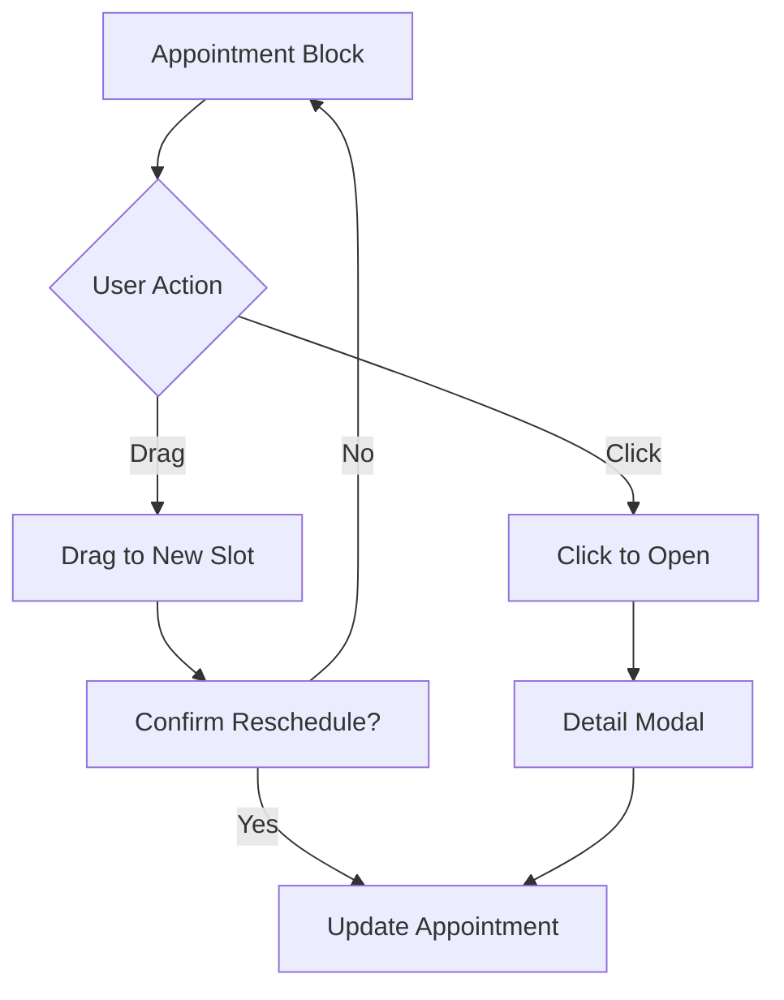

# Admin Dashboard

> **Priority:** P0 (MVP Must-Have)
> **Owner:** Frontend Team
> **Dependencies:** Multi-tenancy, Authentication, All Feature Modules
> **Last Updated:** 2026-02-06

## Overview

The admin dashboard is the central hub for salon owners and administrators to manage operations, view analytics, and configure settings. It provides real-time visibility into business performance and quick access to common tasks.

### Key Features

| Feature | Description |
|---------|-------------|
| **Comprehensive Analytics** | Full business metrics dashboard |
| **Calendar UX** | Drag-drop + Modal editing combined |
| **Customer Search** | Advanced filters (visits, spending, tags) |
| **Real-time Updates** | Live data via Convex subscriptions |

---

## Dashboard Layout

```
┌─────────────────────────────────────────────────────────────────────────┐
│ [Logo] Salon Name                    🔔 Notifications    👤 Ahmet ▼    │
├────────────┬────────────────────────────────────────────────────────────┤
│            │                                                            │
│  📊 Dashboard  │  Welcome back, Ahmet!                                   │
│            │                                                            │
│  📅 Calendar│  ┌─────────────┐ ┌─────────────┐ ┌─────────────┐         │
│            │  │ Today's     │ │ This Week   │ │ Revenue     │         │
│  👥 Staff   │  │ Appointments│ │ Bookings    │ │ This Month  │         │
│            │  │     12      │ │     47      │ │   ₺8,450    │         │
│  💇 Services│  │ +2 walk-ins │ │ ↑15% vs LW  │ │ ↑8% vs LM   │         │
│            │  └─────────────┘ └─────────────┘ └─────────────┘         │
│  👤 Customers│                                                          │
│            │  Today's Schedule                            [View All]   │
│  📦 Products│  ┌─────────────────────────────────────────────────────┐ │
│            │  │ 09:00  Mehmet - Haircut (Ayşe) ✓ Checked In        │ │
│  📈 Reports │  │ 09:30  Empty                                        │ │
│            │  │ 10:00  Fatma - Coloring (Zeynep) ⏳ Confirmed       │ │
│  ⚙️ Settings│  │ 11:00  Ali - Haircut + Beard (Ayşe) ⏳ Confirmed   │ │
│            │  │ 12:00  Lunch Break                                   │ │
│            │  │ ...                                                  │ │
│            │  └─────────────────────────────────────────────────────┘ │
│            │                                                            │
│            │  Quick Actions                                            │
│            │  [+ New Booking]  [+ Walk-in]  [+ Block Time]           │
│            │                                                            │
└────────────┴────────────────────────────────────────────────────────────┘
```

---

## Navigation Structure

```
Dashboard (Home)
├── Calendar
│   ├── Day View
│   ├── Week View
│   └── Month View
├── Staff
│   ├── List
│   ├── Add/Invite
│   └── [Staff Profile]
│       ├── Details
│       └── Schedule
├── Services
│   ├── List by Category
│   ├── Add Service
│   └── Manage Categories
├── Customers
│   ├── List
│   ├── Search
│   └── [Customer Profile]
├── Products (P1)
│   ├── Catalog
│   └── Inventory
├── Reports (P1)
│   ├── Revenue
│   ├── Staff Performance
│   └── Customer Analytics
├── Billing (P0)
│   ├── Subscription Status
│   ├── Payment History
│   └── Manage Subscription (Polar Portal)
└── Settings
    ├── Business Info
    ├── Working Hours
    ├── Booking Settings
    └── Team & Permissions
```

---

## Dashboard Widgets

### 1. Key Metrics Cards

**Today's Appointments**
```typescript
interface TodayMetrics {
  totalAppointments: number;
  completed: number;
  upcoming: number;
  noShows: number;
  walkins: number;
}
```

**Weekly Summary**
```typescript
interface WeeklyMetrics {
  totalBookings: number;
  percentChangeVsLastWeek: number;
  busiestDay: string;
  averagePerDay: number;
}
```

**Monthly Revenue**
```typescript
interface RevenueMetrics {
  total: number; // In TRY
  percentChangeVsLastMonth: number;
  averageTicket: number;
  topService: string;
}
```

### 2. Today's Schedule Widget

**Purpose:** At-a-glance view of today's appointments

**Features:**
- Timeline view (scrollable)
- Color-coded status indicators
- Staff filter dropdown
- Quick actions (check-in, complete, cancel)
- Click to expand details
- Real-time updates

**Status Colors:**
| Status | Color | Icon |
|--------|-------|------|
| Confirmed | Blue | ⏳ |
| Checked In | Green | ✓ |
| In Progress | Yellow | ⚡ |
| Completed | Gray | ✔ |
| No Show | Red | ✗ |
| Cancelled | Strikethrough | — |

### 3. Quick Actions

**New Booking:** Opens booking flow (staff side)
**Walk-in:** Quick form for immediate appointment
**Block Time:** Block staff time (meeting, break)

### 4. Notifications Panel

**Types:**
- New online booking
- Cancellation
- Time-off request
- System alerts
- Payment alerts (failed payment, grace period warnings)

**Real-time:** Convex subscription for live updates

---

## Billing & Subscription Section

### Subscription Status Widget (Dashboard)

A compact widget on the main dashboard showing subscription health:

```
┌─────────────────────────────────────────────────────────┐
│ 💳 Subscription                              [Manage →] │
├─────────────────────────────────────────────────────────┤
│ Plan: Standard (Yearly)                                 │
│ Status: ● Active                                        │
│ Next billing: March 15, 2024 - ₺5,100                   │
└─────────────────────────────────────────────────────────┘
```

**Status Indicators:**
| Status | Color | Icon |
|--------|-------|------|
| Active | Green | ● |
| Past Due | Orange | ⚠️ |
| Grace Period | Red | ⚠️ |
| Unpaid | Red | ✗ |
| Canceled | Gray | — |

### Subscription Warning Banner

When subscription is in trouble, a prominent banner appears:

```
┌─────────────────────────────────────────────────────────────────────────┐
│ ⚠️ Payment Failed - Your subscription will be suspended in 5 days      │
│                                                                         │
│ Please update your payment method to continue using the platform.      │
│                                                         [Update Payment]│
└─────────────────────────────────────────────────────────────────────────┘
```

### Billing Page (`/[slug]/billing`)

**Layout:**

```
┌─────────────────────────────────────────────────────────────────────────┐
│ Billing & Subscription                                                   │
├─────────────────────────────────────────────────────────────────────────┤
│                                                                         │
│ Current Plan                                                            │
│ ┌─────────────────────────────────────────────────────────────────────┐ │
│ │ Standard Plan - Yearly                                               │ │
│ │ ₺5,100/year (₺425/month)                      [Change to Monthly]   │ │
│ │                                                                      │ │
│ │ Status: Active ●                                                     │ │
│ │ Next billing: March 15, 2024                                         │ │
│ │ Member since: March 15, 2023                                         │ │
│ └─────────────────────────────────────────────────────────────────────┘ │
│                                                                         │
│ Payment Method                                                          │
│ ┌─────────────────────────────────────────────────────────────────────┐ │
│ │ 💳 •••• •••• •••• 4242   Exp: 12/25            [Update via Polar →] │ │
│ └─────────────────────────────────────────────────────────────────────┘ │
│                                                                         │
│ Billing History                                                         │
│ ┌─────────────────────────────────────────────────────────────────────┐ │
│ │ Date          │ Description        │ Amount   │ Status  │ Invoice  │ │
│ ├───────────────┼────────────────────┼──────────┼─────────┼──────────┤ │
│ │ Feb 15, 2024  │ Standard - Yearly  │ ₺5,100   │ Paid ✓  │ [PDF]    │ │
│ │ Jan 15, 2024  │ Standard - Monthly │ ₺500     │ Paid ✓  │ [PDF]    │ │
│ │ Dec 15, 2023  │ Standard - Monthly │ ₺500     │ Paid ✓  │ [PDF]    │ │
│ └─────────────────────────────────────────────────────────────────────┘ │
│                                                                         │
│ ─────────────────────────────────────────────────────────────────────── │
│                                              [Cancel Subscription]      │
└─────────────────────────────────────────────────────────────────────────┘
```

### Subscription Status API

```typescript
interface SubscriptionStatus {
  status: "active" | "trialing" | "past_due" | "canceled" | "unpaid";
  plan: "standard_monthly" | "standard_yearly";
  currentPeriodStart: number;
  currentPeriodEnd: number;
  cancelAtPeriodEnd: boolean;
  gracePeriodEndsAt?: number; // Only if past_due
  daysUntilSuspension?: number; // Only if in grace period
}
```

---

## Calendar Views

### Day View (`/[slug]/calendar?view=day`)

```
┌─────────────────────────────────────────────────────────────────────┐
│  < March 15, 2024 >                    [Day] [Week] [Month]        │
├───────────┬───────────────────────────────────────────────────────────┤
│           │ Ayşe          │ Zeynep        │ Fatma         │          │
├───────────┼───────────────┼───────────────┼───────────────┼          │
│ 09:00     │ ▓▓▓▓▓▓▓▓▓▓▓▓ │               │               │          │
│           │ Mehmet        │               │               │          │
│           │ Haircut       │               │               │          │
├───────────┼───────────────┼───────────────┼───────────────┼          │
│ 09:30     │               │               │               │          │
├───────────┼───────────────┼───────────────┼───────────────┼          │
│ 10:00     │               │ ▓▓▓▓▓▓▓▓▓▓▓▓ │               │          │
│           │               │ Fatma K.      │               │          │
│           │               │ Coloring      │               │          │
│ 10:30     │               │ ▓▓▓▓▓▓▓▓▓▓▓▓ │               │          │
│           │               │ (continued)   │               │          │
│ 11:00     │ ▓▓▓▓▓▓▓▓▓▓▓▓ │ ▓▓▓▓▓▓▓▓▓▓▓▓ │               │          │
│           │ Ali           │ (continued)   │               │          │
│           │ Haircut+Beard │               │               │          │
└───────────┴───────────────┴───────────────┴───────────────┴──────────┘
```

**Features:**
- **Drag-and-drop** rescheduling
- Click empty slot to create booking
- Click appointment to view/edit
- Scroll horizontally for more staff
- Time increments: 15 minutes

---

## Calendar Interaction Model

### Drag-Drop + Modal Combined UX

The calendar supports **both** drag-drop for quick changes and modal dialogs for detailed editing.



### Drag-Drop Rescheduling

| Action | Behavior |
|--------|----------|
| Drag appointment | Ghost preview follows cursor |
| Drop on empty slot | Confirmation toast appears |
| Drop on occupied slot | "Slot busy" error shown |
| Drop on different staff | Staff reassignment option |
| Cancel drag (Esc) | Returns to original position |

### Quick Reschedule Toast

```
┌─────────────────────────────────────────────────────────┐
│ Move appointment to 14:30 with Ayşe?                    │
│                                                         │
│ [Cancel]  [Confirm]                                     │
└─────────────────────────────────────────────────────────┘
```

### Appointment Detail Modal

Opened by clicking on an appointment:

```
┌─────────────────────────────────────────────────────────┐
│ Appointment Details                              [×]    │
├─────────────────────────────────────────────────────────┤
│ Customer: Mehmet Yılmaz                                 │
│ Phone: +90 532 xxx xxxx                    [Call] [SMS] │
│                                                         │
│ Services:                                               │
│ • Haircut (45 min) - ₺150                               │
│ • Beard Trim (15 min) - ₺50                             │
│ Total: ₺200                                             │
│                                                         │
│ Staff: Ayşe Demir                         [Change]      │
│ Time: March 15, 2024 at 14:30             [Reschedule]  │
│ Status: Confirmed                                       │
│                                                         │
│ Customer Notes:                                         │
│ "Prefers quiet area, allergic to certain products"      │
│                                                         │
│ Staff Notes (Internal):                                 │
│ "VIP customer, always offer tea"           [Edit]       │
│                                                         │
├─────────────────────────────────────────────────────────┤
│ [Check In]  [Mark No-Show]  [Cancel Appointment]        │
└─────────────────────────────────────────────────────────┘
```

### Empty Slot Click → Quick Booking

Clicking an empty time slot opens a quick booking form:

```
┌─────────────────────────────────────────────────────────┐
│ New Appointment - 14:30 with Ayşe                [×]    │
├─────────────────────────────────────────────────────────┤
│ Customer: [Search by name or phone...      🔍]          │
│                                                         │
│ Services: [Select services...              ▼]           │
│                                                         │
│ Duration: 45 min (calculated from services)             │
│                                                         │
│ [Cancel]  [Create Appointment]                          │
└─────────────────────────────────────────────────────────┘
```

---

### Week View (`/[slug]/calendar?view=week`)

**Layout:** 7 columns (days), rows for each staff
**Features:** Summary counts per day, click to drill down

### Month View (`/[slug]/calendar?view=month`)

**Layout:** Traditional calendar grid
**Features:** Day cells show appointment count, busy indicator

---

## Reports & Analytics (Comprehensive)

### Dashboard Metrics Overview

The dashboard displays **all** key business metrics at a glance:

```
┌─────────────────────────────────────────────────────────────────────┐
│ Today                  │ This Week              │ This Month         │
├────────────────────────┼────────────────────────┼────────────────────┤
│ Appointments: 12       │ Total Bookings: 47     │ Revenue: ₺32,940   │
│ Completed: 8           │ vs Last Week: +15%     │ vs Last Month: +8% │
│ Upcoming: 3            │ Busiest Day: Saturday  │ Avg Ticket: ₺180   │
│ No-Shows: 1            │ New Customers: 12      │ Top Service: Cut   │
│ Walk-ins: 2            │ Utilization: 78%       │ Growth Rate: +12%  │
└────────────────────────┴────────────────────────┴────────────────────┘
```

### Complete Metrics Catalog

| Category | Metric | Description |
|----------|--------|-------------|
| **Appointments** | Total Appointments | Count for period |
| | Completed | Successfully finished |
| | No-Shows | Customer didn't arrive |
| | Cancellations | Cancelled appointments |
| | Walk-ins | Same-day bookings |
| | Online Bookings | Customer self-booked |
| **Revenue** | Total Revenue | Sum of completed appointments |
| | Average Ticket | Revenue per appointment |
| | Revenue by Service | Breakdown by service type |
| | Revenue by Staff | Staff contribution |
| | Growth Rate | vs previous period |
| **Customers** | New Customers | First-time visitors |
| | Returning Customers | 2+ visits |
| | Retention Rate | % returning within 90 days |
| | Top Customers | By visits or spending |
| | Customer Lifetime Value | Average total spend |
| **Staff** | Utilization Rate | Booked hours / available hours |
| | Revenue per Staff | Individual contribution |
| | Appointment Count | Per staff member |
| | Average Service Time | Actual vs scheduled |
| | No-Show Rate | Per staff |
| **Booking** | Lead Time | Days between booking and appointment |
| | Cancellation Rate | % of bookings cancelled |
| | Peak Hours | Busiest time slots |
| | Booking Sources | Online vs phone vs walk-in |

### Revenue Report

**Filters:**
- Date range (presets: Today, This Week, This Month, Custom)
- Staff member
- Service category

**Visualizations:**
- Line chart: Daily/weekly revenue trend
- Bar chart: Revenue by service
- Pie chart: Revenue by staff
- Heatmap: Revenue by day/hour

**Metrics Table:**
```
| Period      | Bookings | Revenue  | Avg Ticket | vs Previous |
|-------------|----------|----------|------------|-------------|
| This Week   | 47       | ₺8,450   | ₺180       | +15%        |
| Last Week   | 41       | ₺7,350   | ₺179       | -           |
| This Month  | 183      | ₺32,940  | ₺180       | +8%         |
```

### Staff Performance Report

**Metrics per Staff:**
- Total appointments
- Hours worked
- Revenue generated
- Average rating (future)
- No-show rate
- Utilization rate (%)
- On-time completion rate

**Staff Comparison View:**
```
┌─────────────────────────────────────────────────────────────────────┐
│ Staff Performance - March 2024                                      │
├──────────┬──────────┬──────────┬──────────┬──────────┬─────────────┤
│ Staff    │ Appts    │ Revenue  │ Util %   │ No-Show  │ Rating      │
├──────────┼──────────┼──────────┼──────────┼──────────┼─────────────┤
│ Ayşe     │ 87       │ ₺15,660  │ 82%      │ 3%       │ ⭐ 4.8      │
│ Zeynep   │ 64       │ ₺11,520  │ 75%      │ 5%       │ ⭐ 4.6      │
│ Fatma    │ 52       │ ₺9,360   │ 68%      │ 2%       │ ⭐ 4.9      │
└──────────┴──────────┴──────────┴──────────┴──────────┴─────────────┘
```

### Customer Analytics

**Metrics:**
- New vs returning customers (pie chart)
- Customer retention rate (trend)
- Top customers by visits
- Top customers by spend
- Source breakdown (online, walk-in, phone)
- Customer acquisition trend

---

## Customer Search & Filters

### Advanced Search Panel

```
┌─────────────────────────────────────────────────────────────────────┐
│ Customer Search                                         [Clear All] │
├─────────────────────────────────────────────────────────────────────┤
│ Name/Phone/Email: [________________________]  🔍                    │
│                                                                     │
│ Filters:                                                            │
│ ┌───────────────────┬───────────────────┬─────────────────────────┐ │
│ │ Last Visit        │ Total Visits      │ Total Spending          │ │
│ │ [Any          ▼]  │ [Any          ▼]  │ [Any              ▼]    │ │
│ │ • Today           │ • 1 visit         │ • Under ₺500            │ │
│ │ • Last 7 days     │ • 2-5 visits      │ • ₺500 - ₺2,000         │ │
│ │ • Last 30 days    │ • 6-10 visits     │ • ₺2,000 - ₺5,000       │ │
│ │ • Last 90 days    │ • 10+ visits      │ • Over ₺5,000           │ │
│ │ • Over 90 days    │                   │                         │ │
│ └───────────────────┴───────────────────┴─────────────────────────┘ │
│                                                                     │
│ ┌───────────────────┬───────────────────┬─────────────────────────┐ │
│ │ No-Show History   │ Tags              │ Booking Source          │ │
│ │ [Any          ▼]  │ [Select tags  ▼]  │ [Any              ▼]    │ │
│ │ • No no-shows     │ ☑ VIP             │ • Online                │ │
│ │ • 1 no-show       │ ☐ New             │ • Walk-in               │ │
│ │ • 2+ no-shows     │ ☑ Frequent        │ • Phone                 │ │
│ │                   │ ☐ At Risk         │ • Import                │ │
│ └───────────────────┴───────────────────┴─────────────────────────┘ │
├─────────────────────────────────────────────────────────────────────┤
│ Showing 47 customers                    [Export CSV]  [Send Email]  │
└─────────────────────────────────────────────────────────────────────┘
```

### Filter Presets

| Preset | Filters Applied |
|--------|-----------------|
| **VIP Customers** | 10+ visits OR ₺5,000+ spending |
| **At Risk** | Last visit > 90 days, 3+ previous visits |
| **New This Month** | First visit in current month |
| **Frequent No-Shows** | 2+ no-shows recorded |
| **Top Spenders** | Total spending > ₺2,000 |

### Customer Search API

```typescript
// Uses orgQuery wrapper (auto-injects organizationId, requires org membership)
export const searchCustomers = orgQuery({
  args: {
    query: v.optional(v.string()), // Name, phone, or email
    filters: v.optional(v.object({
      lastVisit: v.optional(v.union(
        v.literal("today"),
        v.literal("7days"),
        v.literal("30days"),
        v.literal("90days"),
        v.literal("over90days")
      )),
      totalVisits: v.optional(v.object({
        min: v.optional(v.number()),
        max: v.optional(v.number()),
      })),
      totalSpending: v.optional(v.object({
        min: v.optional(v.number()),
        max: v.optional(v.number()),
      })),
      noShowCount: v.optional(v.object({
        min: v.optional(v.number()),
        max: v.optional(v.number()),
      })),
      tags: v.optional(v.array(v.string())),
      source: v.optional(v.union(
        v.literal("online"),
        v.literal("walk_in"),
        v.literal("phone"),
        v.literal("import")
      )),
    })),
    sort: v.optional(v.object({
      field: v.union(
        v.literal("name"),
        v.literal("lastVisit"),
        v.literal("totalVisits"),
        v.literal("totalSpent")
      ),
      direction: v.union(v.literal("asc"), v.literal("desc")),
    })),
    limit: v.optional(v.number()),
    cursor: v.optional(v.string()),
  },
  returns: v.object({
    customers: v.array(v.object({
      _id: v.id("customers"),
      name: v.string(),
      email: v.string(),
      phone: v.string(),
      totalVisits: v.number(),
      totalSpent: v.number(),
      lastVisitDate: v.optional(v.string()),
      noShowCount: v.number(),
      tags: v.array(v.string()),
    })),
    nextCursor: v.optional(v.string()),
    totalCount: v.number(),
  }),
  handler: async (ctx, args) => { /* ... */ },
});
```

---

## Settings Pages

### Business Info (`/[slug]/settings`)

**Fields:**
- Salon name
- Description
- Logo upload
- Contact email
- Contact phone
- Address
- Social media links

### Working Hours (`/[slug]/settings/hours`)

**Interface:** Same as staff schedule editor, but for business-wide defaults

### Booking Settings (`/[slug]/settings/booking`)

| Setting | Type | Default | Description |
|---------|------|---------|-------------|
| Advance booking window | Number | 30 days | How far ahead customers can book |
| Minimum notice | Number | 2 hours | Minimum time before appointment |
| Cancellation window | Number | 2 hours | How late customers can cancel |
| Slot duration | Number | 15 min | Booking slot increments |
| Allow staff selection | Boolean | true | Let customers choose staff |
| Require phone verification | Boolean | true | OTP for online bookings |

### Team & Permissions (`/[slug]/settings/team`)

**Features:**
- View all team members
- Change roles
- Resend invitations
- Remove team members
- Role permission matrix display

---

## Real-Time Features

### Convex Subscriptions

```typescript
// Dashboard real-time updates
const todayAppointments = useQuery(api.appointments.getByDate, {
  organizationId,
  date: today,
});

const notifications = useQuery(api.notifications.getUnread, {
  organizationId,
});

const metrics = useQuery(api.analytics.getDashboardMetrics, {
  organizationId,
});
```

### Live Updates Include:

1. **New booking appears** on calendar immediately
2. **Check-in status** changes reflect instantly
3. **Notifications** appear without refresh
4. **Metrics** update as appointments complete

---

## API Contracts

### Query: Dashboard Metrics

```typescript
// Uses orgQuery wrapper (auto-injects organizationId, requires org membership)
export const getDashboardMetrics = orgQuery({
  args: {},
  returns: v.object({
    today: v.object({
      totalAppointments: v.number(),
      completed: v.number(),
      upcoming: v.number(),
      noShows: v.number(),
      walkIns: v.number(),
    }),
    thisWeek: v.object({
      totalBookings: v.number(),
      percentChange: v.number(),
      busiestDay: v.string(),
    }),
    thisMonth: v.object({
      revenue: v.number(),
      percentChange: v.number(),
      averageTicket: v.number(),
    }),
  }),
  handler: async (ctx, args) => { /* ... */ },
});
```

### Query: Calendar Appointments

```typescript
// Uses orgQuery wrapper (auto-injects organizationId, requires org membership)
export const getCalendarAppointments = orgQuery({
  args: {
    startDate: v.string(),
    endDate: v.string(),
    staffId: v.optional(v.id("staff")),
  },
  returns: v.array(v.object({
    _id: v.id("appointments"),
    date: v.string(),
    startTime: v.number(),
    endTime: v.number(),
    customer: v.object({
      name: v.string(),
      phone: v.string(),
    }),
    services: v.array(v.object({
      name: v.string(),
      duration: v.number(),
    })),
    staff: v.object({
      _id: v.id("staff"),
      name: v.string(),
    }),
    status: v.string(),
    totalPrice: v.number(),
  })),
  handler: async (ctx, args) => { /* ... */ },
});
```

### Query: Revenue Report

```typescript
// Uses orgQuery wrapper (auto-injects organizationId, requires org membership)
export const getRevenueReport = orgQuery({
  args: {
    startDate: v.string(),
    endDate: v.string(),
    staffId: v.optional(v.id("staff")),
    categoryId: v.optional(v.id("serviceCategories")),
  },
  returns: v.object({
    summary: v.object({
      totalRevenue: v.number(),
      totalBookings: v.number(),
      averageTicket: v.number(),
      percentChange: v.number(),
    }),
    byDay: v.array(v.object({
      date: v.string(),
      revenue: v.number(),
      bookings: v.number(),
    })),
    byService: v.array(v.object({
      serviceName: v.string(),
      revenue: v.number(),
      count: v.number(),
    })),
    byStaff: v.array(v.object({
      staffName: v.string(),
      revenue: v.number(),
      count: v.number(),
    })),
  }),
  handler: async (ctx, args) => { /* ... */ },
});
```

---

## Implementation Checklist

### Backend (Convex)

> **Note:** Use custom function wrappers from `convex/lib/functions.ts` (orgQuery, orgMutation, adminMutation, ownerMutation) instead of plain `query()`/`mutation()`. These auto-inject `organizationId` and enforce role-based access.

- [ ] Query: `getDashboardMetrics` (orgQuery)
- [ ] Query: `getCalendarAppointments` (orgQuery)
- [ ] Query: `getNotifications` (orgQuery)
- [ ] Query: `getRevenueReport` (orgQuery)
- [ ] Query: `getStaffPerformance` (orgQuery)
- [ ] Query: `getCustomerAnalytics` (orgQuery)
- [ ] Query: `subscriptions.getCurrent` (orgQuery)
- [ ] Query: `subscriptions.getBillingHistory` (ownerQuery)
- [ ] Mutation: `markNotificationRead` (orgMutation)
- [ ] Mutation: `updateBusinessSettings` (adminMutation)
- [ ] Mutation: `updateBookingSettings` (adminMutation)
- [ ] Mutation: `subscriptions.createCheckout` (ownerMutation)
- [ ] Action: `subscriptions.getPortalUrl`

### Frontend (Next.js)

- [ ] Layout: `DashboardLayout` with sidebar
- [ ] Page: `/[slug]/dashboard`
- [ ] Page: `/[slug]/calendar`
- [ ] Page: `/[slug]/reports`
- [ ] Page: `/[slug]/reports/revenue`
- [ ] Page: `/[slug]/reports/staff`
- [ ] Page: `/[slug]/reports/customers`
- [ ] Page: `/[slug]/billing`
- [ ] Page: `/[slug]/settings`
- [ ] Page: `/[slug]/settings/hours`
- [ ] Page: `/[slug]/settings/booking`
- [ ] Page: `/[slug]/settings/team`
- [ ] Component: `MetricsCard`
- [ ] Component: `TodaySchedule`
- [ ] Component: `QuickActions`
- [ ] Component: `NotificationBell`
- [ ] Component: `CalendarDayView`
- [ ] Component: `CalendarWeekView`
- [ ] Component: `CalendarMonthView`
- [ ] Component: `RevenueChart`
- [ ] Component: `SettingsForm`
- [ ] Component: `SubscriptionStatusWidget`
- [ ] Component: `SubscriptionWarningBanner`
- [ ] Component: `BillingHistoryTable`
- [ ] Hook: `useDashboardMetrics`
- [ ] Hook: `useCalendarAppointments`
- [ ] Hook: `useNotifications`
- [ ] Hook: `useSubscription`

### Tests

- [ ] Unit: Metrics calculation
- [ ] Unit: Date range filtering
- [ ] Integration: Real-time updates
- [ ] E2E: Dashboard navigation
- [ ] E2E: Calendar interactions
- [ ] E2E: Settings update flow

---

## Accessibility

| Requirement | Implementation |
|-------------|----------------|
| Keyboard navigation | All interactive elements focusable |
| Screen reader | ARIA labels on charts, tables |
| Color contrast | WCAG AA compliant |
| Focus indicators | Visible focus rings |
| Skip links | Skip to main content |
