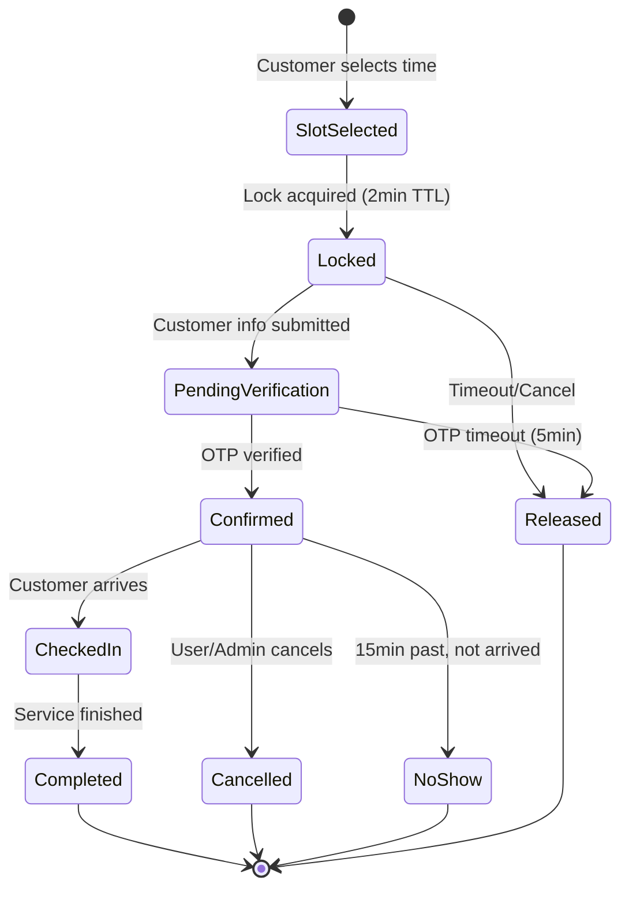
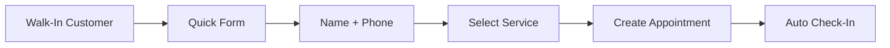

# Core Booking Engine

> **Priority:** P0 (MVP Must-Have)
> **Owner:** Backend Team
> **Dependencies:** Multi-tenancy, Staff Management, Service Catalog
> **Last Updated:** 2026-02-04

## Overview

The core booking engine is the heart of the salon management system. It handles appointment creation, slot availability calculation, conflict prevention, and the complete booking lifecycle.

### Key Business Rules

| Rule | Description |
|------|-------------|
| **Multi-Service** | Sequential execution, different staff per service allowed |
| **Cancellation** | Free cancellation up to 2 hours before appointment |
| **Walk-In** | Quick booking form (name + phone only) |
| **Pricing Display** | Starting price format ("₺150'den başlayan") |
| **Reminders** | Single email 24 hours before appointment |

---

## Booking State Machine



### State Definitions

| State | Description | Actions Available |
|-------|-------------|-------------------|
| `slot_selected` | User viewing slot | Select different slot |
| `locked` | Temporary hold (2min) | Complete booking, cancel |
| `pending_verification` | Awaiting OTP | Verify OTP, resend OTP, cancel |
| `confirmed` | Booking complete | Check-in, cancel, reschedule |
| `checked_in` | Customer arrived | Complete, no-show |
| `completed` | Service rendered | None (final) |
| `cancelled` | Appointment cancelled | None (final) |
| `no_show` | Customer didn't arrive | None (final) |

---

## Multi-Service Booking Model

### Sequential Execution

When a customer books multiple services, they are executed **sequentially** (back-to-back), not in parallel.

```mermaid
gantt
    title Multi-Service Appointment Timeline
    dateFormat HH:mm
    axisFormat %H:%M
    section Booking
    Haircut (Personel A)     :a1, 14:00, 45m
    Hair Coloring (Personel B) :a2, after a1, 60m
    Blow Dry (Personel A)    :a3, after a2, 30m
```



### Different Staff Per Service

Each service in a multi-service booking can be assigned to a **different staff member**:

```typescript
interface MultiServiceBooking {
  appointmentId: Id<"appointments">;
  totalDuration: number; // Sum of all service durations
  services: Array<{
    serviceId: Id<"services">;
    staffId: Id<"staff">; // Can differ per service
    duration: number;
    startTime: number; // Calculated sequentially
    endTime: number;
    order: number; // 1, 2, 3...
  }>;
}
```

### Slot Calculation for Multi-Service

```
1. User selects multiple services
2. For each service, get eligible staff
3. Calculate all valid permutations:
   - Service A (10:00-10:45) with Staff 1
   - Service B (10:45-11:45) with Staff 2 (must be available after A ends)
   - Service C (11:45-12:15) with Staff 1 (must be available after B ends)
4. Show consolidated time slots (by first service start time)
5. Display staff assignments for each service in slot details
```

### Constraints

| Constraint | Rule |
|------------|------|
| Max services per booking | 5 |
| Gap between services | 0 minutes (back-to-back) |
| Staff overlap | Same staff can do multiple services if available |
| "Any Available" | System optimizes staff assignment automatically |

### UI Flow

1. **Service Selection**: Multi-select with running total duration
2. **Staff Selection**:
   - "Any Available" (default): System assigns optimal staff
   - "Choose per service": User picks staff for each service
3. **Time Selection**: Shows first available start time
4. **Summary**: Lists all services with assigned staff and times

---

## Slot Availability Algorithm

### Inputs

```typescript
interface SlotAvailabilityInput {
  organizationId: Id<"organizations">;
  date: string; // ISO date: "2024-03-15"
  serviceIds: Id<"services">[]; // Services to book
  staffId?: Id<"staff">; // Optional specific staff
}
```

### Algorithm

```
1. Calculate total duration from selected services
2. Get staff working hours for the date
   - If staffId provided, use that staff only
   - Otherwise, get all staff who can perform ALL selected services
3. For each staff member:
   a. Get their schedule for the date
   b. Get existing appointments
   c. Get active locks (slotLocks table)
   d. Calculate available windows
4. Generate 15-minute slot options within available windows
5. Filter out slots that would extend past closing time
6. Return combined available slots across all eligible staff
```

### Pseudocode

```typescript
function getAvailableSlots(input: SlotAvailabilityInput): Slot[] {
  const totalDuration = sumServiceDurations(input.serviceIds);
  const eligibleStaff = getEligibleStaff(input);
  const slots: Slot[] = [];

  for (const staff of eligibleStaff) {
    const schedule = getStaffSchedule(staff.id, input.date);
    if (!schedule.isWorking) continue;

    const appointments = getAppointments(staff.id, input.date);
    const locks = getActiveLocks(staff.id, input.date);
    const blockedRanges = [...appointments, ...locks].map(toTimeRange);

    const freeWindows = subtractRanges(
      { start: schedule.startTime, end: schedule.endTime },
      blockedRanges
    );

    for (const window of freeWindows) {
      let slotStart = roundToNext15Min(window.start);
      while (slotStart + totalDuration <= window.end) {
        slots.push({
          staffId: staff.id,
          startTime: slotStart,
          endTime: slotStart + totalDuration,
          staffName: staff.name,
        });
        slotStart += 15; // 15-minute increments
      }
    }
  }

  return sortByTime(deduplicateSlots(slots));
}
```

---

## Slot Locking (Double-Booking Prevention)

### Problem

Two customers selecting the same slot simultaneously could both complete booking, causing a double-booking.

### Solution: Optimistic Locking with TTL

```typescript
// convex/schema.ts
slotLocks: defineTable({
  organizationId: v.id("organizations"),
  staffId: v.id("staff"),
  date: v.string(),
  startTime: v.number(), // minutes from midnight
  endTime: v.number(),
  sessionId: v.string(), // Browser session identifier
  expiresAt: v.number(), // Unix timestamp
})
.index("by_staff_date", ["staffId", "date"])
.index("by_expiry", ["expiresAt"])
```

### Lock Acquisition Flow

```typescript
// mutations/booking.ts
export const acquireSlotLock = mutation({
  args: {
    staffId: v.id("staff"),
    date: v.string(),
    startTime: v.number(),
    endTime: v.number(),
    sessionId: v.string(),
  },
  handler: async (ctx, args) => {
    // Check for existing appointment
    const existingAppointment = await ctx.db
      .query("appointments")
      .withIndex("by_staff_date", (q) =>
        q.eq("staffId", args.staffId).eq("date", args.date)
      )
      .filter((q) =>
        q.and(
          q.lt(q.field("startTime"), args.endTime),
          q.gt(q.field("endTime"), args.startTime)
        )
      )
      .first();

    if (existingAppointment) {
      throw new ConvexError("Slot no longer available");
    }

    // Check for existing lock (not ours)
    const existingLock = await ctx.db
      .query("slotLocks")
      .withIndex("by_staff_date", (q) =>
        q.eq("staffId", args.staffId).eq("date", args.date)
      )
      .filter((q) =>
        q.and(
          q.lt(q.field("startTime"), args.endTime),
          q.gt(q.field("endTime"), args.startTime),
          q.neq(q.field("sessionId"), args.sessionId),
          q.gt(q.field("expiresAt"), Date.now())
        )
      )
      .first();

    if (existingLock) {
      throw new ConvexError("Slot is being booked by another user");
    }

    // Create or update lock
    const lockId = await ctx.db.insert("slotLocks", {
      ...args,
      organizationId: /* from context */,
      expiresAt: Date.now() + 2 * 60 * 1000, // 2 minutes
    });

    return { lockId, expiresAt: Date.now() + 2 * 60 * 1000 };
  },
});
```

### Lock Cleanup (Scheduled Job)

```typescript
// convex/crons.ts
export default cronJobs()
  .interval("cleanup expired locks", { minutes: 1 }, "cleanupExpiredLocks");

// convex/schedulers.ts
export const cleanupExpiredLocks = internalMutation({
  handler: async (ctx) => {
    const expiredLocks = await ctx.db
      .query("slotLocks")
      .withIndex("by_expiry")
      .filter((q) => q.lt(q.field("expiresAt"), Date.now()))
      .collect();

    for (const lock of expiredLocks) {
      await ctx.db.delete(lock._id);
    }

    return { deleted: expiredLocks.length };
  },
});
```

---

## Booking Flow (Step-by-Step)

### Step 1: Service Selection

**UI:** Multi-select service cards with duration/price display

**Validation:**
- At least one service required
- Services must be active
- Services must belong to organization

### Step 2: Staff Selection (Optional)

**UI:** Staff cards with photo, name, next availability

**Options:**
- "Any Available" (default) - System selects based on availability
- Specific staff member - Filters slots to that staff only

### Step 3: Date Selection

**UI:** Calendar with availability indicators

**Constraints:**
- Can book up to 30 days in advance (configurable)
- Past dates disabled
- Days with no availability shown differently

### Step 4: Time Selection

**UI:** Time slot grid (15-min increments)

**Display:**
- Available slots shown as selectable
- Locked slots shown as "Being booked"
- Past slots disabled
- Each slot shows staff name if "Any Available" selected

### Step 5: Customer Information

**UI:** Form with name, phone, email

**Fields:**
| Field | Required | Validation |
|-------|----------|------------|
| Name | Yes | 2-100 characters |
| Phone | Yes | Turkish format (+90...) |
| Email | Yes | Valid email format |
| Notes | No | Max 500 characters |

### Step 6: OTP Verification

**UI:** 6-digit code input

**Process:**
1. Send SMS/Email with 6-digit code
2. Code valid for 5 minutes
3. Max 3 attempts
4. Resend available after 60 seconds

### Step 7: Confirmation

**UI:** Booking summary with confirmation number

**Actions:**
- Send confirmation email
- Create calendar event (.ics)
- Schedule reminder (24h before)

---

## Walk-In Quick Booking

For walk-in customers, staff can create a quick booking with minimal information.

### Quick Booking Form

| Field | Required | Notes |
|-------|----------|-------|
| Customer Name | Yes | 2-100 characters |
| Phone Number | Yes | Turkish format (+90...) |
| Service(s) | Yes | Pre-selected or quick pick |
| Staff | Auto | Current staff or selected |
| Start Time | Auto | "Now" or next available |

### Walk-In Flow



### API: Quick Booking Mutation

```typescript
export const createWalkInBooking = mutation({
  args: {
    organizationId: v.id("organizations"),
    customerName: v.string(),
    customerPhone: v.string(),
    serviceIds: v.array(v.id("services")),
    staffId: v.id("staff"),
    startNow: v.optional(v.boolean()), // Default true
  },
  returns: v.object({
    appointmentId: v.id("appointments"),
    customerId: v.id("customers"),
  }),
  handler: async (ctx, args) => {
    // 1. Find or create customer by phone
    // 2. Calculate duration from services
    // 3. Create appointment with status "checked_in"
    // 4. Skip OTP verification (staff-initiated)
    // 5. Return appointment details
  },
});
```

### Walk-In vs Online Booking

| Aspect | Online Booking | Walk-In |
|--------|----------------|---------|
| OTP Required | Yes | No (staff verified) |
| Email Required | Yes | No |
| Initial Status | `confirmed` | `checked_in` |
| Reminder Email | Yes (24h before) | No |
| Created By | Customer | Staff |

---

## Price Display Format

### Starting Price Model

Services with variable pricing (e.g., hair length, complexity) display as **starting prices**:

```
"Saç Kesimi" - ₺150'den başlayan
"Hair Cut" - Starting from ₺150
```

### Implementation

```typescript
interface ServicePricing {
  basePrice: number; // Minimum/starting price
  variablePrice: boolean; // If true, show "from ₺X"
  maxPrice?: number; // Optional upper bound
  priceNote?: string; // e.g., "Price varies by hair length"
}

// Display logic
function formatPrice(service: ServicePricing, locale: "tr" | "en"): string {
  if (service.variablePrice) {
    return locale === "tr"
      ? `₺${service.basePrice}'den başlayan`
      : `Starting from ₺${service.basePrice}`;
  }
  return `₺${service.basePrice}`;
}
```

### UI Guidelines

| Scenario | Display |
|----------|---------|
| Fixed price | `₺150` |
| Variable price | `₺150'den başlayan` / `Starting from ₺150` |
| Price range | `₺150 - ₺300` (optional, if maxPrice set) |
| Free service | `Ücretsiz` / `Free` |

### Service Card Example

```
┌─────────────────────────────────┐
│ ✂️ Saç Kesimi                   │
│ Hair Cut                        │
│                                 │
│ ⏱️ 45 dakika                    │
│ 💰 ₺150'den başlayan            │
│                                 │
│ Fiyat saç uzunluğuna göre       │
│ değişebilir.                    │
└─────────────────────────────────┘
```

---

## Reminder System

### Single Reminder Strategy (MVP)

| Timing | Channel | Content |
|--------|---------|---------|
| 24 hours before | Email | Appointment details, reschedule link |

### Reminder Email Content

```
Subject: Randevu Hatırlatması - [Salon Adı] / Appointment Reminder - [Salon Name]

Merhaba [İsim],

[Tarih] tarihinde saat [Saat]'da [Salon Adı]'nda randevunuz var.

Hizmetler: [Hizmet Listesi]
Personel: [Personel Adı]
Adres: [Salon Adresi]

[İptal Et] [Yeniden Planla]

---

Hello [Name],

You have an appointment at [Salon Name] on [Date] at [Time].

Services: [Service List]
Staff: [Staff Name]
Address: [Salon Address]

[Cancel] [Reschedule]
```

### Scheduler Implementation

```typescript
// When appointment is confirmed
const reminderJobId = await ctx.scheduler.runAt(
  appointmentDateTime - 24 * 60 * 60 * 1000, // 24 hours before
  internal.notifications.sendReminderEmail,
  { appointmentId }
);

// Store job ID for cancellation
await ctx.db.patch(appointmentId, { reminderJobId });
```

---

## API Contracts

### Query: Get Available Slots

```typescript
export const getAvailableSlots = query({
  args: {
    organizationId: v.id("organizations"),
    date: v.string(),
    serviceIds: v.array(v.id("services")),
    staffId: v.optional(v.id("staff")),
  },
  returns: v.array(
    v.object({
      staffId: v.id("staff"),
      staffName: v.string(),
      startTime: v.number(),
      endTime: v.number(),
      formattedTime: v.string(), // "14:30"
    })
  ),
  handler: async (ctx, args) => {
    // Implementation as described above
  },
});
```

### Mutation: Create Appointment

```typescript
export const createAppointment = mutation({
  args: {
    organizationId: v.id("organizations"),
    staffId: v.id("staff"),
    date: v.string(),
    startTime: v.number(),
    endTime: v.number(),
    serviceIds: v.array(v.id("services")),
    customer: v.object({
      name: v.string(),
      phone: v.string(),
      email: v.string(),
      notes: v.optional(v.string()),
    }),
    sessionId: v.string(),
  },
  returns: v.object({
    appointmentId: v.id("appointments"),
    confirmationCode: v.string(),
  }),
  handler: async (ctx, args) => {
    // 1. Validate slot is still available
    // 2. Validate OTP was verified for this session
    // 3. Find or create customer record
    // 4. Create appointment
    // 5. Delete slot lock
    // 6. Send confirmation email
    // 7. Schedule reminder
    return { appointmentId, confirmationCode };
  },
});
```

### Mutation: Cancel Appointment

**Business Rule:** Free cancellation up to 2 hours before appointment time.

```typescript
export const cancelAppointment = mutation({
  args: {
    appointmentId: v.id("appointments"),
    reason: v.optional(v.string()),
    cancelledBy: v.union(v.literal("customer"), v.literal("staff"), v.literal("admin")),
  },
  returns: v.object({
    success: v.boolean(),
    refundEligible: v.boolean(),
  }),
  handler: async (ctx, args) => {
    const appointment = await ctx.db.get(args.appointmentId);
    if (!appointment) {
      throw new ConvexError("Appointment not found");
    }

    // Calculate time until appointment
    const appointmentDateTime = parseDateTime(appointment.date, appointment.startTime);
    const hoursUntil = (appointmentDateTime - Date.now()) / (1000 * 60 * 60);

    // 2-hour cancellation policy
    const CANCELLATION_CUTOFF_HOURS = 2;

    // Customer can only cancel 2+ hours before
    if (args.cancelledBy === "customer" && hoursUntil < CANCELLATION_CUTOFF_HOURS) {
      throw new ConvexError({
        code: "CANCELLATION_TOO_LATE",
        message: "Appointments must be cancelled at least 2 hours in advance",
        hoursRemaining: hoursUntil,
      });
    }

    // Staff/Admin can cancel anytime (but record late cancellation)
    const isLateCancellation = hoursUntil < CANCELLATION_CUTOFF_HOURS;

    await ctx.db.patch(args.appointmentId, {
      status: "cancelled",
      cancelledAt: Date.now(),
      cancelledBy: args.cancelledBy,
      cancellationReason: args.reason,
      isLateCancellation,
    });

    // Send cancellation notification
    await ctx.scheduler.runAfter(0, internal.notifications.sendCancellationEmail, {
      appointmentId: args.appointmentId,
    });

    // Cancel scheduled reminder
    if (appointment.reminderJobId) {
      await ctx.scheduler.cancel(appointment.reminderJobId);
    }

    return {
      success: true,
      refundEligible: !isLateCancellation,
    };
  },
});
```

### Cancellation Policy Summary

| Actor | Rule | Late Cancel (< 2h) |
|-------|------|-------------------|
| Customer | Can cancel 2+ hours before | Blocked with error |
| Staff | Can cancel anytime | Allowed, marked as late |
| Admin | Can cancel anytime | Allowed, marked as late |

> **Note:** MVP has no deposit/payment system. The `refundEligible` flag is for future payment integration.

---

## Implementation Checklist

### Backend (Convex)

- [ ] Schema: `appointments` table with indexes
- [ ] Schema: `slotLocks` table with TTL index
- [ ] Schema: `customers` table
- [ ] Query: `getAvailableSlots`
- [ ] Query: `getAppointmentsByDate`
- [ ] Query: `getAppointmentById`
- [ ] Mutation: `acquireSlotLock`
- [ ] Mutation: `releaseLock`
- [ ] Mutation: `createAppointment`
- [ ] Mutation: `cancelAppointment`
- [ ] Mutation: `updateAppointmentStatus`
- [ ] Scheduler: `cleanupExpiredLocks` (cron)
- [ ] Scheduler: `sendReminder` (scheduled)
- [ ] Action: `sendConfirmationEmail`
- [ ] Action: `sendCancellationEmail`

### Frontend (Next.js)

- [ ] Component: `ServiceSelector`
- [ ] Component: `StaffSelector`
- [ ] Component: `DatePicker`
- [ ] Component: `TimeSlotGrid`
- [ ] Component: `CustomerInfoForm`
- [ ] Component: `OTPVerification`
- [ ] Component: `BookingConfirmation`
- [ ] Component: `BookingSummary`
- [ ] Page: `/[org]/book` (booking wizard)
- [ ] Page: `/[org]/book/confirmation/[id]`
- [ ] Hook: `useAvailableSlots`
- [ ] Hook: `useSlotLock`
- [ ] Hook: `useBookingFlow`

### Tests

- [ ] Unit: Slot calculation logic
- [ ] Unit: Time range operations
- [ ] Integration: Lock acquisition/release
- [ ] Integration: Full booking flow
- [ ] E2E: Complete booking journey
- [ ] E2E: Concurrent booking attempt (race condition)
- [ ] E2E: OTP verification flow

---

## Edge Cases

See [Edge Cases Document](../appendix/edge-cases.md) for detailed handling of:

- Concurrent booking attempts
- Lock expiration during form fill
- OTP timeout
- Service duration changes after selection
- Staff schedule changes during booking
- Timezone edge cases (DST)
