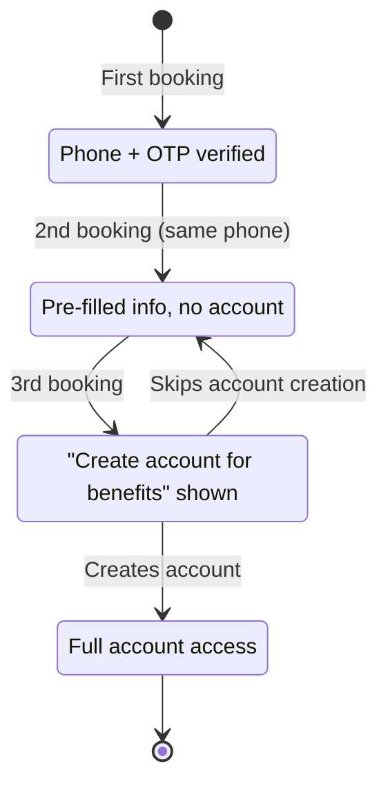
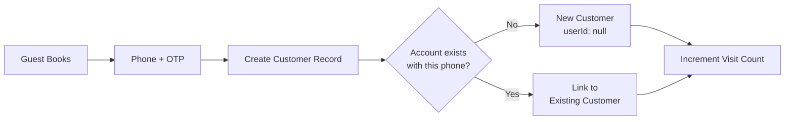
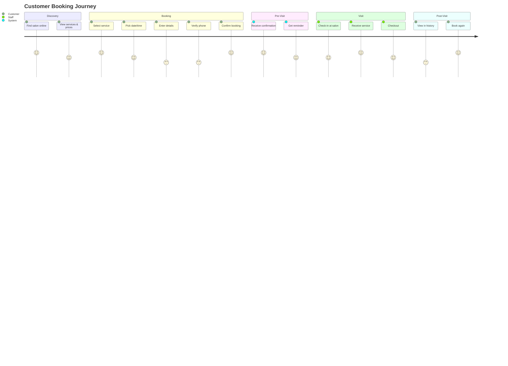
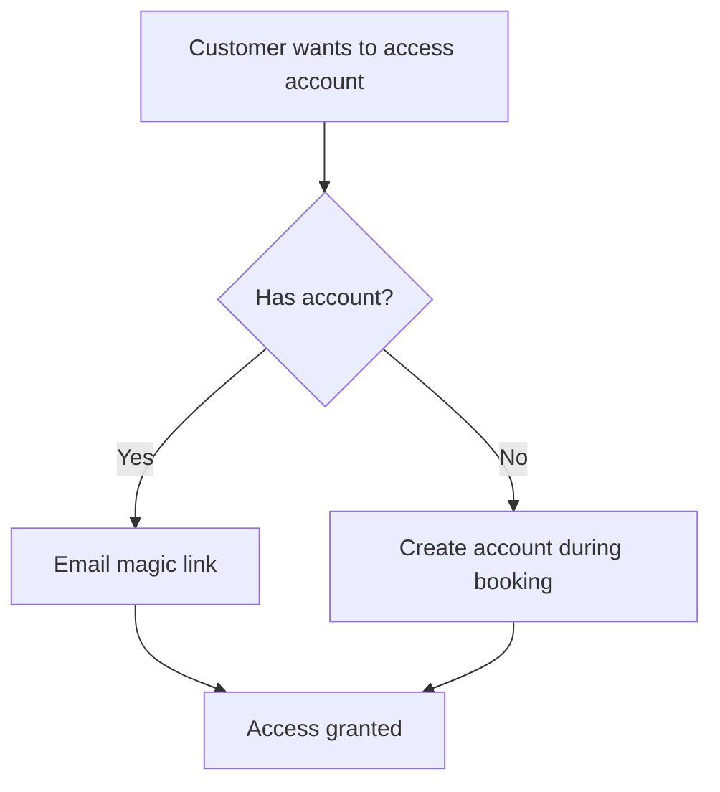

# Customer Portal

> **Priority:** P1 (MVP Nice-to-Have)
> **Owner:** Frontend Team
> **Dependencies:** Core Booking, Authentication
> **Last Updated:** 2026-02-04

## Overview

The customer portal provides a self-service interface for salon customers to book appointments, manage their bookings, view history, and maintain their profile. It uses a **hybrid account model** - customers can book as guests first, and the system encourages account creation after multiple visits.

### Key Business Rules

| Rule | Description |
|------|-------------|
| **Account Model** | Hybrid - Guest booking first, account prompt after 3+ visits |
| **Authentication** | Email magic link (no password) |
| **Notes** | Separate customer notes and internal staff notes |
| **No-Show Policy** | Recorded only, no penalty or blocking |

---

## Hybrid Account Model

### Philosophy

Reduce friction for first-time bookings while encouraging account creation for engaged customers.

### Customer Account States



### Booking by Account State

| Visit | Account State | Experience |
|-------|---------------|------------|
| 1st | Guest | Book with phone + OTP, no account needed |
| 2nd | Recognized | Phone recognized, info pre-filled |
| 3rd+ | Prompted | Banner: "Create account to view history" |
| After signup | Registered | Full portal access, booking history |

### Account Creation Prompt

Shown to customers with 3+ bookings who don't have an account:

```
┌─────────────────────────────────────────────────────────┐
│ 🎉 Welcome back! You've booked with us 3 times.         │
│                                                         │
│ Create a free account to:                               │
│ • View your appointment history                         │
│ • Manage your bookings easily                           │
│ • Get personalized recommendations                      │
│                                                         │
│ [Create Account]  [Maybe Later]                         │
└─────────────────────────────────────────────────────────┘
```

### Guest Booking Data Flow



---

## Customer Journey Map



---

## Public Pages (No Auth Required)

### Salon Landing Page (`/[salon-slug]`)

**Purpose:** Entry point for customers discovering the salon

**Content:**
- Salon name, logo, description
- Address with map
- Business hours
- Contact information
- Featured services preview
- "Book Now" CTA button

**Layout:**
```
┌─────────────────────────────────────────────────────────┐
│ [Logo] Glamour Salon                                    │
│                                                         │
│ Your premier beauty destination in Istanbul             │
│                                                         │
│ ┌─────────────────────┐ ┌─────────────────────────────┐ │
│ │                     │ │ Business Hours               │ │
│ │      [Map]          │ │ Mon-Fri: 09:00 - 20:00      │ │
│ │                     │ │ Sat: 10:00 - 18:00          │ │
│ │                     │ │ Sun: Closed                  │ │
│ └─────────────────────┘ │                             │ │
│                         │ 📍 Nişantaşı, Istanbul       │ │
│                         │ 📞 +90 212 xxx xxxx          │ │
│                         └─────────────────────────────┘ │
│                                                         │
│ Our Services                                            │
│ ┌───────────┐ ┌───────────┐ ┌───────────┐              │
│ │  Haircut  │ │  Coloring │ │  Styling  │  [View All]  │
│ │  ₺150+    │ │  ₺300+    │ │  ₺100+    │              │
│ └───────────┘ └───────────┘ └───────────┘              │
│                                                         │
│              [Book an Appointment]                      │
└─────────────────────────────────────────────────────────┘
```

### Services Page (`/[salon-slug]/services`)

**Purpose:** Browse all services with details

**Features:**
- Services grouped by category
- Each service shows: name, description, duration, price range
- Filter by category
- Search functionality
- "Book This" button per service

### Booking Flow (`/[salon-slug]/book`)

**Purpose:** Complete appointment booking

See [Core Booking](./core-booking.md) for detailed flow specification.

**Mobile Optimization:**
- Single-column layout
- Large touch targets (min 44px)
- Sticky "Continue" button
- Progress indicator
- Back navigation

### Booking Confirmation (`/[salon-slug]/book/confirmed/[id]`)

**Purpose:** Show booking success and next steps

**Content:**
- Confirmation number
- Appointment details (service, staff, date/time)
- Salon address with "Get Directions" link
- "Add to Calendar" button (.ics download)
- "Manage Booking" link (cancel/reschedule)
- QR code (for check-in, future feature)

---

## Authenticated Pages (Login Required)

### Authentication Flow



**Login Methods:**
1. **Magic Link (Primary):** Email-based passwordless login
2. **Phone OTP (Future):** SMS-based verification

### My Bookings (`/[salon-slug]/my-bookings`)

**Purpose:** View and manage appointments

**Tabs:**
- Upcoming (default)
- Past
- Cancelled

**Per Appointment:**
```
┌─────────────────────────────────────────────────────────┐
│ Thursday, March 15, 2024 at 14:30                       │
│                                                         │
│ Haircut with Ayşe                                       │
│ 45 min • ₺150                                           │
│                                                         │
│ Status: Confirmed ✓                                     │
│                                                         │
│ [Reschedule]  [Cancel]                                  │
└─────────────────────────────────────────────────────────┘
```

**Actions:**
- Reschedule (if >2hrs before)
- Cancel (if >2hrs before)
- Add to calendar
- View salon directions

### Booking History (`/[salon-slug]/my-bookings/history`)

**Purpose:** View past appointments

**Per Past Appointment:**
- Date and time
- Service(s) received
- Staff who provided service
- Total paid
- "Book Again" button

### My Profile (`/[salon-slug]/profile`)

**Purpose:** Manage customer profile

**Editable Fields:**
| Field | Required | Notes |
|-------|----------|-------|
| Name | Yes | Display name |
| Email | Yes | Read-only (login identifier) |
| Phone | Yes | For appointment reminders |
| Preferred Staff | No | Default selection in booking |
| Notification Preferences | - | Email reminders on/off |

---

## Customer Data Model

```typescript
// convex/schema.ts
customers: defineTable({
  // Identity
  organizationId: v.id("organizations"),
  userId: v.optional(v.id("users")), // If registered (null for guests)

  // Contact
  name: v.string(),
  email: v.string(),
  phone: v.string(),
  phoneVerified: v.boolean(),

  // Account Status
  accountStatus: v.union(
    v.literal("guest"),      // No account, phone verified only
    v.literal("recognized"), // Returning guest (2+ visits)
    v.literal("prompted"),   // Shown account creation prompt (3+ visits)
    v.literal("registered")  // Has full account
  ),

  // Preferences
  preferredStaffId: v.optional(v.id("staff")),
  notificationPreferences: v.object({
    emailReminders: v.boolean(),
    smsReminders: v.boolean(), // Future
  }),

  // Stats
  totalVisits: v.number(),
  totalSpent: v.number(), // In TRY
  lastVisitDate: v.optional(v.string()),
  noShowCount: v.number(), // Recorded for info only, no penalty

  // Notes - SEPARATE FIELDS
  customerNotes: v.optional(v.string()), // Customer's own notes/preferences (visible to customer)
  staffNotes: v.optional(v.string()), // Internal staff notes (NOT visible to customer)

  // Tags & Metadata
  tags: v.array(v.string()), // "VIP", "New", "Frequent", etc.
  source: v.union(
    v.literal("online"),
    v.literal("walk_in"),
    v.literal("phone"),
    v.literal("import")
  ),

  createdAt: v.number(),
  updatedAt: v.number(),
})
.index("by_organization", ["organizationId"])
.index("by_org_email", ["organizationId", "email"])
.index("by_org_phone", ["organizationId", "phone"])
.index("by_user", ["userId"])
.index("by_org_status", ["organizationId", "accountStatus"])
```

---

## Customer Notes System

### Two Types of Notes

| Note Type | Who Can See | Who Can Edit | Purpose |
|-----------|-------------|--------------|---------|
| **Customer Notes** | Customer + Staff | Customer | Preferences, requests, allergies |
| **Staff Notes** | Staff only | Staff | Internal observations, warnings |

### Customer Notes (Visible)

Customer-provided information visible to both customer and staff:

```
┌─────────────────────────────────────────────────────────┐
│ My Preferences (Customer View)                          │
├─────────────────────────────────────────────────────────┤
│ "I'm allergic to certain hair dyes. Please use          │
│ hypoallergenic products. I prefer quieter times."       │
│                                                         │
│ [Edit]                                                  │
└─────────────────────────────────────────────────────────┘
```

### Staff Notes (Internal)

Staff-only notes not visible to customer:

```
┌─────────────────────────────────────────────────────────┐
│ 📝 Internal Notes (Staff View Only)                     │
├─────────────────────────────────────────────────────────┤
│ "Customer prefers Ayşe, was unhappy with previous       │
│ colorist. VIP - always offer tea. Tip history: generous"│
│                                                         │
│ [Edit]                                                  │
└─────────────────────────────────────────────────────────┘
```

### API Access Control

```typescript
// Customer profile query (for customer)
export const getMyProfile = query({
  handler: async (ctx) => {
    const customer = await getCustomerByUser(ctx);
    return {
      ...customer,
      notes: customer.customerNotes, // Only customer notes
      // staffNotes is NOT included
    };
  },
});

// Customer detail query (for staff)
export const getCustomerDetail = query({
  handler: async (ctx, { customerId }) => {
    await assertRole(ctx, ["owner", "admin", "staff"]);
    const customer = await ctx.db.get(customerId);
    return {
      ...customer,
      customerNotes: customer.customerNotes, // Customer's notes
      staffNotes: customer.staffNotes, // Internal notes (staff only)
    };
  },
});
```

---

## No-Show Policy

### Business Rule

No-shows are **recorded for information only** - no automatic penalties or blocking.

### How No-Shows are Tracked

```typescript
// When marking appointment as no-show
export const markNoShow = mutation({
  args: {
    appointmentId: v.id("appointments"),
  },
  handler: async (ctx, args) => {
    await assertRole(ctx, ["owner", "admin"]);

    const appointment = await ctx.db.get(args.appointmentId);

    // Update appointment status
    await ctx.db.patch(args.appointmentId, {
      status: "no_show",
      noShowMarkedAt: Date.now(),
    });

    // Increment customer no-show count (informational only)
    await ctx.db.patch(appointment.customerId, {
      noShowCount: (await ctx.db.get(appointment.customerId)).noShowCount + 1,
    });

    // NO automatic penalties:
    // - Customer is NOT blocked from future bookings
    // - No deposit requirement triggered
    // - No notification sent to customer
  },
});
```

### No-Show Display (Staff View)

```
┌─────────────────────────────────────────────────────────┐
│ Customer: Mehmet Yılmaz                                 │
├─────────────────────────────────────────────────────────┤
│ Total Visits: 12                                        │
│ No-Shows: 2 (for information only)                      │
│ Last Visit: March 10, 2024                              │
│                                                         │
│ ⚠️ Note: No-shows are recorded but do not affect        │
│    booking privileges.                                  │
└─────────────────────────────────────────────────────────┘
```

---

## API Contracts

### Query: Get Customer Bookings

```typescript
export const getMyBookings = query({
  args: {
    organizationId: v.id("organizations"),
    status: v.optional(v.union(
      v.literal("upcoming"),
      v.literal("past"),
      v.literal("cancelled")
    )),
  },
  returns: v.array(v.object({
    _id: v.id("appointments"),
    date: v.string(),
    startTime: v.number(),
    endTime: v.number(),
    formattedTime: v.string(),
    services: v.array(v.object({
      name: v.string(),
      duration: v.number(),
      price: v.number(),
    })),
    staff: v.object({
      name: v.string(),
      imageUrl: v.optional(v.string()),
    }),
    status: v.string(),
    totalPrice: v.number(),
    canCancel: v.boolean(),
    canReschedule: v.boolean(),
  })),
  handler: async (ctx, args) => {
    // Get current user from auth
    // Find customer by userId
    // Query appointments
  },
});
```

### Query: Get Customer Profile

```typescript
export const getMyProfile = query({
  args: {
    organizationId: v.id("organizations"),
  },
  returns: v.object({
    name: v.string(),
    email: v.string(),
    phone: v.string(),
    preferredStaff: v.optional(v.object({
      _id: v.id("staff"),
      name: v.string(),
    })),
    notificationPreferences: v.object({
      emailReminders: v.boolean(),
      smsReminders: v.boolean(),
    }),
    stats: v.object({
      totalVisits: v.number(),
      memberSince: v.string(),
    }),
  }),
  handler: async (ctx, args) => { /* ... */ },
});
```

### Mutation: Update Customer Profile

```typescript
export const updateMyProfile = mutation({
  args: {
    organizationId: v.id("organizations"),
    name: v.optional(v.string()),
    phone: v.optional(v.string()),
    preferredStaffId: v.optional(v.id("staff")),
    notificationPreferences: v.optional(v.object({
      emailReminders: v.boolean(),
      smsReminders: v.boolean(),
    })),
  },
  returns: v.object({ success: v.boolean() }),
  handler: async (ctx, args) => { /* ... */ },
});
```

---

## Mobile Considerations

### Responsive Design

| Breakpoint | Layout |
|------------|--------|
| < 640px | Mobile single-column |
| 640-1024px | Tablet two-column |
| > 1024px | Desktop multi-column |

### Mobile-Specific Features

1. **Sticky Booking Bar:** Fixed bottom bar on service pages
2. **Swipe Navigation:** Swipe between booking steps
3. **Touch Calendar:** Large date cells, easy month navigation
4. **One-Tap Calling:** Click-to-call salon number
5. **Share Booking:** Share appointment details via native share

### Performance Targets

| Metric | Target |
|--------|--------|
| First Contentful Paint | < 1.5s |
| Time to Interactive | < 3s |
| Largest Contentful Paint | < 2.5s |
| Cumulative Layout Shift | < 0.1 |

---

## Email Notifications

### Booking Confirmation

**Trigger:** Appointment created
**Timing:** Immediate

```
Subject: Booking Confirmed - [Salon Name]

Hi [Customer Name],

Your appointment is confirmed!

📅 [Day], [Date] at [Time]
💇 [Service Name(s)]
👤 with [Staff Name]
📍 [Salon Address]

[Add to Calendar] [Get Directions]

Need to make changes?
[Reschedule] [Cancel]

See you soon!
[Salon Name]
```

### Appointment Reminder

**Trigger:** 24 hours before appointment
**Timing:** Scheduled

```
Subject: Reminder: Your appointment tomorrow at [Salon Name]

Hi [Customer Name],

This is a friendly reminder about your appointment tomorrow.

📅 [Day], [Date] at [Time]
💇 [Service Name(s)]
👤 with [Staff Name]

Need to make changes?
[Reschedule] [Cancel]

See you tomorrow!
[Salon Name]
```

### Cancellation Confirmation

**Trigger:** Appointment cancelled
**Timing:** Immediate

```
Subject: Appointment Cancelled - [Salon Name]

Hi [Customer Name],

Your appointment has been cancelled.

Cancelled appointment:
📅 [Day], [Date] at [Time]
💇 [Service Name(s)]

We'd love to see you soon. Book a new appointment:
[Book Now]

[Salon Name]
```

---

## Implementation Checklist

### Backend (Convex)

- [ ] Schema: `customers` table with indexes
- [ ] Query: `getMyBookings`
- [ ] Query: `getMyProfile`
- [ ] Query: `getBookingById` (for manage booking page)
- [ ] Mutation: `updateMyProfile`
- [ ] Mutation: `cancelMyBooking`
- [ ] Mutation: `rescheduleMyBooking`
- [ ] Action: `sendBookingConfirmation`
- [ ] Action: `sendAppointmentReminder`
- [ ] Scheduler: `scheduleReminder`

### Frontend (Next.js)

- [ ] Page: `/[org]` (salon landing)
- [ ] Page: `/[org]/services`
- [ ] Page: `/[org]/book` (booking wizard)
- [ ] Page: `/[org]/book/confirmed/[id]`
- [ ] Page: `/[org]/my-bookings`
- [ ] Page: `/[org]/my-bookings/history`
- [ ] Page: `/[org]/profile`
- [ ] Component: `SalonHeader`
- [ ] Component: `ServiceGrid`
- [ ] Component: `BookingWizard`
- [ ] Component: `BookingCard`
- [ ] Component: `ProfileForm`
- [ ] Component: `CalendarDownload`
- [ ] Hook: `useMyBookings`
- [ ] Hook: `useMyProfile`

### Tests

- [ ] Unit: Customer data validation
- [ ] Integration: Customer registration flow
- [ ] Integration: Booking management
- [ ] E2E: Complete customer journey
- [ ] E2E: Mobile booking flow
- [ ] Visual: Email template rendering

---

## Future Enhancements (P2+)

| Feature | Priority | Description |
|---------|----------|-------------|
| Loyalty Points | P2 | Earn points per visit, redeem for discounts |
| Favorite Staff | P2 | Quick book with favorite staff |
| Waitlist | P2 | Join waitlist for fully booked slots |
| Reviews | P3 | Rate and review after visit |
| Refer a Friend | P3 | Referral rewards program |
| Gift Cards | P3 | Purchase and redeem gift cards |
