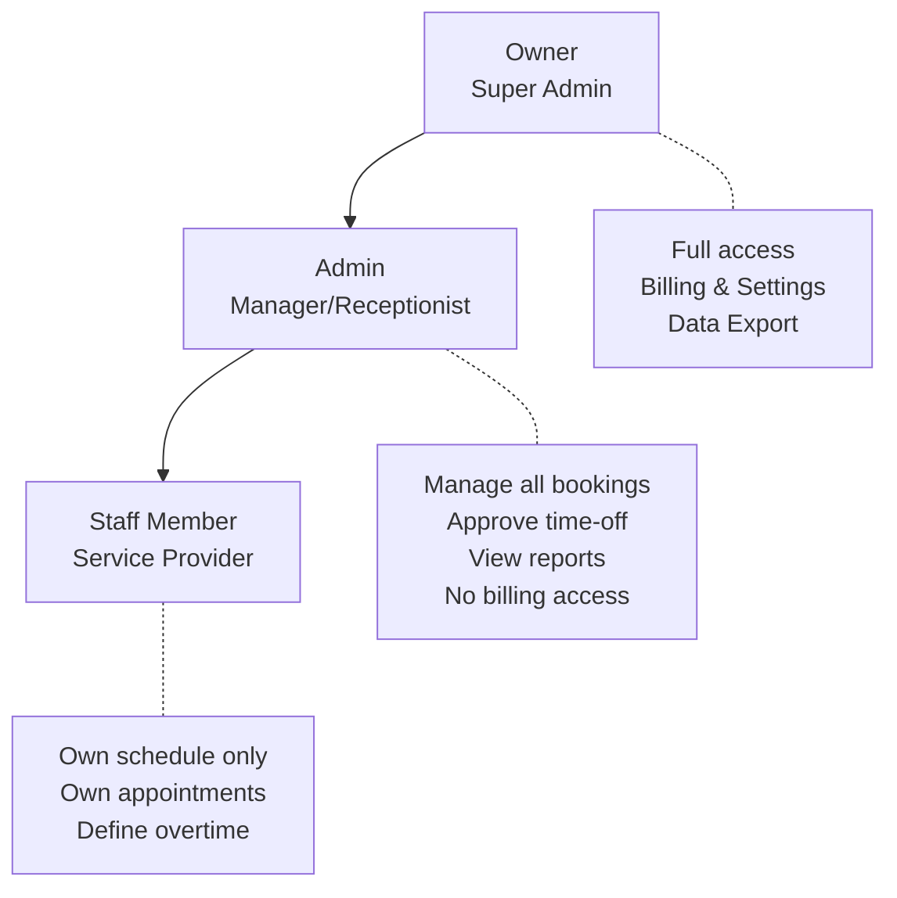
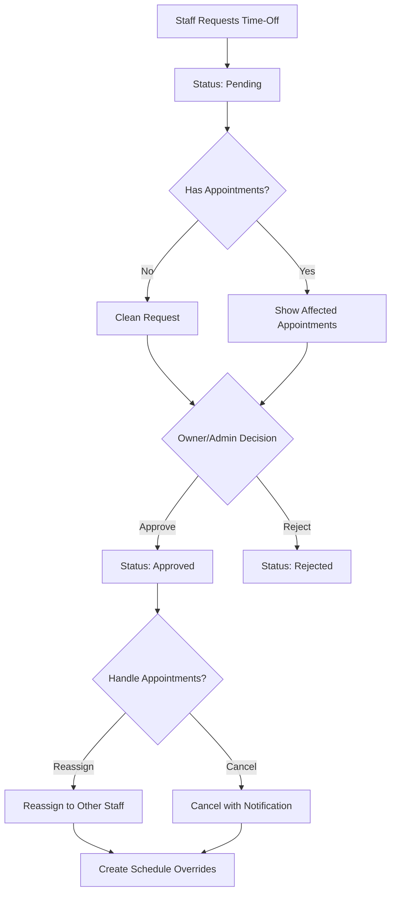
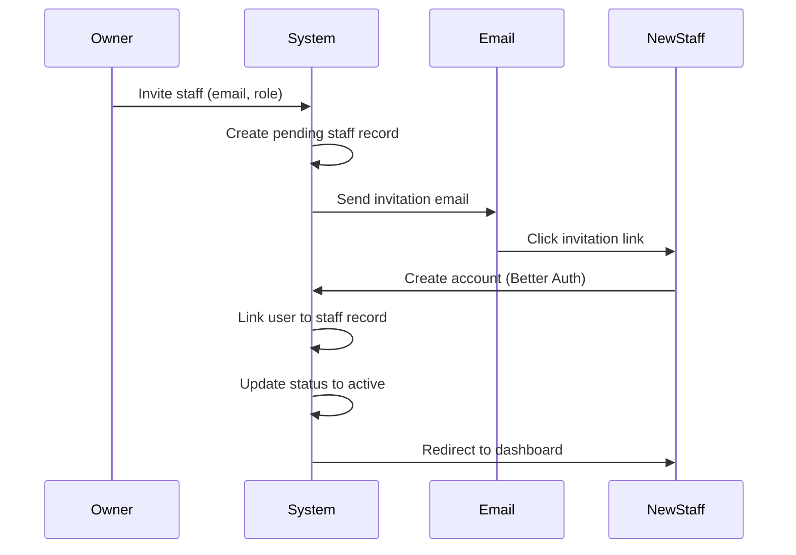

# Staff Management

> **Priority:** P0 (MVP Must-Have)
> **Owner:** Backend Team
> **Dependencies:** Multi-tenancy, Authentication
> **Last Updated:** 2026-02-04

## Overview

Staff management handles team member profiles, working schedules, service assignments, and role-based permissions within a salon organization.

### Key Business Rules

| Rule | Description |
|------|-------------|
| **Role System** | 3 roles only: Owner > Admin > Staff |
| **Time-Off** | Requires approval from Owner or Admin |
| **Out-of-Hours** | Admin can book, Staff can define own overtime |
| **Schedule** | Staff views only own schedule |

---

## Staff Roles & Permissions

### Role Hierarchy (3 Roles Only)

> **Important:** The system has exactly 3 roles. There is no separate "Receptionist" role - front desk duties are performed by Admin or Owner.



### Permission Matrix

| Permission | Owner | Admin | Staff |
|------------|-------|-------|-------|
| View dashboard | ✅ | ✅ | ❌ |
| View all schedules | ✅ | ✅ | ❌ |
| View own schedule | ✅ | ✅ | ✅ |
| Create appointments (any staff) | ✅ | ✅ | ❌ |
| Create appointments (own) | ✅ | ✅ | ✅ |
| Cancel any appointment | ✅ | ✅ | ❌ |
| Cancel own appointment | ✅ | ✅ | ✅ |
| **Book outside business hours** | ✅ | ✅ | ❌ |
| **Define own overtime** | ✅ | ✅ | ✅ |
| Manage services | ✅ | ✅ | ❌ |
| Manage staff profiles | ✅ | ✅ | ❌ |
| **Approve/Reject time-off** | ✅ | ✅ | ❌ |
| **Request time-off** | ✅ | ✅ | ✅ |
| Manage settings | ✅ | ❌ | ❌ |
| View reports | ✅ | ✅ | ❌ |
| Manage billing | ✅ | ❌ | ❌ |
| Export data | ✅ | ❌ | ❌ |

---

## Staff Profile

### Data Model

```typescript
// convex/schema.ts
staff: defineTable({
  // Identity
  userId: v.id("users"), // Better Auth user
  organizationId: v.id("organizations"),

  // Profile
  name: v.string(),
  email: v.string(),
  phone: v.optional(v.string()),
  imageUrl: v.optional(v.string()),
  bio: v.optional(v.string()),

  // Role & Status
  role: v.union(v.literal("owner"), v.literal("admin"), v.literal("staff")),
  status: v.union(v.literal("active"), v.literal("inactive"), v.literal("pending")),

  // Services this staff can perform
  serviceIds: v.array(v.id("services")),

  // Default working hours (can be overridden per day)
  defaultSchedule: v.object({
    monday: v.optional(v.object({ start: v.number(), end: v.number() })),
    tuesday: v.optional(v.object({ start: v.number(), end: v.number() })),
    wednesday: v.optional(v.object({ start: v.number(), end: v.number() })),
    thursday: v.optional(v.object({ start: v.number(), end: v.number() })),
    friday: v.optional(v.object({ start: v.number(), end: v.number() })),
    saturday: v.optional(v.object({ start: v.number(), end: v.number() })),
    sunday: v.optional(v.object({ start: v.number(), end: v.number() })),
  }),

  // Timestamps
  createdAt: v.number(),
  updatedAt: v.number(),
})
.index("by_organization", ["organizationId"])
.index("by_user", ["userId"])
.index("by_org_status", ["organizationId", "status"])
```

### Profile Fields

| Field | Type | Required | Description |
|-------|------|----------|-------------|
| name | string | Yes | Display name |
| email | string | Yes | Contact email (from Better Auth) |
| phone | string | No | Contact phone |
| imageUrl | string | No | Profile photo URL |
| bio | string | No | Short bio (max 500 chars) |
| role | enum | Yes | owner/admin/staff |
| status | enum | Yes | active/inactive/pending |
| serviceIds | array | No | Services they can perform |
| defaultSchedule | object | Yes | Weekly working hours |

---

## Staff Schedule System

### Schedule Types

1. **Default Schedule:** Weekly recurring hours (e.g., Mon-Fri 9:00-18:00)
2. **Schedule Overrides:** Specific date exceptions (e.g., Dec 25 - Closed)
3. **Time-Off Requests:** Leave periods (vacation, sick leave)

### Schedule Override Table

```typescript
// convex/schema.ts
scheduleOverrides: defineTable({
  staffId: v.id("staff"),
  organizationId: v.id("organizations"),
  date: v.string(), // "2024-03-15"
  type: v.union(
    v.literal("custom_hours"), // Different hours
    v.literal("day_off"),      // Not working
    v.literal("time_off")      // Part of leave period
  ),
  // Only for custom_hours
  startTime: v.optional(v.number()), // Minutes from midnight
  endTime: v.optional(v.number()),
  reason: v.optional(v.string()),
  createdAt: v.number(),
})
.index("by_staff_date", ["staffId", "date"])
.index("by_org_date", ["organizationId", "date"])
```

### Time-Off Table

```typescript
// convex/schema.ts
timeOffRequests: defineTable({
  staffId: v.id("staff"),
  organizationId: v.id("organizations"),
  startDate: v.string(),
  endDate: v.string(),
  type: v.union(
    v.literal("vacation"),
    v.literal("sick"),
    v.literal("personal"),
    v.literal("other")
  ),
  status: v.union(
    v.literal("pending"),
    v.literal("approved"),
    v.literal("rejected")
  ),
  reason: v.optional(v.string()),
  // Approval tracking
  approvedBy: v.optional(v.id("staff")),
  approvedAt: v.optional(v.number()),
  rejectionReason: v.optional(v.string()),
  // Affected appointments
  affectedAppointmentIds: v.optional(v.array(v.id("appointments"))),
  createdAt: v.number(),
  updatedAt: v.number(),
})
.index("by_staff", ["staffId"])
.index("by_org_status", ["organizationId", "status"])
.index("by_staff_dates", ["staffId", "startDate", "endDate"])
```

---

## Time-Off Approval Workflow

### Business Rule

All time-off requests require approval from Owner or Admin before taking effect.

### Workflow Diagram



### Time-Off Request States

| Status | Description | Actions Available |
|--------|-------------|-------------------|
| `pending` | Awaiting approval | Approve, Reject, Cancel |
| `approved` | Approved by Owner/Admin | None (final) |
| `rejected` | Rejected with reason | Staff can resubmit |

### API: Request Time-Off

```typescript
export const requestTimeOff = mutation({
  args: {
    startDate: v.string(),
    endDate: v.string(),
    type: v.union(
      v.literal("vacation"),
      v.literal("sick"),
      v.literal("personal"),
      v.literal("other")
    ),
    reason: v.optional(v.string()),
  },
  returns: v.object({
    requestId: v.id("timeOffRequests"),
    affectedAppointments: v.number(),
  }),
  handler: async (ctx, args) => {
    const staff = await getCurrentStaff(ctx);

    // Check for existing appointments in date range
    const affectedAppointments = await ctx.db
      .query("appointments")
      .withIndex("by_staff_date", (q) => q.eq("staffId", staff._id))
      .filter((q) =>
        q.and(
          q.gte(q.field("date"), args.startDate),
          q.lte(q.field("date"), args.endDate),
          q.neq(q.field("status"), "cancelled")
        )
      )
      .collect();

    const requestId = await ctx.db.insert("timeOffRequests", {
      staffId: staff._id,
      organizationId: staff.organizationId,
      ...args,
      status: "pending",
      affectedAppointmentIds: affectedAppointments.map(a => a._id),
      createdAt: Date.now(),
      updatedAt: Date.now(),
    });

    // Notify Owner/Admins of pending request
    await ctx.scheduler.runAfter(0, internal.notifications.notifyTimeOffRequest, {
      requestId,
    });

    return {
      requestId,
      affectedAppointments: affectedAppointments.length,
    };
  },
});
```

### API: Approve/Reject Time-Off

```typescript
export const handleTimeOffRequest = mutation({
  args: {
    requestId: v.id("timeOffRequests"),
    action: v.union(v.literal("approve"), v.literal("reject")),
    rejectionReason: v.optional(v.string()),
    appointmentAction: v.optional(v.union(
      v.literal("reassign"),
      v.literal("cancel")
    )),
    reassignTo: v.optional(v.id("staff")),
  },
  returns: v.object({ success: v.boolean() }),
  handler: async (ctx, args) => {
    // 1. Validate caller is Owner or Admin
    await assertRole(ctx, ["owner", "admin"]);

    const request = await ctx.db.get(args.requestId);
    if (!request || request.status !== "pending") {
      throw new ConvexError("Request not found or already processed");
    }

    if (args.action === "reject") {
      await ctx.db.patch(args.requestId, {
        status: "rejected",
        rejectionReason: args.rejectionReason,
        updatedAt: Date.now(),
      });

      // Notify staff of rejection
      await ctx.scheduler.runAfter(0, internal.notifications.notifyTimeOffRejected, {
        requestId: args.requestId,
      });

      return { success: true };
    }

    // Approval flow
    const approver = await getCurrentStaff(ctx);

    // Handle affected appointments
    if (request.affectedAppointmentIds?.length) {
      for (const appointmentId of request.affectedAppointmentIds) {
        if (args.appointmentAction === "reassign" && args.reassignTo) {
          await ctx.db.patch(appointmentId, { staffId: args.reassignTo });
        } else {
          // Cancel and notify customer
          await ctx.db.patch(appointmentId, {
            status: "cancelled",
            cancelledBy: "staff",
            cancellationReason: "Staff time-off",
          });
          await ctx.scheduler.runAfter(0, internal.notifications.sendCancellationEmail, {
            appointmentId,
          });
        }
      }
    }

    // Create schedule overrides for the time-off period
    const dates = getDateRange(request.startDate, request.endDate);
    for (const date of dates) {
      await ctx.db.insert("scheduleOverrides", {
        staffId: request.staffId,
        organizationId: request.organizationId,
        date,
        type: "time_off",
        reason: `Time off: ${request.type}`,
        createdAt: Date.now(),
      });
    }

    await ctx.db.patch(args.requestId, {
      status: "approved",
      approvedBy: approver._id,
      approvedAt: Date.now(),
      updatedAt: Date.now(),
    });

    // Notify staff of approval
    await ctx.scheduler.runAfter(0, internal.notifications.notifyTimeOffApproved, {
      requestId: args.requestId,
    });

    return { success: true };
  },
});
```

---

## Overtime & Out-of-Hours Booking

### Business Rules

| Actor | Capability |
|-------|------------|
| **Admin/Owner** | Can create appointments outside business hours for any staff |
| **Staff** | Can define own overtime availability windows |

### Staff Overtime Definition

Staff can mark themselves available outside regular business hours:

```typescript
// convex/schema.ts
staffOvertime: defineTable({
  staffId: v.id("staff"),
  organizationId: v.id("organizations"),
  date: v.string(), // Specific date
  startTime: v.number(), // Minutes from midnight
  endTime: v.number(),
  note: v.optional(v.string()), // e.g., "Available for VIP clients"
  createdAt: v.number(),
})
.index("by_staff_date", ["staffId", "date"])
```

### Overtime UI

```
┌─────────────────────────────────────────────────────────┐
│ My Overtime Availability                                │
├─────────────────────────────────────────────────────────┤
│ Add overtime slots when you're available outside        │
│ regular business hours.                                 │
│                                                         │
│ Upcoming Overtime                        [+ Add Slot]   │
│                                                         │
│ Mar 15, 2024 • 18:00 - 20:00                  [Delete] │
│ "Available for color appointments"                      │
│                                                         │
│ Mar 20, 2024 • 08:00 - 09:00                  [Delete] │
│ "Early morning slot"                                    │
└─────────────────────────────────────────────────────────┘
```

### Admin Out-of-Hours Booking

When Admin/Owner creates an appointment outside business hours:

1. System shows warning: "This time is outside regular business hours"
2. Admin can proceed (override capability)
3. Appointment is marked with `isOutsideHours: true` flag
4. No automatic validation against staff schedule

```typescript
export const createAdminAppointment = mutation({
  args: {
    // ... standard appointment args
    forceOutsideHours: v.optional(v.boolean()),
  },
  handler: async (ctx, args) => {
    // Check caller is Admin or Owner
    await assertRole(ctx, ["owner", "admin"]);

    const staffSchedule = await getStaffScheduleForDate(args.staffId, args.date);
    const overtime = await getStaffOvertime(args.staffId, args.date);

    const isWithinSchedule = isTimeInRange(args.startTime, staffSchedule);
    const isWithinOvertime = isTimeInRange(args.startTime, overtime);

    if (!isWithinSchedule && !isWithinOvertime) {
      if (!args.forceOutsideHours) {
        throw new ConvexError({
          code: "OUTSIDE_HOURS",
          message: "This time is outside staff working hours",
          requiresOverride: true,
        });
      }
    }

    // Create appointment with flag
    return ctx.db.insert("appointments", {
      ...args,
      isOutsideHours: !isWithinSchedule && !isWithinOvertime,
      createdBy: "admin",
    });
  },
});
```

### Schedule Resolution Algorithm

```typescript
function getStaffScheduleForDate(staffId: string, date: string): Schedule | null {
  // 1. Check for time-off
  const timeOff = await getTimeOff(staffId, date);
  if (timeOff && timeOff.status === "approved") {
    return null; // Not working
  }

  // 2. Check for override
  const override = await getOverride(staffId, date);
  if (override) {
    if (override.type === "day_off") return null;
    if (override.type === "custom_hours") {
      return {
        startTime: override.startTime,
        endTime: override.endTime,
        isOverride: true,
      };
    }
  }

  // 3. Fall back to default schedule
  const dayOfWeek = getDayOfWeek(date); // "monday", "tuesday", etc.
  const staff = await getStaff(staffId);
  const defaultHours = staff.defaultSchedule[dayOfWeek];

  if (!defaultHours) return null; // Not scheduled for this day

  return {
    startTime: defaultHours.start,
    endTime: defaultHours.end,
    isOverride: false,
  };
}
```

---

## Staff Onboarding Flow

### Invitation Process



### Invitation Email Content

```
Subject: You've been invited to join [Salon Name]

Hi [Name],

[Owner Name] has invited you to join [Salon Name] as a [Role].

Click the link below to create your account and start using the system:

[Invitation Link - expires in 7 days]

If you have questions, contact [Owner Email].
```

---

## API Contracts

### Query: List Staff

```typescript
export const listStaff = query({
  args: {
    organizationId: v.id("organizations"),
    status: v.optional(v.union(
      v.literal("active"),
      v.literal("inactive"),
      v.literal("pending")
    )),
  },
  returns: v.array(v.object({
    _id: v.id("staff"),
    name: v.string(),
    email: v.string(),
    imageUrl: v.optional(v.string()),
    role: v.string(),
    status: v.string(),
    serviceCount: v.number(),
  })),
  handler: async (ctx, args) => { /* ... */ },
});
```

### Query: Get Staff Schedule

```typescript
export const getStaffSchedule = query({
  args: {
    staffId: v.id("staff"),
    startDate: v.string(),
    endDate: v.string(),
  },
  returns: v.array(v.object({
    date: v.string(),
    isWorking: v.boolean(),
    startTime: v.optional(v.number()),
    endTime: v.optional(v.number()),
    isOverride: v.boolean(),
    appointmentCount: v.number(),
  })),
  handler: async (ctx, args) => { /* ... */ },
});
```

### Mutation: Invite Staff

```typescript
export const inviteStaff = mutation({
  args: {
    organizationId: v.id("organizations"),
    email: v.string(),
    name: v.string(),
    role: v.union(v.literal("admin"), v.literal("staff")),
    serviceIds: v.array(v.id("services")),
  },
  returns: v.object({
    staffId: v.id("staff"),
    invitationSent: v.boolean(),
  }),
  handler: async (ctx, args) => {
    // 1. Validate caller is owner/admin
    // 2. Check email not already in org
    // 3. Create pending staff record
    // 4. Generate invitation token
    // 5. Send invitation email
  },
});
```

### Mutation: Update Staff Schedule

```typescript
export const updateDefaultSchedule = mutation({
  args: {
    staffId: v.id("staff"),
    schedule: v.object({
      monday: v.optional(v.object({ start: v.number(), end: v.number() })),
      tuesday: v.optional(v.object({ start: v.number(), end: v.number() })),
      wednesday: v.optional(v.object({ start: v.number(), end: v.number() })),
      thursday: v.optional(v.object({ start: v.number(), end: v.number() })),
      friday: v.optional(v.object({ start: v.number(), end: v.number() })),
      saturday: v.optional(v.object({ start: v.number(), end: v.number() })),
      sunday: v.optional(v.object({ start: v.number(), end: v.number() })),
    }),
  },
  returns: v.object({ success: v.boolean() }),
  handler: async (ctx, args) => {
    // 1. Validate caller can edit this staff
    // 2. Validate times (start < end, within 0-1440)
    // 3. Update staff record
    // 4. Optionally notify affected appointments
  },
});
```

### Mutation: Create Schedule Override

```typescript
export const createScheduleOverride = mutation({
  args: {
    staffId: v.id("staff"),
    date: v.string(),
    type: v.union(
      v.literal("custom_hours"),
      v.literal("day_off")
    ),
    startTime: v.optional(v.number()),
    endTime: v.optional(v.number()),
    reason: v.optional(v.string()),
  },
  returns: v.object({ overrideId: v.id("scheduleOverrides") }),
  handler: async (ctx, args) => {
    // 1. Validate caller can edit this staff
    // 2. Check for conflicting appointments
    // 3. Create or update override
    // 4. If appointments affected, return warning
  },
});
```

---

## UI Components

### Staff List View

```
┌─────────────────────────────────────────────────────────┐
│ Staff Members                           [+ Invite Staff]│
├─────────────────────────────────────────────────────────┤
│ ┌─────┐ Ahmet Yilmaz                              Owner │
│ │ 📷  │ ahmet@salon.com                                 │
│ └─────┘ 5 services • Active                      [Edit] │
├─────────────────────────────────────────────────────────┤
│ ┌─────┐ Ayşe Demir                                Admin │
│ │ 📷  │ ayse@salon.com                                  │
│ └─────┘ 8 services • Active                      [Edit] │
├─────────────────────────────────────────────────────────┤
│ ┌─────┐ Fatma Kaya                                Staff │
│ │ 📷  │ fatma@salon.com                                 │
│ └─────┘ 3 services • Pending                [Resend]    │
└─────────────────────────────────────────────────────────┘
```

### Schedule Editor

```
┌─────────────────────────────────────────────────────────┐
│ Schedule: Ayşe Demir                                    │
├─────────────────────────────────────────────────────────┤
│ Default Weekly Schedule                                 │
│                                                         │
│ Monday    [✓] [09:00] - [18:00]                        │
│ Tuesday   [✓] [09:00] - [18:00]                        │
│ Wednesday [✓] [09:00] - [18:00]                        │
│ Thursday  [✓] [09:00] - [18:00]                        │
│ Friday    [✓] [09:00] - [18:00]                        │
│ Saturday  [✓] [10:00] - [16:00]                        │
│ Sunday    [ ] Closed                                    │
│                                                         │
│ [Save Changes]                                          │
├─────────────────────────────────────────────────────────┤
│ Upcoming Overrides                    [+ Add Override]  │
│                                                         │
│ Mar 15, 2024 - Day Off (Dentist appointment)   [Delete] │
│ Mar 20, 2024 - 10:00-14:00 (Custom)           [Delete] │
└─────────────────────────────────────────────────────────┘
```

---

## Implementation Checklist

### Backend (Convex)

- [ ] Schema: `staff` table with indexes
- [ ] Schema: `scheduleOverrides` table
- [ ] Schema: `timeOffRequests` table
- [ ] Query: `listStaff`
- [ ] Query: `getStaffById`
- [ ] Query: `getStaffSchedule`
- [ ] Query: `getStaffByService` (for booking)
- [ ] Mutation: `inviteStaff`
- [ ] Mutation: `updateStaffProfile`
- [ ] Mutation: `updateStaffRole`
- [ ] Mutation: `deactivateStaff`
- [ ] Mutation: `updateDefaultSchedule`
- [ ] Mutation: `createScheduleOverride`
- [ ] Mutation: `deleteScheduleOverride`
- [ ] Mutation: `requestTimeOff`
- [ ] Mutation: `approveTimeOff`
- [ ] Action: `sendInvitationEmail`
- [ ] Helper: `getStaffScheduleForDate`
- [ ] Helper: `checkScheduleConflicts`

### Frontend (Next.js)

- [ ] Component: `StaffList`
- [ ] Component: `StaffCard`
- [ ] Component: `StaffProfileForm`
- [ ] Component: `ScheduleEditor`
- [ ] Component: `ScheduleOverrideModal`
- [ ] Component: `InviteStaffModal`
- [ ] Component: `ServiceAssignment`
- [ ] Page: `/[org]/staff`
- [ ] Page: `/[org]/staff/[id]`
- [ ] Page: `/[org]/staff/[id]/schedule`
- [ ] Hook: `useStaffList`
- [ ] Hook: `useStaffSchedule`

### Tests

- [ ] Unit: Schedule resolution logic
- [ ] Unit: Permission checks
- [ ] Integration: Staff invitation flow
- [ ] Integration: Schedule override with appointments
- [ ] E2E: Complete staff onboarding
- [ ] E2E: Schedule modification

---

## Edge Cases

| Scenario | Handling |
|----------|----------|
| Staff deleted with future appointments | Appointments reassigned or flagged for attention |
| Time-off approved with existing appointments | Warning shown, appointments need manual handling |
| Last owner tries to leave | Prevented - must transfer ownership first |
| Invitation email bounces | Status remains pending, admin can resend |
| Staff works at multiple locations | Future feature - currently single org only |
