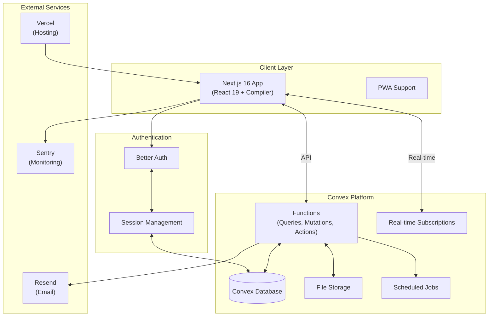
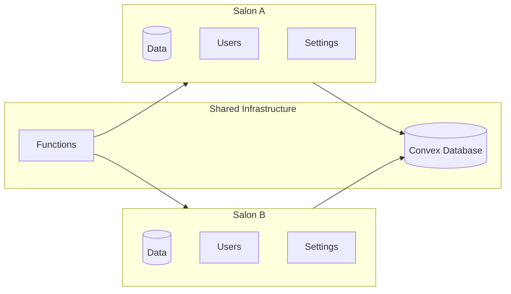
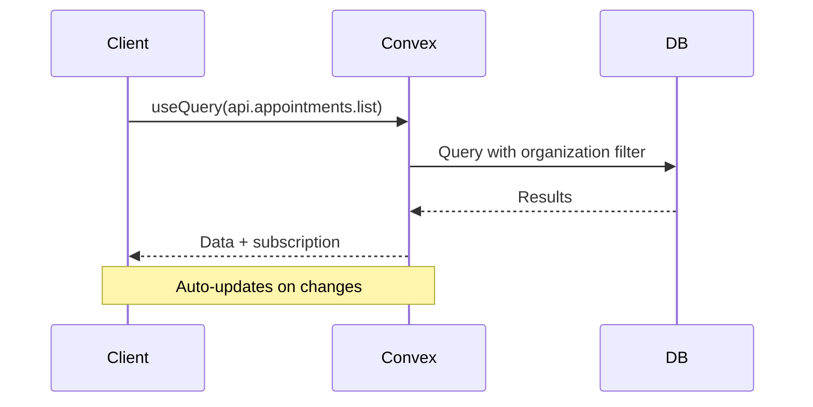
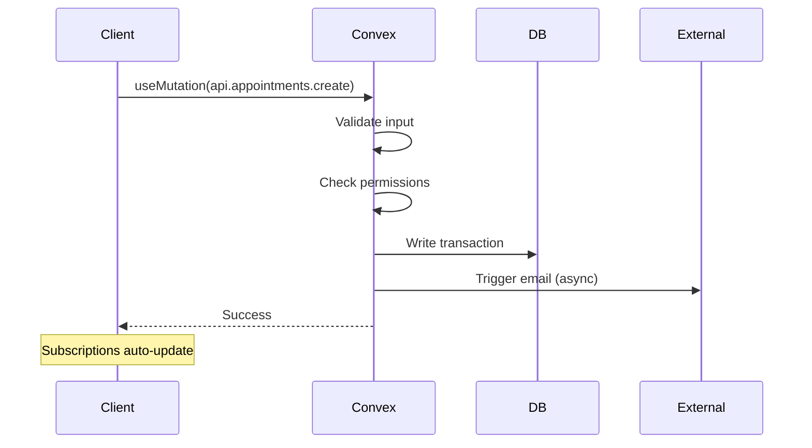
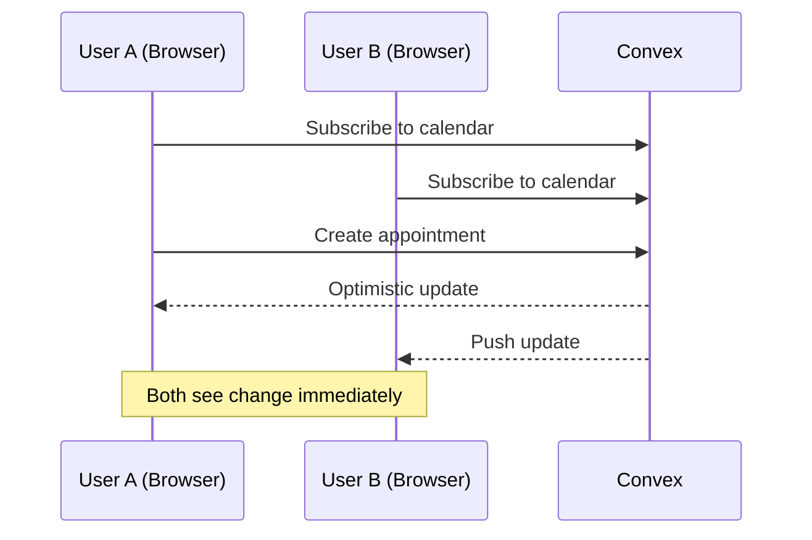
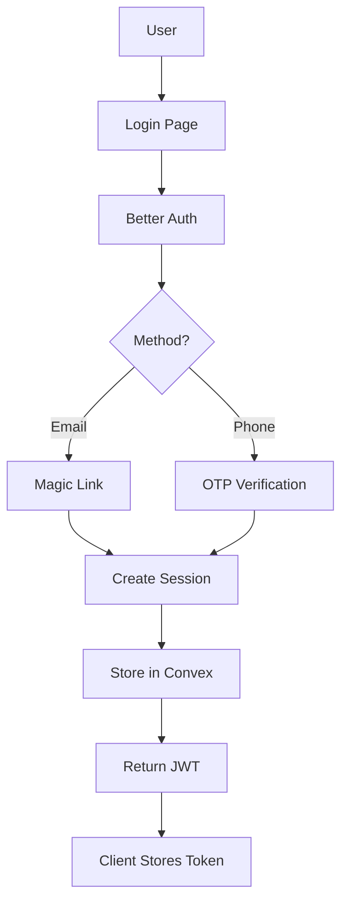
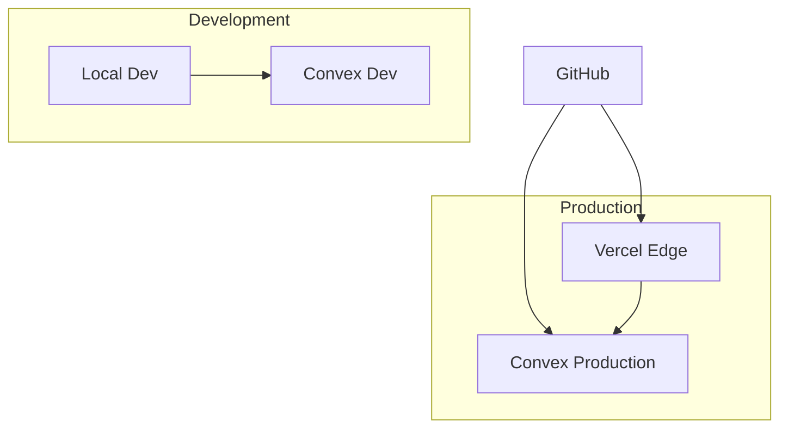
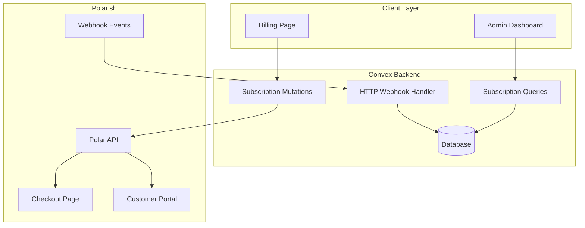
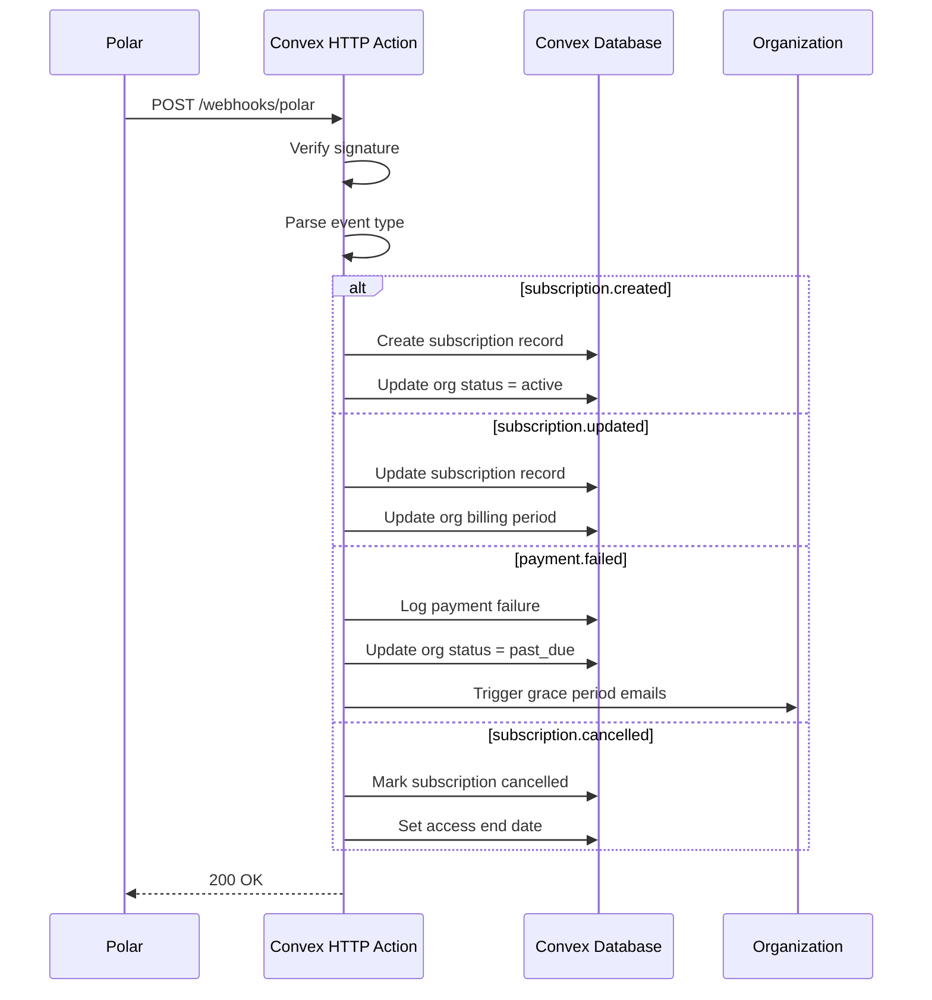
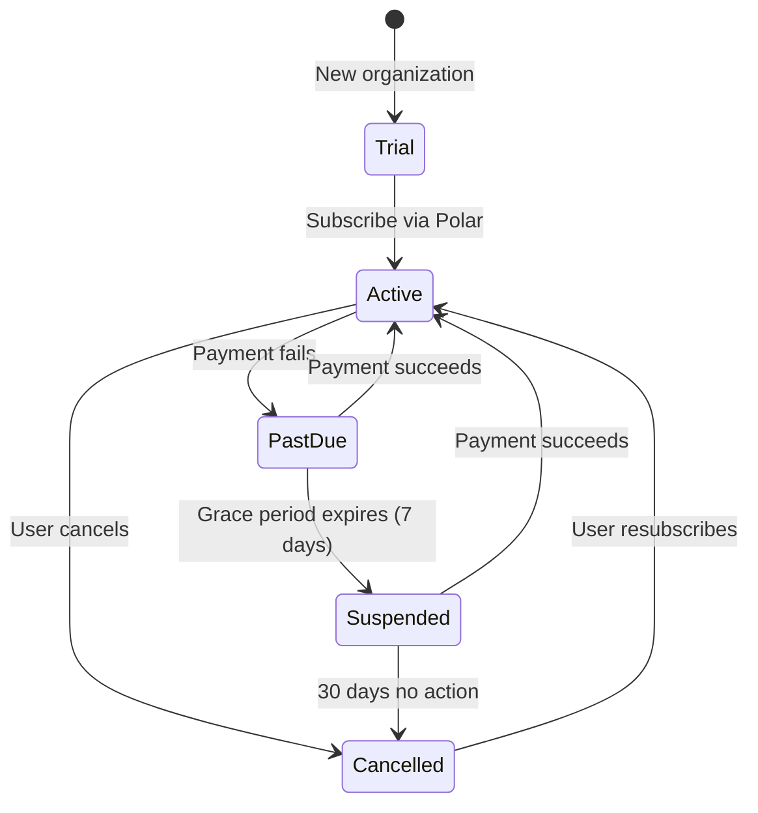

# System Architecture

> **Last Updated:** 2026-02-04
> **Status:** Active

## Overview

The Salon Management SaaS is built on a modern, real-time architecture optimized for simplicity, scalability, and developer experience. The system uses Convex as the unified backend platform, eliminating the need for separate databases, API servers, and real-time infrastructure.

---

## Architecture Diagram



---

## Tech Stack

### Frontend

| Technology      | Version | Purpose                                 |
| --------------- | ------- | --------------------------------------- |
| Next.js         | 16      | React framework with App Router         |
| React           | 19      | UI library                              |
| React Compiler  | Latest  | Automatic optimization (no memo needed) |
| TypeScript      | 5.x     | Type safety                             |
| Tailwind CSS    | 4       | Utility-first styling                   |
| shadcn/ui       | Latest  | Component library (New York style)      |
| TanStack Form   | Latest  | Form state management                   |
| Zod             | 4.x     | Schema validation                       |

### Backend (Convex)

| Feature                 | Usage                       |
| ----------------------- | --------------------------- |
| Convex Functions        | Queries, mutations, actions |
| Convex Database         | Document store with indexes |
| Real-time Subscriptions | Live data sync              |
| File Storage            | Images, documents           |
| Scheduled Jobs          | Crons, delayed tasks        |
| Search Indexes          | Full-text search            |
| convex-helpers          | RLS, triggers, validators   |

### Authentication

| Technology     | Purpose                         |
| -------------- | ------------------------------- |
| Better Auth    | Auth framework                  |
| Convex Adapter | Session storage in Convex       |
| Magic Link     | Passwordless email login        |
| OTP            | Phone verification for bookings |

### External Services

| Service     | Purpose                     | Packages |
| ----------- | --------------------------- | -------- |
| Polar       | SaaS subscription billing   | @convex-dev/polar, @polar-sh/sdk |
| Resend      | Transactional emails        | resend |
| React Email | Email templates             | @react-email/components |
| Sentry      | Error tracking & monitoring | @sentry/nextjs |
| Vercel      | Hosting & deployment        | - |

### Development Tools

| Tool       | Purpose                   |
| ---------- | ------------------------- |
| Bun        | Package manager & runtime |
| Biome      | Linting & formatting      |
| TypeScript | Type checking             |

---

## Multi-Tenancy Architecture

### Tenant Isolation Strategy

The system uses **Organization-Based Multi-Tenancy** where each salon is an organization with complete data isolation.



### Implementation Pattern

```typescript
// Every table includes organizationId
appointments: defineTable({
  organizationId: v.id("organizations"), // Tenant identifier
  // ... other fields
}).index("by_organization", ["organizationId"]);

// Every query filters by organization
export const getAppointments = query({
  args: { organizationId: v.id("organizations") },
  handler: async (ctx, args) => {
    // Verify user has access to this organization
    await assertOrgAccess(ctx, args.organizationId);

    return ctx.db
      .query("appointments")
      .withIndex("by_organization", (q) =>
        q.eq("organizationId", args.organizationId),
      )
      .collect();
  },
});
```

### URL Structure

```
https://app.salonmanagement.com/[org-slug]/[page]

Examples:
- /glamour-salon/dashboard
- /glamour-salon/calendar
- /glamour-salon/book (public booking)
```

---

## Data Flow

### Read Path (Queries)



### Write Path (Mutations)



### Real-time Updates



---

## Security Architecture

### Authentication Flow



### Authorization Model

```typescript
// Role-based access control
type Role = "owner" | "admin" | "staff";

// Permission checks in every mutation
async function assertPermission(
  ctx: MutationCtx,
  organizationId: Id<"organizations">,
  requiredRole: Role,
) {
  const user = await getCurrentUser(ctx);
  const membership = await ctx.db
    .query("staff")
    .withIndex("by_user", (q) => q.eq("userId", user._id))
    .filter((q) => q.eq(q.field("organizationId"), organizationId))
    .first();

  if (!membership) {
    throw new ConvexError("Not a member of this organization");
  }

  const roleHierarchy: Record<Role, number> = {
    owner: 3,
    admin: 2,
    staff: 1,
  };

  if (roleHierarchy[membership.role] < roleHierarchy[requiredRole]) {
    throw new ConvexError("Insufficient permissions");
  }

  return membership;
}
```

### Data Protection

| Layer       | Protection                        |
| ----------- | --------------------------------- |
| Transport   | HTTPS everywhere                  |
| Database    | Convex managed encryption at rest |
| Application | Input validation on all mutations |
| Business    | Organization-scoped queries       |

---

## Scalability Considerations

### Convex Handles

- **Database scaling:** Automatic sharding and replication
- **Real-time subscriptions:** Efficient pub/sub infrastructure
- **Function execution:** Serverless scaling
- **File storage:** CDN-backed storage

### Application Design

| Concern            | Strategy                      |
| ------------------ | ----------------------------- |
| Large lists        | Pagination with cursors       |
| Search             | Convex search indexes         |
| Heavy computations | Actions (not in transactions) |
| Bulk operations    | Batch processing              |

### Performance Targets

| Metric                 | Target  |
| ---------------------- | ------- |
| Query latency (P95)    | < 100ms |
| Mutation latency (P95) | < 200ms |
| Real-time sync         | < 100ms |
| Page load (LCP)        | < 2.5s  |

---

## Error Handling Strategy

### Frontend

```typescript
// Global error boundary
function RootErrorBoundary({ error }: { error: Error }) {
  // Log to Sentry
  Sentry.captureException(error);

  return <ErrorPage />;
}

// Query error handling
function AppointmentsList() {
  const appointments = useQuery(api.appointments.list, { orgId });

  if (appointments === undefined) {
    return <Skeleton />;
  }

  if (appointments instanceof Error) {
    return <ErrorState error={appointments} />;
  }

  return <List data={appointments} />;
}
```

### Backend (Convex)

```typescript
// Structured errors
export const createAppointment = mutation({
  handler: async (ctx, args) => {
    // Validation errors
    if (!args.serviceIds.length) {
      throw new ConvexError({
        code: "VALIDATION_ERROR",
        message: "At least one service is required",
        field: "serviceIds",
      });
    }

    // Business logic errors
    const conflict = await checkConflict(ctx, args);
    if (conflict) {
      throw new ConvexError({
        code: "SLOT_UNAVAILABLE",
        message: "This time slot is no longer available",
        suggestedSlots: await getAlternatives(ctx, args),
      });
    }

    // ... create appointment
  },
});
```

---

## Monitoring & Observability

### Sentry Integration

```typescript
// Error tracking
Sentry.init({
  dsn: process.env.SENTRY_DSN,
  environment: process.env.NODE_ENV,
  tracesSampleRate: 0.1,
});

// Performance monitoring
const transaction = Sentry.startTransaction({
  name: "BookingFlow",
  op: "user.action",
});
```

### Convex Dashboard

- Function execution logs
- Database query performance
- Real-time subscription metrics
- Error rates and stack traces

### Custom Metrics (Future)

| Metric                 | Purpose           |
| ---------------------- | ----------------- |
| Bookings per hour      | Business health   |
| No-show rate           | Customer behavior |
| Page load times        | User experience   |
| Error rate by function | System health     |

---

## Deployment Architecture



### Environments

| Environment | Frontend           | Backend               |
| ----------- | ------------------ | --------------------- |
| Development | localhost:3000     | Convex dev deployment |
| Preview     | Vercel preview URL | Convex dev deployment |
| Production  | Custom domain      | Convex production     |

### CI/CD Pipeline

1. **Push to GitHub**
2. **Vercel builds Next.js**
3. **Convex deploys functions**
4. **Preview deployment created**
5. **Manual promotion to production**

---

---

## Subscription Billing Architecture

### Polar.sh Integration



### Webhook Event Flow



### Subscription States



### Environment Configuration

| Environment | Polar Mode | Webhook URL |
| ----------- | ---------- | ----------- |
| Development | Sandbox    | localhost (ngrok) |
| Preview     | Sandbox    | preview-url/webhooks/polar |
| Production  | Production | app.domain.com/webhooks/polar |

---

## Future Architecture Considerations

### Potential Additions (P2+)

| Feature            | Architecture Impact       |
| ------------------ | ------------------------- |
| SMS notifications  | Add Twilio/SNS action     |
| Customer payments  | Extend Polar for one-time |
| Multi-location     | Extend tenant model       |
| Mobile apps        | Add React Native clients  |
| Advanced analytics | Add data warehouse export |

### Migration Path

If scaling beyond Convex limits becomes necessary:

1. **Database:** Export to PostgreSQL/MongoDB
2. **Real-time:** Add dedicated WebSocket service
3. **Functions:** Move to AWS Lambda/Cloud Functions
4. **Storage:** Migrate to S3/Cloud Storage

Current architecture is designed for easy extraction of individual components if needed.
