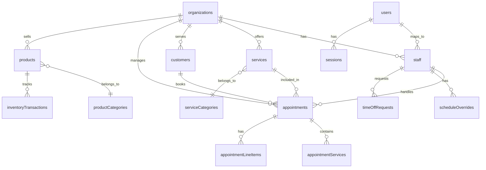

# Convex Database Schema

> **Last Updated:** 2026-02-04
> **Status:** Active

This document contains the complete Convex database schema for the Salon Management SaaS. All tables include multi-tenancy support through `organizationId`.

---

## Schema Overview



---

## Complete Schema Definition

```typescript
// convex/schema.ts
import { defineSchema, defineTable } from "convex/server";
import { v } from "convex/values";

export default defineSchema({
  // ============================================
  // AUTHENTICATION & USERS
  // ============================================

  users: defineTable({
    // Better Auth fields
    email: v.string(),
    emailVerified: v.boolean(),
    name: v.optional(v.string()),
    image: v.optional(v.string()),

    // Custom fields
    phone: v.optional(v.string()),
    phoneVerified: v.optional(v.boolean()),

    createdAt: v.number(),
    updatedAt: v.number(),
  })
    .index("by_email", ["email"]),

  sessions: defineTable({
    userId: v.id("users"),
    token: v.string(),
    expiresAt: v.number(),
    ipAddress: v.optional(v.string()),
    userAgent: v.optional(v.string()),
    createdAt: v.number(),
  })
    .index("by_user", ["userId"])
    .index("by_token", ["token"]),

  accounts: defineTable({
    userId: v.id("users"),
    providerId: v.string(),
    providerAccountId: v.string(),
    accessToken: v.optional(v.string()),
    refreshToken: v.optional(v.string()),
    expiresAt: v.optional(v.number()),
    createdAt: v.number(),
  })
    .index("by_user", ["userId"])
    .index("by_provider", ["providerId", "providerAccountId"]),

  verificationTokens: defineTable({
    identifier: v.string(), // email or phone
    token: v.string(),
    type: v.union(
      v.literal("email"),
      v.literal("phone"),
      v.literal("booking")
    ),
    expiresAt: v.number(),
    createdAt: v.number(),
  })
    .index("by_token", ["token"])
    .index("by_identifier", ["identifier"]),

  // ============================================
  // ORGANIZATIONS (TENANTS)
  // ============================================

  organizations: defineTable({
    // Identity
    name: v.string(),
    slug: v.string(), // URL-friendly identifier
    description: v.optional(v.string()),

    // Contact
    email: v.optional(v.string()),
    phone: v.optional(v.string()),
    website: v.optional(v.string()),

    // Location
    address: v.optional(v.object({
      street: v.string(),
      city: v.string(),
      district: v.optional(v.string()),
      postalCode: v.optional(v.string()),
      country: v.string(),
      coordinates: v.optional(v.object({
        lat: v.number(),
        lng: v.number(),
      })),
    })),

    // Branding
    logoUrl: v.optional(v.string()),
    coverImageUrl: v.optional(v.string()),
    primaryColor: v.optional(v.string()),

    // Settings
    timezone: v.string(), // "Europe/Istanbul"
    currency: v.string(), // "TRY"
    locale: v.string(), // "tr-TR"

    // Business hours (default for organization)
    businessHours: v.object({
      monday: v.optional(v.object({ open: v.number(), close: v.number() })),
      tuesday: v.optional(v.object({ open: v.number(), close: v.number() })),
      wednesday: v.optional(v.object({ open: v.number(), close: v.number() })),
      thursday: v.optional(v.object({ open: v.number(), close: v.number() })),
      friday: v.optional(v.object({ open: v.number(), close: v.number() })),
      saturday: v.optional(v.object({ open: v.number(), close: v.number() })),
      sunday: v.optional(v.object({ open: v.number(), close: v.number() })),
    }),

    // Booking settings
    bookingSettings: v.object({
      advanceBookingDays: v.number(), // How far ahead (default: 30)
      minimumNoticeMinutes: v.number(), // Min time before appointment (default: 120)
      cancellationWindowMinutes: v.number(), // When customer can cancel (default: 120)
      slotDurationMinutes: v.number(), // Slot increments (default: 15)
      allowStaffSelection: v.boolean(), // Can customer choose staff
      requirePhoneVerification: v.boolean(), // OTP required for online booking
      allowWalkIns: v.boolean(),
    }),

    // Status
    status: v.union(
      v.literal("active"),
      v.literal("suspended"),
      v.literal("trial")
    ),
    trialEndsAt: v.optional(v.number()),

    // Subscription (Polar.sh integration)
    subscriptionStatus: v.optional(v.union(
      v.literal("trial"),
      v.literal("active"),
      v.literal("past_due"),
      v.literal("suspended"),
      v.literal("cancelled")
    )),
    subscriptionPlan: v.optional(v.union(
      v.literal("standard_monthly"),
      v.literal("standard_yearly")
    )),
    polarCustomerId: v.optional(v.string()),
    subscriptionExpiresAt: v.optional(v.number()),
    gracePeriodEndsAt: v.optional(v.number()),

    // Metadata
    createdAt: v.number(),
    updatedAt: v.number(),
  })
    .index("by_slug", ["slug"])
    .index("by_status", ["status"])
    .index("by_subscription_status", ["subscriptionStatus"])
    .index("by_polar_customer", ["polarCustomerId"]),

  // ============================================
  // STAFF
  // ============================================

  staff: defineTable({
    userId: v.id("users"),
    organizationId: v.id("organizations"),

    // Profile
    name: v.string(),
    email: v.string(),
    phone: v.optional(v.string()),
    imageUrl: v.optional(v.string()),
    bio: v.optional(v.string()),

    // Role
    role: v.union(
      v.literal("owner"),
      v.literal("admin"),
      v.literal("staff")
    ),
    status: v.union(
      v.literal("active"),
      v.literal("inactive"),
      v.literal("pending")
    ),

    // Services they can perform
    serviceIds: v.array(v.id("services")),

    // Default working schedule
    defaultSchedule: v.object({
      monday: v.optional(v.object({ start: v.number(), end: v.number() })),
      tuesday: v.optional(v.object({ start: v.number(), end: v.number() })),
      wednesday: v.optional(v.object({ start: v.number(), end: v.number() })),
      thursday: v.optional(v.object({ start: v.number(), end: v.number() })),
      friday: v.optional(v.object({ start: v.number(), end: v.number() })),
      saturday: v.optional(v.object({ start: v.number(), end: v.number() })),
      sunday: v.optional(v.object({ start: v.number(), end: v.number() })),
    }),

    // Invitation
    invitationToken: v.optional(v.string()),
    invitedAt: v.optional(v.number()),
    invitedBy: v.optional(v.id("staff")),

    createdAt: v.number(),
    updatedAt: v.number(),
  })
    .index("by_organization", ["organizationId"])
    .index("by_user", ["userId"])
    .index("by_org_status", ["organizationId", "status"])
    .index("by_invitation", ["invitationToken"]),

  scheduleOverrides: defineTable({
    staffId: v.id("staff"),
    organizationId: v.id("organizations"),
    date: v.string(), // "2024-03-15"
    type: v.union(
      v.literal("custom_hours"),
      v.literal("day_off"),
      v.literal("time_off")
    ),
    startTime: v.optional(v.number()), // Minutes from midnight
    endTime: v.optional(v.number()),
    reason: v.optional(v.string()),
    createdAt: v.number(),
  })
    .index("by_staff_date", ["staffId", "date"])
    .index("by_org_date", ["organizationId", "date"]),

  timeOffRequests: defineTable({
    staffId: v.id("staff"),
    organizationId: v.id("organizations"),
    startDate: v.string(),
    endDate: v.string(),
    type: v.union(
      v.literal("vacation"),
      v.literal("sick"),
      v.literal("personal"),
      v.literal("other")
    ),
    status: v.union(
      v.literal("pending"),
      v.literal("approved"),
      v.literal("rejected")
    ),
    reason: v.optional(v.string()),
    approvedBy: v.optional(v.id("staff")),
    reviewedAt: v.optional(v.number()),
    createdAt: v.number(),
    updatedAt: v.number(),
  })
    .index("by_staff", ["staffId"])
    .index("by_org_status", ["organizationId", "status"]),

  // ============================================
  // SERVICES
  // ============================================

  serviceCategories: defineTable({
    organizationId: v.id("organizations"),
    name: v.string(),
    description: v.optional(v.string()),
    sortOrder: v.number(),
    createdAt: v.number(),
  })
    .index("by_organization", ["organizationId"]),

  services: defineTable({
    organizationId: v.id("organizations"),
    categoryId: v.optional(v.id("serviceCategories")),

    // Details
    name: v.string(),
    description: v.optional(v.string()),
    duration: v.number(), // In minutes
    bufferTime: v.optional(v.number()), // Minutes after service

    // Pricing
    price: v.number(), // In TRY (smallest unit = kuruş or full lira)
    priceType: v.union(
      v.literal("fixed"),
      v.literal("starting_from"),
      v.literal("variable")
    ),

    // Display
    imageUrl: v.optional(v.string()),
    sortOrder: v.number(),
    isPopular: v.boolean(),

    // Availability
    status: v.union(
      v.literal("active"),
      v.literal("inactive")
    ),
    showOnline: v.boolean(), // Show in customer booking

    createdAt: v.number(),
    updatedAt: v.number(),
  })
    .index("by_organization", ["organizationId"])
    .index("by_org_category", ["organizationId", "categoryId"])
    .index("by_org_status", ["organizationId", "status"]),

  // ============================================
  // CUSTOMERS
  // ============================================

  customers: defineTable({
    organizationId: v.id("organizations"),
    userId: v.optional(v.id("users")), // If registered (null for guests)

    // Contact
    name: v.string(),
    email: v.string(),
    phone: v.string(),
    phoneVerified: v.boolean(),

    // Account Status (Hybrid Model)
    accountStatus: v.union(
      v.literal("guest"),      // No account, phone verified only
      v.literal("recognized"), // Returning guest (2+ visits)
      v.literal("prompted"),   // Shown account creation prompt (3+ visits)
      v.literal("registered")  // Has full account
    ),

    // Preferences
    preferredStaffId: v.optional(v.id("staff")),
    notificationPreferences: v.object({
      emailReminders: v.boolean(),
      smsReminders: v.boolean(),
    }),

    // Stats (denormalized for performance)
    totalVisits: v.number(),
    totalSpent: v.number(),
    lastVisitDate: v.optional(v.string()),
    noShowCount: v.number(), // Informational only, no penalty

    // Notes - SEPARATE FIELDS
    customerNotes: v.optional(v.string()), // Customer's own notes (visible to customer)
    staffNotes: v.optional(v.string()), // Internal staff notes (NOT visible to customer)

    tags: v.array(v.string()), // "VIP", "Frequent", etc.

    // Source tracking
    source: v.union(
      v.literal("online"),
      v.literal("walk_in"),
      v.literal("phone"),
      v.literal("import")
    ),

    // KVKK Consent Tracking (Turkish GDPR)
    consents: v.object({
      dataProcessing: v.boolean(), // Required for service
      marketing: v.boolean(), // Optional marketing communications
      dataProcessingAt: v.optional(v.number()),
      marketingAt: v.optional(v.number()),
      withdrawnAt: v.optional(v.number()), // If consent withdrawn
    }),

    createdAt: v.number(),
    updatedAt: v.number(),
  })
    .index("by_organization", ["organizationId"])
    .index("by_org_email", ["organizationId", "email"])
    .index("by_org_phone", ["organizationId", "phone"])
    .index("by_user", ["userId"])
    .index("by_org_status", ["organizationId", "accountStatus"]),

  // ============================================
  // APPOINTMENTS
  // ============================================

  appointments: defineTable({
    organizationId: v.id("organizations"),
    customerId: v.id("customers"),
    staffId: v.id("staff"),

    // Timing
    date: v.string(), // "2024-03-15"
    startTime: v.number(), // Minutes from midnight
    endTime: v.number(),

    // Status
    status: v.union(
      v.literal("pending"),       // Awaiting confirmation
      v.literal("confirmed"),     // Confirmed by system/staff
      v.literal("checked_in"),    // Customer arrived
      v.literal("in_progress"),   // Service being performed
      v.literal("completed"),     // Service finished
      v.literal("cancelled"),     // Cancelled
      v.literal("no_show")        // Customer didn't show
    ),

    // Source
    source: v.union(
      v.literal("online"),
      v.literal("walk_in"),
      v.literal("phone"),
      v.literal("staff")
    ),

    // Confirmation
    confirmationCode: v.string(), // e.g., "APT-ABC123"
    confirmedAt: v.optional(v.number()),

    // Check-in
    checkedInAt: v.optional(v.number()),

    // Completion
    completedAt: v.optional(v.number()),

    // Cancellation
    cancelledAt: v.optional(v.number()),
    cancelledBy: v.optional(v.union(
      v.literal("customer"),
      v.literal("staff"),
      v.literal("system")
    )),
    cancellationReason: v.optional(v.string()),

    // Pricing (calculated from services + products)
    subtotal: v.number(),
    discount: v.optional(v.number()),
    total: v.number(),

    // Payment (future)
    paymentStatus: v.optional(v.union(
      v.literal("pending"),
      v.literal("paid"),
      v.literal("partial"),
      v.literal("refunded")
    )),
    paymentMethod: v.optional(v.string()),
    paidAt: v.optional(v.number()),

    // Notes
    customerNotes: v.optional(v.string()), // From customer during booking
    staffNotes: v.optional(v.string()), // Internal notes

    // Notifications
    reminderSentAt: v.optional(v.number()),
    confirmationSentAt: v.optional(v.number()),

    createdAt: v.number(),
    updatedAt: v.number(),
  })
    .index("by_organization", ["organizationId"])
    .index("by_org_date", ["organizationId", "date"])
    .index("by_staff_date", ["staffId", "date"])
    .index("by_customer", ["customerId"])
    .index("by_confirmation", ["confirmationCode"])
    .index("by_org_status", ["organizationId", "status"]),

  appointmentServices: defineTable({
    appointmentId: v.id("appointments"),
    serviceId: v.id("services"),
    serviceName: v.string(), // Denormalized
    duration: v.number(),
    price: v.number(),
    staffId: v.id("staff"), // Can differ per service
  })
    .index("by_appointment", ["appointmentId"]),

  appointmentLineItems: defineTable({
    appointmentId: v.id("appointments"),
    type: v.union(v.literal("service"), v.literal("product")),
    serviceId: v.optional(v.id("services")),
    productId: v.optional(v.id("products")),
    name: v.string(),
    quantity: v.number(),
    unitPrice: v.number(),
    discount: v.optional(v.number()),
    totalPrice: v.number(),
    createdAt: v.number(),
  })
    .index("by_appointment", ["appointmentId"]),

  slotLocks: defineTable({
    organizationId: v.id("organizations"),
    staffId: v.id("staff"),
    date: v.string(),
    startTime: v.number(),
    endTime: v.number(),
    sessionId: v.string(), // Browser session
    expiresAt: v.number(), // TTL
  })
    .index("by_staff_date", ["staffId", "date"])
    .index("by_expiry", ["expiresAt"]),

  // ============================================
  // PRODUCTS
  // ============================================

  productCategories: defineTable({
    organizationId: v.id("organizations"),
    name: v.string(),
    description: v.optional(v.string()),
    sortOrder: v.number(),
    createdAt: v.number(),
  })
    .index("by_organization", ["organizationId"]),

  products: defineTable({
    organizationId: v.id("organizations"),
    categoryId: v.optional(v.id("productCategories")),

    // Details
    name: v.string(),
    description: v.optional(v.string()),
    brand: v.optional(v.string()),
    sku: v.optional(v.string()),
    barcode: v.optional(v.string()),

    // Pricing
    price: v.number(),
    costPrice: v.optional(v.number()),

    // Inventory
    trackInventory: v.boolean(),
    stockQuantity: v.number(),
    lowStockThreshold: v.optional(v.number()),

    // Media
    imageUrl: v.optional(v.string()),
    images: v.array(v.string()),

    // Status
    status: v.union(
      v.literal("active"),
      v.literal("inactive"),
      v.literal("out_of_stock")
    ),
    showOnline: v.boolean(),

    tags: v.array(v.string()),

    createdAt: v.number(),
    updatedAt: v.number(),
  })
    .index("by_organization", ["organizationId"])
    .index("by_org_status", ["organizationId", "status"])
    .index("by_org_category", ["organizationId", "categoryId"])
    .searchIndex("search_products", {
      searchField: "name",
      filterFields: ["organizationId", "status"],
    }),

  inventoryTransactions: defineTable({
    organizationId: v.id("organizations"),
    productId: v.id("products"),
    type: v.union(
      v.literal("sale"),
      v.literal("adjustment"),
      v.literal("restock"),
      v.literal("return"),
      v.literal("damaged"),
      v.literal("transfer")
    ),
    quantity: v.number(),
    previousStock: v.number(),
    newStock: v.number(),
    appointmentId: v.optional(v.id("appointments")),
    notes: v.optional(v.string()),
    staffId: v.id("staff"),
    createdAt: v.number(),
  })
    .index("by_product", ["productId"])
    .index("by_org_date", ["organizationId", "createdAt"]),

  // ============================================
  // NOTIFICATIONS
  // ============================================

  notifications: defineTable({
    organizationId: v.id("organizations"),
    userId: v.optional(v.id("users")), // Null for org-wide
    staffId: v.optional(v.id("staff")),

    type: v.union(
      v.literal("new_booking"),
      v.literal("cancellation"),
      v.literal("time_off_request"),
      v.literal("low_stock"),
      v.literal("no_show"),
      v.literal("system")
    ),

    title: v.string(),
    message: v.string(),
    data: v.optional(v.any()), // Related IDs, etc.

    read: v.boolean(),
    readAt: v.optional(v.number()),

    createdAt: v.number(),
  })
    .index("by_org_unread", ["organizationId", "read"])
    .index("by_staff_unread", ["staffId", "read"]),

  // ============================================
  // AUDIT LOG
  // ============================================

  auditLogs: defineTable({
    organizationId: v.id("organizations"),
    userId: v.optional(v.id("users")),
    staffId: v.optional(v.id("staff")),

    action: v.string(), // "appointment.created", "staff.invited", etc.
    entityType: v.string(), // "appointment", "staff", etc.
    entityId: v.optional(v.string()),

    details: v.optional(v.any()), // Changed fields, etc.
    ipAddress: v.optional(v.string()),

    createdAt: v.number(),
  })
    .index("by_organization", ["organizationId"])
    .index("by_org_date", ["organizationId", "createdAt"])
    .index("by_entity", ["entityType", "entityId"]),

  // ============================================
  // SUBSCRIPTIONS (Polar.sh Integration)
  // ============================================

  organizationSubscriptions: defineTable({
    organizationId: v.id("organizations"),
    polarSubscriptionId: v.string(),
    polarProductId: v.string(),
    polarPriceId: v.string(),
    status: v.union(
      v.literal("active"),
      v.literal("past_due"),
      v.literal("cancelled"),
      v.literal("incomplete")
    ),
    plan: v.union(
      v.literal("standard_monthly"),
      v.literal("standard_yearly")
    ),
    currentPeriodStart: v.number(),
    currentPeriodEnd: v.number(),
    cancelAtPeriodEnd: v.boolean(),
    cancelledAt: v.optional(v.number()),
    createdAt: v.number(),
    updatedAt: v.number(),
  })
    .index("by_organization", ["organizationId"])
    .index("by_polar_subscription", ["polarSubscriptionId"])
    .index("by_status", ["status"]),

  polarCustomers: defineTable({
    organizationId: v.id("organizations"),
    polarCustomerId: v.string(),
    email: v.string(),
    createdAt: v.number(),
    updatedAt: v.number(),
  })
    .index("by_organization", ["organizationId"])
    .index("by_polar_customer", ["polarCustomerId"]),

  subscriptionEvents: defineTable({
    organizationId: v.id("organizations"),
    eventType: v.union(
      v.literal("subscription.created"),
      v.literal("subscription.updated"),
      v.literal("subscription.cancelled"),
      v.literal("payment.succeeded"),
      v.literal("payment.failed"),
      v.literal("checkout.completed")
    ),
    polarEventId: v.string(),
    polarSubscriptionId: v.optional(v.string()),
    data: v.any(), // Raw event payload
    processedAt: v.number(),
    createdAt: v.number(),
  })
    .index("by_organization", ["organizationId"])
    .index("by_event_id", ["polarEventId"])
    .index("by_subscription", ["polarSubscriptionId"])
    .index("by_type", ["eventType"]),

  // ============================================
  // SECURITY EVENTS
  // ============================================

  securityEvents: defineTable({
    // Event identity
    eventType: v.union(
      v.literal("login_success"),
      v.literal("login_failure"),
      v.literal("logout"),
      v.literal("password_reset"),
      v.literal("otp_sent"),
      v.literal("otp_verified"),
      v.literal("otp_failed"),
      v.literal("permission_denied"),
      v.literal("rate_limited"),
      v.literal("suspicious_activity"),
      v.literal("data_export"),
      v.literal("account_locked"),
      v.literal("account_unlocked")
    ),

    // Actor
    userId: v.optional(v.id("users")),
    staffId: v.optional(v.id("staff")),
    organizationId: v.optional(v.id("organizations")),
    email: v.optional(v.string()), // For failed logins
    phone: v.optional(v.string()), // For OTP events

    // Context
    ipAddress: v.optional(v.string()),
    userAgent: v.optional(v.string()),
    sessionId: v.optional(v.string()),

    // Severity
    severity: v.union(
      v.literal("info"),
      v.literal("warning"),
      v.literal("error"),
      v.literal("critical")
    ),

    // Details
    details: v.optional(v.object({
      reason: v.optional(v.string()),
      attemptCount: v.optional(v.number()),
      blockedUntil: v.optional(v.number()),
      resourceType: v.optional(v.string()),
      resourceId: v.optional(v.string()),
    })),

    // Success/failure
    success: v.boolean(),
    errorMessage: v.optional(v.string()),

    createdAt: v.number(),
  })
    .index("by_user", ["userId"])
    .index("by_org", ["organizationId"])
    .index("by_type", ["eventType"])
    .index("by_ip", ["ipAddress"])
    .index("by_date", ["createdAt"])
    .index("by_severity", ["severity", "createdAt"]),
});
```

---

## Index Usage Guide

### Query Patterns

| Query | Index Used |
|-------|------------|
| Get organization by slug | `organizations.by_slug` |
| List staff in organization | `staff.by_organization` |
| Get staff by user | `staff.by_user` |
| List appointments for date | `appointments.by_org_date` |
| Get staff schedule for date | `appointments.by_staff_date` |
| Find customer by phone | `customers.by_org_phone` |
| Search products | `products.search_products` |
| Get unread notifications | `notifications.by_org_unread` |
| Get subscription by org | `organizationSubscriptions.by_organization` |
| Get subscription by Polar ID | `organizationSubscriptions.by_polar_subscription` |
| Get events by subscription | `subscriptionEvents.by_subscription` |
| Find orgs with past_due status | `organizations.by_subscription_status` |

### Composite Index Strategy

```typescript
// Example: Query with multiple filters
const appointments = await ctx.db
  .query("appointments")
  .withIndex("by_org_date", (q) =>
    q
      .eq("organizationId", orgId)
      .eq("date", "2024-03-15")
  )
  .filter((q) => q.eq(q.field("status"), "confirmed"))
  .collect();
```

---

## Schema Migration Notes

When modifying the schema:

1. **Adding fields:** Add with `v.optional()` first, then backfill
2. **Removing fields:** Remove from queries first, then schema
3. **Adding indexes:** Deploy schema first, index builds async
4. **Changing types:** Create new field, migrate data, remove old

### Example: Adding a new field

```typescript
// Step 1: Add as optional
services: defineTable({
  // ... existing fields
  estimatedDuration: v.optional(v.number()), // NEW
})

// Step 2: Run migration
export const backfillEstimatedDuration = internalMutation({
  handler: async (ctx) => {
    const services = await ctx.db.query("services").collect();
    for (const service of services) {
      await ctx.db.patch(service._id, {
        estimatedDuration: service.duration, // Copy from duration
      });
    }
  },
});

// Step 3: Make required after migration
estimatedDuration: v.number(), // Now required
```
