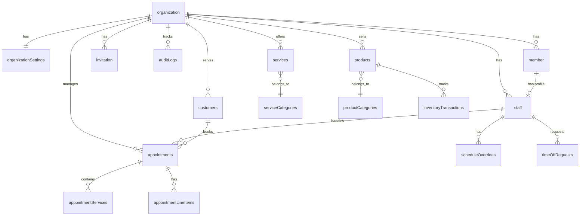

# Convex Database Schema

> **Last Updated:** 2026-02-06
> **Status:** Active

This document contains the complete Convex database schema for the Salon Management SaaS. All tables include multi-tenancy support through `organizationId`.

> **Terminology Note:** This document uses `organization` to match the actual database table names. In code, always use `organizationId`, never `salonId` or `tenantId`. See [Glossary - Organization](../appendix/glossary.md#organization) for terminology guidelines.

> **Note:** Authentication tables (`user`, `session`, `account`, `verification`, `jwks`) are managed by the Better Auth component at `convex/betterAuth/schema.ts` and are NOT part of the application schema.

---

## Schema Overview



---

## Implementation Status

| Section | Status | Sprint | Notes |
|---------|--------|--------|-------|
| Organization & Settings | ✅ Implemented | Sprint 1 | Full CRUD, business hours, settings |
| Member & Invitation | ✅ Implemented | Sprint 1 | Role management, invitation lifecycle |
| Staff | ✅ Implemented | Sprint 1 | Profile management, schedule, service assignments |
| Audit Logs | ⚠️ Partial | Sprint 1.5 | Table ✅, Helper functions ❌ (planned) |
| Services & Categories | ✅ Implemented | Sprint 2A | Full CRUD, staff assignment, image upload |
| Schedule Overrides & Time-Off | 📋 Planned | Sprint 2B | Schema exists, APIs pending |
| Customers | 📋 Planned | Sprint 2C | Schema exists, APIs pending |
| Appointments & Slot Locks | 📋 Planned | Sprint 3-4 | Schema exists, APIs pending |
| Products & Inventory | 📋 Planned | Sprint 2+ | Schema exists, APIs pending |
| Notifications | 📋 Planned | Sprint 5 | Schema exists, APIs pending |
| Subscriptions (Polar) | 📋 Planned | Sprint 6 | Schema exists, APIs pending |
| Security Events | 📋 Planned | TBD | Schema exists, APIs pending |

---

## Complete Schema Definition

```typescript
// convex/schema.ts
import { defineSchema, defineTable } from "convex/server";
import { v } from "convex/values";

export default defineSchema({
  // ============================================
  // ORGANIZATION (TENANT) — ✅ Implemented
  // ============================================

  organization: defineTable({
    name: v.string(),
    slug: v.string(), // URL-friendly identifier
    description: v.optional(v.string()),
    logo: v.optional(v.string()), // Storage URL
    createdAt: v.number(),
    updatedAt: v.number(),
  })
    .index("slug", ["slug"])
    .index("name", ["name"]),

  // ============================================
  // ORGANIZATION SETTINGS — ✅ Implemented
  // 1:1 relationship with organization
  // ============================================

  organizationSettings: defineTable({
    organizationId: v.id("organization"),

    // Contact info
    email: v.optional(v.string()),
    phone: v.optional(v.string()),
    website: v.optional(v.string()),

    // Address
    address: v.optional(v.object({
      street: v.optional(v.string()),
      city: v.optional(v.string()),
      state: v.optional(v.string()),
      postalCode: v.optional(v.string()),
      country: v.optional(v.string()),
    })),

    // Localization
    timezone: v.optional(v.string()), // "Europe/Istanbul"
    currency: v.optional(v.string()), // "TRY"
    locale: v.optional(v.string()), // "tr-TR"

    // Business hours: { monday: { open: "09:00", close: "18:00", closed: false }, ... }
    businessHours: v.optional(v.object({
      monday: v.optional(v.object({ open: v.string(), close: v.string(), closed: v.boolean() })),
      tuesday: v.optional(v.object({ open: v.string(), close: v.string(), closed: v.boolean() })),
      wednesday: v.optional(v.object({ open: v.string(), close: v.string(), closed: v.boolean() })),
      thursday: v.optional(v.object({ open: v.string(), close: v.string(), closed: v.boolean() })),
      friday: v.optional(v.object({ open: v.string(), close: v.string(), closed: v.boolean() })),
      saturday: v.optional(v.object({ open: v.string(), close: v.string(), closed: v.boolean() })),
      sunday: v.optional(v.object({ open: v.string(), close: v.string(), closed: v.boolean() })),
    })),

    // Booking settings
    bookingSettings: v.optional(v.object({
      minAdvanceBookingMinutes: v.optional(v.number()),
      maxAdvanceBookingDays: v.optional(v.number()),
      slotDurationMinutes: v.optional(v.number()),
      bufferBetweenBookingsMinutes: v.optional(v.number()),
      allowOnlineBooking: v.optional(v.boolean()),
      requireDeposit: v.optional(v.boolean()),
      depositAmount: v.optional(v.number()),
      cancellationPolicyHours: v.optional(v.number()),
    })),

    // Subscription (Polar.sh integration - future)
    subscriptionStatus: v.optional(v.union(
      v.literal("active"),
      v.literal("trialing"),
      v.literal("past_due"),
      v.literal("canceled"),
      v.literal("unpaid")
    )),
    subscriptionPlan: v.optional(v.string()),

    createdAt: v.number(),
    updatedAt: v.number(),
  })
    .index("organizationId", ["organizationId"]),

  // ============================================
  // MEMBER (Organization Membership) — ✅ Implemented
  // Manages RBAC roles separately from staff profiles
  // ============================================

  member: defineTable({
    organizationId: v.id("organization"),
    userId: v.string(), // Better Auth user ID (from component)
    role: v.union(
      v.literal("owner"),
      v.literal("admin"),
      v.literal("member")
    ),
    createdAt: v.number(),
    updatedAt: v.number(),
  })
    .index("organizationId", ["organizationId"])
    .index("userId", ["userId"])
    .index("organizationId_userId", ["organizationId", "userId"]),

  // ============================================
  // INVITATION (Pending Staff Invitations) — ✅ Implemented
  // Separate table with full lifecycle management
  // ============================================

  invitation: defineTable({
    organizationId: v.id("organization"),
    email: v.string(),
    name: v.string(),
    role: v.union(v.literal("admin"), v.literal("member")), // No owner invitations
    phone: v.optional(v.string()),
    status: v.union(
      v.literal("pending"),
      v.literal("accepted"),
      v.literal("expired"),
      v.literal("cancelled"),
      v.literal("rejected")
    ),
    invitedBy: v.string(), // User ID who sent the invite
    expiresAt: v.optional(v.number()),
    createdAt: v.number(),
    updatedAt: v.number(),
  })
    .index("organizationId", ["organizationId"])
    .index("email", ["email"])
    .index("organizationId_email", ["organizationId", "email"])
    .index("status", ["status"]),

  // ============================================
  // STAFF (Profile) — ✅ Implemented
  // Professional profile data. Role is on `member` table.
  // ============================================

  staff: defineTable({
    // References
    userId: v.string(), // Better Auth user ID
    organizationId: v.id("organization"),
    memberId: v.id("member"), // Links to member table for role

    // Profile
    name: v.string(),
    email: v.string(),
    phone: v.optional(v.string()),
    imageUrl: v.optional(v.string()),
    bio: v.optional(v.string()),

    // Employment
    status: v.union(
      v.literal("active"),
      v.literal("inactive"),
      v.literal("pending")
    ),

    // Services (typed IDs referencing services table)
    serviceIds: v.optional(v.array(v.id("services"))),

    // Default weekly schedule
    defaultSchedule: v.optional(v.object({
      monday: v.optional(v.object({ start: v.string(), end: v.string(), available: v.boolean() })),
      tuesday: v.optional(v.object({ start: v.string(), end: v.string(), available: v.boolean() })),
      wednesday: v.optional(v.object({ start: v.string(), end: v.string(), available: v.boolean() })),
      thursday: v.optional(v.object({ start: v.string(), end: v.string(), available: v.boolean() })),
      friday: v.optional(v.object({ start: v.string(), end: v.string(), available: v.boolean() })),
      saturday: v.optional(v.object({ start: v.string(), end: v.string(), available: v.boolean() })),
      sunday: v.optional(v.object({ start: v.string(), end: v.string(), available: v.boolean() })),
    })),

    createdAt: v.number(),
    updatedAt: v.number(),
  })
    .index("organizationId", ["organizationId"])
    .index("userId", ["userId"])
    .index("memberId", ["memberId"])
    .index("organizationId_userId", ["organizationId", "userId"])
    .index("organizationId_status", ["organizationId", "status"])
    .index("organizationId_email", ["organizationId", "email"]),

  // ============================================
  // AUDIT LOGS — ⚠️ Partially Implemented
  // Table schema exists ✅
  // Helper functions (convex/lib/audit.ts) NOT implemented ❌
  // Currently: Manual logging in mutations
  // ============================================

  auditLogs: defineTable({
    organizationId: v.id("organization"),
    userId: v.string(), // Better Auth user ID
    action: v.string(), // "org.create", "settings.update", "member.add", etc.
    resourceType: v.string(), // "organization", "member", "invitation", "staff"
    resourceId: v.optional(v.string()),
    details: v.optional(v.any()),
    ipAddress: v.optional(v.string()),
    timestamp: v.number(),
  })
    .index("organizationId", ["organizationId"])
    .index("userId", ["userId"])
    .index("action", ["action"])
    .index("organizationId_action", ["organizationId", "action"])
    .index("timestamp", ["timestamp"]),

  // ============================================
  // SCHEDULE OVERRIDES — 📋 Sprint 2
  // ============================================

  scheduleOverrides: defineTable({
    staffId: v.id("staff"),
    organizationId: v.id("organization"),
    date: v.string(), // "2024-03-15"
    type: v.union(
      v.literal("custom_hours"),
      v.literal("day_off"),
      v.literal("time_off")
    ),
    startTime: v.optional(v.string()), // "09:00"
    endTime: v.optional(v.string()),
    reason: v.optional(v.string()),
    createdAt: v.number(),
  })
    .index("by_staff_date", ["staffId", "date"])
    .index("by_org_date", ["organizationId", "date"]),

  // ============================================
  // TIME-OFF REQUESTS — 📋 Sprint 2
  // ============================================

  timeOffRequests: defineTable({
    staffId: v.id("staff"),
    organizationId: v.id("organization"),
    startDate: v.string(),
    endDate: v.string(),
    type: v.union(
      v.literal("vacation"),
      v.literal("sick"),
      v.literal("personal"),
      v.literal("other")
    ),
    status: v.union(
      v.literal("pending"),
      v.literal("approved"),
      v.literal("rejected")
    ),
    reason: v.optional(v.string()),
    rejectionReason: v.optional(v.string()),
    approvedBy: v.optional(v.id("staff")),
    reviewedAt: v.optional(v.number()),
    createdAt: v.number(),
    updatedAt: v.number(),
  })
    .index("by_staff", ["staffId"])
    .index("by_org_status", ["organizationId", "status"]),

  // ============================================
  // STAFF OVERTIME — 📋 Sprint 2
  // ============================================

  staffOvertime: defineTable({
    staffId: v.id("staff"),
    organizationId: v.id("organization"),
    date: v.string(),
    startTime: v.string(), // "18:00"
    endTime: v.string(), // "20:00"
    reason: v.optional(v.string()),
    createdAt: v.number(),
  })
    .index("by_staff_date", ["staffId", "date"])
    .index("by_org_date", ["organizationId", "date"]),

  // ============================================
  // SERVICES — ✅ Implemented (Sprint 2A)
  // ============================================

  serviceCategories: defineTable({
    organizationId: v.id("organization"),
    name: v.string(),
    description: v.optional(v.string()),
    sortOrder: v.number(),
    createdAt: v.number(),
  })
    .index("by_organization", ["organizationId"]),

  services: defineTable({
    organizationId: v.id("organization"),
    categoryId: v.optional(v.id("serviceCategories")),

    name: v.string(),
    description: v.optional(v.string()),
    duration: v.number(), // In minutes
    bufferTime: v.optional(v.number()), // Minutes after service

    // Pricing
    price: v.number(), // In kuruş (15000 = ₺150.00)
    priceType: v.union(
      v.literal("fixed"),
      v.literal("starting_from"),
      v.literal("variable")
    ),

    // Display
    imageUrl: v.optional(v.string()),
    sortOrder: v.number(),
    isPopular: v.boolean(),

    // Availability
    status: v.union(v.literal("active"), v.literal("inactive")),
    showOnline: v.boolean(),

    createdAt: v.number(),
    updatedAt: v.number(),
  })
    .index("by_organization", ["organizationId"])
    .index("by_org_category", ["organizationId", "categoryId"])
    .index("by_org_status", ["organizationId", "status"]),

  // ============================================
  // CUSTOMERS — 📋 Sprint 2
  // ============================================

  customers: defineTable({
    organizationId: v.id("organization"),
    userId: v.optional(v.string()), // Better Auth user ID if registered

    // Contact
    name: v.string(),
    email: v.string(),
    phone: v.string(),
    phoneVerified: v.boolean(),

    // Account Status (Hybrid Model)
    accountStatus: v.union(
      v.literal("guest"),
      v.literal("recognized"),
      v.literal("prompted"),
      v.literal("registered")
    ),

    // Preferences
    preferredStaffId: v.optional(v.id("staff")),
    notificationPreferences: v.object({
      emailReminders: v.boolean(),
      smsReminders: v.boolean(),
    }),

    // Stats (denormalized)
    totalVisits: v.number(),
    totalSpent: v.number(),
    lastVisitDate: v.optional(v.string()),
    noShowCount: v.number(),

    // Notes
    customerNotes: v.optional(v.string()),
    staffNotes: v.optional(v.string()),

    tags: v.array(v.string()),

    // Source tracking
    source: v.union(
      v.literal("online"),
      v.literal("walk_in"),
      v.literal("phone"),
      v.literal("staff"),
      v.literal("import")
    ),

    // KVKK Consent Tracking
    consents: v.object({
      dataProcessing: v.boolean(),
      marketing: v.boolean(),
      dataProcessingAt: v.optional(v.number()),
      marketingAt: v.optional(v.number()),
      withdrawnAt: v.optional(v.number()),
    }),

    createdAt: v.number(),
    updatedAt: v.number(),
  })
    .index("by_organization", ["organizationId"])
    .index("by_org_email", ["organizationId", "email"])
    .index("by_org_phone", ["organizationId", "phone"])
    .index("by_user", ["userId"])
    .index("by_org_status", ["organizationId", "accountStatus"]),

  // ============================================
  // APPOINTMENTS — 📋 Sprint 3-4
  // ============================================

  appointments: defineTable({
    organizationId: v.id("organization"),
    customerId: v.id("customers"),
    staffId: v.id("staff"),

    date: v.string(), // "2024-03-15"
    startTime: v.number(), // Minutes from midnight
    endTime: v.number(),

    status: v.union(
      v.literal("pending"),
      v.literal("confirmed"),
      v.literal("checked_in"),
      v.literal("in_progress"),
      v.literal("completed"),
      v.literal("cancelled"),
      v.literal("no_show")
    ),

    source: v.union(
      v.literal("online"),
      v.literal("walk_in"),
      v.literal("phone"),
      v.literal("staff")
    ),

    confirmationCode: v.string(),
    confirmedAt: v.optional(v.number()),
    checkedInAt: v.optional(v.number()),
    completedAt: v.optional(v.number()),

    // Cancellation
    cancelledAt: v.optional(v.number()),
    cancelledBy: v.optional(v.union(
      v.literal("customer"),
      v.literal("staff"),
      v.literal("system")
    )),
    cancellationReason: v.optional(v.string()),

    // Pricing
    subtotal: v.number(),
    discount: v.optional(v.number()),
    total: v.number(),

    // Payment (future)
    paymentStatus: v.optional(v.union(
      v.literal("pending"),
      v.literal("paid"),
      v.literal("partial"),
      v.literal("refunded")
    )),
    paymentMethod: v.optional(v.string()),
    paidAt: v.optional(v.number()),

    // Notes
    customerNotes: v.optional(v.string()),
    staffNotes: v.optional(v.string()),

    // Notifications
    reminderSentAt: v.optional(v.number()),
    confirmationSentAt: v.optional(v.number()),

    createdAt: v.number(),
    updatedAt: v.number(),
  })
    .index("by_organization", ["organizationId"])
    .index("by_org_date", ["organizationId", "date"])
    .index("by_staff_date", ["staffId", "date"])
    .index("by_customer", ["customerId"])
    .index("by_confirmation", ["confirmationCode"])
    .index("by_org_status", ["organizationId", "status"]),

  appointmentServices: defineTable({
    appointmentId: v.id("appointments"),
    serviceId: v.id("services"),
    serviceName: v.string(), // Denormalized
    duration: v.number(),
    price: v.number(),
    staffId: v.id("staff"),
  })
    .index("by_appointment", ["appointmentId"]),

  appointmentLineItems: defineTable({
    appointmentId: v.id("appointments"),
    type: v.union(v.literal("service"), v.literal("product")),
    serviceId: v.optional(v.id("services")),
    productId: v.optional(v.id("products")),
    name: v.string(),
    quantity: v.number(),
    unitPrice: v.number(),
    discount: v.optional(v.number()),
    totalPrice: v.number(),
    createdAt: v.number(),
  })
    .index("by_appointment", ["appointmentId"]),

  slotLocks: defineTable({
    organizationId: v.id("organization"),
    staffId: v.id("staff"),
    date: v.string(),
    startTime: v.number(),
    endTime: v.number(),
    sessionId: v.string(),
    expiresAt: v.number(),
  })
    .index("by_staff_date", ["staffId", "date"])
    .index("by_expiry", ["expiresAt"]),

  // ============================================
  // PRODUCTS — 📋 Sprint 2+
  // ============================================

  productCategories: defineTable({
    organizationId: v.id("organization"),
    name: v.string(),
    description: v.optional(v.string()),
    showOnline: v.boolean(),
    sortOrder: v.number(),
    createdAt: v.number(),
  })
    .index("by_organization", ["organizationId"]),

  products: defineTable({
    organizationId: v.id("organization"),
    categoryId: v.optional(v.id("productCategories")),

    name: v.string(),
    description: v.optional(v.string()),
    brand: v.optional(v.string()),
    sku: v.optional(v.string()),
    barcode: v.optional(v.string()),

    // Pricing
    price: v.number(),
    costPrice: v.optional(v.number()),

    // Inventory
    trackInventory: v.boolean(),
    stockQuantity: v.number(),
    lowStockThreshold: v.optional(v.number()),

    // Media
    imageUrl: v.optional(v.string()),
    images: v.array(v.string()),

    // Status
    status: v.union(
      v.literal("active"),
      v.literal("inactive"),
      v.literal("out_of_stock")
    ),
    showOnline: v.boolean(),

    tags: v.array(v.string()),

    createdAt: v.number(),
    updatedAt: v.number(),
  })
    .index("by_organization", ["organizationId"])
    .index("by_org_status", ["organizationId", "status"])
    .index("by_org_category", ["organizationId", "categoryId"])
    .searchIndex("search_products", {
      searchField: "name",
      filterFields: ["organizationId", "status"],
    }),

  inventoryTransactions: defineTable({
    organizationId: v.id("organization"),
    productId: v.id("products"),
    type: v.union(
      v.literal("sale"),
      v.literal("adjustment"),
      v.literal("restock"),
      v.literal("return"),
      v.literal("damaged")
    ),
    quantity: v.number(),
    previousStock: v.number(),
    newStock: v.number(),
    appointmentId: v.optional(v.id("appointments")),
    notes: v.optional(v.string()),
    staffId: v.id("staff"),
    createdAt: v.number(),
  })
    .index("by_product", ["productId"])
    .index("by_org_date", ["organizationId", "createdAt"]),

  // ============================================
  // NOTIFICATIONS — 📋 Sprint 5
  // ============================================

  notifications: defineTable({
    organizationId: v.id("organization"),
    userId: v.optional(v.string()),
    staffId: v.optional(v.id("staff")),

    type: v.union(
      v.literal("new_booking"),
      v.literal("cancellation"),
      v.literal("time_off_request"),
      v.literal("low_stock"),
      v.literal("no_show"),
      v.literal("payment_failed"),
      v.literal("system")
    ),

    title: v.string(),
    message: v.string(),
    data: v.optional(v.any()),

    read: v.boolean(),
    readAt: v.optional(v.number()),

    createdAt: v.number(),
  })
    .index("by_org_unread", ["organizationId", "read"])
    .index("by_staff_unread", ["staffId", "read"]),

  // ============================================
  // SUBSCRIPTIONS (Polar.sh) — 📋 Sprint 6
  // ============================================

  organizationSubscriptions: defineTable({
    organizationId: v.id("organization"),
    polarSubscriptionId: v.string(),
    polarProductId: v.string(),
    polarPriceId: v.string(),
    status: v.union(
      v.literal("active"),
      v.literal("trialing"),
      v.literal("past_due"),
      v.literal("canceled"),
      v.literal("unpaid")
    ),
    plan: v.union(
      v.literal("standard_monthly"),
      v.literal("standard_yearly")
    ),
    currentPeriodStart: v.number(),
    currentPeriodEnd: v.number(),
    cancelAtPeriodEnd: v.boolean(),
    cancelledAt: v.optional(v.number()),
    createdAt: v.number(),
    updatedAt: v.number(),
  })
    .index("by_organization", ["organizationId"])
    .index("by_polar_subscription", ["polarSubscriptionId"])
    .index("by_status", ["status"]),

  polarCustomers: defineTable({
    organizationId: v.id("organization"),
    polarCustomerId: v.string(),
    email: v.string(),
    createdAt: v.number(),
    updatedAt: v.number(),
  })
    .index("by_organization", ["organizationId"])
    .index("by_polar_customer", ["polarCustomerId"]),

  subscriptionEvents: defineTable({
    organizationId: v.id("organization"),
    eventType: v.union(
      v.literal("subscription.created"),
      v.literal("subscription.updated"),
      v.literal("subscription.cancelled"),
      v.literal("payment.succeeded"),
      v.literal("payment.failed"),
      v.literal("checkout.completed")
    ),
    polarEventId: v.string(),
    polarSubscriptionId: v.optional(v.string()),
    data: v.any(),
    processedAt: v.number(),
    createdAt: v.number(),
  })
    .index("by_organization", ["organizationId"])
    .index("by_event_id", ["polarEventId"])
    .index("by_subscription", ["polarSubscriptionId"])
    .index("by_type", ["eventType"]),

  // ============================================
  // SECURITY EVENTS — 📋 Planned (TBD)
  // ============================================

  securityEvents: defineTable({
    eventType: v.union(
      v.literal("login_success"),
      v.literal("login_failure"),
      v.literal("logout"),
      v.literal("permission_denied"),
      v.literal("rate_limited"),
      v.literal("suspicious_activity"),
      v.literal("data_export")
    ),

    userId: v.optional(v.string()),
    staffId: v.optional(v.id("staff")),
    organizationId: v.optional(v.id("organization")),
    email: v.optional(v.string()),

    ipAddress: v.optional(v.string()),
    userAgent: v.optional(v.string()),
    sessionId: v.optional(v.string()),

    severity: v.union(
      v.literal("info"),
      v.literal("warning"),
      v.literal("error"),
      v.literal("critical")
    ),

    details: v.optional(v.object({
      reason: v.optional(v.string()),
      attemptCount: v.optional(v.number()),
      blockedUntil: v.optional(v.number()),
      resourceType: v.optional(v.string()),
      resourceId: v.optional(v.string()),
    })),

    success: v.boolean(),
    errorMessage: v.optional(v.string()),

    createdAt: v.number(),
  })
    .index("by_user", ["userId"])
    .index("by_org", ["organizationId"])
    .index("by_type", ["eventType"])
    .index("by_ip", ["ipAddress"])
    .index("by_date", ["createdAt"])
    .index("by_severity", ["severity", "createdAt"]),
});
```

---

## Key Architecture Decisions

### Separate Tables vs Embedded Data

| Design Choice | Rationale |
|---|---|
| `organizationSettings` is separate from `organization` | Cleaner partial updates, avoids write contention on the main org record |
| `member` is separate from `staff` | Separates RBAC (membership/role) from professional profile data |
| `invitation` is separate from `staff` | Full lifecycle management (create/accept/reject/cancel/resend) without polluting staff records |
| Role is on `member`, not `staff` | A user's organizational role (owner/admin/member) is independent of their staff profile |

### Authentication Tables

Auth tables are managed by the Better Auth component (`convex/betterAuth/schema.ts`) and include:
- `user` — User accounts (email, name, image)
- `session` — Active sessions
- `account` — OAuth provider accounts (Google)
- `verification` — Email/phone verification tokens
- `jwks` — JSON Web Key Sets

These tables are **NOT** defined in the application schema (`convex/schema.ts`). User IDs from Better Auth are stored as `v.string()` in application tables (not `v.id("user")`).

---

## Index Usage Guide

### Query Patterns

| Query | Index Used |
|-------|------------|
| Get organization by slug | `organization.slug` |
| Get org settings | `organizationSettings.organizationId` |
| List members in org | `member.organizationId` |
| Find user's membership | `member.organizationId_userId` |
| List user's memberships | `member.userId` |
| List invitations for org | `invitation.organizationId` |
| Find invitation by email | `invitation.email` |
| Check existing invitation | `invitation.organizationId_email` |
| List staff in organization | `staff.organizationId` |
| Get staff by user ID | `staff.organizationId_userId` |
| Get staff by member ID | `staff.memberId` |
| List active staff | `staff.organizationId_status` |
| Find staff by email | `staff.organizationId_email` |
| List appointments for date | `appointments.by_org_date` |
| Get staff schedule for date | `appointments.by_staff_date` |
| Find customer by phone | `customers.by_org_phone` |
| Search products | `products.search_products` |
| Get unread notifications | `notifications.by_org_unread` |

### Composite Index Strategy

```typescript
// Example: Query with index + filter
const activeStaff = await ctx.db
  .query("staff")
  .withIndex("organizationId_status", (q) =>
    q.eq("organizationId", orgId).eq("status", "active")
  )
  .collect();
```

---

## Schema Migration Notes

When modifying the schema:

1. **Adding fields:** Add with `v.optional()` first, then backfill
2. **Removing fields:** Remove from queries first, then schema
3. **Adding indexes:** Deploy schema first, index builds async
4. **Changing types:** Create new field, migrate data, remove old

### Example: Adding a new field

```typescript
// Step 1: Add as optional
services: defineTable({
  // ... existing fields
  estimatedDuration: v.optional(v.number()), // NEW
})

// Step 2: Run migration
export const backfillEstimatedDuration = internalMutation({
  handler: async (ctx) => {
    const services = await ctx.db.query("services").collect();
    for (const service of services) {
      await ctx.db.patch(service._id, {
        estimatedDuration: service.duration,
      });
    }
  },
});

// Step 3: Make required after migration
estimatedDuration: v.number(), // Now required
```

---

## Audit Logging Implementation Status

> **Status:** ⚠️ Partially Implemented

### What's Implemented

- ✅ `auditLogs` table schema (see above)
- ✅ All necessary indexes for querying audit logs
- ✅ Manual audit log creation in some mutations

### What's NOT Implemented

- ❌ `convex/lib/audit.ts` helper file (does not exist)
- ❌ Centralized audit logging utility
- ❌ Automatic audit logging middleware
- ❌ Consistent audit logging across all mutations

### Current Usage Pattern

Functions manually create audit logs:

```typescript
// File: convex/organizations.ts
export const create = authedMutation({
  handler: async (ctx, args) => {
    // Create organization
    const orgId = await ctx.db.insert("organization", { /* ... */ });

    // Manually log audit event
    await ctx.db.insert("auditLogs", {
      organizationId: orgId,
      userId: ctx.user._id,
      action: "org.create",
      resourceType: "organization",
      resourceId: orgId,
      timestamp: Date.now(),
    });

    return orgId;
  },
});
```

### Planned Helper Pattern (Not Yet Implemented)

```typescript
// Future: convex/lib/audit.ts
export async function logAudit(
  ctx: Context,
  params: {
    organizationId: Id<"organization">;
    action: string;
    resourceType: string;
    resourceId?: string;
    details?: any;
    ipAddress?: string;
  }
) {
  await ctx.db.insert("auditLogs", {
    ...params,
    userId: ctx.user._id,
    timestamp: Date.now(),
  });
}

// Usage:
import { logAudit } from "./lib/audit";

export const create = authedMutation({
  handler: async (ctx, args) => {
    const orgId = await ctx.db.insert("organization", { /* ... */ });

    await logAudit(ctx, {
      organizationId: orgId,
      action: "org.create",
      resourceType: "organization",
      resourceId: orgId,
    });

    return orgId;
  },
});
```

**Why this matters:**
- The table exists and can be queried
- Audit logs are being created in key operations
- BUT: No consistent helper means some operations may not be logged
- Future work: Create `convex/lib/audit.ts` with reusable helper functions

**See also:** [Implementation Roadmap](../06-implementation-roadmap.md#sprint-15) for planned audit helper implementation

---

## See Also

**Related Documentation:**
- [API Contracts](./api-contracts.md) - Function signatures using this schema
- [System Architecture](./architecture.md) - Multi-tenancy and data isolation
- [Shared Validators](./api-contracts.md#shared-validators-convexlibvalidatorsts) - Return type validators for schema documents
- [Glossary - Organization](../appendix/glossary.md#organization) - Terminology guidelines (organization vs salon vs tenant)

**Implementation Files:**
- `convex/schema.ts` - Full schema definition (this document)
- `convex/lib/validators.ts` - Document validators for return types (309 lines)
- `convex/organizations.ts` - Organization CRUD operations
- `convex/members.ts` - Member management
- `convex/staff.ts` - Staff profile management
- `convex/invitations.ts` - Invitation lifecycle
- `convex/serviceCategories.ts` - Service category CRUD (188 lines)
- `convex/services.ts` - Service CRUD + staff assignment (353 lines)
- `convex/users.ts` - User queries (getCurrentUser)
- `convex/files.ts` - File uploads: logos, staff images, service images (253 lines)
