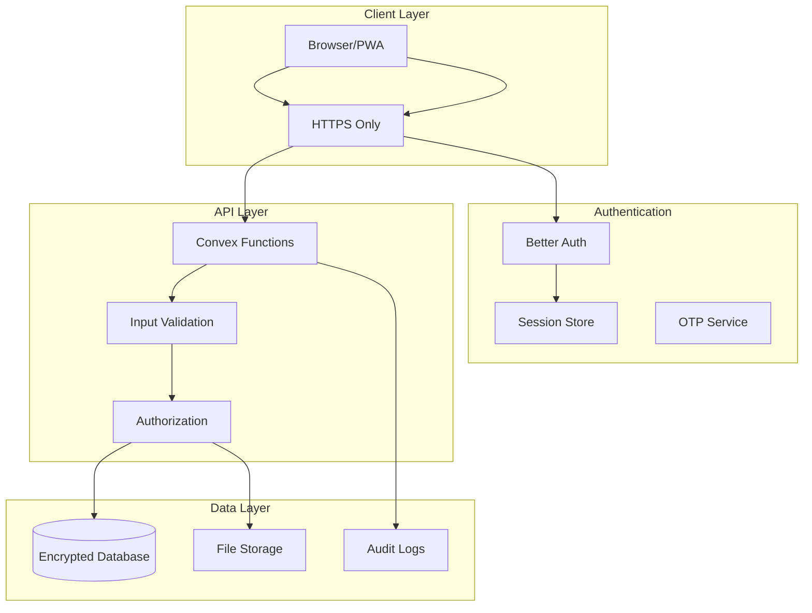
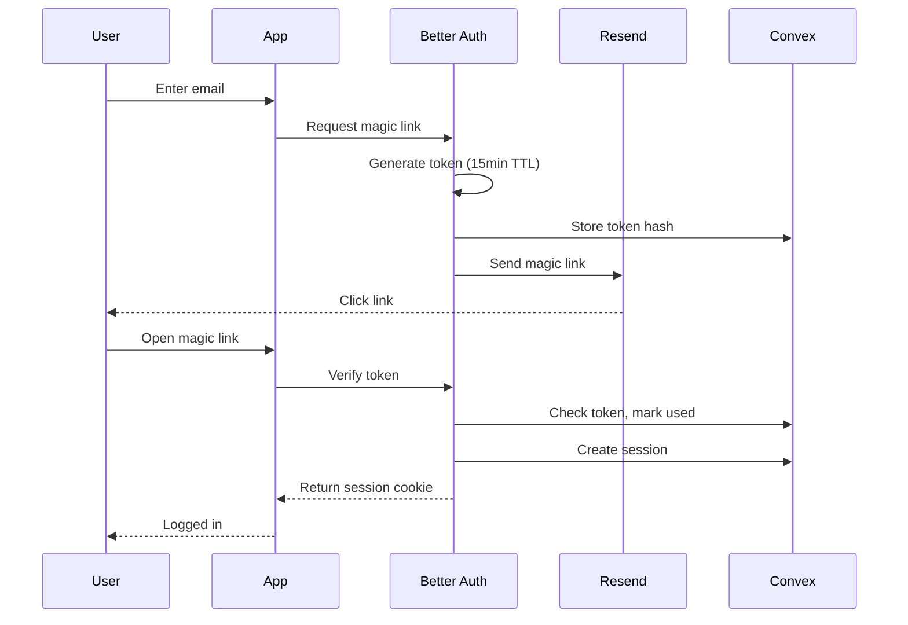
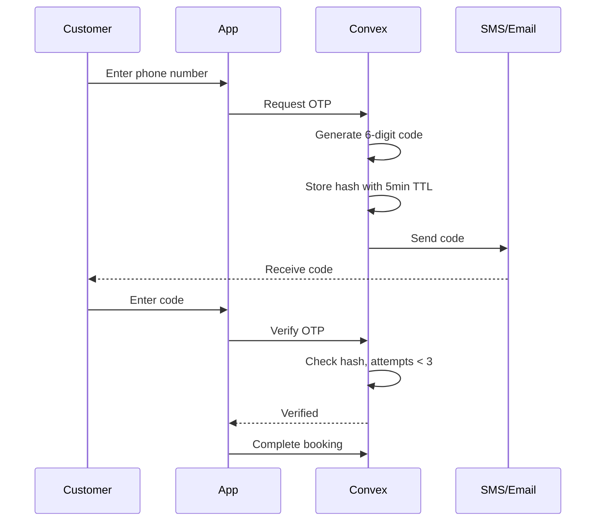
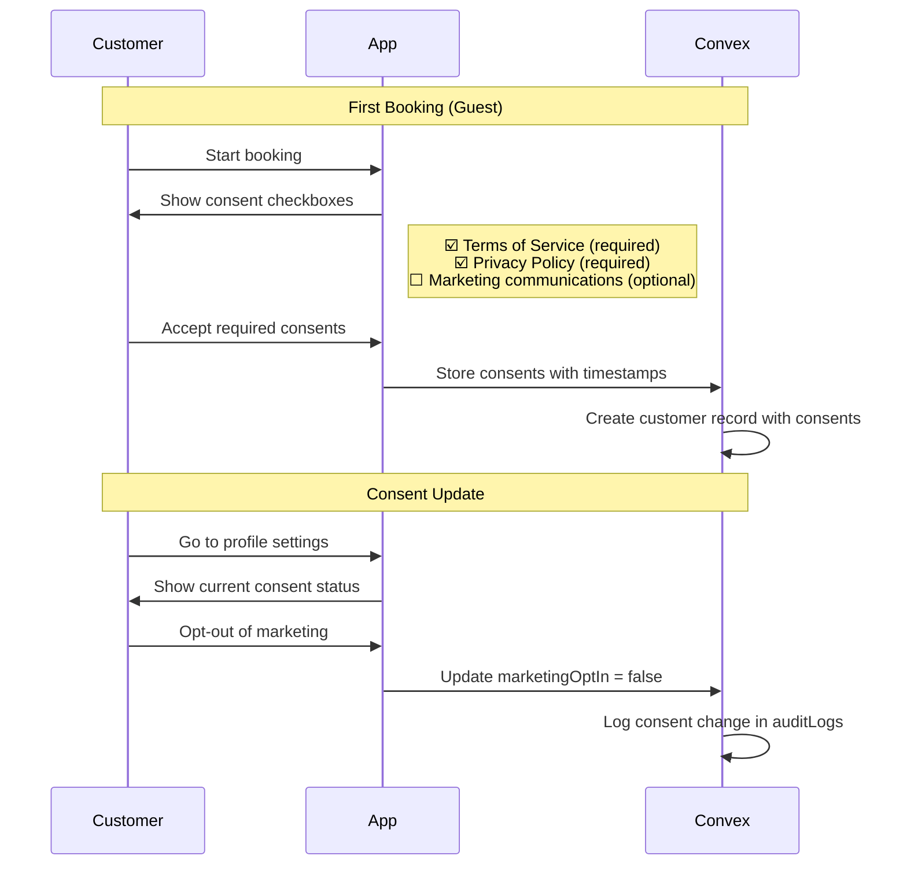

# Security Specifications

> **Last Updated:** 2026-02-04
> **Status:** Active
> **Compliance Target:** KVKK (Turkish GDPR)

## Overview

This document outlines the security requirements, authentication flows, authorization model, and compliance considerations for the Salon Management SaaS platform.

---

## Security Architecture



---

## Authentication

### Authentication Methods

| Method | Use Case | Security Level |
|--------|----------|----------------|
| Magic Link (Email) | Staff login | High |
| OTP (Phone) | Customer booking verification | Medium |
| Session Token | Ongoing authentication | High |

### Better Auth Configuration

```typescript
// auth.ts
import { betterAuth } from "better-auth";
import { ConvexAdapter } from "@better-auth/convex";

export const auth = betterAuth({
  database: new ConvexAdapter(convex),

  emailAndPassword: {
    enabled: false, // No password auth - magic link only
  },

  magicLink: {
    enabled: true,
    expiresIn: 60 * 15, // 15 minutes
    sendMagicLink: async ({ email, url }) => {
      await sendEmail({
        to: email,
        subject: "Your login link",
        template: "magic-link",
        data: { url },
      });
    },
  },

  session: {
    expiresIn: 60 * 60 * 24 * 7, // 7 days
    updateAge: 60 * 60, // Update every hour
    cookieCache: {
      enabled: true,
      maxAge: 60 * 5, // 5 minutes
    },
  },

  rateLimit: {
    enabled: true,
    window: 60, // 1 minute
    max: 10, // Max 10 requests per window
  },
});
```

### Magic Link Flow



### OTP Verification (Booking)



**OTP Security Rules:**
- 6-digit numeric code
- 5-minute expiration
- Max 3 verification attempts
- 60-second cooldown between sends
- Max 5 sends per phone per hour

---

## Authorization

### Role-Based Access Control (RBAC)

```typescript
// Authorization model
type Role = "owner" | "admin" | "staff" | "customer";

interface Permission {
  resource: string;
  actions: ("create" | "read" | "update" | "delete")[];
  scope: "own" | "organization" | "all";
}

const rolePermissions: Record<Role, Permission[]> = {
  owner: [
    { resource: "*", actions: ["create", "read", "update", "delete"], scope: "organization" },
  ],
  admin: [
    { resource: "appointments", actions: ["create", "read", "update", "delete"], scope: "organization" },
    { resource: "staff", actions: ["create", "read", "update"], scope: "organization" },
    { resource: "services", actions: ["create", "read", "update", "delete"], scope: "organization" },
    { resource: "customers", actions: ["create", "read", "update"], scope: "organization" },
    { resource: "reports", actions: ["read"], scope: "organization" },
  ],
  staff: [
    { resource: "appointments", actions: ["create", "read", "update"], scope: "own" },
    { resource: "customers", actions: ["read"], scope: "organization" },
    { resource: "services", actions: ["read"], scope: "organization" },
  ],
  customer: [
    { resource: "appointments", actions: ["create", "read", "update"], scope: "own" },
    { resource: "services", actions: ["read"], scope: "organization" },
    { resource: "profile", actions: ["read", "update"], scope: "own" },
  ],
};
```

### Authorization Implementation

```typescript
// convex/lib/auth.ts
import { ConvexError } from "convex/values";

export async function assertOrgAccess(
  ctx: QueryCtx | MutationCtx,
  organizationId: Id<"organizations">
): Promise<{ userId: Id<"users">; staffId: Id<"staff">; role: Role }> {
  const identity = await ctx.auth.getUserIdentity();
  if (!identity) {
    throw new ConvexError({ code: "UNAUTHENTICATED", message: "Not logged in" });
  }

  const user = await ctx.db
    .query("users")
    .withIndex("by_email", (q) => q.eq("email", identity.email))
    .first();

  if (!user) {
    throw new ConvexError({ code: "USER_NOT_FOUND", message: "User not found" });
  }

  const staffMember = await ctx.db
    .query("staff")
    .withIndex("by_user", (q) => q.eq("userId", user._id))
    .filter((q) => q.eq(q.field("organizationId"), organizationId))
    .first();

  if (!staffMember || staffMember.status !== "active") {
    throw new ConvexError({ code: "ACCESS_DENIED", message: "Not a member of this organization" });
  }

  return {
    userId: user._id,
    staffId: staffMember._id,
    role: staffMember.role as Role,
  };
}

export async function assertRole(
  ctx: QueryCtx | MutationCtx,
  organizationId: Id<"organizations">,
  requiredRoles: Role[]
): Promise<void> {
  const { role } = await assertOrgAccess(ctx, organizationId);

  if (!requiredRoles.includes(role)) {
    throw new ConvexError({
      code: "FORBIDDEN",
      message: `Requires one of: ${requiredRoles.join(", ")}`,
    });
  }
}
```

### Usage in Mutations

```typescript
export const updateService = mutation({
  args: {
    serviceId: v.id("services"),
    name: v.optional(v.string()),
    price: v.optional(v.number()),
  },
  handler: async (ctx, args) => {
    const service = await ctx.db.get(args.serviceId);
    if (!service) throw new ConvexError({ code: "NOT_FOUND" });

    // Check authorization - requires admin or owner
    await assertRole(ctx, service.organizationId, ["owner", "admin"]);

    // Proceed with update
    await ctx.db.patch(args.serviceId, {
      ...(args.name && { name: args.name }),
      ...(args.price && { price: args.price }),
      updatedAt: Date.now(),
    });
  },
});
```

---

## Data Protection

### Multi-Tenancy Isolation

**Every query MUST include organization filtering:**

```typescript
// CORRECT - Tenant-scoped query
const appointments = await ctx.db
  .query("appointments")
  .withIndex("by_organization", (q) =>
    q.eq("organizationId", organizationId)
  )
  .collect();

// WRONG - Exposes all tenants
const appointments = await ctx.db.query("appointments").collect();
```

### Input Validation

```typescript
// All mutations validate input
export const createAppointment = mutation({
  args: {
    organizationId: v.id("organizations"),
    date: v.string(), // Will be validated as ISO date
    startTime: v.number(),
    customerPhone: v.string(),
  },
  handler: async (ctx, args) => {
    // Date validation
    const dateRegex = /^\d{4}-\d{2}-\d{2}$/;
    if (!dateRegex.test(args.date)) {
      throw new ConvexError({
        code: "VALIDATION_ERROR",
        message: "Invalid date format",
        field: "date",
      });
    }

    // Time validation
    if (args.startTime < 0 || args.startTime > 1440) {
      throw new ConvexError({
        code: "VALIDATION_ERROR",
        message: "Invalid time",
        field: "startTime",
      });
    }

    // Phone validation (Turkish format)
    const phoneRegex = /^(\+90|0)?[5][0-9]{9}$/;
    if (!phoneRegex.test(args.customerPhone.replace(/\s/g, ""))) {
      throw new ConvexError({
        code: "VALIDATION_ERROR",
        message: "Invalid Turkish phone number",
        field: "customerPhone",
      });
    }

    // ... proceed with creation
  },
});
```

### Sensitive Data Handling

| Data Type | Storage | Access Control |
|-----------|---------|----------------|
| Email | Encrypted at rest | Organization members |
| Phone | Encrypted at rest | Organization members |
| Session tokens | Hashed | System only |
| OTP codes | Hashed with salt | System only |
| Invitation tokens | Hashed | System only |

### Data Retention

| Data Type | Retention Period | Deletion Method |
|-----------|------------------|-----------------|
| Active appointments | Indefinite | Manual deletion |
| Completed appointments | 2 years | Automated purge |
| Cancelled appointments | 90 days | Automated purge |
| Audit logs | 1 year | Automated purge |
| Sessions | Until expiry | Automated cleanup |
| OTP tokens | 5 minutes | Automated cleanup |

---

## KVKK Compliance

### Data Subject Rights

| Right | Implementation |
|-------|----------------|
| Access | Customer can view all their data via profile |
| Rectification | Customer can update profile information |
| Erasure | "Delete my data" button in settings |
| Portability | Export data as JSON/CSV |
| Objection | Opt-out of marketing communications |

### Data Processing Records

```typescript
// Audit log for data access
export const logDataAccess = internalMutation({
  args: {
    organizationId: v.id("organizations"),
    userId: v.id("users"),
    action: v.string(),
    entityType: v.string(),
    entityId: v.optional(v.string()),
    ipAddress: v.optional(v.string()),
  },
  handler: async (ctx, args) => {
    await ctx.db.insert("auditLogs", {
      ...args,
      createdAt: Date.now(),
    });
  },
});
```

### Consent Management

```typescript
// Customer consent tracking
customers: defineTable({
  // ... other fields
  consents: v.object({
    termsAccepted: v.boolean(),
    termsAcceptedAt: v.optional(v.number()),
    termsVersion: v.optional(v.string()), // e.g., "2026-01-15"
    privacyAccepted: v.boolean(),
    privacyAcceptedAt: v.optional(v.number()),
    privacyVersion: v.optional(v.string()),
    marketingOptIn: v.boolean(),
    marketingOptInAt: v.optional(v.number()),
    dataProcessingConsent: v.boolean(), // KVKK explicit consent
    dataProcessingConsentAt: v.optional(v.number()),
  }),
});
```

### Consent Collection Flow



### Consent UI Requirements

**Guest Booking (First Visit):**
```
☑️ I accept the Terms of Service (required)
☑️ I accept the Privacy Policy and consent to data processing (required)
☐ I agree to receive promotional communications (optional)

[Continue to Booking]
```

**Returning Customer (Account Holder):**
- Consents already stored
- No repeated consent collection
- Consent status visible in profile settings
- Can modify optional consents (marketing) anytime

### Data Export (KVKK Article 11)

Customers can request all their personal data under KVKK Article 11:

**Included in Export:**
| Data Category | Details |
|---------------|---------|
| Personal Info | Name, phone, email |
| Appointment History | All past/future appointments |
| Customer Notes | Notes created by customer |
| Consent Records | All consent timestamps and versions |
| Account Activity | Login history, profile changes |

**Excluded from Export:**
| Data Category | Reason |
|---------------|--------|
| Staff Internal Notes | Legitimate business interest exception |
| Aggregated Analytics | Not personal data |
| Security Event Logs | Legal retention requirement |

**Export Implementation:**

```typescript
export const exportCustomerData = action({
  args: {
    customerId: v.id("customers"),
    format: v.union(v.literal("json"), v.literal("csv")),
  },
  handler: async (ctx, args) => {
    // Verify customer owns this data
    await assertCustomerOwnership(ctx, args.customerId);

    const customer = await ctx.runQuery(internal.customers.getWithHistory, {
      customerId: args.customerId,
    });

    // Format and return data
    return args.format === "json"
      ? JSON.stringify(customer, null, 2)
      : convertToCsv(customer);
  },
});
```

**Response Timeline:** 30 days per KVKK Article 13

---

## API Security

### Rate Limiting

| Endpoint Type | Limit | Window |
|---------------|-------|--------|
| Authentication | 10 requests | 1 minute |
| Public APIs | 100 requests | 1 minute |
| Authenticated APIs | 500 requests | 1 minute |
| File uploads | 10 uploads | 1 hour |

### CORS Configuration

```typescript
// Convex HTTP actions
export const httpRouter = httpRouter({
  cors: {
    origin: [
      "https://salonmanagement.com",
      "https://*.salonmanagement.com",
      process.env.NODE_ENV === "development" && "http://localhost:3000",
    ].filter(Boolean),
    methods: ["GET", "POST", "PUT", "DELETE", "OPTIONS"],
    allowedHeaders: ["Content-Type", "Authorization"],
    credentials: true,
  },
});
```

### Security Headers

```typescript
// next.config.ts
const securityHeaders = [
  {
    key: "X-DNS-Prefetch-Control",
    value: "on",
  },
  {
    key: "Strict-Transport-Security",
    value: "max-age=63072000; includeSubDomains; preload",
  },
  {
    key: "X-Frame-Options",
    value: "SAMEORIGIN",
  },
  {
    key: "X-Content-Type-Options",
    value: "nosniff",
  },
  {
    key: "Referrer-Policy",
    value: "origin-when-cross-origin",
  },
  {
    key: "Content-Security-Policy",
    value: `
      default-src 'self';
      script-src 'self' 'unsafe-eval' 'unsafe-inline';
      style-src 'self' 'unsafe-inline';
      img-src 'self' blob: data: https:;
      font-src 'self';
      connect-src 'self' https://*.convex.cloud wss://*.convex.cloud;
    `.replace(/\s+/g, " ").trim(),
  },
];
```

---

## Incident Response

### Security Event Categories

| Severity | Examples | Response Time |
|----------|----------|---------------|
| Critical | Data breach, auth bypass | Immediate |
| High | Mass unauthorized access attempts | 1 hour |
| Medium | Single account compromise | 4 hours |
| Low | Policy violations, anomalies | 24 hours |

### Monitoring

```typescript
// Security event logging
async function logSecurityEvent(
  ctx: MutationCtx,
  event: {
    type: "login_failed" | "unauthorized_access" | "rate_limited" | "suspicious_activity";
    severity: "low" | "medium" | "high" | "critical";
    userId?: Id<"users">;
    ipAddress?: string;
    details: Record<string, unknown>;
  }
) {
  await ctx.db.insert("securityEvents", {
    ...event,
    createdAt: Date.now(),
  });

  // Alert on high/critical events
  if (event.severity === "high" || event.severity === "critical") {
    await ctx.scheduler.runAfter(0, internal.alerts.sendSecurityAlert, {
      event,
    });
  }
}
```

---

## Security Checklist

### Development

- [ ] Input validation on all mutations
- [ ] Organization ID filtering on all queries
- [ ] Role checks on sensitive operations
- [ ] No sensitive data in logs
- [ ] No secrets in code (use env vars)
- [ ] Dependencies regularly updated

### Deployment

- [ ] HTTPS enforced
- [ ] Security headers configured
- [ ] CORS properly restricted
- [ ] Rate limiting enabled
- [ ] Error messages don't expose internals

### Operations

- [ ] Audit logging enabled
- [ ] Security monitoring active
- [ ] Incident response plan documented
- [ ] Regular security reviews scheduled
- [ ] Data retention policies enforced

### Compliance

- [ ] Privacy policy published
- [ ] Terms of service published
- [ ] KVKK data processing records maintained
- [ ] Data subject request process documented
- [ ] Consent tracking implemented

---

## Payment Security (Polar.sh Integration)

### PCI Compliance

| Aspect | Implementation |
|--------|----------------|
| **Card Data Handling** | Polar handles all card data - never touches our servers |
| **PCI DSS Scope** | Out of scope - SAQ-A eligible (redirected checkout) |
| **Card Storage** | Stored by Polar, we only store Polar customer/subscription IDs |
| **Payment Processing** | Occurs entirely on Polar's PCI-compliant infrastructure |

### Webhook Security

```typescript
// Verify Polar webhook signature
function verifyPolarSignature(
  body: string,
  signature: string | null
): boolean {
  if (!signature) return false;

  const secret = process.env.POLAR_WEBHOOK_SECRET;
  if (!secret) throw new Error("POLAR_WEBHOOK_SECRET not configured");

  const expectedSignature = crypto
    .createHmac("sha256", secret)
    .update(body)
    .digest("hex");

  return crypto.timingSafeEqual(
    Buffer.from(signature),
    Buffer.from(expectedSignature)
  );
}
```

### Webhook Validation Checklist

- [ ] Verify signature on every webhook request
- [ ] Reject requests without valid signature (401)
- [ ] Use timing-safe comparison to prevent timing attacks
- [ ] Log all webhook events for audit
- [ ] Implement idempotency using `polarEventId`
- [ ] Handle webhook retries gracefully

### Payment Data Handling Policy

| Data Type | Storage | Access |
|-----------|---------|--------|
| Polar Customer ID | Encrypted in Convex | System only |
| Polar Subscription ID | Encrypted in Convex | System only |
| Payment Event Logs | Encrypted in Convex | Owner + System |
| Card Details | **Never stored** | N/A |
| Invoice PDFs | Polar-hosted URLs | Owner via Polar portal |

### Subscription Security

| Control | Implementation |
|---------|----------------|
| **Access Control** | Only organization owner can manage subscription |
| **Checkout Sessions** | Time-limited, single-use URLs |
| **Portal Access** | Generated per-request, short-lived URLs |
| **Webhook Replay** | Prevented via idempotency key checking |
| **Rate Limiting** | 10 checkout attempts per hour per org |

### Environment Variables

```bash
# Required for Polar integration
POLAR_ACCESS_TOKEN=polar_sk_...        # API access token
POLAR_WEBHOOK_SECRET=whsec_...         # Webhook signature verification
POLAR_ORGANIZATION_ID=org_...          # Your Polar organization

# Environment-specific
POLAR_ENVIRONMENT=sandbox              # "sandbox" or "production"
```

### Security Event Logging for Payments

```typescript
// Log payment-related security events
const paymentSecurityEvents = [
  "checkout_initiated",
  "checkout_completed",
  "checkout_abandoned",
  "payment_succeeded",
  "payment_failed",
  "subscription_cancelled",
  "webhook_signature_invalid",
  "webhook_replay_attempted",
  "unauthorized_billing_access",
];
```

### Fraud Prevention

| Risk | Mitigation |
|------|------------|
| Checkout abuse | Rate limit checkout session creation |
| Webhook spoofing | Signature verification required |
| Replay attacks | Idempotency key checking |
| Unauthorized access | Role-based access (owner only) |
| Session hijacking | Short-lived checkout/portal URLs |
