# User Flows

> **Last Updated:** 2026-02-04
> **Status:** Active

This document contains visual flow diagrams (Mermaid) for key user journeys in the Salon Management SaaS.

---

## Customer Booking Flow

### Complete Booking Journey

```mermaid
flowchart TB
    Start([Customer visits salon page])
    Browse[Browse Services]
    Select[Select Service(s)]
    Staff{Select Staff?}
    AnyStaff[Any Available]
    SpecificStaff[Choose Specific Staff]
    Date[Select Date]
    Time[Select Time Slot]
    SlotAvailable{Slot Available?}
    Lock[Acquire Slot Lock]
    LockFailed{Lock Failed?}
    Info[Enter Contact Info]
    OTP[Verify Phone OTP]
    OTPValid{OTP Valid?}
    Confirm[Confirm Booking]
    Success([Booking Confirmed])
    Email[Send Confirmation Email]
    Reminder[Schedule Reminder]

    Start --> Browse
    Browse --> Select
    Select --> Staff
    Staff -->|Yes| SpecificStaff
    Staff -->|No| AnyStaff
    SpecificStaff --> Date
    AnyStaff --> Date
    Date --> Time
    Time --> SlotAvailable
    SlotAvailable -->|No| Date
    SlotAvailable -->|Yes| Lock
    Lock --> LockFailed
    LockFailed -->|Yes| Time
    LockFailed -->|No| Info
    Info --> OTP
    OTP --> OTPValid
    OTPValid -->|No, retry| OTP
    OTPValid -->|Yes| Confirm
    Confirm --> Success
    Success --> Email
    Success --> Reminder
```

### Booking Cancellation Flow


---

## Staff Daily Operations Flow

### Morning Check-in Flow


### Customer Check-in Flow


### Appointment Completion Flow


---

## Admin Management Flows

### Staff Onboarding Flow


### Service Creation Flow


### Schedule Override Flow


---

## Authentication Flows

### Google OAuth Login (Current)


### OTP Verification (Booking) — Planned (Sprint 3-4)

> **Note:** OTP verification for booking is not yet implemented. This flow describes the planned behavior.


---

## Hybrid Account Flows

### Guest to Account Holder Journey

This flow shows how customers transition from anonymous guests to registered account holders.


### Account Creation During Booking


---

## Walk-in Quick Booking Flow

### Fast Walk-in Entry

Optimized for speed when customer walks in without appointment.

```mermaid
flowchart TB
    Start([Customer walks in])
    OpenQuickForm[Click "Walk-in" button]

    subgraph QuickForm[Minimal Form - 30 seconds]
        Name[Enter customer name]
        Phone[Enter phone number]
        SelectService[Select service(s)]
        Staff{Assign staff?}
        AnyAvailable[Any available - auto]
        SpecificStaff[Choose staff]
        TimeSlot[Start time: NOW or next slot]
    end

    CreateBooking[Create appointment]
    Status[Status: checked_in]
    NotifyStaff[Notify assigned staff]
    Done([Walk-in registered])

    Start --> OpenQuickForm
    OpenQuickForm --> Name
    Name --> Phone
    Phone --> SelectService
    SelectService --> Staff
    Staff -->|No preference| AnyAvailable
    Staff -->|Specific| SpecificStaff
    AnyAvailable --> TimeSlot
    SpecificStaff --> TimeSlot
    TimeSlot --> CreateBooking
    CreateBooking --> Status
    Status --> NotifyStaff
    NotifyStaff --> Done

    style QuickForm fill:#e8f5e9
```

### Walk-in vs Online Booking Comparison


---

## Time-Off Request & Approval Flow

### Staff Time-Off Request

```mermaid
flowchart TB
    Start([Staff opens schedule])
    RequestButton[Click "Request Time Off"]

    subgraph RequestForm[Time-Off Request Form]
        DateRange[Select date range]
        Type[Select type]
        TypeOptions["• Vacation
        • Sick Leave
        • Personal
        • Other"]
        Reason[Add note - optional]
    end

    CheckConflicts{Appointments in range?}
    ShowWarning["⚠️ You have 3 appointments"]
    Acknowledge[Staff acknowledges]
    Submit[Submit request]
    Pending[Status: Pending]
    Notify[Notify Admin/Owner]
    Wait([Awaiting approval])

    Start --> RequestButton
    RequestButton --> DateRange
    DateRange --> Type
    Type --> TypeOptions
    TypeOptions --> Reason
    Reason --> CheckConflicts
    CheckConflicts -->|Yes| ShowWarning
    CheckConflicts -->|No| Submit
    ShowWarning --> Acknowledge
    Acknowledge --> Submit
    Submit --> Pending
    Pending --> Notify
    Notify --> Wait
```

### Admin Time-Off Approval

```mermaid
flowchart TB
    Start([Admin sees notification])
    ViewRequest[View time-off request]

    subgraph Details[Request Details]
        Staff[Staff: Ayşe]
        Dates["Dates: Feb 15-17"]
        Type[Type: Vacation]
        Note[Note: Family event]
    end

    CheckAppts{Appointments affected?}

    subgraph NoConflict[No Conflicts]
        DirectApprove[One-click approve]
    end

    subgraph HasConflict[Has Conflicts]
        ShowAffected["⚠️ 5 appointments affected"]
        Options{Choose action}
        Reassign[Reassign to other staff]
        Cancel[Cancel appointments]
        Reject[Reject request]
    end

    ProcessReassign[Auto-reassign appointments]
    ProcessCancel[Cancel and notify customers]
    WriteRejection[Add rejection reason]

    Approve[Approve time-off]
    Denied[Reject time-off]
    NotifyStaff[Notify staff of decision]
    UpdateSchedule[Update schedule]
    Done([Complete])

    Start --> ViewRequest
    ViewRequest --> Details
    Details --> CheckAppts
    CheckAppts -->|No| DirectApprove
    CheckAppts -->|Yes| ShowAffected

    DirectApprove --> Approve

    ShowAffected --> Options
    Options --> Reassign
    Options --> Cancel
    Options --> Reject

    Reassign --> ProcessReassign
    ProcessReassign --> Approve

    Cancel --> ProcessCancel
    ProcessCancel --> Approve

    Reject --> WriteRejection
    WriteRejection --> Denied

    Approve --> NotifyStaff
    Denied --> NotifyStaff
    NotifyStaff --> UpdateSchedule
    UpdateSchedule --> Done

    style HasConflict fill:#fff3e0
```



### Time-Off States


---

## System Flows

### Real-Time Slot Update


### Notification Flow


---

## Error Recovery Flows

### Lock Expiration Recovery


### Network Error Recovery

```mermaid
flowchart TB
    Start([User action])
    Send[Send request]
    Response{Response?}
    Success[Handle success]
    Timeout[Request timeout]
    Retry{Auto retry?}
    AutoRetry[Retry with backoff]
    ShowError[Show error message]
    UserRetry{User clicks retry?}
    Abandon[User abandons]
    Manual[Manual retry]

    Start --> Send
    Send --> Response
    Response -->|Success| Success
    Response -->|Timeout| Timeout
    Timeout --> Retry
    Retry -->|Yes, attempt < 3| AutoRetry
    AutoRetry --> Send
    Retry -->|No| ShowError
    ShowError --> UserRetry
    UserRetry -->|Yes| Manual
    UserRetry -->|No| Abandon
    Manual --> Send
```

---

## Subscription Flows

### Subscription Checkout Flow

```mermaid
flowchart TB
    Start([Owner opens billing page])
    ViewPlans[View subscription plans]
    SelectPlan{Select billing period}
    Monthly[Monthly ₺500/mo]
    Yearly[Yearly ₺5,100/yr<br/>15% savings]

    CreateCheckout[Create Polar checkout session]
    Redirect[Redirect to Polar checkout]

    subgraph Polar["Polar Checkout"]
        EnterCard[Enter payment details]
        Processing[Process payment]
        Success{Payment successful?}
    end

    Webhook[Receive webhook: checkout.completed]
    ActivateOrg[Activate organization]
    SendConfirmation[Send confirmation email]
    ShowSuccess[Show success message]
    Dashboard([Return to dashboard])

    Failed[Payment failed]
    Retry{Try again?}
    Abandon([Abandon checkout])

    Start --> ViewPlans
    ViewPlans --> SelectPlan
    SelectPlan -->|Monthly| Monthly
    SelectPlan -->|Yearly| Yearly
    Monthly --> CreateCheckout
    Yearly --> CreateCheckout
    CreateCheckout --> Redirect
    Redirect --> EnterCard
    EnterCard --> Processing
    Processing --> Success
    Success -->|Yes| Webhook
    Success -->|No| Failed
    Webhook --> ActivateOrg
    ActivateOrg --> SendConfirmation
    SendConfirmation --> ShowSuccess
    ShowSuccess --> Dashboard
    Failed --> Retry
    Retry -->|Yes| EnterCard
    Retry -->|No| Abandon

    style Polar fill:#e3f2fd
```

### Failed Payment Recovery Flow

```mermaid
flowchart TB
    Start([Payment fails])
    SetPastDue[Set status: past_due]
    StartGrace[Start 7-day grace period]
    SendEmail1[Day 0: Send failure email]

    subgraph GracePeriod["Grace Period - 7 Days"]
        Day1[Day 1: Full access continues]
        Day3[Day 3: Reminder email]
        Day5[Day 5: Warning email]
        Day7[Day 7: Final notice email]
    end

    UpdatePayment{Owner updates payment?}
    RetryPayment[Retry payment via Polar]
    PaymentSuccess{Payment successful?}
    ClearGrace[Clear grace period]
    Reactivate[Set status: active]
    Recovered([Recovery successful])

    GraceExpires[Grace period expires]
    Suspend[Set status: suspended]
    LockAccess[Lock all access except billing]
    SendSuspendEmail[Send suspension email]
    Suspended([Account suspended])

    LaterUpdate{Owner updates payment?}
    RetryLater[Process payment]
    LaterSuccess{Payment successful?}
    Reactivated([Account reactivated])

    Start --> SetPastDue
    SetPastDue --> StartGrace
    StartGrace --> SendEmail1
    SendEmail1 --> Day1
    Day1 --> Day3
    Day3 --> Day5
    Day5 --> Day7

    UpdatePayment -->|Yes, during grace| RetryPayment
    RetryPayment --> PaymentSuccess
    PaymentSuccess -->|Yes| ClearGrace
    ClearGrace --> Reactivate
    Reactivate --> Recovered

    Day7 --> GraceExpires
    GraceExpires --> Suspend
    Suspend --> LockAccess
    LockAccess --> SendSuspendEmail
    SendSuspendEmail --> Suspended

    Suspended --> LaterUpdate
    LaterUpdate -->|Yes| RetryLater
    RetryLater --> LaterSuccess
    LaterSuccess -->|Yes| Reactivated
    LaterSuccess -->|No| Suspended

    style GracePeriod fill:#fff3e0
```

### Subscription Cancellation Flow

```mermaid
flowchart TB
    Start([Owner clicks cancel])
    ConfirmPrompt[Show confirmation dialog]

    subgraph Dialog["Cancellation Dialog"]
        Warning["⚠️ Are you sure?<br/>Your access will end on [date]"]
        Benefits[Show what they'll lose]
        Reason[Optional: Select reason]
        Confirm{Confirm cancellation?}
    end

    Cancel[Cancel subscription]
    SetCancelAtEnd[Set cancelAtPeriodEnd = true]
    SendConfirmEmail[Send cancellation confirmation]
    ShowEndDate[Show when access ends]

    ContinueAccess[Access continues until period end]
    AccessEnds[Access ends]
    DataRetention[Data retained 30 days]
    DataDeleted[Data deleted]

    KeepSubscription([Keep subscription])
    Cancelled([Subscription cancelled])

    Resubscribe{Owner resubscribes?}
    NewCheckout[Start new checkout]
    Reactivated([Subscription reactivated])

    Start --> ConfirmPrompt
    ConfirmPrompt --> Warning
    Warning --> Benefits
    Benefits --> Reason
    Reason --> Confirm
    Confirm -->|No| KeepSubscription
    Confirm -->|Yes| Cancel
    Cancel --> SetCancelAtEnd
    SetCancelAtEnd --> SendConfirmEmail
    SendConfirmEmail --> ShowEndDate
    ShowEndDate --> Cancelled

    Cancelled --> ContinueAccess
    ContinueAccess --> AccessEnds
    AccessEnds --> DataRetention
    DataRetention --> DataDeleted

    AccessEnds --> Resubscribe
    Resubscribe -->|Yes| NewCheckout
    NewCheckout --> Reactivated
```

### Subscription Status States

```mermaid
stateDiagram-v2
    [*] --> NoSubscription: New organization

    NoSubscription --> Active: Complete checkout
    Active --> PastDue: Payment fails
    PastDue --> Active: Payment succeeds
    PastDue --> Suspended: Grace period expires (7 days)
    Suspended --> Active: Payment succeeds
    Active --> Cancelled: Owner cancels
    Cancelled --> Active: Owner resubscribes

    Suspended --> Deleted: 30 days no action
    Cancelled --> Deleted: 30 days after period ends

    note right of Active: Full platform access
    note right of PastDue: Full access, warning banners
    note right of Suspended: Billing page only
    note right of Cancelled: Access until period end
```

### Billing Page User Flow

```mermaid
flowchart TB
    Start([Owner opens billing])
    ViewStatus[View subscription status]

    subgraph StatusView["Current Status"]
        Plan[Current plan & billing period]
        NextBilling[Next billing date & amount]
        PaymentMethod[Payment method on file]
    end

    subgraph Actions["Available Actions"]
        ManagePortal[Manage via Polar Portal]
        ChangePlan[Change billing period]
        CancelSub[Cancel subscription]
        ViewHistory[View billing history]
    end

    ManagePortal --> PolarPortal[Open Polar customer portal]
    ChangePlan --> UpgradeFlow[Monthly ↔ Yearly]
    CancelSub --> CancelFlow[Cancellation flow]
    ViewHistory --> HistoryTable[Show past payments]

    DownloadInvoice[Download invoice PDF]
    HistoryTable --> DownloadInvoice

    Start --> ViewStatus
    ViewStatus --> StatusView
    StatusView --> Actions

    style Actions fill:#e8f5e9
```
