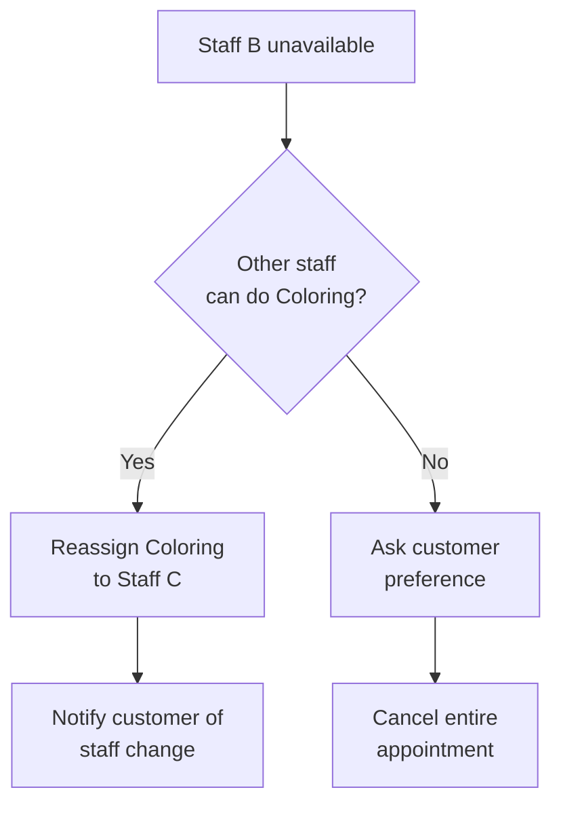
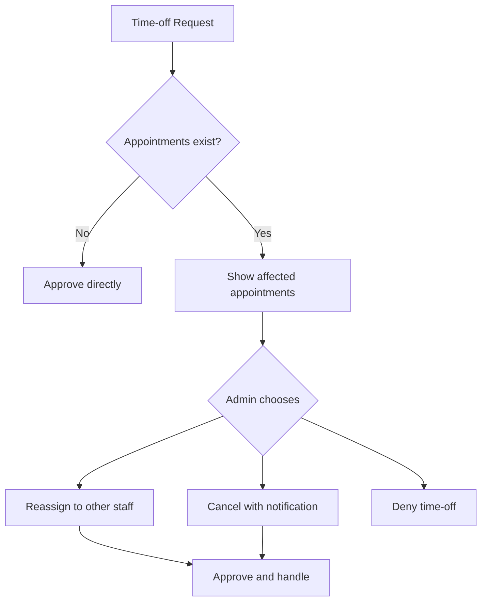

# Edge Cases & Error Handling

> **Last Updated:** 2026-02-04
> **Status:** Active

This document catalogs edge cases, error scenarios, and their prescribed handling for the Salon Management SaaS.

---

## Hybrid Account Model Edge Cases

### EC-HAM-001: Guest Upgrades Mid-Booking

**Scenario:** Guest (3+ visits) decides to create account during booking flow.

**Handling:**
1. Preserve current booking progress
2. Show quick account creation (email + magic link)
3. After account created, link existing customer record to new user
4. Continue booking with authenticated session
5. Merge any duplicate customer records

---

### EC-HAM-002: Phone Number Already Registered

**Scenario:** Guest tries to book with phone number already linked to a registered account.

**Handling:**
```typescript
// During phone verification
const existingCustomer = await findCustomerByPhone(phone);
if (existingCustomer?.userId) {
  // Prompt to log in instead
  throw new ConvexError({
    code: "ACCOUNT_EXISTS",
    message: "This phone is linked to an account. Please log in to continue.",
    loginPrompt: true,
  });
}
```

**UX:**
```
This phone number is linked to an existing account.
Please log in to manage your bookings.

[Log In]  [Use Different Phone]
```

---

### EC-HAM-003: Customer Tries to Merge Own Duplicate Records

**Scenario:** Customer realizes they have bookings under different phone/email.

**Handling:**
- Customer cannot self-merge (privacy/security)
- Must contact salon to request merge
- Staff verifies identity before merging
- All history consolidated under primary record

---

## Multi-Service Booking Edge Cases

### EC-MSB-001: Different Staff Partial Unavailability

**Scenario:** Customer books Hair Cut (Staff A) + Coloring (Staff B) + Blow Dry (Staff A). Staff B becomes unavailable.

**Handling:**


**Customer Notification:**
```
One of your stylists is unavailable:

Original: Hair Coloring with Zeynep
New: Hair Coloring with Fatma

Other services unchanged.

[Accept Change]  [Reschedule All]  [Cancel]
```

---

### EC-MSB-002: Service Duration Changes After Multi-Service Booking

**Scenario:** Coloring service duration increased from 60min to 90min after booking.

**Handling:**
1. Check if subsequent services still fit
2. If not, flag appointment for manual review
3. Notify customer: "Your appointment timing may need adjustment"
4. Admin can extend or reschedule affected services

---

### EC-MSB-003: Gap Between Services in Multi-Service Booking

**Scenario:** Staff A finishes at 11:00, Staff B not available until 11:30 (30min gap).

**Options:**
1. **Prevent at booking:** Don't offer this combination
2. **Allow with warning:** "30 minute wait between services"
3. **Buffer time:** Use salon waiting area

**Configuration:**
```typescript
bookingSettings: {
  maxGapBetweenServices: 15, // Minutes, 0 = back-to-back only
  showGapWarning: true,
}
```

---

## Time-Off Approval Edge Cases

### EC-TO-001: Conflicting Time-Off Requests

**Scenario:** Two staff members request same dates, both have appointments.

**Handling:**
- Show admin which request was submitted first
- Show impact analysis for each:
  - Staff A: 5 appointments, all can be reassigned
  - Staff B: 3 appointments, 1 cannot be reassigned (specialized service)
- Admin decides which to approve based on business needs

---

### EC-TO-002: Time-Off for Day with Unresolvable Appointments

**Scenario:** Staff requests day off but has appointment that no other staff can perform.

**Handling:**
```
⚠️ Cannot auto-handle all appointments:

Reassignable: 4 appointments
Cannot reassign: 1 appointment
  - Customer: Ahmet Yılmaz
  - Service: Advanced Color Correction (only Ayşe certified)

Options:
[Approve & Cancel Unassignable]  [Reject Request]  [Contact Customer First]
```

---

### EC-TO-003: Retroactive Time-Off Request

**Scenario:** Staff requests time-off for past dates (sick leave documentation).

**Handling:**
- Allow for record-keeping purposes
- Mark affected past appointments as "cancelled - staff illness"
- Don't trigger customer notifications (already happened)
- Admin flag required: `retroactive: true`

---

## Overtime Edge Cases

### EC-OT-001: Appointment Booked, Then Overtime Deleted

**Scenario:** Staff creates overtime slot, customer books it, staff tries to delete.

**Handling:**
- Block deletion if appointments exist
- Error: "Cannot delete overtime with existing appointments"
- Must cancel/reschedule appointments first

---

### EC-OT-002: Overtime Conflicts with Regular Schedule

**Scenario:** Staff creates overtime for time already covered by regular hours.

**Handling:**
- Allow (overtime extends availability)
- Don't double-count in utilization metrics
- Clear UI indicator: "Extends regular hours"

---

## Notes System Edge Cases

### EC-NS-001: Staff Note Contains Sensitive Information

**Scenario:** Staff adds note with customer's medical information.

**Handling:**
- Staff notes are internal-only (never shown to customer)
- Warn staff: "Internal notes may be subject to KVKK requests"
- Consider separate "medical notes" field with extra protections
- Audit log all note access

---

### EC-NS-002: Customer Requests Their Data (KVKK)

**Scenario:** Customer requests all data under KVKK Article 11.

**Data Export Includes:**
- Customer notes (customer-created)
- Appointment history
- Contact information

**Data Export Excludes:**
- Staff internal notes (legitimate business interest)
- Aggregated analytics
- Security event logs (retention required)

**Response Timeline:** 30 days per KVKK

---

## Booking Edge Cases

### EC-001: Double Booking Race Condition

**Scenario:** Two customers simultaneously select the same time slot.

**Detection:** Slot lock acquisition fails for second user.

**Handling:**
```typescript
// When lock acquisition fails
try {
  await acquireSlotLock(slot);
} catch (error) {
  if (error.code === "SLOT_LOCKED") {
    // Show user-friendly message
    showToast("This slot is being booked by another user. Please select a different time.");
    // Refresh available slots
    refetchSlots();
  }
}
```

**UX:**
- Real-time slot availability updates via Convex subscription
- Slots turn gray/disabled when locked by others
- Message: "This time is being booked. Please select another slot."

---

### EC-002: Lock Expiration During Form Fill

**Scenario:** Customer takes too long filling out contact information, lock expires.

**Detection:** Lock TTL (2 minutes) exceeded.

**Handling:**
1. Show warning at 30 seconds remaining
2. Attempt to extend lock when form submitted
3. If extension fails, check if slot still available
4. If available, re-acquire lock and continue
5. If unavailable, show error and return to slot selection

**UX:**
```
⚠️ Your slot reservation expires in 30 seconds. Please complete your booking.
[I need more time] [Complete now]
```

---

### EC-003: OTP Verification Timeout

**Scenario:** Customer doesn't enter OTP within 5-minute window.

**Handling:**
1. Code expires after 5 minutes
2. Show "Code expired" message
3. Offer "Resend code" button (60-second cooldown between sends)
4. Slot lock released after OTP timeout
5. Customer must restart booking flow

**Rate Limits:**
- Max 3 verification attempts per code
- Max 5 codes sent per phone per hour
- 60-second minimum between code requests

---

### EC-004: Service Duration Changes After Selection

**Scenario:** Admin changes service duration while customer is booking.

**Handling:**
- Slot calculation uses duration at time of slot selection
- If duration increases and slot no longer fits, show error at confirmation
- Error message: "Service duration has changed. Please select a new time slot."

**Prevention:**
- Admin sees warning if service has upcoming bookings
- Consider queuing duration changes for future bookings only

---

### EC-005: Staff Becomes Unavailable During Booking

**Scenario:** Staff marked unavailable (sick leave) while customer is booking.

**Handling:**
1. Check staff availability at final confirmation
2. If unavailable, offer alternatives:
   - Different staff (if "Any Available" mode)
   - Different time with same staff
   - Cancel booking
3. Error: "Your selected staff is no longer available. Would you like to choose a different time or staff member?"

---

### EC-006: Booking Outside Business Hours

**Scenario:** Customer attempts to book during closed hours.

**Prevention:**
- Slots query respects business hours
- Calendar shows closed days/hours as unavailable

**Edge Case:** Business hours change after slot displayed
- Validate against current hours at confirmation
- Show error if now outside hours

---

### EC-007: Timezone Mismatches (DST)

**Scenario:** Booking made just before DST transition.

**Handling:**
- All times stored in salon's timezone (not UTC offset)
- Use timezone-aware library (e.g., date-fns-tz)
- Display reminder email shows correct local time

**Example:**
- Customer books 2:30 PM on "spring forward" day
- 2:30 PM doesn't exist (clocks jump from 2:00 to 3:00)
- System should either:
  - Prevent booking at non-existent times
  - Automatically adjust to 3:30 PM with notification

---

## Staff Schedule Edge Cases

### EC-010: Staff Takes Leave After Appointments Booked

**Scenario:** Staff requests time off for date with existing appointments.

**Handling Flow:**


**Customer Notification:**
```
Subject: Your appointment has been rescheduled

Hi [Name],

Your appointment on [Date] at [Time] with [Staff] has been affected by a schedule change.

[If reassigned:]
Your appointment has been moved to [New Staff].

[If cancelled:]
Unfortunately, we had to cancel your appointment. Please book a new time at your convenience.

[Reschedule link]
```

---

### EC-011: Last Owner Tries to Leave Organization

**Scenario:** Only owner attempts to deactivate their account.

**Prevention:**
- Check if user is last owner before deactivation
- Require ownership transfer first
- Error: "You are the only owner. Please transfer ownership before deactivating your account."

---

### EC-012: Staff Deleted with Future Appointments

**Scenario:** Admin removes staff member who has future bookings.

**Handling Options:**
1. **Block deletion:** "This staff has 5 future appointments. Please reassign or cancel them first."
2. **Force with reassignment:** Prompt to reassign all appointments
3. **Soft delete:** Mark staff inactive, appointments remain visible

**Recommended:** Option 1 (safest) or Option 2 (pragmatic)

---

## Payment Edge Cases - SaaS Subscription (MVP)

### EC-PAY-001: Card Declined During Checkout

**Scenario:** Customer's card is declined during subscription checkout on Polar.

**Handling:**
- Polar shows clear error message on checkout page
- Customer can retry with different card
- No subscription created until payment succeeds
- Organization remains in trial/inactive state
- Log checkout attempt for analytics

**UX:**
```
Payment Failed

Your card was declined. Please try a different payment method.

[Try Different Card]  [Contact Support]
```

---

### EC-PAY-002: Subscription Expires During Active Appointment

**Scenario:** Organization's subscription expires/suspends while customer has active appointment in progress.

**Handling:**
1. Current appointments continue uninterrupted
2. Suspension takes effect after appointment completes
3. No new appointments can be created
4. Staff can complete checkout for active appointments
5. Dashboard shows suspension warning
6. Redirect to billing page after appointment completion

**Policy:**
- In-progress appointments are never interrupted
- Suspension only affects new operations
- Customer experience is protected

---

### EC-PAY-003: Webhook Delivery Failure

**Scenario:** Polar webhook fails to deliver (network issue, our server down).

**Handling:**
1. Polar automatically retries (exponential backoff)
2. Webhook endpoint implements idempotency
3. Use `polarEventId` to detect duplicate events
4. Manual sync option available for support team
5. Alert if webhook delivery consistently fails

**Implementation:**
```typescript
// Check for duplicate event
const existingEvent = await ctx.db
  .query("subscriptionEvents")
  .withIndex("by_event_id", (q) => q.eq("polarEventId", event.id))
  .first();

if (existingEvent) {
  // Already processed, return 200 to stop retries
  return new Response("Already processed", { status: 200 });
}
```

**Retry Schedule (Polar):**
| Attempt | Delay |
|---------|-------|
| 1 | Immediate |
| 2 | 1 minute |
| 3 | 5 minutes |
| 4 | 30 minutes |
| 5 | 2 hours |
| 6 | 12 hours |
| 7 | 24 hours |

---

### EC-PAY-004: Grace Period Expiry

**Scenario:** Organization fails to update payment within 7-day grace period.

**Handling:**
1. Day 7 reminder sent with final warning
2. Grace period ends at exact time of original failure + 7 days
3. Status changes from `past_due` to `suspended`
4. All access locked except billing page
5. Suspension email sent immediately
6. Data retained for 30 days

**Suspended State Access:**
| Feature | Access |
|---------|--------|
| Billing page | ✅ Allowed |
| Dashboard | ❌ Blocked |
| Calendar | ❌ Blocked |
| Appointments | ❌ Blocked |
| API calls | ❌ Blocked |
| Customer booking | ❌ Blocked |

**UX (Suspended Page):**
```
┌─────────────────────────────────────────────────────────────────────────┐
│                                                                         │
│                      ⚠️ Account Suspended                               │
│                                                                         │
│  Your subscription payment has failed and your account is suspended.   │
│                                                                         │
│  Your data is safe and will be retained for 30 days.                   │
│  Update your payment method to restore access immediately.             │
│                                                                         │
│                        [Update Payment Method]                          │
│                                                                         │
│                        Need help? Contact Support                       │
│                                                                         │
└─────────────────────────────────────────────────────────────────────────┘
```

---

### EC-PAY-005: Subscription Cancelled But Staff Still Working

**Scenario:** Owner cancels subscription, but staff members have active sessions.

**Handling:**
1. Cancellation sets `cancelAtPeriodEnd = true`
2. Access continues until period end
3. Staff sessions continue normally
4. No new bookings allowed after period end
5. Clear in-app countdown to access end

---

### EC-PAY-006: Race Condition in Plan Change

**Scenario:** Two admins try to change billing period simultaneously.

**Handling:**
1. Polar checkout is idempotent
2. Only one checkout can complete
3. Second attempt sees already-updated subscription
4. UI refresh shows current state
5. No double-charging possible

---

### EC-PAY-007: Payment Method Update During Past Due

**Scenario:** Organization is past_due and owner updates payment method.

**Handling:**
1. New card added via Polar portal
2. Polar automatically retries failed payment
3. If successful, webhook triggers status update
4. Grace period cleared
5. Status restored to `active`
6. Confirmation email sent

---

## Customer Payment Edge Cases (Future - v2.0)

### EC-020: Card Declined Mid-Checkout

**Scenario:** Payment fails during appointment checkout.

**Handling:**
- Show clear error message
- Don't mark appointment as paid
- Offer retry or alternative payment
- Log failed attempt for reporting

---

### EC-021: Network Timeout During Payment

**Scenario:** Connection lost while processing payment.

**Handling:**
1. Payment gateway tracks idempotency key
2. On reconnect, check payment status
3. If paid, update appointment
4. If not paid, show retry option
5. Never charge twice for same booking

---

## Data Integrity Edge Cases

### EC-030: Deleted Service with Existing Appointments

**Scenario:** Admin deletes service that's part of existing appointments.

**Prevention:**
- Soft delete only (mark as inactive)
- Historical appointments retain service name (denormalized)
- Error if hard delete attempted: "This service has booking history. It can be deactivated but not deleted."

---

### EC-031: Customer with Multiple Records

**Scenario:** Same person books with different email/phone over time.

**Detection:**
- Phone number match but different email
- Email match but different phone

**Handling:**
- Allow staff to merge customer records
- Combine booking history
- Keep most recent contact info
- Audit log the merge

---

### EC-032: Orphaned Appointments After Org Deletion

**Scenario:** Organization deleted with appointments in system.

**Prevention:**
- Require admin to handle all future appointments first
- Send cancellation emails to affected customers
- Soft delete organization (preserve for compliance)

---

## Concurrency Edge Cases

### EC-040: Simultaneous Status Updates

**Scenario:** Two staff members update same appointment simultaneously.

**Handling:**
- Convex mutations are atomic
- Last write wins for simple fields
- For state transitions, validate current state before updating

```typescript
// Validate state transition
const appointment = await ctx.db.get(args.appointmentId);
if (appointment.status !== "confirmed") {
  throw new ConvexError({
    code: "INVALID_STATE",
    message: `Cannot check in from status: ${appointment.status}`,
  });
}
```

---

### EC-041: Subscription Reconnection with Stale Data

**Scenario:** Client reconnects after network issue, has outdated state.

**Handling:**
- Convex automatically syncs on reconnection
- UI should show loading state during reconnection
- Optimistic updates are rolled back if server state differs

---

## UI Edge Cases

### EC-050: Very Long Service Names

**Scenario:** Service name exceeds display area.

**Handling:**
- Truncate with ellipsis
- Show full name on hover (tooltip)
- Max database field length: 100 characters

```tsx
<span className="truncate max-w-[200px]" title={service.name}>
  {service.name}
</span>
```

---

### EC-051: Many Staff Members (Scroll)

**Scenario:** Salon has 20+ staff members, calendar is unwieldy.

**Handling:**
- Horizontal scroll on calendar
- Staff filter dropdown
- "My Schedule" view for individual staff
- Virtualized list for performance

---

### EC-052: No Available Slots for 30 Days

**Scenario:** Customer tries to book but salon is fully booked.

**UX:**
```
No availability for the next 30 days

[Popular staff] is fully booked. Try:
• Selecting "Any Available" staff
• Checking back later for cancellations
• Calling the salon directly: [phone]
```

---

## Error Message Guidelines

### User-Facing Error Messages

| Code | Message | Action |
|------|---------|--------|
| `SLOT_UNAVAILABLE` | "This time slot is no longer available. Please select another time." | Show slot picker |
| `LOCK_EXPIRED` | "Your slot reservation expired. Please select a time again." | Restart flow |
| `INVALID_OTP` | "Incorrect code. Please try again." | Clear input, focus |
| `OTP_EXPIRED` | "Code expired. Click 'Resend' to get a new code." | Show resend button |
| `RATE_LIMITED` | "Too many attempts. Please wait [X] seconds." | Show countdown |
| `PERMISSION_DENIED` | "You don't have permission to perform this action." | N/A |
| `NOT_FOUND` | "The requested resource was not found." | Redirect to safe page |
| `NETWORK_ERROR` | "Connection lost. Please check your internet and try again." | Show retry button |

### Technical Error Messages (Logs Only)

Detailed technical messages should:
- Go to error tracking (Sentry)
- Include request ID for support
- Never expose to end users
- Contain stack traces and context

---

## Recovery Procedures

### Procedure: Bulk Appointment Cancellation

When a major issue requires cancelling multiple appointments:

1. Query affected appointments
2. Generate cancellation list for review
3. Send bulk cancellation emails
4. Update appointment statuses
5. Release all slot locks
6. Log action in audit trail
7. Notify admin of completion

### Procedure: Data Corruption Recovery

1. Identify affected records
2. Export backup from Convex dashboard
3. Script corrections
4. Validate data integrity
5. Notify affected users if needed
6. Document incident

---

## Testing Checklist

For each edge case, ensure:

- [ ] Unit test for detection logic
- [ ] Integration test for handling flow
- [ ] E2E test for user experience
- [ ] Error message appears correctly
- [ ] Recovery path works
- [ ] Audit log captures event
