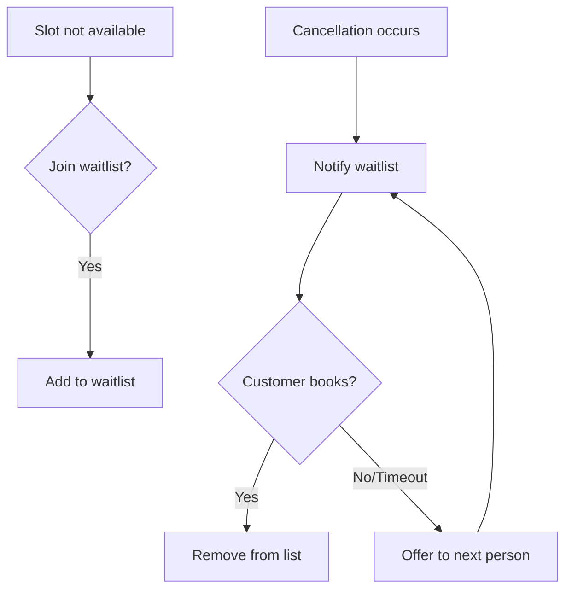

# Future Roadmap

> **Last Updated:** 2026-02-04
> **Status:** Planning Document

This document outlines features planned for post-MVP releases. Features are organized by priority and estimated release version.

---

## Version Overview

| Version | Focus | Target |
|---------|-------|--------|
| v1.0 (MVP) | Core booking, staff management, **SaaS billing** | Initial release |
| v1.1 | Enhanced notifications, Turkish i18n | Post-MVP quick wins |
| v1.2 | Customer loyalty, advanced analytics | Growth features |
| v2.0 | Customer payments, multi-location | Major expansion |
| v2.x | AI features, marketplace | Future vision |

> **Note:** SaaS subscription billing via Polar.sh is included in MVP (v1.0). Customer payment processing (deposits, prepayments for appointments) is planned for v2.0.

---

## P2 Features (v1.1 - v1.2)

### SMS Notifications

**Priority:** P2
**Target:** v1.1

**Description:** Send appointment reminders and confirmations via SMS in addition to email.

**Requirements:**
- Integration with Turkish SMS provider (Netgsm, Iletimerkezi)
- SMS templates for: confirmation, reminder, cancellation
- Opt-in/opt-out per customer
- Character limit handling (Turkish characters)
- Delivery status tracking
- Cost tracking per organization

**Technical Notes:**
- Convex action to call SMS API
- Scheduled job for reminders
- Webhook for delivery status

---

### WhatsApp Integration

**Priority:** P2
**Target:** v1.2

**Description:** Send notifications via WhatsApp Business API for higher engagement.

**Requirements:**
- WhatsApp Business API integration
- Template messages (pre-approved)
- Interactive booking confirmations
- Quick reply buttons for confirm/cancel
- Message read receipts

**Benefits:**
- Higher open rates than SMS
- Rich media support
- Two-way communication potential

---

### Waitlist Management

**Priority:** P2
**Target:** v1.1

**Description:** Allow customers to join waitlist for fully booked time slots.

**Requirements:**
- Customer can request specific date/time/staff
- Notification when slot becomes available
- First-come-first-served or priority-based
- Auto-expire waitlist entries after 24h
- Admin can manually offer slots to waitlist

**User Flow:**

---

### Recurring Appointments

**Priority:** P2
**Target:** v1.2

**Description:** Allow customers to book regular appointments (e.g., haircut every 4 weeks).

**Requirements:**
- Set recurrence: weekly, bi-weekly, monthly
- Choose end date or number of occurrences
- Manage series (edit single vs all)
- Conflict detection for future dates
- Bulk cancellation of series

**Constraints:**
- Max 12 months in advance
- Max 52 occurrences per series
- Staff availability validated for each

---

### Advanced Analytics

**Priority:** P2
**Target:** v1.2

**Description:** Deeper business insights beyond basic dashboard metrics.

**Reports:**
- Revenue forecasting (based on bookings)
- Staff utilization heatmaps
- Customer cohort analysis
- Service performance trends
- Peak hours analysis
- No-show prediction

**Features:**
- Custom date ranges
- Export to Excel/CSV
- Scheduled email reports (weekly/monthly)
- Comparison views (this month vs last month)

---

### Customer Loyalty Program

**Priority:** P2
**Target:** v1.2

**Description:** Points-based system to encourage repeat visits.

**Requirements:**
- Earn points per visit (configurable rate)
- Earn points per TRY spent
- Redeem points for discounts
- Tier levels (Bronze, Silver, Gold)
- Points expiration policy
- Admin dashboard for program management

**Example Configuration:**
- 1 point per ₺10 spent
- 100 points = ₺10 discount
- Points expire after 12 months
- Gold status at 500+ points/year

---

## P3 Features (v2.0+)

### Customer Payment Processing

**Priority:** P3
**Target:** v2.0

**Description:** Accept online payments from salon customers for appointments (deposits, prepayments).

> **Note:** Platform subscription billing is P0 and implemented in MVP via Polar.sh. This section covers customer-facing payments only.

**Requirements:**
- One-time appointment payments via @polar-sh/sdk
- Deposit collection (% of service price)
- Full prepayment option
- Refund processing
- Receipt/invoice generation for customers
- Financial reporting for salon owners

**Considerations:**
- PCI compliance (handled by Polar)
- Multi-currency support (TRY primarily)
- Webhook-based event handling
- Integration with appointment system

---

### Multi-Location Support

**Priority:** P3
**Target:** v2.0

**Description:** Single organization with multiple physical locations.

**Requirements:**
- Add/manage multiple locations
- Staff assigned to specific location(s)
- Services per location (optional)
- Location-specific business hours
- Customer chooses location when booking
- Consolidated reporting across locations
- Inventory transfer between locations

**Architecture Changes:**
- `locations` table (child of organizations)
- All bookings tied to location
- Staff can belong to multiple locations

---

### Online Payments for Products

**Priority:** P3
**Target:** v2.1

**Description:** E-commerce capability for retail products.

**Requirements:**
- Product catalog with online purchasing
- Shopping cart
- Shipping or in-store pickup
- Order management
- Integration with existing product inventory

---

### Mobile Applications

**Priority:** P3
**Target:** v2.x

**Description:** Native mobile apps for iOS and Android.

**Options:**
1. **React Native:** Share code with web
2. **Capacitor:** Wrap existing web app
3. **Native:** Best performance, highest cost

> **Note:** There is no PWA currently. The web app is a standard Next.js application.

**Features:**
- Push notifications
- Offline appointment viewing
- Biometric login
- Camera for profile photos

**Initial Recommendation:** React Native for code sharing with the existing React codebase.

---

### AI-Powered Features

**Priority:** P3
**Target:** v2.x

**Description:** Machine learning enhancements.

**Features:**

1. **Smart Scheduling**
   - Suggest optimal times based on staff efficiency
   - Balance workload across staff
   - Consider travel time between locations

2. **No-Show Prediction**
   - Flag high-risk bookings
   - Require deposit for risky bookings
   - Send extra reminders

3. **Service Recommendations**
   - Suggest add-on services
   - Personalized offers based on history
   - "Customers also booked..."

4. **Demand Forecasting**
   - Predict busy periods
   - Staff scheduling recommendations
   - Dynamic pricing suggestions

---

### Marketplace / Discovery

**Priority:** P3
**Target:** v3.0

**Description:** Platform where customers can discover salons.

**Features:**
- Public salon directory
- Search by location, service, rating
- Customer reviews and ratings
- Featured salon listings (paid)
- Booking directly from marketplace

**Business Model:**
- Commission per booking from marketplace
- Featured listing fees
- Premium salon profiles

---

## Technical Debt & Infrastructure

### Performance Optimization

**Target:** Ongoing

- Database query optimization
- Image CDN for photos
- Edge caching for static content
- Bundle size reduction
- Core Web Vitals monitoring

### Monitoring & Observability

**Target:** v1.1

- Structured logging
- Performance dashboards
- Alerting for anomalies
- Error rate monitoring
- User session recording (privacy-compliant)

### Security Enhancements

**Target:** v1.1

- ~~Rate limiting per endpoint~~ (Already implemented in Sprint 1 via `convex/lib/rateLimits.ts` using `@convex-dev/rate-limiter`)
- Brute force protection
- Security audit
- Penetration testing
- SOC 2 preparation

### Developer Experience

**Target:** Ongoing

- Comprehensive API documentation
- SDK for integrations
- Webhook system for events
- Sandbox environment for testing

---

## Deprecation Schedule

| Feature | Deprecated | Removed | Replacement |
|---------|------------|---------|-------------|
| Email-only notifications | v1.1 | - | SMS/WhatsApp options |
| Basic analytics | v1.2 | - | Advanced analytics |
| Manual customer payment tracking | v2.0 | v2.1 | Polar customer payments |

> **Note:** SaaS subscription billing is implemented from v1.0 MVP using Polar.sh.

---

## Feature Request Process

Community feature requests will be evaluated based on:

1. **Impact:** How many users benefit?
2. **Effort:** Development complexity
3. **Strategy:** Alignment with product vision
4. **Revenue:** Potential for monetization
5. **Competition:** Market differentiation

Feature requests can be submitted via:
- GitHub Issues (when open-sourced)
- In-app feedback form
- Customer support channels

---

## Version Release Cadence

| Type | Frequency | Contents |
|------|-----------|----------|
| Patch (x.x.1) | As needed | Bug fixes, security patches |
| Minor (x.1.0) | Monthly | New features, improvements |
| Major (2.0.0) | Yearly | Breaking changes, major features |

All releases follow semantic versioning principles.
