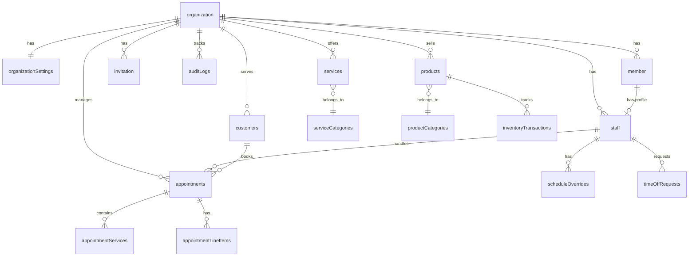

# Database Schema

> **Last Updated:** 2026-02-06
> **Status:** Active

This document contains the complete Convex database schema for the Salon Management SaaS. All tables include multi-tenancy support through `organizationId`.

> **Terminology Note:** This document uses `organization` to match the actual database table names. In code, always use `organizationId`, never `salonId` or `tenantId`. See [Glossary - Organization](./glossary.md#organization) for terminology guidelines.

> **Note:** Authentication tables (`user`, `session`, `account`, `verification`, `jwks`) are managed by the Better Auth component at `convex/betterAuth/schema.ts` and are NOT part of the application schema.

---

## Quick Navigation

- [Schema Overview](#schema-overview) - ER diagram and relationships
- [Implementation Status](#implementation-status) - What's built vs planned
- [Core Tables](#core-tables) - Organization, settings, members, staff
- [Services](#services-tables) - Service catalog and categories
- [Schedule Management](#schedule-management-tables) - Overrides, time-off, overtime
- [Customers & Appointments](#customers-and-appointments-tables) - Booking system
- [Products](#products-tables) - Inventory management
- [Subscriptions](#subscription-tables) - Polar.sh billing
- [System Tables](#system-tables) - Audit logs, notifications, security
- [Index Usage Guide](#index-usage-guide) - Query patterns and optimization
- [Schema Migration Notes](#schema-migration-notes) - Safe schema evolution

---

## Schema Overview



---

## Implementation Status

| Section | Status | Sprint | Notes |
|---------|--------|--------|-------|
| Organization & Settings | ✅ Implemented | Sprint 1 | Full CRUD, business hours, settings |
| Member & Invitation | ✅ Implemented | Sprint 1 | Role management, invitation lifecycle |
| Staff | ✅ Implemented | Sprint 1 | Profile management, schedule, service assignments |
| Audit Logs | ⚠️ Partial | Sprint 1.5 | Table ✅, Helper functions ❌ (planned) |
| Services & Categories | ✅ Implemented | Milestone 2A | Full CRUD, staff assignment, image upload |
| Schedule Overrides | ✅ Implemented | Milestone 2B | CRUD + schedule resolution |
| Time-Off Requests | ✅ Implemented | Milestone 2B | Request/approve/reject workflow |
| Staff Overtime | ✅ Implemented | Milestone 2B | Overtime slot management |
| Customers | ✅ Implemented | Milestone 3 | Full CRUD, search, merge |
| Appointments & Slot Locks | 📋 Planned | Sprint 3-4 | Schema exists, APIs pending |
| Products & Inventory | 📋 Planned | Sprint 2+ | Schema exists, APIs pending |
| Notifications | 📋 Planned | Sprint 5 | Schema exists, APIs pending |
| Subscriptions (Polar) | 📋 Planned | Sprint 6 | Schema exists, APIs pending |
| Security Events | 📋 Planned | TBD | Schema exists, APIs pending |

---

## Core Tables

### `organization`

**Purpose:** Multi-tenant isolation - each salon is an organization

**Schema:**
```typescript
organization: defineTable({
  name: v.string(),
  slug: v.string(), // URL-friendly identifier
  description: v.optional(v.string()),
  logo: v.optional(v.string()), // Storage URL
  createdAt: v.number(),
  updatedAt: v.number(),
})
  .index("slug", ["slug"])
  .index("name", ["name"])
```

**Indexes:**
- `slug` - Lookup by URL slug (unique constraint via validation)
- `name` - Search organizations by name

**Relationships:**
- `organizationSettings` → 1:1 relationship
- `members` → `member.organizationId`
- `staff` → `staff.organizationId`
- `services` → `services.organizationId`

**Validation Rules:**
- slug: lowercase, alphanumeric + hyphens, 3-30 chars
- name: 1-100 chars
- logo: must be valid storage URL

---

### `organizationSettings`

**Purpose:** 1:1 relationship with organization for configuration

**Schema:**
```typescript
organizationSettings: defineTable({
  organizationId: v.id("organization"),

  // Contact info
  email: v.optional(v.string()),
  phone: v.optional(v.string()),
  website: v.optional(v.string()),

  // Address
  address: v.optional(v.object({
    street: v.optional(v.string()),
    city: v.optional(v.string()),
    state: v.optional(v.string()),
    postalCode: v.optional(v.string()),
    country: v.optional(v.string()),
  })),

  // Localization
  timezone: v.optional(v.string()), // "Europe/Istanbul"
  currency: v.optional(v.string()), // "TRY"
  locale: v.optional(v.string()), // "tr-TR"

  // Business hours: { monday: { open: "09:00", close: "18:00", closed: false }, ... }
  businessHours: v.optional(v.object({
    monday: v.optional(v.object({ open: v.string(), close: v.string(), closed: v.boolean() })),
    tuesday: v.optional(v.object({ open: v.string(), close: v.string(), closed: v.boolean() })),
    wednesday: v.optional(v.object({ open: v.string(), close: v.string(), closed: v.boolean() })),
    thursday: v.optional(v.object({ open: v.string(), close: v.string(), closed: v.boolean() })),
    friday: v.optional(v.object({ open: v.string(), close: v.string(), closed: v.boolean() })),
    saturday: v.optional(v.object({ open: v.string(), close: v.string(), closed: v.boolean() })),
    sunday: v.optional(v.object({ open: v.string(), close: v.string(), closed: v.boolean() })),
  })),

  // Booking settings
  bookingSettings: v.optional(v.object({
    minAdvanceBookingMinutes: v.optional(v.number()),
    maxAdvanceBookingDays: v.optional(v.number()),
    slotDurationMinutes: v.optional(v.number()),
    bufferBetweenBookingsMinutes: v.optional(v.number()),
    allowOnlineBooking: v.optional(v.boolean()),
    requireDeposit: v.optional(v.boolean()),
    depositAmount: v.optional(v.number()),
    cancellationPolicyHours: v.optional(v.number()),
  })),

  // Subscription (Polar.sh integration - future)
  subscriptionStatus: v.optional(v.union(
    v.literal("active"),
    v.literal("trialing"),
    v.literal("past_due"),
    v.literal("canceled"),
    v.literal("unpaid")
  )),
  subscriptionPlan: v.optional(v.string()),

  createdAt: v.number(),
  updatedAt: v.number(),
})
  .index("organizationId", ["organizationId"])
```

**Indexes:**
- `organizationId` - Primary lookup

**Key Fields:**
- `businessHours` - Weekly operating schedule
- `bookingSettings` - Booking rules and constraints
- `subscriptionStatus` - Polar.sh subscription state

---

### `member`

**Purpose:** Organization membership with role-based access control

**Schema:**
```typescript
member: defineTable({
  organizationId: v.id("organization"),
  userId: v.string(), // Better Auth user ID (from component)
  role: v.union(
    v.literal("owner"),
    v.literal("admin"),
    v.literal("member")
  ),
  createdAt: v.number(),
  updatedAt: v.number(),
})
  .index("organizationId", ["organizationId"])
  .index("userId", ["userId"])
  .index("organizationId_userId", ["organizationId", "userId"])
```

**Indexes:**
- `organizationId` - List members in org
- `userId` - Find user's memberships
- `organizationId_userId` - Verify membership (composite)

**Relationships:**
- `staff` → 1:1 optional (member may have staff profile)

**Roles:**
- `owner` - Full access including billing/deletion (1 per org)
- `admin` - Manage operations, staff, settings
- `member` - Basic access, own schedule only

---

### `invitation`

**Purpose:** Pending staff invitations with full lifecycle

**Schema:**
```typescript
invitation: defineTable({
  organizationId: v.id("organization"),
  email: v.string(),
  name: v.string(),
  role: v.union(v.literal("admin"), v.literal("member")), // No owner invitations
  phone: v.optional(v.string()),
  status: v.union(
    v.literal("pending"),
    v.literal("accepted"),
    v.literal("expired"),
    v.literal("cancelled"),
    v.literal("rejected")
  ),
  invitedBy: v.string(), // User ID who sent the invite
  expiresAt: v.optional(v.number()),
  createdAt: v.number(),
  updatedAt: v.number(),
})
  .index("organizationId", ["organizationId"])
  .index("email", ["email"])
  .index("organizationId_email", ["organizationId", "email"])
  .index("status", ["status"])
```

**Indexes:**
- `organizationId` - List org invitations
- `email` - Find by invitee email
- `organizationId_email` - Check existing invitation (composite)
- `status` - Filter by status

**Status Flow:**
```
pending → accepted
pending → expired (7 days)
pending → cancelled (by inviter)
pending → rejected (by invitee)
```

---

### `staff`

**Purpose:** Professional profile data (role is on `member` table)

**Schema:**
```typescript
staff: defineTable({
  // References
  userId: v.string(), // Better Auth user ID
  organizationId: v.id("organization"),
  memberId: v.id("member"), // Links to member table for role

  // Profile
  name: v.string(),
  email: v.string(),
  phone: v.optional(v.string()),
  imageUrl: v.optional(v.string()),
  bio: v.optional(v.string()),

  // Employment
  status: v.union(
    v.literal("active"),
    v.literal("inactive"),
    v.literal("pending")
  ),

  // Services (typed IDs referencing services table)
  serviceIds: v.optional(v.array(v.id("services"))),

  // Default weekly schedule
  defaultSchedule: v.optional(v.object({
    monday: v.optional(v.object({ start: v.string(), end: v.string(), available: v.boolean() })),
    tuesday: v.optional(v.object({ start: v.string(), end: v.string(), available: v.boolean() })),
    wednesday: v.optional(v.object({ start: v.string(), end: v.string(), available: v.boolean() })),
    thursday: v.optional(v.object({ start: v.string(), end: v.string(), available: v.boolean() })),
    friday: v.optional(v.object({ start: v.string(), end: v.string(), available: v.boolean() })),
    saturday: v.optional(v.object({ start: v.string(), end: v.string(), available: v.boolean() })),
    sunday: v.optional(v.object({ start: v.string(), end: v.string(), available: v.boolean() })),
  })),

  createdAt: v.number(),
  updatedAt: v.number(),
})
  .index("organizationId", ["organizationId"])
  .index("userId", ["userId"])
  .index("memberId", ["memberId"])
  .index("organizationId_userId", ["organizationId", "userId"])
  .index("organizationId_status", ["organizationId", "status"])
  .index("organizationId_email", ["organizationId", "email"])
```

**Indexes:**
- `organizationId` - List staff in org
- `userId` - Find staff by user ID
- `memberId` - Lookup by member ID
- `organizationId_userId` - Find user's staff profile in org
- `organizationId_status` - Filter active/inactive staff
- `organizationId_email` - Lookup by email in org

**Key Fields:**
- `serviceIds` - Array of service IDs staff can perform
- `defaultSchedule` - Weekly availability pattern
- `status` - Employment status

---

## Services Tables

### `serviceCategories`

**Purpose:** Organize services into logical groups

**Schema:**
```typescript
serviceCategories: defineTable({
  organizationId: v.id("organization"),
  name: v.string(),
  description: v.optional(v.string()),
  sortOrder: v.number(),
  createdAt: v.number(),
})
  .index("by_organization", ["organizationId"])
```

**Indexes:**
- `by_organization` - List categories for org

**Implementation:** ✅ Full CRUD (Milestone 2A)

---

### `services`

**Purpose:** Service offerings with pricing and staff assignment

**Schema:**
```typescript
services: defineTable({
  organizationId: v.id("organization"),
  categoryId: v.optional(v.id("serviceCategories")),

  name: v.string(),
  description: v.optional(v.string()),
  duration: v.number(), // In minutes
  bufferTime: v.optional(v.number()), // Minutes after service

  // Pricing
  price: v.number(), // In kuruş (15000 = ₺150.00)
  priceType: v.union(
    v.literal("fixed"),
    v.literal("starting_from"),
    v.literal("variable")
  ),

  // Display
  imageUrl: v.optional(v.string()),
  sortOrder: v.number(),
  isPopular: v.boolean(),

  // Availability
  status: v.union(v.literal("active"), v.literal("inactive")),
  showOnline: v.boolean(),

  createdAt: v.number(),
  updatedAt: v.number(),
})
  .index("by_organization", ["organizationId"])
  .index("by_org_category", ["organizationId", "categoryId"])
  .index("by_org_status", ["organizationId", "status"])
```

**Indexes:**
- `by_organization` - List all services
- `by_org_category` - Filter by category
- `by_org_status` - Filter active/inactive

**Key Features:**
- Pricing in kuruş (integer cents)
- Soft-delete via status="inactive"
- Staff assignment via `staff.serviceIds` array

**Implementation:** ✅ Full CRUD + staff assignment (Milestone 2A)

---

## Schedule Management Tables

### `scheduleOverrides`

**Purpose:** Override default staff schedule for specific dates

**Schema:**
```typescript
scheduleOverrides: defineTable({
  staffId: v.id("staff"),
  organizationId: v.id("organization"),
  date: v.string(), // "2024-03-15"
  type: v.union(
    v.literal("custom_hours"),
    v.literal("day_off"),
    v.literal("time_off")
  ),
  startTime: v.optional(v.string()), // "09:00"
  endTime: v.optional(v.string()),
  reason: v.optional(v.string()),
  createdAt: v.number(),
})
  .index("by_staff_date", ["staffId", "date"])
  .index("by_org_date", ["organizationId", "date"])
```

**Indexes:**
- `by_staff_date` - Get staff's overrides for date
- `by_org_date` - View all overrides org-wide

**Types:**
- `custom_hours` - Work different hours than default
- `day_off` - Unavailable for entire day
- `time_off` - Auto-created when time-off approved

**Implementation:** ✅ CRUD + schedule resolution (Milestone 2B)

---

### `timeOffRequests`

**Purpose:** Staff time-off request workflow

**Schema:**
```typescript
timeOffRequests: defineTable({
  staffId: v.id("staff"),
  organizationId: v.id("organization"),
  startDate: v.string(),
  endDate: v.string(),
  type: v.union(
    v.literal("vacation"),
    v.literal("sick"),
    v.literal("personal"),
    v.literal("other")
  ),
  status: v.union(
    v.literal("pending"),
    v.literal("approved"),
    v.literal("rejected")
  ),
  reason: v.optional(v.string()),
  rejectionReason: v.optional(v.string()),
  approvedBy: v.optional(v.id("staff")),
  reviewedAt: v.optional(v.number()),
  createdAt: v.number(),
  updatedAt: v.number(),
})
  .index("by_staff", ["staffId"])
  .index("by_org_status", ["organizationId", "status"])
```

**Indexes:**
- `by_staff` - Staff's own requests
- `by_org_status` - Filter pending/approved/rejected

**Workflow:**
1. Staff creates request (status="pending")
2. Admin/owner reviews (approve/reject)
3. If approved: auto-creates schedule overrides for each day

**Implementation:** ✅ Full workflow (Milestone 2B)

---

### `staffOvertime`

**Purpose:** Staff overtime availability outside regular hours

**Schema:**
```typescript
staffOvertime: defineTable({
  staffId: v.id("staff"),
  organizationId: v.id("organization"),
  date: v.string(),
  startTime: v.string(), // "18:00"
  endTime: v.string(), // "20:00"
  reason: v.optional(v.string()),
  createdAt: v.number(),
})
  .index("by_staff_date", ["staffId", "date"])
  .index("by_org_date", ["organizationId", "date"])
```

**Indexes:**
- `by_staff_date` - Staff's overtime for date
- `by_org_date` - View all overtime org-wide

**Implementation:** ✅ CRUD (Milestone 2B)

---

## Customers and Appointments Tables

### `customers`

**Purpose:** Customer database with hybrid account model

**Schema:**
```typescript
customers: defineTable({
  organizationId: v.id("organization"),
  userId: v.optional(v.string()), // Better Auth user ID if registered

  // Contact
  name: v.string(),
  email: v.string(),
  phone: v.string(),
  phoneVerified: v.boolean(),

  // Account Status (Hybrid Model)
  accountStatus: v.union(
    v.literal("guest"),
    v.literal("recognized"),
    v.literal("prompted"),
    v.literal("registered")
  ),

  // Preferences
  preferredStaffId: v.optional(v.id("staff")),
  notificationPreferences: v.object({
    emailReminders: v.boolean(),
    smsReminders: v.boolean(),
  }),

  // Stats (denormalized)
  totalVisits: v.number(),
  totalSpent: v.number(),
  lastVisitDate: v.optional(v.string()),
  noShowCount: v.number(),

  // Notes
  customerNotes: v.optional(v.string()),
  staffNotes: v.optional(v.string()),

  tags: v.array(v.string()),

  // Source tracking
  source: v.union(
    v.literal("online"),
    v.literal("walk_in"),
    v.literal("phone"),
    v.literal("staff"),
    v.literal("import")
  ),

  // KVKK Consent Tracking
  consents: v.object({
    dataProcessing: v.boolean(),
    marketing: v.boolean(),
    dataProcessingAt: v.optional(v.number()),
    marketingAt: v.optional(v.number()),
    withdrawnAt: v.optional(v.number()),
  }),

  createdAt: v.number(),
  updatedAt: v.number(),
})
  .index("by_organization", ["organizationId"])
  .index("by_org_email", ["organizationId", "email"])
  .index("by_org_phone", ["organizationId", "phone"])
  .index("by_user", ["userId"])
  .index("by_org_status", ["organizationId", "accountStatus"])
  .searchIndex("search_customers", {
    searchField: "name",
    filterFields: ["organizationId"],
  })
```

**Indexes:**
- `by_organization` - List all customers
- `by_org_email` - Lookup by email (unique per org)
- `by_org_phone` - Lookup by phone (unique per org)
- `by_user` - Find customer by user ID
- `by_org_status` - Filter by account status
- `search_customers` - Full-text search on name

**Implementation:** ✅ Full CRUD, search, merge (Milestone 3)

---

### `appointments`

**Purpose:** Booking records

**Schema:**
```typescript
appointments: defineTable({
  organizationId: v.id("organization"),
  customerId: v.id("customers"),
  staffId: v.id("staff"),

  date: v.string(), // "2024-03-15"
  startTime: v.number(), // Minutes from midnight
  endTime: v.number(),

  status: v.union(
    v.literal("pending"),
    v.literal("confirmed"),
    v.literal("checked_in"),
    v.literal("in_progress"),
    v.literal("completed"),
    v.literal("cancelled"),
    v.literal("no_show")
  ),

  source: v.union(
    v.literal("online"),
    v.literal("walk_in"),
    v.literal("phone"),
    v.literal("staff")
  ),

  confirmationCode: v.string(),
  confirmedAt: v.optional(v.number()),
  checkedInAt: v.optional(v.number()),
  completedAt: v.optional(v.number()),

  // Cancellation
  cancelledAt: v.optional(v.number()),
  cancelledBy: v.optional(v.union(
    v.literal("customer"),
    v.literal("staff"),
    v.literal("system")
  )),
  cancellationReason: v.optional(v.string()),

  // Pricing
  subtotal: v.number(),
  discount: v.optional(v.number()),
  total: v.number(),

  // Payment (future)
  paymentStatus: v.optional(v.union(
    v.literal("pending"),
    v.literal("paid"),
    v.literal("partial"),
    v.literal("refunded")
  )),
  paymentMethod: v.optional(v.string()),
  paidAt: v.optional(v.number()),

  // Notes
  customerNotes: v.optional(v.string()),
  staffNotes: v.optional(v.string()),

  // Notifications
  reminderSentAt: v.optional(v.number()),
  confirmationSentAt: v.optional(v.number()),

  createdAt: v.number(),
  updatedAt: v.number(),
})
  .index("by_organization", ["organizationId"])
  .index("by_org_date", ["organizationId", "date"])
  .index("by_staff_date", ["staffId", "date"])
  .index("by_customer", ["customerId"])
  .index("by_confirmation", ["confirmationCode"])
  .index("by_org_status", ["organizationId", "status"])
```

**Indexes:**
- `by_organization` - List all appointments
- `by_org_date` - Calendar view
- `by_staff_date` - Staff schedule
- `by_customer` - Customer history
- `by_confirmation` - Lookup by confirmation code
- `by_org_status` - Filter by status

**Status Flow:**
```
pending → confirmed → checked_in → in_progress → completed
       ↘ cancelled
       ↘ no_show
```

**Implementation:** 📋 Planned (Sprint 3-4)

---

### `appointmentServices`

**Purpose:** Services included in appointment

**Schema:**
```typescript
appointmentServices: defineTable({
  appointmentId: v.id("appointments"),
  serviceId: v.id("services"),
  serviceName: v.string(), // Denormalized
  duration: v.number(),
  price: v.number(),
  staffId: v.id("staff"),
})
  .index("by_appointment", ["appointmentId"])
```

---

### `slotLocks`

**Purpose:** Temporary slot reservations during booking (prevents double-booking)

**Schema:**
```typescript
slotLocks: defineTable({
  organizationId: v.id("organization"),
  staffId: v.id("staff"),
  date: v.string(),
  startTime: v.number(),
  endTime: v.number(),
  sessionId: v.string(),
  expiresAt: v.number(),
})
  .index("by_staff_date", ["staffId", "date"])
  .index("by_expiry", ["expiresAt"])
```

**Purpose:** 2-minute TTL locks for booking flow
**Cleanup:** Automated via scheduled job

---

## Products Tables

### `products`

**Purpose:** Product catalog with inventory tracking

**Schema:**
```typescript
products: defineTable({
  organizationId: v.id("organization"),
  categoryId: v.optional(v.id("productCategories")),

  name: v.string(),
  description: v.optional(v.string()),
  brand: v.optional(v.string()),
  sku: v.optional(v.string()),
  barcode: v.optional(v.string()),

  // Pricing
  price: v.number(),
  costPrice: v.optional(v.number()),

  // Inventory
  trackInventory: v.boolean(),
  stockQuantity: v.number(),
  lowStockThreshold: v.optional(v.number()),

  // Media
  imageUrl: v.optional(v.string()),
  images: v.array(v.string()),

  // Status
  status: v.union(
    v.literal("active"),
    v.literal("inactive"),
    v.literal("out_of_stock")
  ),
  showOnline: v.boolean(),

  tags: v.array(v.string()),

  createdAt: v.number(),
  updatedAt: v.number(),
})
  .index("by_organization", ["organizationId"])
  .index("by_org_status", ["organizationId", "status"])
  .index("by_org_category", ["organizationId", "categoryId"])
  .searchIndex("search_products", {
    searchField: "name",
    filterFields: ["organizationId", "status"],
  })
```

**Implementation:** 📋 Planned (Sprint 2+)

---

## Subscription Tables

### `organizationSubscriptions`

**Purpose:** Polar.sh subscription tracking

**Schema:**
```typescript
organizationSubscriptions: defineTable({
  organizationId: v.id("organization"),
  polarSubscriptionId: v.string(),
  polarProductId: v.string(),
  polarPriceId: v.string(),
  status: v.union(
    v.literal("active"),
    v.literal("trialing"),
    v.literal("past_due"),
    v.literal("canceled"),
    v.literal("unpaid")
  ),
  plan: v.union(
    v.literal("standard_monthly"),
    v.literal("standard_yearly")
  ),
  currentPeriodStart: v.number(),
  currentPeriodEnd: v.number(),
  cancelAtPeriodEnd: v.boolean(),
  cancelledAt: v.optional(v.number()),
  createdAt: v.number(),
  updatedAt: v.number(),
})
  .index("by_organization", ["organizationId"])
  .index("by_polar_subscription", ["polarSubscriptionId"])
  .index("by_status", ["status"])
```

**Implementation:** 📋 Planned (Sprint 6)

---

## System Tables

### `auditLogs`

**Purpose:** Track important operations

**Schema:**
```typescript
auditLogs: defineTable({
  organizationId: v.id("organization"),
  userId: v.string(), // Better Auth user ID
  action: v.string(), // "org.create", "settings.update", "member.add", etc.
  resourceType: v.string(), // "organization", "member", "invitation", "staff"
  resourceId: v.optional(v.string()),
  details: v.optional(v.any()),
  ipAddress: v.optional(v.string()),
  timestamp: v.number(),
})
  .index("organizationId", ["organizationId"])
  .index("userId", ["userId"])
  .index("action", ["action"])
  .index("organizationId_action", ["organizationId", "action"])
  .index("timestamp", ["timestamp"])
```

**Implementation:** ⚠️ Partial (table exists, helper functions planned)

---

## Index Usage Guide

### Query Patterns

| Query | Index Used |
|-------|------------|
| Get organization by slug | `organization.slug` |
| Get org settings | `organizationSettings.organizationId` |
| List members in org | `member.organizationId` |
| Find user's membership | `member.organizationId_userId` |
| List staff in organization | `staff.organizationId` |
| Get staff by user ID | `staff.organizationId_userId` |
| List appointments for date | `appointments.by_org_date` |
| Get staff schedule for date | `appointments.by_staff_date` |
| Find customer by phone | `customers.by_org_phone` |
| Search products | `products.search_products` |

### Composite Index Strategy

```typescript
// Example: Query with composite index
const activeStaff = await ctx.db
  .query("staff")
  .withIndex("organizationId_status", (q) =>
    q.eq("organizationId", orgId).eq("status", "active")
  )
  .collect();
```

---

## Schema Migration Notes

When modifying the schema:

1. **Adding fields:** Add with `v.optional()` first, then backfill
2. **Removing fields:** Remove from queries first, then schema
3. **Adding indexes:** Deploy schema first, index builds async
4. **Changing types:** Create new field, migrate data, remove old

### Example: Adding a new field

```typescript
// Step 1: Add as optional
services: defineTable({
  // ... existing fields
  estimatedDuration: v.optional(v.number()), // NEW
})

// Step 2: Run migration
export const backfillEstimatedDuration = internalMutation({
  handler: async (ctx) => {
    const services = await ctx.db.query("services").collect();
    for (const service of services) {
      await ctx.db.patch(service._id, {
        estimatedDuration: service.duration,
      });
    }
  },
});

// Step 3: Make required after migration
estimatedDuration: v.number(), // Now required
```

---

## See Also

**Related Documentation:**
- [API Reference](./api-reference.md) - Function signatures using this schema
- [System Architecture](./system-architecture.md) - Multi-tenancy and data isolation
- [Glossary](./glossary.md) - Terminology guidelines

**Implementation Files:**
- `convex/schema.ts` - Full schema definition
- `convex/lib/validators.ts` - Document validators for return types (309 lines)
- `convex/lib/scheduleResolver.ts` - Schedule resolution logic (163 lines)
- `convex/organizations.ts` - Organization CRUD operations
- `convex/members.ts` - Member management
- `convex/staff.ts` - Staff profile management
- `convex/invitations.ts` - Invitation lifecycle
- `convex/serviceCategories.ts` - Service category CRUD (188 lines)
- `convex/services.ts` - Service CRUD + staff assignment (353 lines)
- `convex/scheduleOverrides.ts` - Schedule override CRUD (178 lines)
- `convex/timeOffRequests.ts` - Time-off request workflow (335 lines)
- `convex/staffOvertime.ts` - Overtime management (155 lines)
- `convex/customers.ts` - Customer CRUD + search + merge (~500 lines)
- `convex/users.ts` - User queries (getCurrentUser)
- `convex/files.ts` - File uploads: logos, staff images, service images (253 lines)
