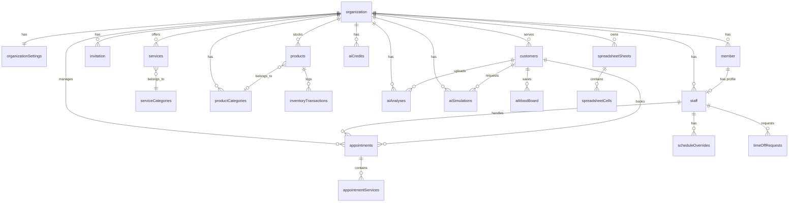

# Database Schema

> **Source:** `convex/schema.ts` (~575 lines) | **Validators:** `convex/lib/validators.ts` (~760 lines)
> Auth tables (`user`, `session`, `account`, `verification`, `jwks`) managed by Better Auth at `convex/betterAuth/schema.ts`.

## ER Diagram

```mermaid
erDiagram
    organization ||--|| organizationSettings : has
    organization ||--o{ member : has
    organization ||--o{ invitation : has
    organization ||--o{ staff : has
    organization ||--o{ services : offers
    organization ||--o{ customers : serves
    organization ||--o{ appointments : manages
    member ||--o| staff : "has profile"
    staff ||--o{ appointments : handles
    staff ||--o{ scheduleOverrides : has
    staff ||--o{ timeOffRequests : requests
    services }o--|| serviceCategories : belongs_to
    customers ||--o{ appointments : books
    appointments ||--o{ appointmentServices : contains
    organization ||--o{ productCategories : has
    organization ||--o{ products : stocks
    products }o--o| productCategories : belongs_to
    products ||--o{ inventoryTransactions : logs
    organization ||--o{ aiCredits : has
    organization ||--o{ aiAnalyses : has
    organization ||--o{ aiSimulations : has
    customers ||--o{ aiAnalyses : uploads
    customers ||--o{ aiSimulations : requests
    customers ||--o{ aiMoodBoard : saves
    organization ||--o{ spreadsheetSheets : owns
    spreadsheetSheets ||--o{ spreadsheetCells : contains
```

## User Profile Table

### `userProfile`
Cross-organization profile for registered users. One document per user (not per org).

- `userId: string` — Better Auth user ID (unique, index `by_user`)
- `avatarConfig?: any` — Full `AvatarConfig` JSON from react-nice-avatar (rendered client-side)
- `gender?: "male" | "female" | "unspecified"`
- `dateOfBirth?, phone?, hairType?, hairLength?, allergies?, allergyNotes?`
- `salonPreferences?: object` — Category-specific preferences (see `convex/schema.ts` for full structure)
- `emailReminders, marketingEmails, marketingConsent` (booleans) + consent timestamps
- `onboardingCompleted, onboardingCompletedAt?, onboardingDismissedAt?`
- `avatarUrl?: string` — **Legacy** (old Dicebear URL, no longer written)
- Indexes: `by_user`

## Core Tables

### `organization`
- `name, slug` (unique), `description?, logo?, salonType?: string[]` (multi-select, 34 types)
- Indexes: `slug`, `name`

### `organizationSettings`
- `organizationId` (1:1), `email?, phone?, website?, address?`
- `timezone?, currency?, locale?, businessHours?, bookingSettings?`
- `subscriptionStatus?` (active|trialing|past_due|canceling|canceled|unpaid|suspended|pending_payment)
- `subscriptionPlan?, polarSubscriptionId?, polarCustomerId?, trialEndsAt?, currentPeriodEnd?, gracePeriodEndsAt?, suspendedAt?, cancelledAt?, cancellationReason?, cancellationComment?`
- Indexes: `organizationId`, `by_polar_subscription`

### `member`
- `organizationId, userId, role: owner|staff`
- Indexes: `organizationId`, `userId`, `organizationId_userId`
- Owner (1 per org): full access. Staff: limited self-service.

### `invitation`
- `organizationId, email, name, role: staff, phone?, status: pending|accepted|expired|cancelled|rejected, invitedBy, expiresAt?`
- Indexes: `organizationId`, `email`, `organizationId_email`, `status`

### `staff`
- `userId, organizationId, memberId, name, email, phone?, imageUrl?, bio?`
- `status: active|inactive|pending`, `serviceIds?: array(id("services"))`, `defaultSchedule?`
- Indexes: `organizationId`, `userId`, `memberId`, `organizationId_userId`, `organizationId_status`, `organizationId_email`

## Services Tables

### `serviceCategories`
- `organizationId, name, description?, sortOrder` — Index: `by_organization`

### `services`
- `organizationId, categoryId?, name, description?, duration, price` (kuruş), `priceType, imageUrl?, sortOrder, isPopular, status, showOnline`
- Indexes: `by_organization`, `by_org_category`, `by_org_status`
- Soft-delete via status="inactive". Staff assignment via `staff.serviceIds`.

## Schedule Management Tables

### `scheduleOverrides`
- `staffId, organizationId, date, type: custom_hours|day_off|time_off, startTime?, endTime?, reason?`
- Indexes: `by_staff_date`, `by_org_date`

### `timeOffRequests`
- `staffId, organizationId, startDate, endDate, type: vacation|sick|personal|other`
- `status: pending|approved|rejected, reason?, rejectionReason?, approvedBy?, reviewedAt?`
- Indexes: `by_staff`, `by_org_status`

### `staffOvertime`
- `staffId, organizationId, date, startTime, endTime, reason?`
- Indexes: `by_staff_date`, `by_org_date`

## Customers & Appointments Tables

### `customers`
- `organizationId, userId?, name, email, phone` (Turkish format, unique per org)
- `accountStatus: guest|recognized|prompted|registered`
- Stats: `totalVisits, totalSpent, lastVisitDate?, noShowCount`
- `customerNotes?, staffNotes?, tags[], source, consents`
- Indexes: `by_organization`, `by_org_email`, `by_org_phone`, `by_user`, `by_org_status`
- Search: `searchIndex("search_customers")` on name

### `appointments`
- `organizationId, customerId, staffId, date, startTime, endTime` (minutes from midnight)
- `status: pending|confirmed|checked_in|in_progress|completed|cancelled|no_show`
- `source, confirmationCode, subtotal, discount?, total`
- Timestamps: `confirmedAt?, checkedInAt?, completedAt?, cancelledAt?, noShowAt?, rescheduledAt?`
- Cancel: `cancelledBy?: customer|staff|system, cancellationReason?`
- Reschedule: `rescheduleCount?, rescheduleHistory?`
- `notificationReminderSentAt?, confirmationSentAt?, customerNotes?, staffNotes?`
- Indexes: `by_organization`, `by_org_date`, `by_staff_date`, `by_customer`, `by_confirmation`, `by_org_status`, `by_status_date`

### `appointmentServices`
- `appointmentId, serviceId, serviceName, duration, price, staffId`
- Indexes: `by_appointment`, `by_service`

### `slotLocks`
- `organizationId, staffId, date, startTime, endTime, sessionId, expiresAt`
- 2-min TTL, cleaned by cron every 1 minute.

## Product & Inventory Tables

### `productCategories`
- `organizationId, name, description?, sortOrder, status` — Index: `by_org`

### `products`
- `organizationId, categoryId?, name, description?, sku?, brand?`
- `costPrice, sellingPrice` (kuruş), `imageStorageIds?, imageUrls?` (max 4), `supplierInfo?`
- `stockQuantity, lowStockThreshold?, status: active|inactive`
- Indexes: `by_org`, `by_org_category`, `by_org_status`
- Margin: `((sellingPrice - costPrice) / sellingPrice) * 100`, guarded on `sellingPrice > 0`

### `inventoryTransactions`
- `organizationId, productId, staffId?, type: restock|adjustment|waste`
- `quantity` (signed), `previousStock, newStock, note?, createdAt`
- Indexes: `by_product`, `by_org_date`

## Billing & Admin Tables

### `productBenefits`
- `polarProductId, benefits[]` — Index: `polarProductId`

### `adminActions`
- `action, performedBy, targetType, targetId?, details?, timestamp` — Index: `by_timestamp`

### `bannedUsers`
- `userId, bannedBy, reason?, bannedAt` — Index: `by_user_id`

## Spreadsheet Tables

### `spreadsheetSheets`
Freeform spreadsheet tabs per organization.

- `organizationId: Id<"organization">`
- `name: string` — Sheet display name
- `order: number` — Tab display order
- `columnCount?: number` — Default 10, max 52
- `rowCount?: number` — Default 20, max 5000
- `freezeRow?: number` — Rows frozen from top
- `freezeCol?: number` — Columns frozen from left
- `mergedRegions?: {startRow, startCol, endRow, endCol}[]`
- `conditionalFormats?: string` — JSON-serialized `CondFormatRule[]`
- Indexes: `by_org`

### `spreadsheetCells`
Sparse cell storage — only non-empty cells are persisted.

- `organizationId: Id<"organization">`
- `sheetId: Id<"spreadsheetSheets">`
- `cellRef: string` — A1-notation (e.g. `"B3"`)
- `value: string` — Raw value or formula string (prefixed `=`)
- `bold?, italic?, underline?: boolean`
- `align?: "left" | "center" | "right"`
- `fontSize?, fontFamily?, bgColor?, textColor?: string`
- `numberFormat?: string` — Format key (e.g. `"currency"`, `"percent"`)
- `validationRule?: string` — JSON-serialized `ValidationRule`
- Indexes: `by_sheet`, `by_org_sheet`

## AI Tables

### `aiCredits`
- `customerId? | organizationId?` (one must be set), `balance, updatedAt`
- Indexes: `by_customer`, `by_organization`

### `aiCreditTransactions`
- `creditId, type: purchase|usage|refund, amount, referenceType?, referenceId?, description?`
- Indexes: `by_credit`, `by_credit_type`

### `aiAnalyses`
- `customerId, organizationId, imageStorageId, status, result?, errorMessage?, creditTransactionId?`
- Indexes: `by_customer`, `by_org_status`

### `aiSimulations`
- `customerId, organizationId, originalImageId, resultImageId?, prompt, status, errorMessage?, creditTransactionId?`
- Indexes: `by_customer`, `by_org_status`

### `aiCareSchedules`
- `customerId, organizationId, recommendations[], nextCheckDate, creditTransactionId?`
- Indexes: `by_customer`, `by_org`, `by_next_check`

### `aiMoodBoard`
- `customerId, organizationId, items[]` — Indexes: `by_customer`, `by_org`

### `designCatalog`
- `organizationId, name, category, imageStorageId, thumbnailStorageId?, description?, tags[], salonType, status, sortOrder`
- Indexes: `by_org`, `by_org_category`

## Index Usage Guide

| Query Pattern | Index |
|---------------|-------|
| User profile by userId | `userProfile.by_user` |
| Org by slug | `organization.slug` |
| Members in org | `member.organizationId` |
| User's membership | `member.organizationId_userId` |
| Staff in org | `staff.organizationId` |
| Appointments by date | `appointments.by_org_date` |
| Staff schedule | `appointments.by_staff_date` |
| Customer by phone | `customers.by_org_phone` |
| Appointment by code | `appointments.by_confirmation` |
| Appointments by status+date | `appointments.by_status_date` |
| Subscription by Polar ID | `organizationSettings.by_polar_subscription` |
| Products in org | `products.by_org` |
| Products by category | `products.by_org_category` |
| Active products (public) | `products.by_org_status` |
| Inventory history | `inventoryTransactions.by_product` |
| Sheets in org | `spreadsheetSheets.by_org` |
| Cells in sheet | `spreadsheetCells.by_org_sheet` |
