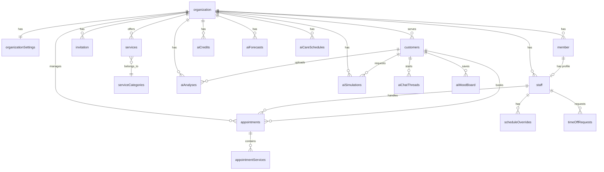

# Database Schema

> **Source:** `convex/schema.ts` (~533 lines) | **Validators:** `convex/lib/validators.ts` (~910 lines)
> Auth tables (`user`, `session`, `account`, `verification`, `jwks`) managed by Better Auth at `convex/betterAuth/schema.ts`.

## ER Diagram

## Implementation Status

| Table | Status | Milestone |
|-------|--------|-----------|
| organization, organizationSettings, member, invitation, staff | ✅ | M1 |
| serviceCategories, services | ✅ | M2A |
| scheduleOverrides, timeOffRequests, staffOvertime | ✅ | M2B |
| customers | ✅ | M2C |
| appointments, appointmentServices, slotLocks | ✅ | M3-M4 |
| auditLogs | ⚠️ Partial | Table exists, helpers pending |
| products, productCategories, inventoryTransactions | 📋 | M8+ |
| notifications | ✅ | M5 |
| productBenefits | ✅ | M6 |
| aiCredits, aiCreditTransactions | 📋 | M10A |
| aiAnalyses, aiSimulations, aiChatThreads, aiChatMessages, aiMoodBoard | 📋 | M10B |
| aiForecasts, aiCareSchedules | 📋 | M10C |

## Core Tables

### `organization`
- `name: string`, `slug: string` (unique, 3-30 chars), `description?: string`, `logo?: string`
- Indexes: `slug`, `name`

### `organizationSettings`
- `organizationId: id("organization")` (1:1)
- `email?, phone?, website?, address?: {street?, city?, state?, postalCode?, country?}`
- `timezone?: string` ("Europe/Istanbul"), `currency?: string`, `locale?: string`
- `businessHours?: {monday..sunday: {open, close, closed}}`
- `bookingSettings?: {minAdvanceBookingMinutes?, maxAdvanceBookingDays?, slotDurationMinutes?, bufferBetweenBookingsMinutes?, allowOnlineBooking?, cancellationPolicyHours?}`
- `subscriptionStatus?: active|trialing|past_due|canceled|unpaid|suspended|pending_payment`
- `subscriptionPlan?, polarSubscriptionId?, polarCustomerId?, trialEndsAt?, currentPeriodEnd?, gracePeriodEndsAt?, suspendedAt?, cancelledAt?`
- Indexes: `organizationId`, `by_polar_subscription` (on `polarSubscriptionId`)

### `member`
- `organizationId, userId: string, role: owner|admin|member`
- Indexes: `organizationId`, `userId`, `organizationId_userId`
- Owner (1 per org): full access + billing. Admin: operations. Member: own schedule only.

### `invitation`
- `organizationId, email, name, role: admin|member, phone?, status: pending|accepted|expired|cancelled|rejected, invitedBy, expiresAt?`
- Indexes: `organizationId`, `email`, `organizationId_email`, `status`

### `staff`
- `userId, organizationId, memberId` (links to member for role)
- Profile: `name, email, phone?, imageUrl?, bio?`
- `status: active|inactive|pending`
- `serviceIds?: array(id("services"))` - services staff can perform
- `defaultSchedule?: {monday..sunday: {start, end, available}}`
- Indexes: `organizationId`, `userId`, `memberId`, `organizationId_userId`, `organizationId_status`, `organizationId_email`

## Services Tables

### `serviceCategories`
- `organizationId, name, description?, sortOrder`
- Index: `by_organization`

### `services`
- `organizationId, categoryId?, name, description?, duration: number` (minutes)
- `price: number` (kuruş, 15000=₺150), `priceType: fixed|starting_from|variable`
- `imageUrl?, sortOrder, isPopular, status: active|inactive, showOnline`
- Indexes: `by_organization`, `by_org_category`, `by_org_status`
- Soft-delete via status="inactive". Staff assignment via `staff.serviceIds`.

## Schedule Management Tables

### `scheduleOverrides`
- `staffId, organizationId, date: string, type: custom_hours|day_off|time_off`
- `startTime?, endTime?: string` ("09:00"), `reason?`
- Indexes: `by_staff_date`, `by_org_date`
- `time_off` type auto-created when time-off request approved.

### `timeOffRequests`
- `staffId, organizationId, startDate, endDate, type: vacation|sick|personal|other`
- `status: pending|approved|rejected, reason?, rejectionReason?, approvedBy?, reviewedAt?`
- Indexes: `by_staff`, `by_org_status`

### `staffOvertime`
- `staffId, organizationId, date, startTime, endTime: string, reason?`
- Indexes: `by_staff_date`, `by_org_date`

## Customers & Appointments Tables

### `customers`
- `organizationId, userId?: string` (if registered)
- `name, email, phone` (Turkish format, unique per org)
- `accountStatus: guest|recognized|prompted|registered`
- `preferredStaffId?, notificationPreferences: {emailReminders}`
- Stats: `totalVisits, totalSpent, lastVisitDate?, noShowCount`
- `customerNotes?, staffNotes?, tags: array(string), source: online|walk_in|phone|staff|import`
- `consents: {dataProcessing, marketing, dataProcessingAt?, marketingAt?, withdrawnAt?}`
- Indexes: `by_organization`, `by_org_email`, `by_org_phone`, `by_user`, `by_org_status`
- Search: `searchIndex("search_customers")` on name, filter by organizationId

### `appointments`
- `organizationId, customerId, staffId`
- `date: string, startTime: number` (minutes from midnight), `endTime: number`
- `status: pending|confirmed|checked_in|in_progress|completed|cancelled|no_show`
- `source: online|walk_in|phone|staff, confirmationCode: string`
- Timestamps: `confirmedAt?, checkedInAt?, completedAt?, cancelledAt?`
- Cancel: `cancelledBy?: customer|staff|system, cancellationReason?`
- Pricing: `subtotal, discount?, total`
- Reschedule: `rescheduledAt?, rescheduleCount?, rescheduleHistory?: array({from/to dates+times, rescheduledBy, rescheduledAt})`
- `noShowAt?, customerNotes?, staffNotes?`
- Indexes: `by_organization`, `by_org_date`, `by_staff_date`, `by_customer`, `by_confirmation`, `by_org_status`

### `appointmentServices`
- `appointmentId, serviceId, serviceName, duration, price, staffId`
- Index: `by_appointment`

### `slotLocks`
- `organizationId, staffId, date, startTime, endTime, sessionId, expiresAt`
- Indexes: `by_staff_date`, `by_expiry`, `by_session`
- 2-min TTL, cleaned up by cron every 1 minute.

## Billing Tables

### `productBenefits` (M6)
- `polarProductId: string`, `benefits: array(string)`
- Index: `polarProductId`
- Synced from Polar API via `polarSync.triggerSync`

## AI Tables (M10)

### `aiCredits`
- `customerId?: id("customers")`, `organizationId?: id("organization")` (one must be set — separate pools)
- `balance: number` (current credit balance)
- `updatedAt: number` (last balance change timestamp)
- Indexes: `by_customer`, `by_organization`
- Two pools: customer credits (for photo analysis, simulation, chat) and org credits (for forecasts, post-visit, care schedule)

### `aiCreditTransactions`
- `creditId: id("aiCredits")`, `type: purchase|usage|refund`
- `amount: number` (positive for purchase/refund, negative for usage)
- `referenceType?: string` (e.g., "photo_analysis", "simulation", "chat", "forecast", "post_visit", "care_schedule")
- `referenceId?: string` (ID of the related resource)
- `description?: string`
- Indexes: `by_credit`, `by_credit_type`

### `aiAnalyses`
- `customerId: id("customers")`, `organizationId: id("organization")`
- `imageStorageId: id("_storage")`, `status: pending|processing|completed|failed`
- `result?: { faceShape, skinTone, skinUndertone, hairType, hairColor, hairDensity, hairCondition, recommendations[], productRecommendations[], salonServiceMatches[] }`
- `errorMessage?: string`, `creditTransactionId?: id("aiCreditTransactions")`
- Indexes: `by_customer`, `by_org_status`

### `aiSimulations`
- `customerId: id("customers")`, `organizationId: id("organization")`
- `originalImageId: id("_storage")`, `resultImageId?: id("_storage")`
- `prompt: string`, `status: pending|processing|completed|failed`
- `errorMessage?: string`, `creditTransactionId?: id("aiCreditTransactions")`
- Indexes: `by_customer`, `by_org_status`

### `aiChatThreads`
- `customerId: id("customers")`, `organizationId: id("organization")`
- `title: string`, `status: active|archived`
- Indexes: `by_customer`, `by_org_status`

### `aiChatMessages`
- `threadId: id("aiChatThreads")`, `role: user|assistant|system`
- `content: string`, `creditDeducted: boolean`
- Index: `by_thread`

### `aiForecasts`
- `organizationId: id("organization")`
- `type: weekly|monthly`
- `predictions: array({ date, predictedRevenue, predictedAppointments, confidence })`
- `insights: array({ type, title, description, impact? })`
- `expiresAt: number` (24h cache TTL)
- `creditTransactionId?: id("aiCreditTransactions")`
- Indexes: `by_org_type`, `by_expiry`

### `aiCareSchedules`
- `customerId: id("customers")`, `organizationId: id("organization")`
- `recommendations: array({ serviceType, recommendedDate, reason, priority })`
- `nextCheckDate: string` (YYYY-MM-DD)
- `creditTransactionId?: id("aiCreditTransactions")`
- Indexes: `by_customer`, `by_org`, `by_next_check`

### `aiMoodBoard`
- `customerId: id("customers")`, `organizationId: id("organization")`
- `items: array({ imageStorageId: id("_storage"), note?, source: analysis|simulation, savedAt: number })`
- Indexes: `by_customer`, `by_org`
- Free feature (no credit cost)

## Planned Tables

### `products` / `productCategories` / `inventoryTransactions` (M8+)
Schema exists in PRD. Products with pricing, inventory tracking, supplier info.

### `auditLogs`
- `organizationId, userId, action, resourceType, resourceId?, details?, ipAddress?, timestamp`
- Table exists, helper functions pending.

## Index Usage Guide

| Query Pattern | Index |
|---------------|-------|
| Org by slug | `organization.slug` |
| Members in org | `member.organizationId` |
| User's membership | `member.organizationId_userId` |
| Staff in org | `staff.organizationId` |
| Appointments by date | `appointments.by_org_date` |
| Staff schedule | `appointments.by_staff_date` |
| Customer by phone | `customers.by_org_phone` |
| Appointment by code | `appointments.by_confirmation` |
| Subscription by Polar ID | `organizationSettings.by_polar_subscription` |
| Product benefits | `productBenefits.polarProductId` |
| Customer AI credits | `aiCredits.by_customer` |
| Org AI credits | `aiCredits.by_organization` |
| Customer analyses | `aiAnalyses.by_customer` |
| Chat messages in thread | `aiChatMessages.by_thread` |
| Org forecasts | `aiForecasts.by_org_type` |
| Care schedule check | `aiCareSchedules.by_next_check` |
| Customer mood board | `aiMoodBoard.by_customer` |
