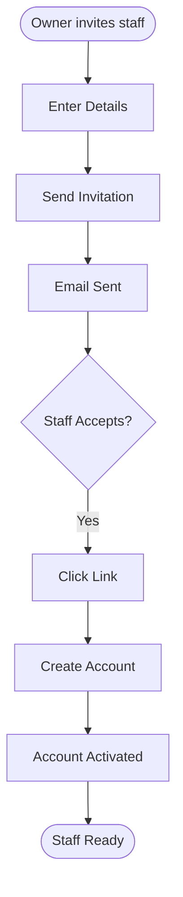
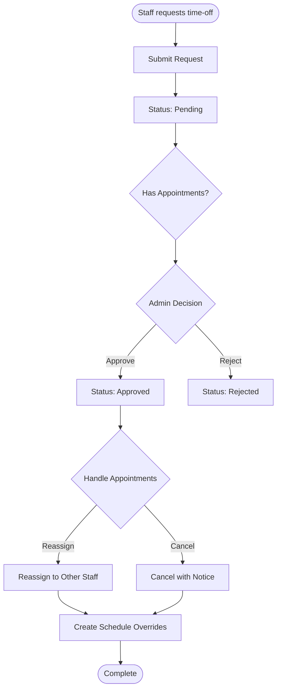
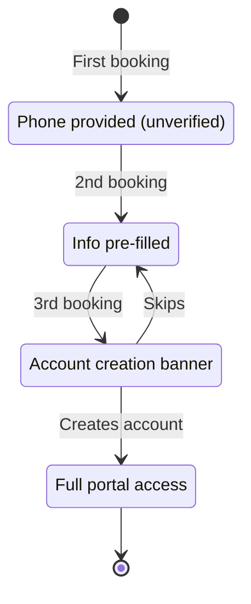
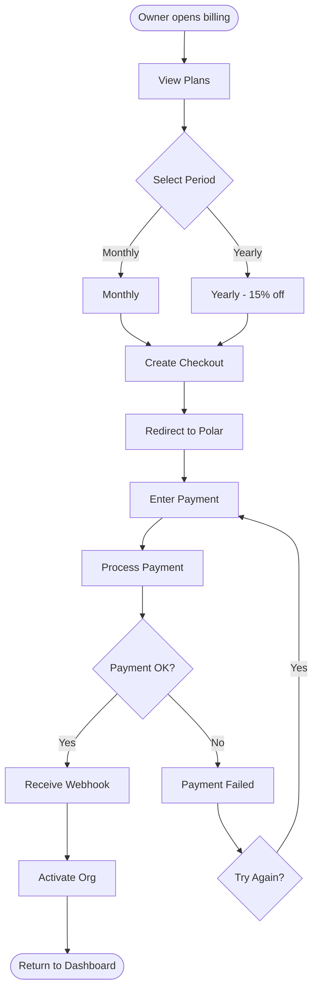
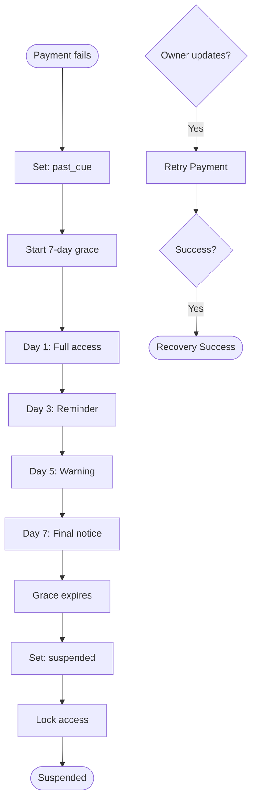
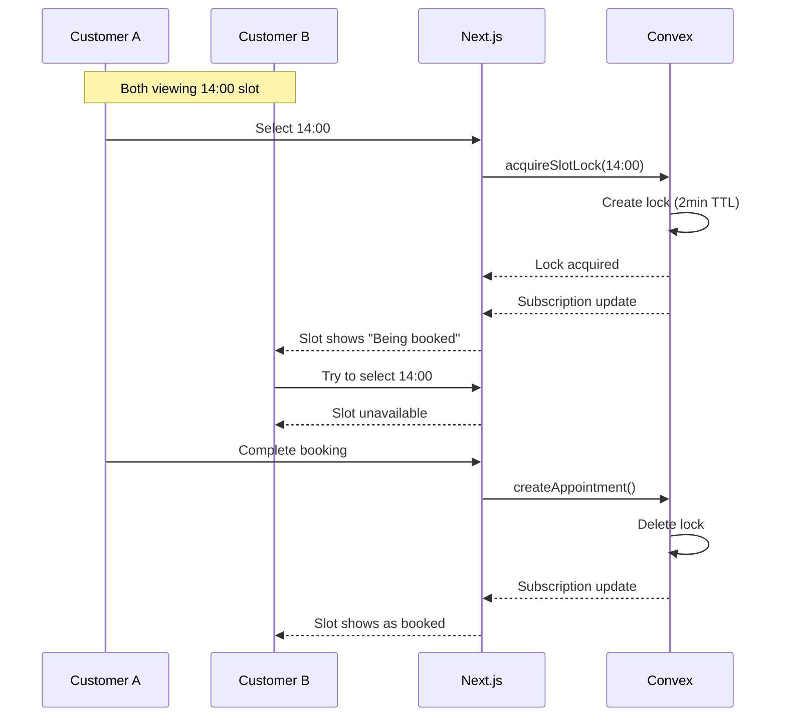

# Design System

> **Last Updated:** 2026-02-06
> **Status:** Active
> **UI Framework:** shadcn/ui (New York style)

This document defines the visual design language, component patterns, UI guidelines, and user flows for the Salon Management SaaS platform.

---

## Table of Contents

1. [Design Principles](#design-principles)
2. [Color System](#color-system)
3. [Typography](#typography)
4. [Spacing System](#spacing-system)
5. [Component Library](#component-library)
6. [Layout Patterns](#layout-patterns)
7. [Mobile Considerations](#mobile-considerations)
8. [Loading & Empty States](#loading--empty-states)
9. [Animation Guidelines](#animation-guidelines)
10. [Accessibility](#accessibility)
11. [User Flows](#user-flows)

---

## Design Principles

### 1. Clarity Over Decoration

Every element serves a purpose. Avoid decorative elements that don't improve usability or comprehension.

### 2. Consistent & Predictable

Users should be able to predict how interface elements behave based on their appearance and past interactions.

### 3. Mobile-First, Desktop-Ready

Design for mobile constraints first, then enhance for larger screens.

### 4. Accessible by Default

Follow WCAG 2.1 AA guidelines. Ensure color contrast, keyboard navigation, and screen reader support.

### 5. Turkish Market Fit

Respect cultural conventions: right-to-left currency (₺150), date format (DD.MM.YYYY), 24-hour time.

---

## Color System

### Brand Colors

```css
/* CSS Variables - defined in globals.css */
:root {
  /* Primary - CTAs, links, active states */
  --primary: oklch(0.55 0.15 250); /* Blue */
  --primary-foreground: oklch(0.98 0 0);

  /* Secondary - Secondary actions */
  --secondary: oklch(0.95 0.01 250);
  --secondary-foreground: oklch(0.20 0 0);

  /* Accent - Highlights, badges */
  --accent: oklch(0.92 0.04 250);
  --accent-foreground: oklch(0.20 0 0);

  /* Destructive - Errors, deletions */
  --destructive: oklch(0.55 0.20 25); /* Red */
  --destructive-foreground: oklch(0.98 0 0);

  /* Success - Confirmations */
  --success: oklch(0.60 0.15 145); /* Green */
  --success-foreground: oklch(0.98 0 0);

  /* Warning - Alerts, cautions */
  --warning: oklch(0.75 0.15 85); /* Amber */
  --warning-foreground: oklch(0.20 0 0);
}
```

### Semantic Color Usage

| Color | Use Case | Example |
|-------|----------|---------|
| Primary | CTAs, links, focus | "Book Now" button |
| Secondary | Secondary actions | "Cancel" button |
| Destructive | Delete, errors | "Delete appointment" |
| Success | Confirmations | "Booking confirmed" |
| Warning | Alerts | "Low inventory" |
| Muted | Disabled, placeholders | Disabled input |

### Appointment Status Colors

```typescript
const statusColors = {
  pending: "bg-yellow-100 text-yellow-800",
  confirmed: "bg-blue-100 text-blue-800",
  checked_in: "bg-green-100 text-green-800",
  in_progress: "bg-purple-100 text-purple-800",
  completed: "bg-gray-100 text-gray-800",
  cancelled: "bg-red-100 text-red-800 line-through",
  no_show: "bg-red-100 text-red-800",
};
```

---

## Typography

### Font Stack

```css
:root {
  --font-sans: "Inter", system-ui, -apple-system, sans-serif;
  --font-mono: "JetBrains Mono", monospace;
}
```

### Type Scale

| Name | Size | Weight | Use Case |
|------|------|--------|----------|
| `text-xs` | 12px | 400 | Labels, captions |
| `text-sm` | 14px | 400 | Secondary text, table cells |
| `text-base` | 16px | 400 | Body text (default) |
| `text-lg` | 18px | 500 | Subheadings |
| `text-xl` | 20px | 600 | Section titles |
| `text-2xl` | 24px | 600 | Page titles |
| `text-3xl` | 30px | 700 | Hero headings |

### Heading Hierarchy

```tsx
// Page title
<h1 className="text-2xl font-semibold tracking-tight">Dashboard</h1>

// Section title
<h2 className="text-xl font-semibold">Today's Appointments</h2>

// Subsection
<h3 className="text-lg font-medium">Upcoming</h3>

// Card title
<h4 className="text-base font-medium">Appointment Details</h4>
```

---

## Spacing System

### Base Scale

```
4px  → 1 (0.25rem)
8px  → 2 (0.5rem)
12px → 3 (0.75rem)
16px → 4 (1rem)
20px → 5 (1.25rem)
24px → 6 (1.5rem)
32px → 8 (2rem)
40px → 10 (2.5rem)
48px → 12 (3rem)
64px → 16 (4rem)
```

### Layout Spacing

| Context | Spacing | Class |
|---------|---------|-------|
| Page padding (mobile) | 16px | `p-4` |
| Page padding (desktop) | 24px | `p-6` |
| Card padding | 16px | `p-4` |
| Section gap | 32px | `space-y-8` |
| List item gap | 12px | `space-y-3` |
| Form field gap | 16px | `space-y-4` |
| Button group gap | 8px | `gap-2` |

---

## Component Library

### Buttons

```tsx
// Primary action
<Button>Book Appointment</Button>

// Secondary action
<Button variant="secondary">Cancel</Button>

// Destructive action
<Button variant="destructive">Delete</Button>

// Outline button
<Button variant="outline">Edit</Button>

// Ghost button (minimal)
<Button variant="ghost" size="icon">
  <MoreHorizontal className="h-4 w-4" />
</Button>

// Link button
<Button variant="link">Learn more</Button>
```

**Button Sizes:**
- `default` - Standard (h-10)
- `sm` - Compact (h-9)
- `lg` - Large CTA (h-11)
- `icon` - Square icon (h-10 w-10)

### Form Elements

```tsx
// Text input
<div className="space-y-2">
  <Label htmlFor="name">Name</Label>
  <Input id="name" placeholder="Enter your name" />
</div>

// With error
<div className="space-y-2">
  <Label htmlFor="email">Email</Label>
  <Input id="email" className="border-destructive" />
  <p className="text-sm text-destructive">Invalid email</p>
</div>

// Select
<Select>
  <SelectTrigger>
    <SelectValue placeholder="Select a service" />
  </SelectTrigger>
  <SelectContent>
    <SelectItem value="haircut">Haircut</SelectItem>
    <SelectItem value="coloring">Coloring</SelectItem>
  </SelectContent>
</Select>

// Textarea
<Textarea placeholder="Additional notes..." />

// Checkbox
<div className="flex items-center space-x-2">
  <Checkbox id="terms" />
  <Label htmlFor="terms">Accept terms</Label>
</div>
```

### Cards

```tsx
// Basic card
<Card>
  <CardHeader>
    <CardTitle>Today's Appointments</CardTitle>
    <CardDescription>12 appointments scheduled</CardDescription>
  </CardHeader>
  <CardContent>
    {/* Content */}
  </CardContent>
  <CardFooter>
    <Button>View All</Button>
  </CardFooter>
</Card>

// Compact card (for lists)
<Card className="p-4">
  <div className="flex justify-between items-center">
    <div>
      <p className="font-medium">14:30 - Haircut</p>
      <p className="text-sm text-muted-foreground">Mehmet Yilmaz</p>
    </div>
    <Badge>Confirmed</Badge>
  </div>
</Card>
```

### Badges

```tsx
// Status badges
<Badge variant="default">Active</Badge>
<Badge variant="secondary">Pending</Badge>
<Badge variant="destructive">Cancelled</Badge>
<Badge variant="outline">Draft</Badge>

// Custom status
<Badge className="bg-green-100 text-green-800">Confirmed</Badge>
<Badge className="bg-yellow-100 text-yellow-800">Checked In</Badge>
```

### Dialogs/Modals

```tsx
<Dialog>
  <DialogTrigger asChild>
    <Button>Open Dialog</Button>
  </DialogTrigger>
  <DialogContent className="sm:max-w-[425px]">
    <DialogHeader>
      <DialogTitle>Cancel Appointment</DialogTitle>
      <DialogDescription>
        Are you sure you want to cancel?
      </DialogDescription>
    </DialogHeader>
    <div className="py-4">
      {/* Form fields */}
    </div>
    <DialogFooter>
      <Button variant="outline">Keep</Button>
      <Button variant="destructive">Cancel</Button>
    </DialogFooter>
  </DialogContent>
</Dialog>
```

### Tables

```tsx
<Table>
  <TableHeader>
    <TableRow>
      <TableHead>Name</TableHead>
      <TableHead>Email</TableHead>
      <TableHead>Status</TableHead>
      <TableHead className="text-right">Actions</TableHead>
    </TableRow>
  </TableHeader>
  <TableBody>
    <TableRow>
      <TableCell className="font-medium">Ahmet Yilmaz</TableCell>
      <TableCell>ahmet@example.com</TableCell>
      <TableCell><Badge>Active</Badge></TableCell>
      <TableCell className="text-right">
        <Button variant="ghost" size="icon">
          <MoreHorizontal className="h-4 w-4" />
        </Button>
      </TableCell>
    </TableRow>
  </TableBody>
</Table>
```

---

## Layout Patterns

### Dashboard Layout

```
┌─────────────────────────────────────────────────────────────┐
│ Header (h-14)                                               │
├────────────┬────────────────────────────────────────────────┤
│            │                                                │
│  Sidebar   │  Main Content Area                            │
│  (w-64)    │  (flex-1)                                     │
│            │                                                │
│  - Nav     │  ┌─────────────────────────────────────────┐  │
│  - Links   │  │ Page Header                             │  │
│            │  └─────────────────────────────────────────┘  │
│            │                                                │
│            │  ┌─────────────────────────────────────────┐  │
│            │  │ Content                                 │  │
│            │  └─────────────────────────────────────────┘  │
└────────────┴────────────────────────────────────────────────┘
```

```tsx
export function DashboardLayout({ children }: { children: React.ReactNode }) {
  return (
    <div className="min-h-screen bg-background">
      <Header />
      <div className="flex">
        <Sidebar className="hidden md:flex w-64 border-r" />
        <main className="flex-1 p-6">{children}</main>
      </div>
    </div>
  );
}
```

### Booking Wizard Layout

```
┌─────────────────────────────────────────────────────────────┐
│ Salon Header                                                │
├─────────────────────────────────────────────────────────────┤
│                                                             │
│  Progress: [1]──[2]──[3]──[4]──[5]                         │
│                                                             │
│  ┌───────────────────────────────────────────────────────┐ │
│  │  Step Content (centered, max-w-2xl)                   │ │
│  └───────────────────────────────────────────────────────┘ │
│                                                             │
│  ┌───────────────────────────────────────────────────────┐ │
│  │ [Back]                                   [Continue]   │ │
│  └───────────────────────────────────────────────────────┘ │
└─────────────────────────────────────────────────────────────┘
```

### Calendar View Layout

```
┌─────────────────────────────────────────────────────────────┐
│ [< Prev]  March 2024  [Next >]    [Day][Week][Month]       │
├───────────┬─────────────────────────────────────────────────┤
│ Time      │ Staff columns (horizontal scroll)              │
├───────────┼─────────┬─────────┬─────────┬─────────┬────────┤
│ 09:00     │ █████   │         │         │ █████   │        │
│ 09:30     │ █████   │         │ ████    │         │        │
│ 10:00     │         │ ████    │ ████    │         │        │
└───────────┴─────────┴─────────┴─────────┴─────────┴────────┘
```

---

## Mobile Considerations

### Touch Targets

- Minimum: 44x44px
- Recommended spacing: 8px
- Interactive elements easily tappable

### Responsive Breakpoints

```css
sm: 640px   /* Small tablets */
md: 768px   /* Tablets */
lg: 1024px  /* Desktop */
xl: 1280px  /* Large desktop */
2xl: 1536px /* Extra large */
```

### Mobile Navigation

```tsx
// Bottom navigation (booking flow)
<nav className="fixed bottom-0 left-0 right-0 md:hidden border-t bg-background p-4">
  <div className="flex justify-between">
    <Button variant="outline" onClick={goBack}>Back</Button>
    <Button onClick={goNext}>Continue</Button>
  </div>
</nav>

// Hamburger menu (dashboard)
<Sheet>
  <SheetTrigger asChild>
    <Button variant="ghost" size="icon" className="md:hidden">
      <Menu className="h-5 w-5" />
    </Button>
  </SheetTrigger>
  <SheetContent side="left">
    <Navigation />
  </SheetContent>
</Sheet>
```

---

## Loading & Empty States

### Skeleton Components

```tsx
// Card skeleton
<Card className="p-4">
  <Skeleton className="h-4 w-3/4 mb-2" />
  <Skeleton className="h-4 w-1/2" />
</Card>

// List skeleton
{Array.from({ length: 5 }).map((_, i) => (
  <div key={i} className="flex items-center space-x-4">
    <Skeleton className="h-12 w-12 rounded-full" />
    <div className="space-y-2">
      <Skeleton className="h-4 w-[200px]" />
      <Skeleton className="h-4 w-[150px]" />
    </div>
  </div>
))}
```

### Loading Indicators

```tsx
// Inline spinner
<Button disabled>
  <Loader2 className="mr-2 h-4 w-4 animate-spin" />
  Loading...
</Button>

// Full page loading
<div className="flex h-screen items-center justify-center">
  <Loader2 className="h-8 w-8 animate-spin text-primary" />
</div>
```

### Empty States

```tsx
// No data
<div className="flex flex-col items-center justify-center py-12 text-center">
  <Calendar className="h-12 w-12 text-muted-foreground mb-4" />
  <h3 className="text-lg font-medium">No appointments today</h3>
  <p className="text-sm text-muted-foreground mb-4">
    Get started by creating your first appointment
  </p>
  <Button>Create Appointment</Button>
</div>

// Search no results
<div className="text-center py-8">
  <Search className="h-8 w-8 text-muted-foreground mx-auto mb-2" />
  <p className="text-muted-foreground">No results for "{query}"</p>
</div>
```

### Error States

```tsx
// Inline error
<Alert variant="destructive">
  <AlertCircle className="h-4 w-4" />
  <AlertTitle>Error</AlertTitle>
  <AlertDescription>
    Failed to load appointments. Please try again.
  </AlertDescription>
</Alert>

// Form error
<div className="text-sm text-destructive flex items-center gap-1">
  <AlertCircle className="h-4 w-4" />
  This field is required
</div>

// Full page error
<div className="flex flex-col items-center justify-center py-12">
  <AlertTriangle className="h-12 w-12 text-destructive mb-4" />
  <h3 className="text-lg font-medium">Something went wrong</h3>
  <p className="text-sm text-muted-foreground mb-4">
    We couldn't load this page.
  </p>
  <Button onClick={retry}>Retry</Button>
</div>
```

---

## Animation Guidelines

### Transitions

```css
/* Default transition */
transition: all 150ms ease;

/* For hover states */
transition: background-color 150ms ease, border-color 150ms ease;

/* For modals/sheets */
transition: transform 300ms ease, opacity 300ms ease;
```

### Motion Principles

1. **Keep it subtle** - Enhance, don't distract
2. **Use sparingly** - Reserve for meaningful changes
3. **Respect preferences** - Honor `prefers-reduced-motion`

```tsx
// Respect reduced motion
<div className="transition-transform motion-reduce:transition-none">
  {/* Content */}
</div>
```

---

## Accessibility

### Checklist

- [ ] Color contrast ratio ≥ 4.5:1 for text
- [ ] Focus indicators visible on all interactive elements
- [ ] All images have alt text
- [ ] Form inputs have associated labels
- [ ] Error messages announced to screen readers
- [ ] Keyboard navigation works throughout
- [ ] Skip links for main content
- [ ] ARIA labels where semantic HTML insufficient

---

## User Flows

### Customer Booking Flow

```mermaid
flowchart TB
    Start([Customer visits salon page])
    Browse[Browse Services]
    Select[Select Service(s)]
    Staff{Select Staff?}
    AnyStaff[Any Available]
    SpecificStaff[Choose Staff]
    DateTime[Select Date & Time]
    SlotAvailable{Slot Available?}
    Lock[Acquire Slot Lock]
    Info[Enter Contact Info]
    Confirm[Confirm Booking]
    Success([Booking Confirmed])

    Start --> Browse
    Browse --> Select
    Select --> Staff
    Staff -->|Yes| SpecificStaff
    Staff -->|No| AnyStaff
    SpecificStaff --> DateTime
    AnyStaff --> DateTime
    DateTime --> SlotAvailable
    SlotAvailable -->|No| DateTime
    SlotAvailable -->|Yes| Lock
    Lock --> Info
    Info --> Confirm
    Note right of Info: No OTP verification (deferred)
    Confirm --> Success
```

### Staff Onboarding Flow



### Time-Off Approval Flow



### Walk-in Quick Booking

```mermaid
flowchart TB
    Start([Customer walks in])
    OpenForm[Click "Walk-in"]
    Name[Enter Name]
    Phone[Enter Phone]
    Service[Select Service]
    Staff{Assign Staff?}
    AnyAvailable[Any Available]
    Specific[Choose Staff]
    Create[Create Appointment]
    Status[Status: checked_in]
    Done([Walk-in Registered])

    Start --> OpenForm
    OpenForm --> Name
    Name --> Phone
    Phone --> Service
    Service --> Staff
    Staff -->|No| AnyAvailable
    Staff -->|Yes| Specific
    AnyAvailable --> Create
    Specific --> Create
    Create --> Status
    Status --> Done
```

### Hybrid Account Journey



### Subscription Checkout Flow



### Failed Payment Recovery



### Real-Time Slot Update



---

## Navigation

- [← Back to README](./README.md)
- [Features →](./features.md)
