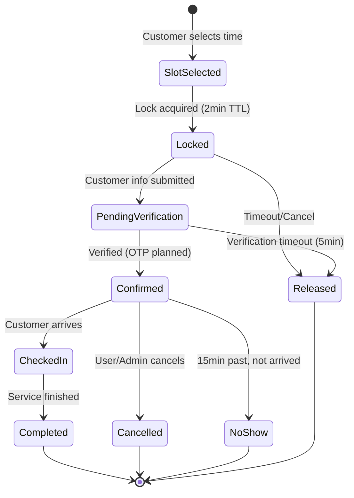
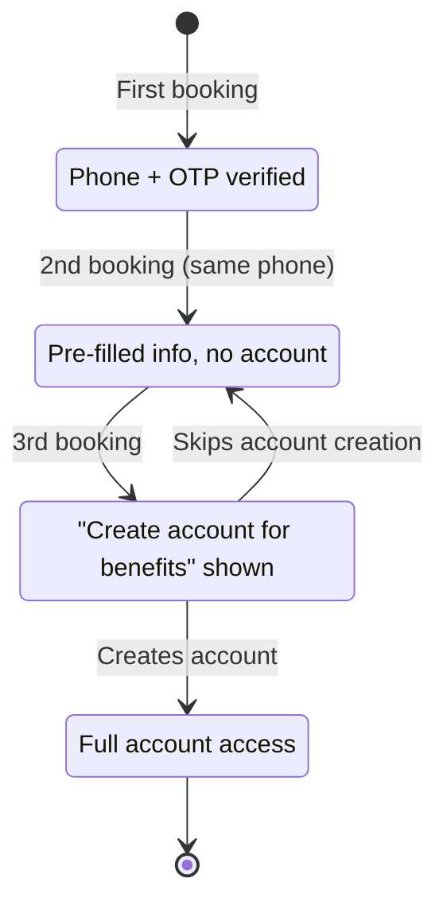
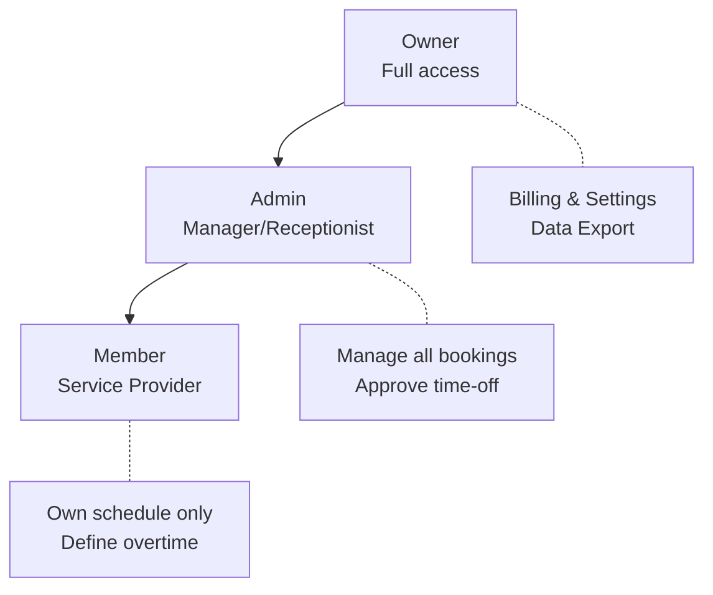
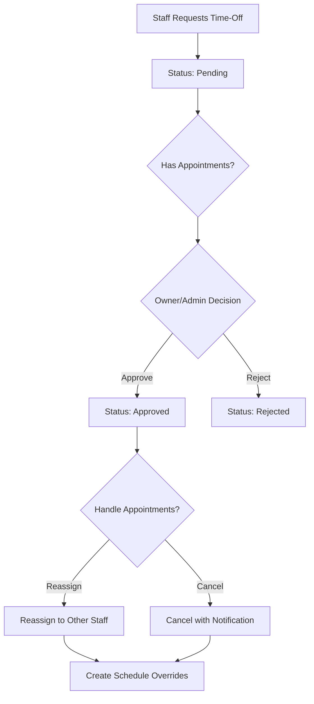
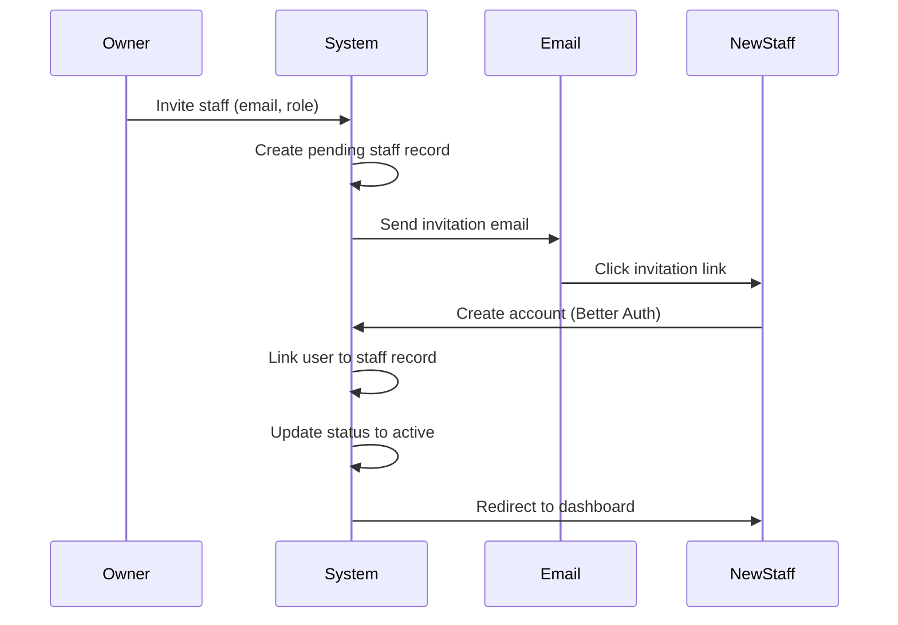

# Features

> **Last Updated:** 2026-02-06
> **Status:** Active

This document provides a comprehensive overview of all features in the Salon Management SaaS platform, organized by functional area.

---

## Table of Contents

1. [Admin Dashboard](#admin-dashboard)
2. [Core Booking Engine](#core-booking-engine)
3. [Customer Portal](#customer-portal)
4. [Staff Management](#staff-management)
5. [Products & Inventory](#products--inventory)

---

## Admin Dashboard

> **Priority:** P0 (MVP Must-Have)
> **Owner:** Frontend Team
> **Dependencies:** Multi-tenancy, Authentication, All Feature Modules

The admin dashboard is the central hub for salon owners and administrators to manage operations, view analytics, and configure settings.

### Key Features

| Feature | Description |
|---------|-------------|
| **Comprehensive Analytics** | Full business metrics dashboard |
| **Calendar UX** | Drag-drop + Modal editing combined |
| **Customer Search** | Advanced filters (visits, spending, tags) |
| **Real-time Updates** | Live data via Convex subscriptions |

### Dashboard Layout

```
┌─────────────────────────────────────────────────────────────────────────┐
│ [Logo] Salon Name                    🔔 Notifications    👤 Ahmet ▼    │
├────────────┬────────────────────────────────────────────────────────────┤
│            │                                                            │
│  📊 Dashboard  │  Welcome back, Ahmet!                                   │
│            │                                                            │
│  📅 Calendar│  ┌─────────────┐ ┌─────────────┐ ┌─────────────┐         │
│            │  │ Today's     │ │ This Week   │ │ Revenue     │         │
│  👥 Staff   │  │ Appointments│ │ Bookings    │ │ This Month  │         │
│            │  │     12      │ │     47      │ │   ₺8,450    │         │
│  💇 Services│  │ +2 walk-ins │ │ ↑15% vs LW  │ │ ↑8% vs LM   │         │
│            │  └─────────────┘ └─────────────┘ └─────────────┘         │
│  👤 Customers│                                                          │
│            │  Today's Schedule                            [View All]   │
│  📦 Products│  ┌─────────────────────────────────────────────────────┐ │
│            │  │ 09:00  Mehmet - Haircut (Ayşe) ✓ Checked In        │ │
│  📈 Reports │  │ 09:30  Empty                                        │ │
│            │  │ 10:00  Fatma - Coloring (Zeynep) ⏳ Confirmed       │ │
│  ⚙️ Settings│  │ 11:00  Ali - Haircut + Beard (Ayşe) ⏳ Confirmed   │ │
│            │  │ ...                                                  │ │
│            │  └─────────────────────────────────────────────────────┘ │
└────────────┴────────────────────────────────────────────────────────────┘
```

### Navigation Structure

```
Dashboard (Home)
├── Calendar
│   ├── Day View
│   ├── Week View
│   └── Month View
├── Staff
│   ├── List
│   ├── Add/Invite
│   └── [Staff Profile]
│       ├── Details
│       └── Schedule
├── Services
│   ├── List by Category
│   ├── Add Service
│   └── Manage Categories
├── Customers
│   ├── List
│   ├── Search
│   └── [Customer Profile]
├── Products (P1)
│   ├── Catalog
│   └── Inventory
├── Reports (P1)
│   ├── Revenue
│   ├── Staff Performance
│   └── Customer Analytics
├── Billing (P0)
│   ├── Subscription Status
│   ├── Payment History
│   └── Manage Subscription
└── Settings
    ├── Business Info
    ├── Working Hours
    ├── Booking Settings
    └── Team & Permissions
```

### Dashboard Widgets

#### Key Metrics Cards

**Today's Appointments**
```typescript
interface TodayMetrics {
  totalAppointments: number;
  completed: number;
  upcoming: number;
  noShows: number;
  walkins: number;
}
```

**Weekly Summary**
```typescript
interface WeeklyMetrics {
  totalBookings: number;
  percentChangeVsLastWeek: number;
  busiestDay: string;
  averagePerDay: number;
}
```

**Monthly Revenue**
```typescript
interface RevenueMetrics {
  total: number; // In TRY
  percentChangeVsLastMonth: number;
  averageTicket: number;
  topService: string;
}
```

#### Today's Schedule Widget

**Features:**
- Timeline view (scrollable)
- Color-coded status indicators
- Staff filter dropdown
- Quick actions (check-in, complete, cancel)
- Real-time updates

**Status Colors:**
| Status | Color | Icon |
|--------|-------|------|
| Confirmed | Blue | ⏳ |
| Checked In | Green | ✓ |
| In Progress | Yellow | ⚡ |
| Completed | Gray | ✔ |
| No Show | Red | ✗ |
| Cancelled | Strikethrough | — |

### Calendar Views

#### Day View

```
┌─────────────────────────────────────────────────────────────────────┐
│  < March 15, 2024 >                    [Day] [Week] [Month]        │
├───────────┬───────────────────────────────────────────────────────────┤
│           │ Ayşe          │ Zeynep        │ Fatma         │          │
├───────────┼───────────────┼───────────────┼───────────────┼          │
│ 09:00     │ ▓▓▓▓▓▓▓▓▓▓▓▓ │               │               │          │
│           │ Mehmet        │               │               │          │
│ 09:30     │               │               │               │          │
│ 10:00     │               │ ▓▓▓▓▓▓▓▓▓▓▓▓ │               │          │
│           │               │ Fatma K.      │               │          │
└───────────┴───────────────┴───────────────┴───────────────┴──────────┘
```

**Features:**
- Drag-and-drop rescheduling
- Click empty slot to create booking
- Click appointment to view/edit
- Time increments: 15 minutes

#### Calendar Interaction Model

The calendar supports both drag-drop for quick changes and modal dialogs for detailed editing.

**Drag-Drop Rescheduling:**
| Action | Behavior |
|--------|----------|
| Drag appointment | Ghost preview follows cursor |
| Drop on empty slot | Confirmation toast appears |
| Drop on occupied slot | "Slot busy" error shown |
| Cancel drag (Esc) | Returns to original position |

### Complete Metrics Catalog

| Category | Metric | Description |
|----------|--------|-------------|
| **Appointments** | Total Appointments | Count for period |
| | Completed | Successfully finished |
| | No-Shows | Customer didn't arrive |
| | Cancellations | Cancelled appointments |
| | Walk-ins | Same-day bookings |
| | Online Bookings | Customer self-booked |
| **Revenue** | Total Revenue | Sum of completed appointments |
| | Average Ticket | Revenue per appointment |
| | Revenue by Service | Breakdown by service type |
| | Revenue by Staff | Staff contribution |
| | Growth Rate | vs previous period |
| **Customers** | New Customers | First-time visitors |
| | Returning Customers | 2+ visits |
| | Retention Rate | % returning within 90 days |
| | Top Customers | By visits or spending |
| **Staff** | Utilization Rate | Booked hours / available hours |
| | Revenue per Staff | Individual contribution |
| | No-Show Rate | Per staff |
| **Booking** | Lead Time | Days between booking and appointment |
| | Cancellation Rate | % of bookings cancelled |
| | Peak Hours | Busiest time slots |

### Customer Search & Filters

```
┌─────────────────────────────────────────────────────────────────────┐
│ Customer Search                                         [Clear All] │
├─────────────────────────────────────────────────────────────────────┤
│ Name/Phone/Email: [________________________]  🔍                    │
│                                                                     │
│ Filters:                                                            │
│ ┌───────────────────┬───────────────────┬─────────────────────────┐ │
│ │ Last Visit        │ Total Visits      │ Total Spending          │ │
│ │ [Any          ▼]  │ [Any          ▼]  │ [Any              ▼]    │ │
│ │ • Today           │ • 1 visit         │ • Under ₺500            │ │
│ │ • Last 7 days     │ • 2-5 visits      │ • ₺500 - ₺2,000         │ │
│ │ • Last 30 days    │ • 6-10 visits     │ • ₺2,000 - ₺5,000       │ │
│ │ • Last 90 days    │ • 10+ visits      │ • Over ₺5,000           │ │
│ │ • Over 90 days    │                   │                         │ │
│ └───────────────────┴───────────────────┴─────────────────────────┘ │
│                                                                     │
│ ┌───────────────────┬───────────────────┬─────────────────────────┐ │
│ │ No-Show History   │ Tags              │ Booking Source          │ │
│ │ [Any          ▼]  │ [Select tags  ▼]  │ [Any              ▼]    │ │
│ └───────────────────┴───────────────────┴─────────────────────────┘ │
├─────────────────────────────────────────────────────────────────────┤
│ Showing 47 customers                    [Export CSV]  [Send Email]  │
└─────────────────────────────────────────────────────────────────────┘
```

**Filter Presets:**
| Preset | Filters Applied |
|--------|-----------------|
| **VIP Customers** | 10+ visits OR ₺5,000+ spending |
| **At Risk** | Last visit > 90 days, 3+ previous visits |
| **New This Month** | First visit in current month |
| **Frequent No-Shows** | 2+ no-shows recorded |

### Billing & Subscription Section

#### Subscription Status Widget

```
┌─────────────────────────────────────────────────────────┐
│ 💳 Subscription                              [Manage →] │
├─────────────────────────────────────────────────────────┤
│ Plan: Standard (Yearly)                                 │
│ Status: ● Active                                        │
│ Next billing: March 15, 2024 - ₺5,100                   │
└─────────────────────────────────────────────────────────┘
```

**Status Indicators:**
| Status | Color | Icon |
|--------|-------|------|
| Active | Green | ● |
| Past Due | Orange | ⚠️ |
| Grace Period | Red | ⚠️ |
| Canceled | Gray | — |

#### Subscription Warning Banner

When subscription is in trouble:

```
┌─────────────────────────────────────────────────────────────────────┐
│ ⚠️ Payment Failed - Your subscription will be suspended in 5 days  │
│ Please update your payment method to continue using the platform.  │
│                                                     [Update Payment]│
└─────────────────────────────────────────────────────────────────────┘
```

### Settings Pages

#### Business Info
- Salon name, description
- Logo upload
- Contact email, phone
- Address
- Social media links

#### Working Hours
Same interface as staff schedule editor, but for business-wide defaults.

#### Booking Settings

| Setting | Type | Default | Description |
|---------|------|---------|-------------|
| Advance booking window | Number | 30 days | How far ahead customers can book |
| Minimum notice | Number | 2 hours | Minimum time before appointment |
| Cancellation window | Number | 2 hours | How late customers can cancel |
| Slot duration | Number | 15 min | Booking slot increments |
| Allow staff selection | Boolean | true | Let customers choose staff |
| Require phone verification | Boolean | true | OTP for online bookings |

---

## Core Booking Engine

> **Priority:** P0 (MVP Must-Have)
> **Owner:** Backend Team
> **Dependencies:** Multi-tenancy, Staff Management, Service Catalog

The core booking engine handles appointment creation, slot availability calculation, conflict prevention, and the complete booking lifecycle.

### Key Business Rules

| Rule | Description |
|------|-------------|
| **Multi-Service** | Sequential execution, different staff per service allowed |
| **Cancellation** | Free cancellation up to 2 hours before appointment |
| **Walk-In** | Quick booking form (name + phone only) |
| **Pricing Display** | Starting price format ("₺150'den başlayan") |
| **Reminders** | Single email 24 hours before appointment |

### Booking State Machine



**State Definitions:**

| State | Description | Actions Available |
|-------|-------------|-------------------|
| `slot_selected` | User viewing slot | Select different slot |
| `locked` | Temporary hold (2min) | Complete booking, cancel |
| `pending_verification` | Awaiting OTP verification | Verify, resend, cancel |
| `confirmed` | Booking complete | Check-in, cancel, reschedule |
| `checked_in` | Customer arrived | Complete, no-show |
| `completed` | Service rendered | None (final) |
| `cancelled` | Appointment cancelled | None (final) |
| `no_show` | Customer didn't arrive | None (final) |

### Multi-Service Booking Model

#### Sequential Execution

Services are executed back-to-back, not in parallel.

```mermaid
gantt
    title Multi-Service Appointment Timeline
    dateFormat HH:mm
    axisFormat %H:%M
    section Booking
    Haircut (Staff A)     :a1, 14:00, 45m
    Hair Coloring (Staff B) :a2, after a1, 60m
    Blow Dry (Staff A)    :a3, after a2, 30m
```



#### Different Staff Per Service

Each service can be assigned to a different staff member:

```typescript
interface MultiServiceBooking {
  appointmentId: Id<"appointments">;
  totalDuration: number; // Sum of all durations
  services: Array<{
    serviceId: Id<"services">;
    staffId: Id<"staff">; // Can differ per service
    duration: number;
    startTime: number; // Calculated sequentially
    endTime: number;
    order: number; // 1, 2, 3...
  }>;
}
```

**Constraints:**
| Constraint | Rule |
|------------|------|
| Max services per booking | 5 |
| Gap between services | 0 minutes (back-to-back) |
| Staff overlap | Same staff can do multiple services if available |
| "Any Available" | System optimizes staff assignment |

### Slot Availability Algorithm

**Inputs:**
```typescript
interface SlotAvailabilityInput {
  organizationId: Id<"organizations">;
  date: string; // ISO date: "2024-03-15"
  serviceIds: Id<"services">[];
  staffId?: Id<"staff">; // Optional
}
```

**Algorithm:**
```
1. Calculate total duration from selected services
2. Get staff working hours for the date
3. For each staff member:
   a. Get their schedule
   b. Get existing appointments
   c. Get active locks
   d. Calculate available windows
4. Generate 15-minute slot options
5. Filter out slots extending past closing time
6. Return combined slots across eligible staff
```

### Slot Locking (Double-Booking Prevention)

```typescript
slotLocks: defineTable({
  organizationId: v.id("organization"),
  staffId: v.id("staff"),
  date: v.string(),
  startTime: v.number(), // minutes from midnight
  endTime: v.number(),
  sessionId: v.string(), // Browser session identifier
  expiresAt: v.number(), // Unix timestamp
})
```

**Lock Acquisition Flow:**
1. Check for existing appointment in slot
2. Check for existing lock (not ours)
3. Create or update lock (2-minute TTL)
4. Return lock ID and expiration

**Cleanup:** Cron job runs every minute to delete expired locks

### Booking Flow (Step-by-Step)

1. **Service Selection** - Multi-select with duration/price
2. **Staff Selection** - "Any Available" or specific staff
3. **Date Selection** - Calendar with availability indicators
4. **Time Selection** - 15-min increment grid
5. **Customer Information** - Name, phone, email, notes
6. **OTP Verification** - 6-digit code (planned Sprint 3-4)
7. **Confirmation** - Summary with confirmation number

### Walk-In Quick Booking

For walk-in customers, staff can create quick bookings with minimal information.

| Field | Required | Notes |
|-------|----------|-------|
| Customer Name | Yes | 2-100 characters |
| Phone Number | Yes | Turkish format (+90...) |
| Service(s) | Yes | Pre-selected or quick pick |
| Staff | Auto | Current staff or selected |
| Start Time | Auto | "Now" or next available |

**Walk-In vs Online:**
| Aspect | Online Booking | Walk-In |
|--------|----------------|---------|
| OTP Required | Yes | No (staff verified) |
| Initial Status | `confirmed` | `checked_in` |
| Reminder Email | Yes (24h before) | No |
| Created By | Customer | Staff |

### Price Display Format

Services with variable pricing display as starting prices:

```
"Saç Kesimi" - ₺150'den başlayan
"Hair Cut" - Starting from ₺150
```

**Display Guidelines:**
| Scenario | Display |
|----------|---------|
| Fixed price | `₺150` |
| Variable price | `₺150'den başlayan` / `Starting from ₺150` |
| Price range | `₺150 - ₺300` (optional) |
| Free service | `Ücretsiz` / `Free` |

### Reminder System

**Single Reminder Strategy (MVP):**
| Timing | Channel | Content |
|--------|---------|---------|
| 24 hours before | Email | Appointment details, reschedule link |

---

## Customer Portal

> **Priority:** P1 (MVP Nice-to-Have)
> **Owner:** Frontend Team
> **Dependencies:** Core Booking, Authentication

The customer portal provides self-service interface for booking, managing appointments, and profile maintenance.

### Key Business Rules

| Rule | Description |
|------|-------------|
| **Account Model** | Hybrid - Guest booking first, account prompt after 3+ visits |
| **Authentication** | Google OAuth (primary), Magic link (planned) |
| **Notes** | Separate customer notes and internal staff notes |
| **No-Show Policy** | Recorded only, no penalty or blocking |

### Hybrid Account Model



**Booking by Account State:**
| Visit | Account State | Experience |
|-------|---------------|------------|
| 1st | Guest | Book with phone + OTP, no account |
| 2nd | Recognized | Phone recognized, info pre-filled |
| 3rd+ | Prompted | Banner: "Create account to view history" |
| After signup | Registered | Full portal access, booking history |

### Public Pages (No Auth Required)

#### Salon Landing Page

- Salon name, logo, description
- Address with map
- Business hours
- Contact information
- Featured services preview
- "Book Now" CTA

#### Services Page

- Services grouped by category
- Each service: name, description, duration, price range
- Filter by category
- Search functionality
- "Book This" button per service

#### Booking Flow

Complete appointment booking wizard (see Core Booking section).

#### Booking Confirmation

- Confirmation number
- Appointment details
- Salon address with "Get Directions"
- "Add to Calendar" button (.ics)
- "Manage Booking" link
- QR code (future)

### Authenticated Pages (Login Required)

#### My Bookings

**Tabs:**
- Upcoming (default)
- Past
- Cancelled

**Per Appointment:**
- Date/time
- Service(s) with staff
- Status badge
- Actions: Reschedule, Cancel (if >2hrs before)

#### My Profile

**Editable Fields:**
| Field | Required | Notes |
|-------|----------|-------|
| Name | Yes | Display name |
| Email | Yes | Read-only (login identifier) |
| Phone | Yes | For reminders |
| Preferred Staff | No | Default in booking |
| Notification Preferences | - | Email reminders on/off |

### Customer Data Model

```typescript
customers: defineTable({
  organizationId: v.id("organization"),
  userId: v.optional(v.string()), // If registered (null for guests)

  // Contact
  name: v.string(),
  email: v.string(),
  phone: v.string(),
  phoneVerified: v.boolean(),

  // Account Status
  accountStatus: v.union(
    v.literal("guest"),      // No account
    v.literal("recognized"), // Returning guest
    v.literal("prompted"),   // Shown account prompt
    v.literal("registered")  // Has full account
  ),

  // Stats
  totalVisits: v.number(),
  totalSpent: v.number(),
  noShowCount: v.number(),

  // Notes - SEPARATE FIELDS
  customerNotes: v.optional(v.string()), // Customer-visible
  staffNotes: v.optional(v.string()), // Staff-only
})
```

### Customer Notes System

| Note Type | Who Can See | Who Can Edit | Purpose |
|-----------|-------------|--------------|---------|
| **Customer Notes** | Customer + Staff | Customer | Preferences, allergies |
| **Staff Notes** | Staff only | Staff | Internal observations |

### No-Show Policy

**Business Rule:** No-shows are recorded for information only - no automatic penalties.

```typescript
export const markNoShow = mutation({
  handler: async (ctx, args) => {
    // Update appointment status
    await ctx.db.patch(appointmentId, {
      status: "no_show",
    });

    // Increment counter (informational only)
    await ctx.db.patch(customerId, {
      noShowCount: customer.noShowCount + 1,
    });

    // NO automatic penalties:
    // - Customer is NOT blocked
    // - No deposit requirement
    // - No notification sent
  },
});
```

---

## Staff Management

> **Priority:** P0 (MVP Must-Have)
> **Owner:** Backend Team
> **Dependencies:** Multi-tenancy, Authentication

Staff management handles team member profiles, working schedules, service assignments, and role-based permissions.

### Key Business Rules

| Rule | Description |
|------|-------------|
| **Role System** | 3 roles only: Owner > Admin > Member |
| **Time-Off** | Requires approval from Owner or Admin |
| **Out-of-Hours** | Admin can book, Staff can define own overtime |
| **Schedule** | Staff views only own schedule |

### Role Hierarchy (3 Roles Only)



### Permission Matrix

| Permission | Owner | Admin | Member |
|------------|-------|-------|--------|
| View dashboard | ✅ | ✅ | ❌ |
| View all schedules | ✅ | ✅ | ❌ |
| View own schedule | ✅ | ✅ | ✅ |
| Create appointments (any staff) | ✅ | ✅ | ❌ |
| **Book outside business hours** | ✅ | ✅ | ❌ |
| **Define own overtime** | ✅ | ✅ | ✅ |
| Manage services | ✅ | ✅ | ❌ |
| **Approve/Reject time-off** | ✅ | ✅ | ❌ |
| **Request time-off** | ✅ | ✅ | ✅ |
| Manage settings | ✅ | ❌ | ❌ |
| Manage billing | ✅ | ❌ | ❌ |

### Staff Profile

```typescript
member: defineTable({
  organizationId: v.id("organization"),
  userId: v.string(), // Better Auth user ID
  role: v.union(
    v.literal("owner"),
    v.literal("admin"),
    v.literal("member")
  ),
})

staff: defineTable({
  userId: v.string(),
  organizationId: v.id("organization"),
  memberId: v.id("member"), // Links to member for role

  // Profile
  name: v.string(),
  email: v.string(),
  phone: v.optional(v.string()),
  imageUrl: v.optional(v.string()),
  bio: v.optional(v.string()),

  // Status
  status: v.union(
    v.literal("active"),
    v.literal("inactive"),
    v.literal("pending")
  ),

  // Services
  serviceIds: v.optional(v.array(v.string())),

  // Default schedule (time as strings "HH:MM")
  defaultSchedule: v.optional(v.object({
    monday: v.optional(v.object({
      start: v.string(),
      end: v.string(),
      available: v.boolean()
    })),
    // ... other days
  })),
})
```

> **Important:** Role is on `member` table, NOT on `staff` table. This separates organizational membership from professional profile.

### Staff Schedule System

**Three Schedule Types:**

1. **Default Schedule** - Weekly recurring hours
2. **Schedule Overrides** - Specific date exceptions
3. **Time-Off Requests** - Leave periods requiring approval

**Schedule Override Table:**
```typescript
scheduleOverrides: defineTable({
  staffId: v.id("staff"),
  organizationId: v.id("organization"),
  date: v.string(), // "2024-03-15"
  type: v.union(
    v.literal("custom_hours"), // Different hours
    v.literal("day_off"),      // Not working
    v.literal("time_off")      // Part of approved leave
  ),
  startTime: v.optional(v.number()), // Minutes from midnight
  endTime: v.optional(v.number()),
  reason: v.optional(v.string()),
})
```

**Time-Off Table:**
```typescript
timeOffRequests: defineTable({
  staffId: v.id("staff"),
  organizationId: v.id("organization"),
  startDate: v.string(),
  endDate: v.string(),
  type: v.union(
    v.literal("vacation"),
    v.literal("sick"),
    v.literal("personal"),
    v.literal("other")
  ),
  status: v.union(
    v.literal("pending"),
    v.literal("approved"),
    v.literal("rejected")
  ),
  approvedBy: v.optional(v.id("staff")),
  affectedAppointmentIds: v.optional(v.array(v.id("appointments"))),
})
```

### Time-Off Approval Workflow

**Business Rule:** All time-off requires approval from Owner or Admin.



**Time-Off States:**
| Status | Description | Actions Available |
|--------|-------------|-------------------|
| `pending` | Awaiting approval | Approve, Reject, Cancel |
| `approved` | Approved by Owner/Admin | None (final) |
| `rejected` | Rejected with reason | Staff can resubmit |

### Overtime & Out-of-Hours Booking

| Actor | Capability |
|-------|------------|
| **Admin/Owner** | Can create appointments outside business hours |
| **Staff** | Can define own overtime availability windows |

**Staff Overtime Definition:**
```typescript
staffOvertime: defineTable({
  staffId: v.id("staff"),
  organizationId: v.id("organization"),
  date: v.string(), // Specific date
  startTime: v.number(), // Minutes from midnight
  endTime: v.number(),
  note: v.optional(v.string()),
})
```

**Admin Out-of-Hours Booking:**
1. System shows warning: "Outside regular business hours"
2. Admin can proceed (override capability)
3. Appointment marked with `isOutsideHours: true`

### Schedule Resolution Algorithm

```typescript
function getStaffScheduleForDate(staffId: string, date: string): Schedule | null {
  // 1. Check for time-off
  const timeOff = await getTimeOff(staffId, date);
  if (timeOff?.status === "approved") return null;

  // 2. Check for override
  const override = await getOverride(staffId, date);
  if (override) {
    if (override.type === "day_off") return null;
    if (override.type === "custom_hours") {
      return { startTime: override.startTime, endTime: override.endTime };
    }
  }

  // 3. Fall back to default schedule
  const dayOfWeek = getDayOfWeek(date);
  const staff = await getStaff(staffId);
  return staff.defaultSchedule[dayOfWeek] || null;
}
```

### Staff Onboarding Flow



---

## Products & Inventory

> **Priority:** P1 (MVP Nice-to-Have)
> **Owner:** Backend Team
> **Dependencies:** Multi-tenancy, Admin Dashboard

The products module enables salons to showcase retail products as a digital catalog. The system does NOT process sales transactions.

### Business Model

**What This Module Does:**
| Feature | Description |
|---------|-------------|
| **Product Catalog** | Display products with images, descriptions, prices |
| **Customer Discovery** | Customers browse products on salon's page |
| **Inventory Tracking** | Full inventory management for internal use |
| **Staff Awareness** | Staff knows what's available to recommend |
| **Low Stock Alerts** | Notifications when reordering needed |

**What This Module Does NOT Do:**
| Excluded Feature | Reason |
|------------------|--------|
| ❌ Online Sales | Salons sell in-store, not online |
| ❌ Payment Processing | Transactions at salon's POS |
| ❌ E-commerce | No shopping cart, no online orders |

### MVP Scope

**In Scope (P1):**
- Product catalog display (public showcase)
- Product management (CRUD)
- **Full inventory tracking** with:
  - Purchase/cost price
  - Supplier information
  - Batch/lot tracking
  - Profit margin calculation
- Low stock alerts
- Product categorization

**Out of Scope (P2+):**
- Online product sales / e-commerce
- Purchase order management
- Barcode scanning
- Automatic reorder

### Product Data Model

```typescript
products: defineTable({
  organizationId: v.id("organization"),

  // Basic Info
  name: v.string(),
  description: v.optional(v.string()),
  brand: v.optional(v.string()),
  sku: v.optional(v.string()),
  barcode: v.optional(v.string()),

  // Pricing (Full Inventory)
  sellingPrice: v.number(), // Display price
  costPrice: v.number(), // Purchase price
  profitMargin: v.optional(v.number()), // Calculated

  // Supplier
  supplier: v.optional(v.object({
    name: v.string(),
    contactEmail: v.optional(v.string()),
    contactPhone: v.optional(v.string()),
  })),

  // Batch/Lot
  batchNumber: v.optional(v.string()),
  expirationDate: v.optional(v.string()),

  // Inventory
  stockQuantity: v.number(),
  lowStockThreshold: v.number(),
  reorderQuantity: v.optional(v.number()),

  // Display
  status: v.union(
    v.literal("active"),
    v.literal("inactive"),
    v.literal("out_of_stock")
  ),
  showOnShowcase: v.boolean(),
  featured: v.boolean(),
})

inventoryTransactions: defineTable({
  organizationId: v.id("organization"),
  productId: v.id("products"),
  type: v.union(
    v.literal("purchase"),    // From supplier
    v.literal("adjustment"),  // Manual correction
    v.literal("damaged"),     // Damaged/expired
    v.literal("used"),        // Used in services
    v.literal("sold"),        // Sold in-store
    v.literal("returned")     // To supplier
  ),
  quantity: v.number(), // +/- for adds/reductions
  previousStock: v.number(),
  newStock: v.number(),
  unitCost: v.optional(v.number()),
  staffId: v.id("staff"),
})
```

### Customer-Facing Showcase

```
┌─────────────────────────────────────────────────────────────────────┐
│ 🛍️ Our Products                                                     │
│ Discover premium products available at our salon.                  │
├─────────────────────────────────────────────────────────────────────┤
│ ⭐ Featured Products                                                │
│ ┌───────────────┐ ┌───────────────┐ ┌───────────────┐              │
│ │     [📷]      │ │     [📷]      │ │     [📷]      │              │
│ │ Kerastase     │ │ Olaplex No.3  │ │ Moroccan Oil  │              │
│ │ ₺450          │ │ ₺380          │ │ ₺520          │              │
│ │ [View Details]│ │ [View Details]│ │ [View Details]│              │
│ └───────────────┘ └───────────────┘ └───────────────┘              │
└─────────────────────────────────────────────────────────────────────┘
```

**Key UX Points:**
- No "Add to Cart" - showcase only
- Clear CTA to book or ask staff
- Stock status NOT shown to customers
- Clean, aspirational presentation

### Admin Product Management

```
┌─────────────────────────────────────────────────────────────────────┐
│ Products                                    [+ Add Product] [Export]│
├─────────────────────────────────────────────────────────────────────┤
│ □ │ Product         │ Category  │ Stock │ Cost  │ Price │ Margin │  │
│───┼─────────────────┼───────────┼───────┼───────┼───────┼────────┼  │
│ □ │ Kerastase Shamp │ Hair Care │ 🔴 3  │ ₺280  │ ₺450  │ 60.7%  │⋮ │
│ □ │ Olaplex No.3    │ Treatment │ 🟡 8  │ ₺250  │ ₺380  │ 52.0%  │⋮ │
│ □ │ Moroccan Oil    │ Treatment │ 🟢 25 │ ₺320  │ ₺520  │ 62.5%  │⋮ │
└─────────────────────────────────────────────────────────────────────┘

Legend: 🔴 Below threshold  🟡 Near threshold  🟢 In stock
```

**Features:**
- Stock quantity, cost price, margin columns
- Low stock indicators
- Quick filters
- Bulk actions
- Export to CSV

### Inventory Management

#### Stock Adjustment Modal

```
┌─────────────────────────────────────────────────────────────────────┐
│ Stock Adjustment: Kerastase Shampoo                       [Close]   │
├─────────────────────────────────────────────────────────────────────┤
│ Current Stock: 3 units                                             │
│                                                                     │
│ Transaction Type:                                                   │
│ ● Purchase (received from supplier)                                │
│ ○ Sold (recorded in-store sale)                                    │
│ ○ Adjustment (inventory correction)                                │
│                                                                     │
│ Quantity Change: [+__10__] units                                   │
│ New Stock Will Be: 13 units                                        │
│                                                                     │
│ Unit Cost: [₺__280__]                                              │
│ Batch Number: [__LOT-2024-03__]                                    │
│                                                                     │
│ [Cancel]                                    [Save Transaction]      │
└─────────────────────────────────────────────────────────────────────┘
```

#### Low Stock Alerts

**Dashboard Widget:**
```
┌─────────────────────────────────────────────────────────────────────┐
│ ⚠️ Low Stock Alert                                       [View All] │
├─────────────────────────────────────────────────────────────────────┤
│ 🔴 Kerastase Shampoo         │ 3 left  │ Min: 5  │ [Record Stock]  │
│ 🔴 Olaplex No.3              │ 2 left  │ Min: 5  │ [Record Stock]  │
└─────────────────────────────────────────────────────────────────────┘
```

**Email Alert:**
```
Subject: Low Stock Alert - 3 Products Need Attention

Hi Ahmet,

The following products are running low:

🔴 Critical (Below Threshold):
• Kerastase Shampoo - 3 units (threshold: 5)
• Olaplex No.3 - 2 units (threshold: 5)

Log in to record new stock: [Dashboard Link]
```

### Profit Margin Calculation

```
Profit Margin (%) = ((Selling Price - Cost Price) / Cost Price) × 100
```

| Product | Cost | Selling | Margin | Health |
|---------|------|---------|--------|--------|
| Kerastase | ₺280 | ₺450 | 60.7% | 🟢 Good |
| Premium Serum | ₺400 | ₺500 | 25.0% | 🟡 Low |
| Discount Item | ₺100 | ₺90 | -10.0% | 🔴 Loss |

**Margin Health Indicators:**
- 🟢 Good: ≥40% margin
- 🟡 Low: 20-39% margin
- 🔴 Loss: <20% or negative

---

## Navigation

- [← Back to README](./README.md)
- [API Reference →](./api-reference.md)
