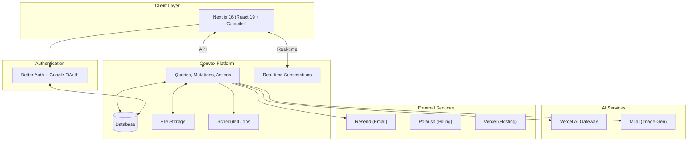

# System Architecture

## Architecture Overview



## Tech Stack

| Layer | Technologies |
|-------|-------------|
| Frontend | Next.js 16, React 19 + Compiler, TypeScript 5.x, Tailwind CSS v4, shadcn/ui, TanStack Form + Zod |
| Backend | Convex (DB, functions, real-time, file storage, crons, search indexes), convex-helpers (RLS, triggers, validators) |
| Auth | Better Auth + @convex-dev/better-auth, Google OAuth |
| AI | `ai` (v6+), `@ai-sdk/react`, `@fal-ai/client`, Vercel AI Gateway (multi-provider: GPT-4o vision, Claude chat, Gemini Flash forecast) |
| External | Polar.sh (billing), Resend (email), React Email (templates), Sentry (monitoring), Vercel (hosting) |
| Tools | Bun (package manager), Biome (linter/formatter) |

## Multi-Tenancy

- Every table includes `organizationId` for tenant isolation
- Custom function wrappers (`orgQuery`, `orgMutation`) auto-inject organizationId and verify membership
- URL structure: `/:slug/dashboard`, `/:slug/book` (public)
- Terminology: `organization` in code, `salon` in UI, `tenant` in architecture

## Auth & Authorization

Custom wrappers in `convex/lib/functions.ts` with progressive access levels:

| Wrapper | Auth | Context Added |
|---------|------|---------------|
| `publicQuery/Mutation` | None | — |
| `authedQuery/Mutation` | Required | `ctx.user` |
| `orgQuery/Mutation` | Required + membership | `ctx.user, organizationId, member, staff` |
| `ownerQuery/Mutation` | Required + owner only | Same + owner check |
| `superAdminQuery/Mutation` | Required + env email | `ctx.user, isSuperAdmin` |

**ErrorCode enum:** UNAUTHENTICATED, FORBIDDEN, OWNER_REQUIRED, SUPER_ADMIN_REQUIRED, NOT_FOUND, ALREADY_EXISTS, VALIDATION_ERROR, INVALID_INPUT, RATE_LIMITED, INTERNAL_ERROR

## Rate Limiting

`convex/lib/rateLimits.ts` using `@convex-dev/rate-limiter`. Two strategies: token bucket (allows bursts) and fixed window (strict limits).

| Operation | Limit | Key |
|-----------|-------|-----|
| createInvitation | 20/day | org |
| resendInvitation | 3/hour | invitation |
| createOrganization | 3/day (fixed) | user |
| addMember | 10/hour | org |
| createService | 20/hour | org |
| createBooking | 10/hour | org |
| cancelBooking | 3/hour | user |
| rescheduleBooking | 3/hour | org |
| createScheduleOverride | 30/day | org |
| createTimeOffRequest | 5/day | staff |
| createOvertime | 10/day | staff |
| createCustomer | 30/hour | org |
| cancelSubscription | 3/hour | org |
| suspendOrganization | 10/hour | superadmin |
| deleteOrganization | 5/day | superadmin |
| banUser | 10/hour | superadmin |
| acquireSlotLock | 10/min | user |
| confirmationCodeLookup | 10/min | org+code |
| deleteAccount | 1/day | user |
| aiPhotoAnalysis | 5/hour | customer |
| aiSimulation | 3/hour | customer |
| aiChat | 30/hour | customer |
| aiForecast | 5/day | org |
| aiCreditPurchase | 5/hour | customer/org |

## Project Structure

```
convex/
├── _generated/           # Auto-generated (don't edit)
├── betterAuth/           # Auth component
├── lib/
│   ├── functions.ts      # Custom wrappers + ErrorCode
│   ├── validators.ts     # Return validators (~910 lines)
│   ├── rateLimits.ts     # Rate limit config
│   ├── scheduleResolver.ts # Schedule resolution
│   ├── confirmation.ts   # Confirmation codes
│   ├── dateTime.ts       # Date/time utils
│   ├── phone.ts          # Turkish phone validation
│   ├── ics.ts            # ICS calendar file generator
│   ├── relationships.ts  # DB relationship helpers
│   └── rls.ts            # RLS helpers
├── schema.ts             # Database schema (~533 lines)
├── appointments.ts       # ~1,700 lines
├── customers.ts          # ~610 lines
├── services.ts           # ~411 lines
├── staff.ts (~447 lines), members.ts, organizations.ts, invitations.ts
├── slots.ts, slotLocks.ts, crons.ts
├── scheduleOverrides.ts, timeOffRequests.ts, staffOvertime.ts
├── serviceCategories.ts, appointmentServices.ts
├── polar.ts, polarActions.ts, polarSync.ts, subscriptions.ts, subscriptions_helpers.ts
├── analytics.ts, reports.ts (~603 lines), notifications.ts
├── email.tsx (~380 lines), email_helpers.ts
├── aiAnalysis.ts, aiSimulations.ts, aiChat.ts
├── aiCredits.ts, aiForecasts.ts, aiCareSchedules.ts, aiMoodBoard.ts
├── aiActions.tsx              # "use node" - external AI calls (Gateway, fal.ai)
├── lib/aiConstants.ts         # Credit costs, model configs, provider routing
├── admin.ts (~705 lines)      # SuperAdmin platform management
├── files.ts, users.ts, auth.ts, http.ts
└── auth.config.ts, convex.config.ts

src/
├── app/
│   ├── (auth)/sign-in/        # Sign-in page
│   ├── [slug]/(authenticated)/ # Dashboard, appointments, customers, staff, services, reports, settings
│   ├── [slug]/(public)/        # Book, appointment/[code]
│   ├── onboarding/             # Org creation wizard
│   ├── dashboard/              # Redirect to active org
│   └── page.tsx                # Salon directory (/)
├── components/ui/              # shadcn/ui (56+ components)
├── hooks/
├── lib/                        # auth-client, auth-server, utils
├── modules/
│   ├── booking/                # 19 files (~1,824 lines)
│   ├── customers/              # 10 files
│   ├── services/               # 11 files
│   ├── staff/                  # 12 files
│   ├── organization/           # 4 files (Provider, switcher, hooks)
│   ├── billing/                # 9 components + 1 hook (subscription, plans, cancel, reactivate, plan change, billing history)
│   ├── dashboard/              # 5 files (stats, charts)
│   ├── calendar/               # 15 files (day/week views, DnD, staff filter, reschedule, status actions)
│   ├── notifications/          # 4 files (bell, panel)
│   ├── reports/                # 16 files (revenue, staff, customer reports, CSV export)
│   ├── ai/
│   │   ├── customer/components/  # PhotoAnalysisView, SimulationView, StyleChatView, MoodBoardView, CareScheduleView
│   │   ├── organization/components/ # RevenueForecastView, OrgAICreditManager
│   │   ├── components/           # CreditBalance, CreditPurchaseDialog, AIPageLayout
│   │   └── lib/                  # constants, types
│   ├── settings/               # 8 files
│   ├── auth/                   # 11 files
│   └── convex/                 # ConvexClientProvider
├── admin/                      # Admin panel layout + 4 pages (Dashboard, Organizations, Users, Action Log)
└── middleware.ts               # Auth middleware
```

## Route Structure

| Route | Auth | Description |
|-------|------|-------------|
| `/` | Public | Salon directory |
| `/sign-in` | Public | Sign-in |
| `/onboarding` | Auth | Org creation |
| `/:slug/dashboard` | Auth+Org | Dashboard |
| `/:slug/appointments` | Auth+Org | Appointment management |
| `/:slug/customers` | Auth+Org | Customer database |
| `/:slug/staff` | Auth+Org | Staff management |
| `/:slug/services` | Auth+Org | Service catalog |
| `/:slug/reports` | Auth+Org (admin) | Reports & analytics |
| `/:slug/settings` | Auth+Org | Org settings |
| `/:slug/billing` | Auth+Org | Subscription management |
| `/:slug/ai` | Public | Customer AI features (photo analysis, simulation, chat, mood board, care schedule) |
| `/:slug/ai-insights` | Auth+Org (owner) | Organization AI features (revenue forecast, credit management) |
| `/:slug/book` | Public | Public booking |
| `/:slug/appointment/:code` | Public | Appointment lookup |
| `/admin` | Auth+SuperAdmin | Platform management (stats, orgs, users, action log) |

## Deployment

| Environment | Frontend | Backend |
|-------------|----------|---------|
| Development | localhost:3000 | Convex dev |
| Preview | Vercel preview | Convex dev |
| Production | Custom domain | Convex production |

CI/CD: Push to GitHub → Vercel builds Next.js → Convex deploys functions.

## SuperAdmin Platform

**Access model:** Environment-based via `SUPER_ADMIN_EMAILS` env var. Comma-separated list of email addresses.

**Permission model:**
- SuperAdmins bypass org membership and owner role checks via `resolveOrgContext` helper
- Synthetic owner member created at runtime for any org access
- Ban check in `getAuthUser` — banned users blocked at auth layer before any function execution
- All platform actions logged to `adminActions` audit table

**Capabilities:**
1. **Platform Stats**: Total orgs, active orgs, total users, appointments, revenue
2. **Organization Management**: List, suspend, unsuspend, delete orgs, manual subscription updates
3. **User Management**: List users, ban/unban accounts
4. **Action Log**: Full audit trail of all SuperAdmin actions with timestamp, target, details

**Implementation:**
- Backend: `convex/admin.ts` (~705 lines) - 11 functions
- Frontend: `/admin` layout with 4 pages (Dashboard, Organizations, Users, Action Log)
- Impersonation banner: Red warning shown when SuperAdmin views non-member org
- Dashboard button: Shield icon shown in header for SuperAdmin access

**Security:**
- Rate limits: suspend (10/hr), delete (5/day), ban (10/hr)
- Cascading deletes: deleteOrganization removes all related data
- Audit trail: All actions logged with performedBy, targetType, targetId, details
