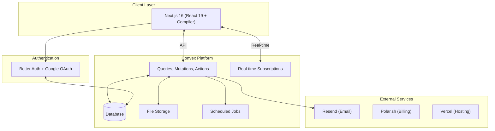

# System Architecture

## Architecture Overview



## Tech Stack

| Layer | Technologies |
|-------|-------------|
| Frontend | Next.js 16, React 19 + Compiler, TypeScript 5.x, Tailwind CSS v4, shadcn/ui, TanStack Form + Zod |
| Backend | Convex (DB, functions, real-time, file storage, crons, search indexes), convex-helpers (RLS, triggers, validators) |
| Auth | Better Auth + @convex-dev/better-auth, Google OAuth |
| External | Polar.sh (billing), Resend (email), React Email (templates), Sentry (monitoring), Vercel (hosting) |
| Tools | Bun (package manager), Biome (linter/formatter) |

## Multi-Tenancy

- Every table includes `organizationId` for tenant isolation
- Custom function wrappers (`orgQuery`, `orgMutation`) auto-inject organizationId and verify membership
- URL structure: `/:slug/dashboard`, `/:slug/book` (public)
- Terminology: `organization` in code, `salon` in UI, `tenant` in architecture

## Auth & Authorization

Custom wrappers in `convex/lib/functions.ts` with progressive access levels:

| Wrapper | Auth | Context Added |
|---------|------|---------------|
| `publicQuery/Mutation` | None | — |
| `maybeAuthedQuery` | Optional | `ctx.user \| null` |
| `authedQuery/Mutation` | Required | `ctx.user` |
| `orgQuery/Mutation` | Required + membership | `ctx.user, organizationId, member, staff` |
| `adminQuery/Mutation` | Required + admin/owner | Same + role check |
| `ownerQuery/Mutation` | Required + owner only | Same + owner check |

**ErrorCode enum:** UNAUTHENTICATED, FORBIDDEN, ADMIN_REQUIRED, OWNER_REQUIRED, NOT_FOUND, ALREADY_EXISTS, VALIDATION_ERROR, INVALID_INPUT, RATE_LIMITED, INTERNAL_ERROR

## Rate Limiting

`convex/lib/rateLimits.ts` using `@convex-dev/rate-limiter`. Two strategies: token bucket (allows bursts) and fixed window (strict limits).

| Operation | Limit | Key |
|-----------|-------|-----|
| createInvitation | 20/day | org |
| resendInvitation | 3/hour | invitation |
| createOrganization | 3/day (fixed) | user |
| addMember | 10/hour | org |
| createService | 20/hour | org |
| createBooking | 10/hour | org |
| cancelBooking | 5/hour | org |
| rescheduleBooking | 3/hour | org |
| createScheduleOverride | 30/day | org |
| createTimeOffRequest | 5/day | staff |
| createOvertime | 10/day | staff |
| createCustomer | 30/hour | org |

## Project Structure

```
convex/
├── _generated/           # Auto-generated (don't edit)
├── betterAuth/           # Auth component
├── lib/
│   ├── functions.ts      # Custom wrappers + ErrorCode
│   ├── validators.ts     # Return validators (~730 lines)
│   ├── rateLimits.ts     # Rate limit config
│   ├── scheduleResolver.ts # Schedule resolution
│   ├── confirmation.ts   # Confirmation codes
│   ├── dateTime.ts       # Date/time utils
│   ├── phone.ts          # Turkish phone validation
│   ├── relationships.ts  # DB relationship helpers
│   └── rls.ts            # RLS helpers
├── schema.ts             # Database schema
├── appointments.ts       # ~1,200 lines
├── customers.ts          # ~600 lines
├── services.ts           # ~350 lines
├── staff.ts, members.ts, organizations.ts, invitations.ts
├── slots.ts, slotLocks.ts, crons.ts
├── scheduleOverrides.ts, timeOffRequests.ts, staffOvertime.ts
├── serviceCategories.ts, appointmentServices.ts
├── files.ts, users.ts, auth.ts, http.ts
└── auth.config.ts, convex.config.ts

src/
├── app/
│   ├── (auth)/sign-in/        # Sign-in page
│   ├── [slug]/(authenticated)/ # Dashboard, appointments, customers, staff, services, settings
│   ├── [slug]/(public)/        # Book, appointment/[code]
│   ├── onboarding/             # Org creation wizard
│   ├── dashboard/              # Redirect to active org
│   └── page.tsx                # Salon directory (/)
├── components/ui/              # shadcn/ui (56+ components)
├── hooks/
├── lib/                        # auth-client, auth-server, utils
├── modules/
│   ├── booking/                # 16 files, ~1,800 lines
│   ├── customers/              # 7 components
│   ├── services/               # 9 components
│   ├── staff/                  # 10+ components
│   ├── organization/           # Provider, switcher, hooks
│   ├── settings/               # Settings forms
│   ├── auth/                   # Auth components
│   └── convex/                 # ConvexClientProvider
└── middleware.ts               # Auth middleware
```

## Route Structure

| Route | Auth | Description |
|-------|------|-------------|
| `/` | Public | Salon directory |
| `/sign-in` | Public | Sign-in |
| `/onboarding` | Auth | Org creation |
| `/:slug/dashboard` | Auth+Org | Dashboard |
| `/:slug/appointments` | Auth+Org | Appointment management |
| `/:slug/customers` | Auth+Org | Customer database |
| `/:slug/staff` | Auth+Org | Staff management |
| `/:slug/services` | Auth+Org | Service catalog |
| `/:slug/settings` | Auth+Org | Org settings |
| `/:slug/book` | Public | Public booking |
| `/:slug/appointment/:code` | Public | Appointment lookup |

## Deployment

| Environment | Frontend | Backend |
|-------------|----------|---------|
| Development | localhost:3000 | Convex dev |
| Preview | Vercel preview | Convex dev |
| Production | Custom domain | Convex production |

CI/CD: Push to GitHub → Vercel builds Next.js → Convex deploys functions.
