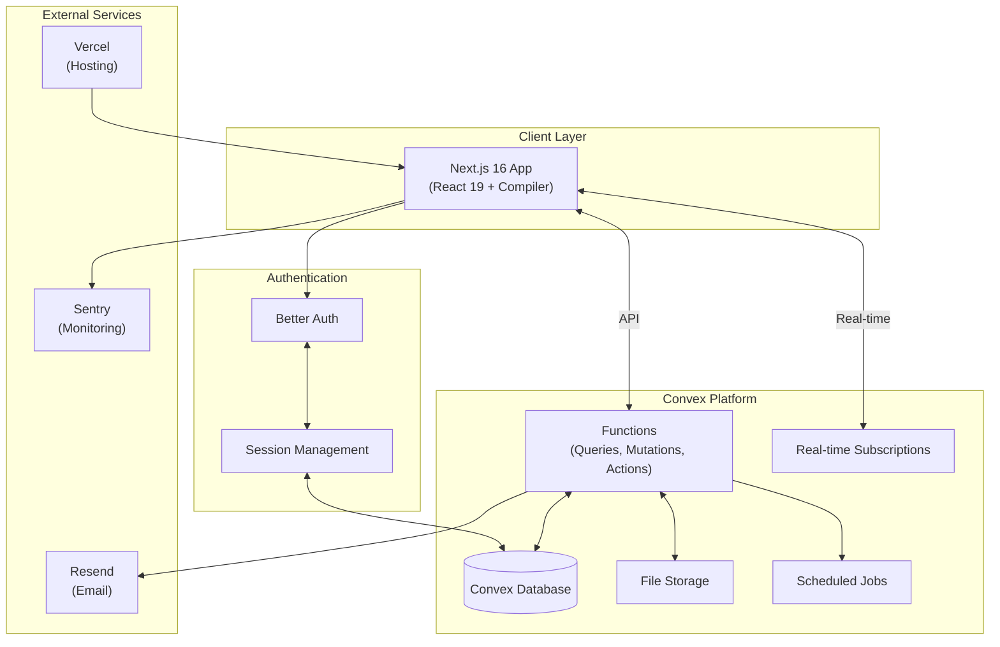
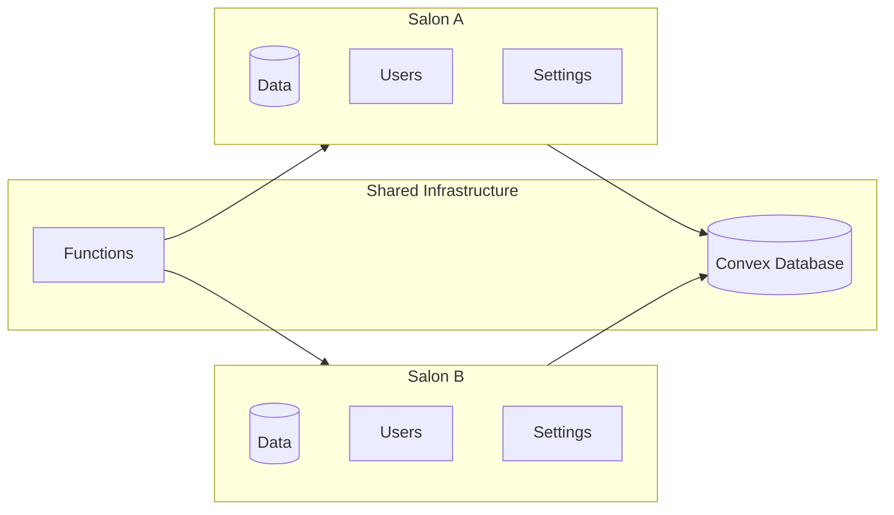
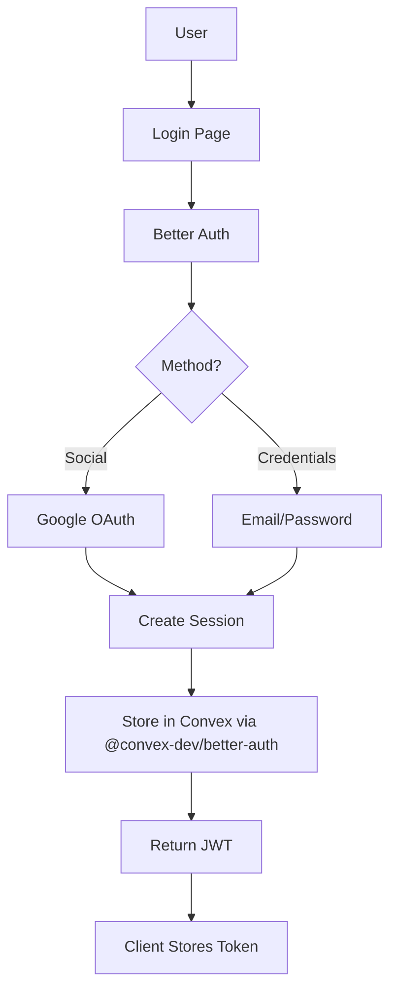
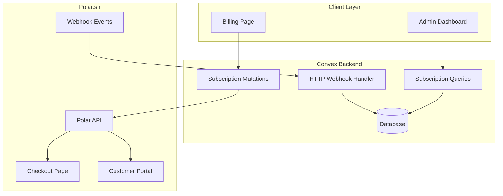
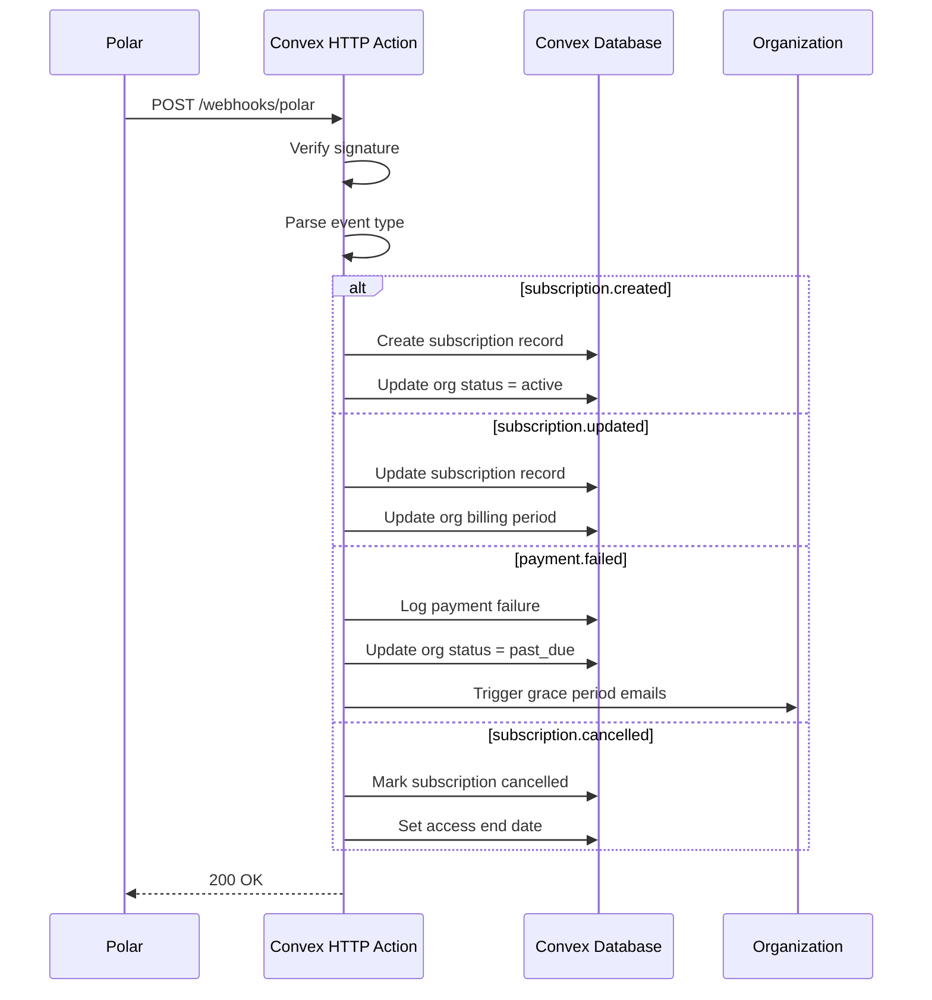
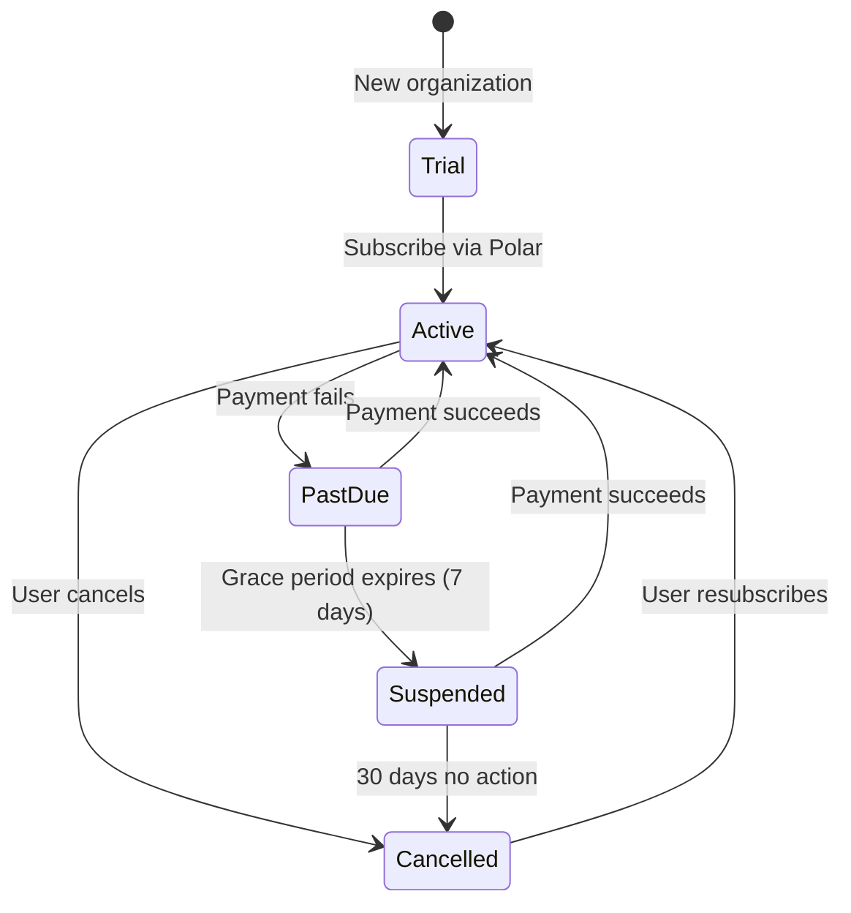
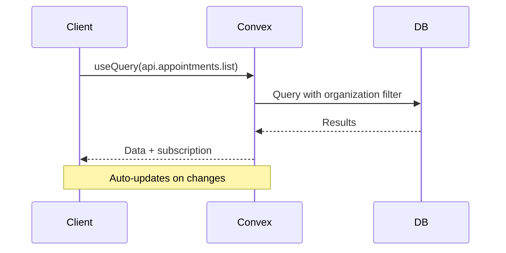
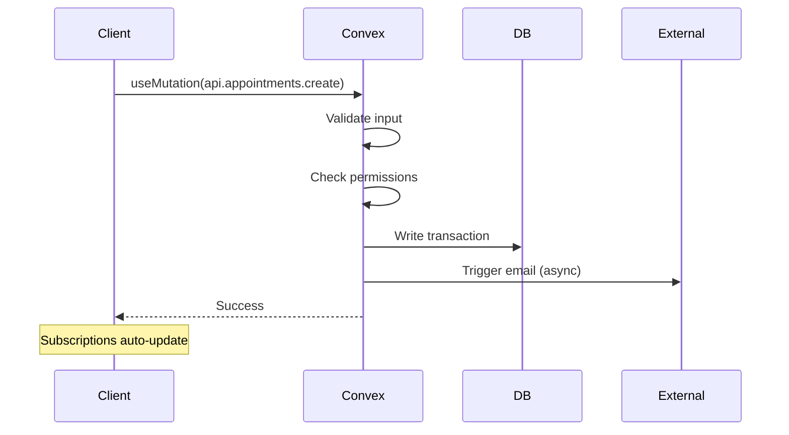
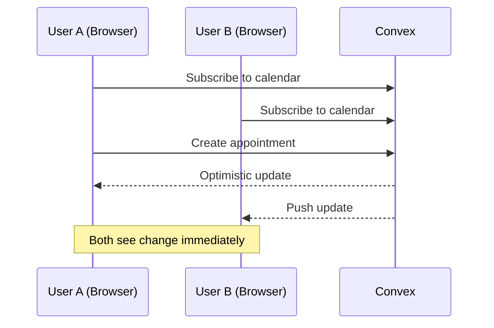
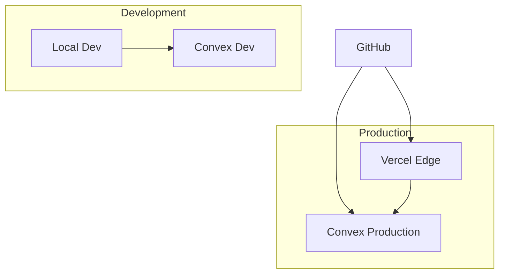

# System Architecture

**Multi-tenant salon management platform with real-time booking and comprehensive business tools**

---

## Table of Contents

1. [Overview](#overview)
2. [Technology Stack](#technology-stack)
3. [Multi-Tenancy Architecture](#multi-tenancy-architecture)
4. [Authentication & Authorization](#authentication--authorization)
5. [Rate Limiting](#rate-limiting)
6. [Subscription Billing](#subscription-billing)
7. [Security Architecture](#security-architecture)
8. [Data Flow Patterns](#data-flow-patterns)
9. [Scalability & Performance](#scalability--performance)
10. [Monitoring & Observability](#monitoring--observability)
11. [Project Structure](#project-structure)
12. [Development Workflow](#development-workflow)
13. [Configuration](#configuration)
14. [Deployment](#deployment)

---

## Overview

The Salon Management SaaS is built on a modern, real-time architecture optimized for simplicity, scalability, and developer experience. The system uses Convex as the unified backend platform, eliminating the need for separate databases, API servers, and real-time infrastructure.

### Architecture Diagram



---

## Technology Stack

### Frontend

| Technology      | Version | Purpose                                 |
| --------------- | ------- | --------------------------------------- |
| Next.js         | 16      | React framework with App Router         |
| React           | 19      | UI library                              |
| React Compiler  | Latest  | Automatic optimization (no memo needed) |
| TypeScript      | 5.x     | Type safety                             |
| Tailwind CSS    | 4       | Utility-first styling                   |
| shadcn/ui       | Latest  | Component library (New York style)      |
| TanStack Form   | Latest  | Form state management                   |
| Zod             | 4.x     | Schema validation                       |

### Backend (Convex)

| Feature                 | Usage                       |
| ----------------------- | --------------------------- |
| Convex Functions        | Queries, mutations, actions |
| Convex Database         | Document store with indexes |
| Real-time Subscriptions | Live data sync              |
| File Storage            | Images, documents           |
| Scheduled Jobs          | Crons, delayed tasks        |
| Search Indexes          | Full-text search            |
| convex-helpers          | RLS, triggers, validators   |

### Authentication

| Technology              | Purpose                                      |
| ----------------------- | -------------------------------------------- |
| Better Auth             | Auth framework                               |
| @convex-dev/better-auth | Convex adapter (session/user storage)        |
| Google OAuth            | Primary social login                         |
| Email/Password          | Fallback authentication                      |

### External Services

| Service     | Purpose                     | Packages |
| ----------- | --------------------------- | -------- |
| Polar       | SaaS subscription billing   | @convex-dev/polar, @polar-sh/sdk |
| Resend      | Transactional emails        | resend |
| React Email | Email templates             | @react-email/components |
| Sentry      | Error tracking & monitoring | @sentry/nextjs |
| Vercel      | Hosting & deployment        | - |

### Development Tools

| Tool       | Purpose                   |
| ---------- | ------------------------- |
| Bun        | Package manager & runtime |
| Biome      | Linting & formatting      |
| TypeScript | Type checking             |

---

## Multi-Tenancy Architecture

> **Terminology Note:** This document uses "tenant" and "organization" interchangeably when discussing architecture. In code and database schema, we use `organization` (e.g., `organizationId`). See [Glossary](./glossary.md#organization) for full terminology guidelines.

### Tenant Isolation Strategy

The system uses **Organization-Based Multi-Tenancy** where each salon is an organization with complete data isolation.



### Data Model

The schema uses **singular table names** and separates concerns across dedicated tables:

| Table | Purpose |
| --- | --- |
| `organization` | Core salon identity (name, slug) |
| `organizationSettings` | Salon configuration (hours, booking settings, contact) |
| `member` | Organization membership + role (owner/admin/member) |
| `staff` | Staff profiles (schedule, services, bio) |
| `invitation` | Pending staff invitations |
| `auditLogs` | Operation audit trail |

### Implementation Pattern

```typescript
// Every table includes organizationId (singular table name)
appointments: defineTable({
  organizationId: v.id("organization"), // Tenant identifier
  // ... other fields
}).index("organizationId", ["organizationId"]);

// Use orgQuery wrapper — organizationId is auto-injected, membership is verified
export const getAppointments = orgQuery({
  args: {},
  handler: async (ctx) => {
    // ctx.organizationId, ctx.member, ctx.staff are available
    return ctx.db
      .query("appointments")
      .withIndex("organizationId", (q) =>
        q.eq("organizationId", ctx.organizationId),
      )
      .collect();
  },
});
```

### URL Structure

```
https://app.salonmanagement.com/[org-slug]/[page]

Examples:
- /glamour-salon/dashboard
- /glamour-salon/calendar
- /glamour-salon/book (public booking)
```

---

## Authentication & Authorization

### Authentication Flow



### Authorization Model

Authorization is enforced via **custom function wrappers** (defined in `convex/lib/functions.ts`) built on `convex-helpers/server/customFunctions`. Each wrapper adds progressively stricter checks and injects context:

```typescript
// Role-based access control
type Role = "owner" | "admin" | "member";

// Structured error codes (ErrorCode enum in convex/lib/functions.ts)
const ErrorCode = {
  UNAUTHENTICATED: "UNAUTHENTICATED",
  FORBIDDEN: "FORBIDDEN",
  ADMIN_REQUIRED: "ADMIN_REQUIRED",
  OWNER_REQUIRED: "OWNER_REQUIRED",
  NOT_FOUND: "NOT_FOUND",
  ALREADY_EXISTS: "ALREADY_EXISTS",
  VALIDATION_ERROR: "VALIDATION_ERROR",
  INVALID_INPUT: "INVALID_INPUT",
  RATE_LIMITED: "RATE_LIMITED",
  INTERNAL_ERROR: "INTERNAL_ERROR",
} as const;
```

#### Custom Function Wrappers

| Wrapper | Auth | Context Added | Use Case |
| --- | --- | --- | --- |
| `publicQuery` | None | — | Public data (org info by slug) |
| `maybeAuthedQuery` | Optional | `ctx.user` (or `null`) | Works for both authed/unauthed users |
| `authedQuery/Mutation` | Required | `ctx.user` | User-scoped data (profile, orgs list) |
| `orgQuery/Mutation` | Required + org membership | `ctx.user`, `ctx.organizationId`, `ctx.member`, `ctx.staff` | All org-scoped operations |
| `adminQuery/Mutation` | Required + admin/owner role | Same as org + `ctx.role` | Staff management, settings |
| `ownerQuery/Mutation` | Required + owner role only | Same as org + `ctx.role` | Billing, org deletion |

```typescript
// User resolution via Better Auth component
import { authComponent } from "../auth";

async function getAuthUser(ctx) {
  const user = await authComponent.getAuthUser(ctx);
  if (!user) {
    throw new ConvexError({
      code: ErrorCode.UNAUTHENTICATED,
      message: "Authentication required",
    });
  }
  return user;
}

// orgQuery/orgMutation auto-inject organizationId from args
// and check membership via the "member" table
export const orgQuery = customQuery(baseQuery, {
  args: { organizationId: v.id("organization") },
  input: async (ctx, args) => {
    const user = await getAuthUser(ctx);

    const member = await ctx.db
      .query("member")
      .withIndex("organizationId_userId", (q) =>
        q.eq("organizationId", args.organizationId).eq("userId", user._id),
      )
      .first();

    if (!member) {
      throw new ConvexError({
        code: ErrorCode.FORBIDDEN,
        message: "You don't have access to this organization",
      });
    }

    const staff = await ctx.db
      .query("staff")
      .withIndex("organizationId_userId", (q) =>
        q.eq("organizationId", args.organizationId).eq("userId", user._id),
      )
      .first();

    return {
      ctx: { user, organizationId: args.organizationId, member, staff },
      args: {},
    };
  },
});
```

### Data Protection

| Layer       | Protection                        |
| ----------- | --------------------------------- |
| Transport   | HTTPS everywhere                  |
| Database    | Convex managed encryption at rest |
| Application | Input validation on all mutations |
| Business    | Organization-scoped queries       |

---

## Rate Limiting

> **File:** `convex/lib/rateLimits.ts` (118 lines)
> **Status:** ✅ Implemented
> **Purpose:** Prevents abuse and ensures fair resource usage via configurable rate limits

The system uses the `@convex-dev/rate-limiter` component with two strategies:

### Rate Limiting Strategies

| Strategy | Behavior | Use Case |
|----------|----------|----------|
| **Token Bucket** | Allows bursts, refills gradually | User-facing actions that may come in bursts |
| **Fixed Window** | Hard limit per time window | Critical operations that must have strict limits |

### Rate Limit Configuration

All rate limits are defined in a centralized configuration file and applied via the `rateLimiter` instance.

#### Invitation Limits

| Operation | Strategy | Rate | Period | Capacity | Reason |
|-----------|----------|------|--------|----------|--------|
| `createInvitation` | Token Bucket | 20 | 1 day | 25 | Prevents invitation spam, allows burst when setting up team |
| `resendInvitation` | Token Bucket | 3 | 1 hour | 3 | Prevents email bombardment of invitee |

#### Organization Limits

| Operation | Strategy | Rate | Period | Capacity | Reason |
|-----------|----------|------|--------|----------|--------|
| `createOrganization` | Fixed Window | 3 | 1 day | 3 | Prevents abuse of free trials |

#### Member Limits

| Operation | Strategy | Rate | Period | Capacity | Reason |
|-----------|----------|------|--------|----------|--------|
| `addMember` | Token Bucket | 10 | 1 hour | 15 | Prevents mass member addition attacks |

#### Service & Schedule Limits

| Operation | Strategy | Rate | Period | Capacity | Reason |
|-----------|----------|------|--------|----------|--------|
| `createService` | Token Bucket | 20 | 1 hour | 25 | Prevents service catalog spam |
| `createScheduleOverride` | Token Bucket | 30 | 1 day | 35 | Per org, prevents override abuse |
| `createTimeOffRequest` | Token Bucket | 5 | 1 day | 5 | Per staff, prevents time-off spam |
| `createOvertime` | Token Bucket | 10 | 1 day | 12 | Per staff, prevents overtime abuse |

### Token Bucket vs Fixed Window

```typescript
// Token Bucket: Allows burst, then throttles
{
  kind: "token bucket",
  rate: 20,        // 20 tokens per day
  period: DAY,
  capacity: 25,    // Can accumulate 25 tokens (allows burst of 5 extra)
}

// Fixed Window: Hard limit, resets at window boundary
{
  kind: "fixed window",
  rate: 3,         // Exactly 3 per day
  period: DAY,
}
```

### Usage Example

```typescript
// File: convex/invitations.ts
import { rateLimiter } from "./lib/rateLimits";

export const create = adminMutation({
  args: { /* ... */ },
  handler: async (ctx, args) => {
    // Check rate limit (key: organizationId)
    await rateLimiter.limit(ctx, "createInvitation", {
      key: ctx.organizationId,
    });

    // Create invitation if limit not exceeded
    // ...
  },
});
```

**How it works:**
1. Function calls `rateLimiter.limit()` with a unique key (e.g., organizationId)
2. Rate limiter checks if key has exceeded limit
3. If exceeded: throws `ConvexError` with `RATE_LIMITED` code
4. If allowed: consumes a token and proceeds

### Rate Limit Response

When rate limited, mutations throw:

```typescript
throw new ConvexError({
  code: ErrorCode.RATE_LIMITED,
  message: "Too many invitations. Please try again later.",
  retryAfter: 3600, // Seconds until limit resets
});
```

**Frontend handling:**

```typescript
try {
  await createInvitation({ email, name, role });
} catch (error) {
  if (error.code === "RATE_LIMITED") {
    toast.error(error.message);
    // Optionally: disable button for error.retryAfter seconds
  }
}
```

---

## Subscription Billing

### Polar.sh Integration



### Webhook Event Flow



### Subscription States



### Environment Configuration

| Environment | Polar Mode | Webhook URL |
| ----------- | ---------- | ----------- |
| Development | Sandbox    | localhost (ngrok) |
| Preview     | Sandbox    | preview-url/webhooks/polar |
| Production  | Production | app.domain.com/webhooks/polar |

---

## Security Architecture

### Input Validation

```typescript
// All mutations validate input
export const createAppointment = mutation({
  args: {
    organizationId: v.id("organization"),
    date: v.string(), // Will be validated as ISO date
    startTime: v.number(),
    customerPhone: v.string(),
  },
  handler: async (ctx, args) => {
    // Date validation
    const dateRegex = /^\d{4}-\d{2}-\d{2}$/;
    if (!dateRegex.test(args.date)) {
      throw new ConvexError({
        code: "VALIDATION_ERROR",
        message: "Invalid date format",
        field: "date",
      });
    }

    // Time validation
    if (args.startTime < 0 || args.startTime > 1440) {
      throw new ConvexError({
        code: "VALIDATION_ERROR",
        message: "Invalid time",
        field: "startTime",
      });
    }

    // Phone validation (Turkish format)
    const phoneRegex = /^(\+90|0)?[5][0-9]{9}$/;
    if (!phoneRegex.test(args.customerPhone.replace(/\s/g, ""))) {
      throw new ConvexError({
        code: "VALIDATION_ERROR",
        message: "Invalid Turkish phone number",
        field: "customerPhone",
      });
    }

    // ... proceed with creation
  },
});
```

### Sensitive Data Handling

| Data Type | Storage | Access Control |
|-----------|---------|----------------|
| Email | Encrypted at rest | Organization members |
| Phone | Encrypted at rest | Organization members |
| Session tokens | Hashed | System only |
| OAuth tokens | Managed by Google/Better Auth | System only |
| Invitation tokens | Hashed | System only |

### Data Retention

| Data Type | Retention Period | Deletion Method |
|-----------|------------------|-----------------|
| Active appointments | Indefinite | Manual deletion |
| Completed appointments | 2 years | Automated purge |
| Cancelled appointments | 90 days | Automated purge |
| Audit logs | 1 year | Automated purge |
| Sessions | Until expiry | Automated cleanup |

---

## Data Flow Patterns

### Read Path (Queries)



### Write Path (Mutations)



### Real-time Updates



---

## Scalability & Performance

### Convex Handles

- **Database scaling:** Automatic sharding and replication
- **Real-time subscriptions:** Efficient pub/sub infrastructure
- **Function execution:** Serverless scaling
- **File storage:** CDN-backed storage

### Application Design

| Concern            | Strategy                      |
| ------------------ | ----------------------------- |
| Large lists        | Pagination with cursors       |
| Search             | Convex search indexes         |
| Heavy computations | Actions (not in transactions) |
| Bulk operations    | Batch processing              |

### Performance Targets

| Metric                 | Target  |
| ---------------------- | ------- |
| Query latency (P95)    | < 100ms |
| Mutation latency (P95) | < 200ms |
| Real-time sync         | < 100ms |
| Page load (LCP)        | < 2.5s  |

---

## Monitoring & Observability

### Sentry Integration

```typescript
// Error tracking
Sentry.init({
  dsn: process.env.SENTRY_DSN,
  environment: process.env.NODE_ENV,
  tracesSampleRate: 0.1,
});

// Performance monitoring
const transaction = Sentry.startTransaction({
  name: "BookingFlow",
  op: "user.action",
});
```

### Convex Dashboard

- Function execution logs
- Database query performance
- Real-time subscription metrics
- Error rates and stack traces

### Custom Metrics (Future)

| Metric                 | Purpose           |
| ---------------------- | ----------------- |
| Bookings per hour      | Business health   |
| No-show rate           | Customer behavior |
| Page load times        | User experience   |
| Error rate by function | System health     |

---

## Project Structure

### Root Structure

```
salon-management-saas/
├── .agents/                # AI agent configurations
├── .claude/                # Claude AI context files
├── .next/                  # Next.js build output (auto-generated)
├── convex/                 # Backend (Convex functions, schema, auth)
├── docs/                   # Project documentation
├── node_modules/           # Dependencies (auto-generated)
├── public/                 # Static assets
├── src/                    # Frontend source code
├── .gitignore              # Git ignore rules
├── CLAUDE.md               # Claude Code assistant guide
├── README.md               # Project overview & setup
├── biome.json              # Biome linter/formatter config
├── bun.lock                # Bun lockfile
├── components.json         # shadcn/ui configuration
├── next-env.d.ts           # Next.js TypeScript declarations
├── next.config.ts          # Next.js configuration
├── package.json            # Dependencies & scripts
├── postcss.config.mjs      # PostCSS configuration
├── tsconfig.json           # TypeScript configuration
└── tsconfig.tsbuildinfo    # TypeScript build cache
```

### `/convex` - Backend Layer

All backend logic, database schema, authentication, and server-side functions.

```
convex/
├── _generated/             # Auto-generated by Convex (DO NOT EDIT)
│   ├── api.d.ts           # API type definitions
│   ├── api.js             # API runtime code
│   ├── dataModel.d.ts     # Database model types
│   └── server.d.ts        # Server function types
│
├── betterAuth/            # Better Auth Convex component
│   ├── schema.ts          # Auth tables schema (auto-generated)
│   └── component/         # Auth component internals
│
├── lib/                   # Shared backend utilities
│   ├── audit.ts           # Audit logging helpers
│   ├── confirmation.ts    # Confirmation code generator (40 lines)
│   ├── dateTime.ts        # Date/time utilities (78 lines)
│   ├── functions.ts       # Custom query/mutation wrappers (RLS)
│   ├── phone.ts           # Turkish phone validation helper
│   ├── rateLimits.ts      # Rate limiting utilities
│   ├── relationships.ts   # Database relationship helpers
│   ├── rls.ts             # Row-level security helpers
│   ├── scheduleResolver.ts # Schedule resolution logic (163 lines)
│   └── validators.ts      # Convex return validators (~716 lines)
│
├── appointments.ts        # Appointment CRUD + booking (801 lines)
├── appointmentServices.ts # Appointment-service junction (54 lines)
├── auth.config.ts         # Better Auth configuration
├── auth.ts                # Auth instance & options
├── convex.config.ts       # Convex deployment config
├── crons.ts               # Scheduled jobs (14 lines)
├── customers.ts           # Customer CRUD + search + merge (~500 lines)
├── files.ts               # File storage queries/mutations (logos, staff, services)
├── http.ts                # HTTP routes (auth endpoints)
├── invitations.ts         # Staff invitation management
├── members.ts             # Organization member management
├── organizations.ts       # Organization CRUD operations
├── schema.ts              # Database schema definition
├── scheduleOverrides.ts   # Schedule override CRUD (178 lines)
├── serviceCategories.ts   # Service category CRUD (188 lines)
├── services.ts            # Service CRUD + staff assignment (353 lines)
├── slotLocks.ts           # Slot lock acquire/release/cleanup (145 lines)
├── slots.ts               # Slot availability algorithm (206 lines)
├── staff.ts               # Staff profile queries/mutations
├── staffOvertime.ts       # Overtime management (155 lines)
├── timeOffRequests.ts     # Time-off request workflow (335 lines)
└── users.ts               # User queries (getCurrentUser)
```

### `/src` - Frontend Layer

All client-side code including pages, components, hooks, and utilities.

```
src/
├── app/                   # Next.js App Router pages
│   ├── (auth)/            # Auth pages (route group, no URL segment)
│   │   ├── sign-in/       # Sign-in page
│   │   │   └── page.tsx
│   │   └── layout.tsx     # Auth layout (minimal, no sidebar)
│   │
│   ├── [slug]/            # Multi-tenant routes (org slug in URL)
│   │   ├── (authenticated)/  # Protected routes (requires auth + membership)
│   │   │   ├── appointments/  # Appointment management
│   │   │   │   └── page.tsx
│   │   │   ├── customers/     # Customer database
│   │   │   │   ├── [id]/      # Customer detail
│   │   │   │   └── page.tsx
│   │   │   ├── dashboard/     # Dashboard page
│   │   │   │   └── page.tsx
│   │   │   ├── services/      # Service catalog
│   │   │   │   └── page.tsx
│   │   │   ├── settings/      # Organization settings
│   │   │   │   └── page.tsx
│   │   │   ├── staff/         # Staff management
│   │   │   │   ├── [id]/      # Staff detail/edit
│   │   │   │   └── page.tsx
│   │   │   └── layout.tsx     # Authenticated layout (sidebar, header)
│   │   │
│   │   ├── (public)/          # Public routes (no auth required)
│   │   │   ├── book/          # Public booking page
│   │   │   │   └── page.tsx
│   │   │   ├── appointment/   # Appointment lookup
│   │   │   │   └── [code]/    # By confirmation code
│   │   │   │       └── page.tsx
│   │   │   └── layout.tsx     # Public layout (minimal)
│   │   │
│   │   ├── error.tsx      # Error boundary
│   │   ├── layout.tsx     # Org layout (shared)
│   │   └── not-found.tsx  # 404 page
│   │
│   ├── api/               # API routes (if needed)
│   ├── dashboard/         # Dashboard redirect logic
│   │   └── page.tsx       # Redirects to active org
│   ├── onboarding/        # First-time user flow
│   │   └── page.tsx       # Organization creation wizard
│   │
│   ├── favicon.ico        # Site favicon
│   ├── globals.css        # Global styles & Tailwind imports
│   ├── layout.tsx         # Root layout (providers, fonts)
│   ├── page.tsx           # Salon directory (public listing)
│   └── tw-animate.css     # Tailwind animation utilities
│
├── components/            # Reusable components
│   ├── business-hours/    # Business hours editor components
│   │   ├── business-hours-editor.tsx
│   │   └── day-row.tsx
│   ├── logo-upload/       # Logo upload widget
│   │   └── logo-upload.tsx
│   └── ui/                # shadcn/ui components (56+ components)
│       ├── button.tsx
│       ├── dialog.tsx
│       ├── form.tsx
│       ├── input.tsx
│       ├── select.tsx
│       └── ... (50+ more)
│
├── hooks/                 # Custom React hooks
│   └── use-mobile.ts      # Mobile viewport detection
│
├── lib/                   # Client-side utilities
│   ├── auth-client.ts     # Client-side auth hooks (authClient)
│   ├── auth-server.ts     # Server-side auth helpers (SSR)
│   └── utils.ts           # Utility functions (cn, etc.)
│
├── modules/               # Feature modules (domain-driven)
│   ├── auth/              # Authentication module
│   │   ├── components/    # Auth-specific components
│   │   ├── layouts/       # Auth page layouts
│   │   ├── views/         # Auth page views
│   │   └── index.ts       # Public exports
│   │
│   ├── booking/           # Booking engine module (Milestone 3)
│   │   ├── components/    # Booking UI (12 components)
│   │   │   ├── CreateAppointmentDialog.tsx  # Multi-step booking (275 lines)
│   │   │   ├── AppointmentList.tsx          # List + filters (200)
│   │   │   ├── BookingSummary.tsx            # Review before confirm (197)
│   │   │   ├── TimeSlotGrid.tsx             # 15-min slot grid (141)
│   │   │   ├── BookingForm.tsx              # Customer info form (119)
│   │   │   ├── BookingConfirmation.tsx      # Confirmation screen (113)
│   │   │   ├── ServiceSelector.tsx          # Multi-select services (110)
│   │   │   ├── DatePicker.tsx               # Calendar date picker (94)
│   │   │   ├── CancelAppointmentDialog.tsx  # Cancel form (89)
│   │   │   ├── UpdateStatusDropdown.tsx     # Status change UI (83)
│   │   │   ├── StaffSelector.tsx            # Staff picker (63)
│   │   │   └── AppointmentStatusBadge.tsx   # Status badge (26)
│   │   ├── hooks/
│   │   │   └── useBookingFlow.ts            # Booking state management (110)
│   │   ├── lib/
│   │   │   └── constants.ts                 # Booking constants (29)
│   │   └── index.ts
│   │
│   ├── convex/            # Convex integration
│   │   └── ConvexClientProvider.tsx
│   │
│   ├── organization/      # Organization management
│   │   ├── components/    # OrganizationSwitcher, InvitationBanner
│   │   ├── providers/     # OrganizationProvider (context)
│   │   └── index.ts       # Hooks: useOrganization, useActiveOrg
│   │
│   ├── settings/          # Settings module
│   │   ├── components/    # Settings forms & sub-pages
│   │   └── index.ts
│   │
│   ├── services/          # Service catalog module
│   │   ├── components/    # ServicesList, AddServiceDialog, CategorySidebar, etc.
│   │   ├── lib/           # Currency utilities (formatPrice, kurusToLira)
│   │   └── index.ts       # Public exports
│   │
│   ├── staff/             # Staff management module
│   │   ├── components/    # Staff components (dialogs, lists, forms)
│   │   │   ├── AddStaffDialog.tsx
│   │   │   ├── StaffTable.tsx
│   │   │   ├── ScheduleEditor.tsx
│   │   │   ├── ScheduleOverrideDialog.tsx
│   │   │   ├── ScheduleOverrideList.tsx
│   │   │   ├── TimeOffRequestForm.tsx
│   │   │   ├── TimeOffRequestList.tsx
│   │   │   ├── TimeOffApprovalPanel.tsx
│   │   │   ├── OvertimeDialog.tsx
│   │   │   └── OvertimeManager.tsx
│   │   ├── lib/           # Shared utilities & constants
│   │   │   └── constants.ts  # DAYS, TIME_OPTIONS, timeToMinutes
│   │   └── index.ts
│   │
│   └── customers/         # Customer database module
│       ├── components/    # Customer components
│       │   ├── AddCustomerDialog.tsx
│       │   ├── EditCustomerDialog.tsx
│       │   ├── DeleteCustomerDialog.tsx
│       │   ├── MergeCustomerDialog.tsx
│       │   ├── CustomerTable.tsx
│       │   ├── CustomerSearch.tsx
│       │   └── CustomerStats.tsx
│       ├── lib/           # Shared utilities & constants
│       │   ├── constants.ts  # ACCOUNT_STATUS_LABELS, SOURCE_LABELS
│       │   └── phone.ts      # turkishPhoneSchema, formatPhoneInput
│       └── index.ts
│
└── middleware.ts          # Next.js middleware (auth protection)
```

### Route Structure

| Route | File Path | Auth | Description |
|-------|-----------|------|-------------|
| `/` | `src/app/page.tsx` | Public | Salon directory |
| `/sign-in` | `src/app/(auth)/sign-in/page.tsx` | Public | Sign-in page |
| `/onboarding` | `src/app/onboarding/page.tsx` | Auth | Org creation wizard |
| `/dashboard` | `src/app/dashboard/page.tsx` | Auth | Redirects to active org |
| `/:slug/dashboard` | `[slug]/(authenticated)/dashboard/page.tsx` | Auth+Org | Org dashboard |
| `/:slug/appointments` | `[slug]/(authenticated)/appointments/page.tsx` | Auth+Org | Appointment management |
| `/:slug/services` | `[slug]/(authenticated)/services/page.tsx` | Auth+Org | Service catalog |
| `/:slug/settings` | `[slug]/(authenticated)/settings/page.tsx` | Auth+Org | Org settings |
| `/:slug/staff` | `[slug]/(authenticated)/staff/page.tsx` | Auth+Org | Staff list |
| `/:slug/staff/:id` | `[slug]/(authenticated)/staff/[id]/page.tsx` | Auth+Org | Staff detail/edit |
| `/:slug/customers` | `[slug]/(authenticated)/customers/page.tsx` | Auth+Org | Customer list + search |
| `/:slug/customers/:id` | `[slug]/(authenticated)/customers/[id]/page.tsx` | Auth+Org | Customer detail |
| `/:slug/book` | `[slug]/(public)/book/page.tsx` | Public | Public booking page |
| `/:slug/appointment/:code` | `[slug]/(public)/appointment/[code]/page.tsx` | Public | Appointment lookup by code |

**Route Groups:**
- `(authenticated)` — Requires authentication and organization membership. Has sidebar layout.
- `(public)` — No authentication required. Minimal layout for customer-facing pages.

**Middleware:** `src/middleware.ts` protects authenticated routes and whitelists public booking routes (`/book`, `/appointment/`).

---

## Development Workflow

### Starting Development

```bash
# Terminal 1: Next.js dev server
bun run dev

# Terminal 2: Convex backend (REQUIRED for type generation)
bunx convex dev
```

### Adding a New Feature

1. Update schema: `convex/schema.ts`
2. Wait for type regeneration (Convex dev server must be running)
3. Create Convex functions: `convex/[feature].ts`
   - Use custom wrappers (`orgQuery`, `adminMutation`)
   - Add return validators
   - Apply rate limiting if needed
4. Create frontend module: `src/modules/[feature]/`
5. Add components: `src/modules/[feature]/components/`
6. Export public API: `src/modules/[feature]/index.ts`

### Common Mistakes to Avoid

1. **Using base `query()`/`mutation()`** instead of custom wrappers
2. **Forgetting `returns:` validators** on Convex functions
3. **Adding `organizationId` to args** when using `orgQuery`/`orgMutation` (auto-injected)
4. **Not running `bunx convex dev`** after schema changes
5. **Using `useMemo`/`useCallback`** with React Compiler enabled
6. **Editing `convex/_generated/`** or `convex/betterAuth/schema.ts`
7. **Calling `form.reset()` during render** — use `key={id}` to force remount instead (TanStack Form)

---

## Configuration

### Environment Variables

```bash
CONVEX_DEPLOYMENT=dev:...        # Auto-set by Convex CLI
NEXT_PUBLIC_CONVEX_URL=https://... # Required
NEXT_PUBLIC_CONVEX_SITE_URL=...  # Required for Better Auth
SITE_URL=http://localhost:3000   # Better Auth base URL
BETTER_AUTH_SECRET=...           # Better Auth secret key
```

### Key Config Files

| File | Purpose |
|------|---------|
| `package.json` | Dependencies, scripts, Bun workspace config |
| `tsconfig.json` | TypeScript compiler options & path aliases |
| `next.config.ts` | Next.js framework configuration |
| `biome.json` | Biome linter/formatter rules |
| `components.json` | shadcn/ui component generator config |
| `postcss.config.mjs` | PostCSS plugins (Tailwind CSS v4) |
| `.gitignore` | Git ignore patterns |

---

## Deployment

### Deployment Architecture



### Environments

| Environment | Frontend           | Backend               |
| ----------- | ------------------ | --------------------- |
| Development | localhost:3000     | Convex dev deployment |
| Preview     | Vercel preview URL | Convex dev deployment |
| Production  | Custom domain      | Convex production     |

### CI/CD Pipeline

1. **Push to GitHub**
2. **Vercel builds Next.js**
3. **Convex deploys functions**
4. **Preview deployment created**
5. **Manual promotion to production**

---

## See Also

**Related Documentation:**
- [Database Schema](./database-schema.md) - Complete schema with relationships
- [API Reference](./api-reference.md) - Function signatures and contracts
- [Glossary](./glossary.md) - Terminology guidelines

**Key Implementation Files:**
- `convex/lib/functions.ts` - Custom function wrappers
- `convex/lib/rateLimits.ts` - Rate limit configuration
- `convex/auth.ts` - Better Auth configuration
- `convex/http.ts` - HTTP routes and webhook handlers
- `src/middleware.ts` - Next.js auth middleware
