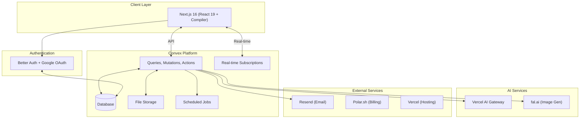

# System Architecture

## Architecture Overview

```mermaid
flowchart TB
    subgraph Client["Client Layer"]
        NextJS["Next.js 16 (React 19 + Compiler)"]
    end
    subgraph Convex["Convex Platform"]
        Functions["Queries, Mutations, Actions"]
        Database[(Database)]
        Realtime["Real-time Subscriptions"]
        Storage["File Storage"]
        Scheduler["Scheduled Jobs"]
    end
    subgraph Auth["Authentication"]
        BetterAuth["Better Auth + Google OAuth"]
    end
    subgraph AI["AI Services"]
        AIGateway["Vercel AI Gateway"]
        FalAI["fal.ai (Image Gen)"]
    end
    subgraph External["External Services"]
        Resend["Resend (Email)"]
        Polar["Polar.sh (Billing)"]
        Vercel["Vercel (Hosting)"]
    end
    NextJS <-->|Real-time| Realtime
    NextJS <-->|API| Functions
    Functions <--> Database
    Functions <--> Storage
    Functions --> Scheduler
    Functions --> AIGateway
    Functions --> FalAI
    Functions --> Resend
    NextJS --> BetterAuth
    BetterAuth <--> Database
```

## Tech Stack

| Layer | Technologies |
|-------|-------------|
| Frontend | Next.js 16, React 19 + Compiler, TypeScript 5.x, Tailwind CSS v4, shadcn/ui, TanStack Form + Zod, react-nice-avatar |
| Backend | Convex (DB, functions, real-time, file storage, crons, search indexes), convex-helpers (triggers, validators) |
| Auth | Better Auth + @convex-dev/better-auth, Google OAuth |
| AI | `ai` (v6+), `@ai-sdk/react`, `@fal-ai/client`, Vercel AI Gateway (GPT-4o vision) |
| External | Polar.sh (billing), Resend (email), React Email (templates), Vercel (hosting) |
| Tools | Bun (package manager), Biome (linter/formatter) |

## Multi-Tenancy

- Every table includes `organizationId` for tenant isolation
- Custom function wrappers (`orgQuery`, `orgMutation`) auto-inject organizationId and verify membership
- URL structure: `/:slug/dashboard`, `/:slug/book` (public)
- Terminology: `organization` in code, `salon` in UI, `tenant` in architecture

## Auth & Authorization

See CLAUDE.md → Convex Custom Function Wrappers for the full wrapper table.

**ErrorCode enum:** UNAUTHENTICATED, FORBIDDEN, OWNER_REQUIRED, SUPER_ADMIN_REQUIRED, NOT_FOUND, ALREADY_EXISTS, VALIDATION_ERROR, INVALID_INPUT, RATE_LIMITED, INTERNAL_ERROR

## Rate Limiting

See [API Reference](api-reference.md) → Rate Limits for the full table.

## Project Structure

See CLAUDE.md → Architecture for the full file tree.

## Route Structure

| Route | Auth | Description |
|-------|------|-------------|
| `/` | Public | Salon directory |
| `/sign-in` | Public | Sign-in |
| `/onboarding` | Auth | Org creation |
| `/:slug/dashboard` | Auth+Org | Dashboard |
| `/:slug/appointments` | Auth+Org | Appointment management |
| `/:slug/customers` | Auth+Org | Customer database |
| `/:slug/staff` | Auth+Org | Staff management |
| `/:slug/services` | Auth+Org | Service catalog |
| `/:slug/reports` | Auth+Org (owner) | Reports & analytics |
| `/:slug/settings` | Auth+Org | Org settings |
| `/:slug/billing` | Auth+Org | Subscription management |
| `/:slug/ai` | Public | Customer AI features |
| `/:slug/products` | Auth+Org (owner) | Product & inventory management |
| `/:slug/book` | Public | Public booking |
| `/:slug/catalog` | Public | Public product catalog |
| `/:slug/appointment/:code` | Public | Appointment lookup |
| `/admin` | Auth+SuperAdmin | Platform management |

## Deployment

| Environment | Frontend | Backend |
|-------------|----------|---------|
| Development | localhost:3000 | Convex dev |
| Preview | Vercel preview | Convex dev |
| Production | Custom domain | Convex production |

CI/CD: Push to GitHub → Vercel builds Next.js → Convex deploys functions.

## SuperAdmin Platform

**Access:** Environment-based via `SUPER_ADMIN_EMAILS` env var.

**Capabilities:** Platform stats, org management (suspend/unsuspend/delete), user management (ban/unban), action log audit trail.

**Security:** SuperAdmins bypass org membership via synthetic owner member. Ban check in `getAuthUser` blocks banned users. All actions logged to `adminActions` table. Rate limits: suspend (10/hr), delete (5/day), ban (10/hr).

See [Features](features.md) → SuperAdmin for full details.
